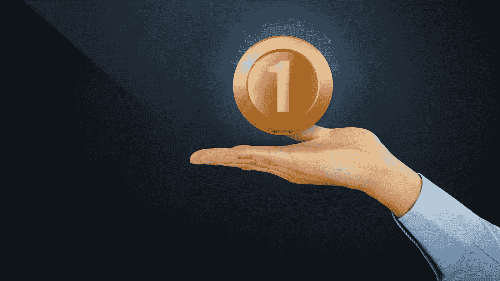

# 致富的捷径？

> 原文：<https://medium.datadriveninvestor.com/shortcut-to-riches-30669d65afa1?source=collection_archive---------15----------------------->

## 比特币

## 新技术如何改变货币格局？

Canva Pro Image

那是在 2010 年。我的收件箱里有一封邮件——购买代币。

我为什么要买没有价值的东西？当时代币在游戏中使用。我在角色扮演游戏里见过他们。玩家可以在游戏中购买代币和数字物品。

但是，一个没有游戏的代币？我该怎么办？在哪里可以用它买东西？也许这只是一个骗局。我知道更好的烧钱方法。

我当时想了想，把邮件删了。

我一点也不知道邮件里的信息是什么。与此同时，每个人都知道比特币，这种神秘的技术让许多人变得富有。我总是思考这个问题:

如果我在 2010 年买了一个比特币，一个 20 美分的代币就好了。用 20 美分赚 18000 美元，这是投资者的梦想。

矿工开采数字货币比特币。矿工的工作得到了回报——比特币。每隔几年，就会减半。矿工开采比特币获得的奖励更少。顾名思义——他们得到一半的价格。

在事件减半后，比特币历史上出现了两次牛市。比特币价格飙升——上涨了 2%至 3，000 %。随后直线下跌。

 [## 人工智能帮助你聪明理财|数据驱动的投资者

### 自动化和人工智能为创新平台提供动力，简化双方的财务流程…

www.datadriveninvestor.com](https://www.datadriveninvestor.com/2020/09/02/artificial-intelligence-helps-you-be-smart-with-money/) 

观察者在 2012 年至 2014 年看到了第一个，在 2016 年至 2018 年看到了第二个。

上一次减半是在 2020 年 5 月，到目前为止价格上涨了 200%。一位花旗银行的分析师指出——如果这种模式第三次出现，到 2021 年底，价格很可能会涨到 318，000 美元。

之后可能会直线下跌。

许多问题在我脑海中闪过。这次我应该跳上火车吗？目前，价格约为 17，000 美元，假设它达到 318，000，它将在未来 12 个月内增长约 17 倍。

而如果历史不会重演呢？比特币明天可能一文不值。那我该怎么办呢？

我该决定什么？

你会怎么做？

自 1999 年以来，我是各行各业公司的执行官、顾问和教练。我专攻企业发展和金融。从种子轮到 IPO 级别。我从 2006 年开始关注生命科学。

[**加入我的邮件列表保持联系！**](https://mailchi.mp/5a50875fb5ea/newsletter)

## 访问专家视图— [订阅 DDI 英特尔](https://datadriveninvestor.com/ddi-intel)