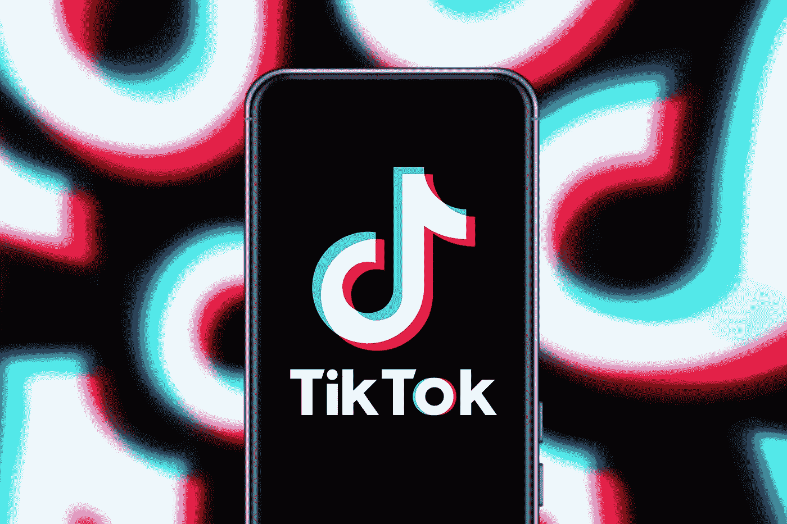

# 品牌应该在抖音投资吗？以下是你需要知道的

> 原文：<https://medium.datadriveninvestor.com/should-brands-invest-in-tiktok-heres-what-you-need-to-know-1c0cdd592577?source=collection_archive---------21----------------------->

抖音在过去几年里迅速崛起，随着人们在家的时间越来越多，新冠肺炎疫情推动了它的发展。社交媒体巨头[宣称](https://www.cnbc.com/2020/08/24/tiktok-reveals-us-global-user-growth-numbers-for-first-time.html)在美国拥有约 1 亿月活跃用户，在全球拥有近 7 亿活跃用户。伴随着这种不可思议的增长而来的是越来越多的审查。在这篇文章中，我将探讨如果品牌考虑在这个平台上存在，他们应该记住什么。

**抖音禁令**

在特朗普总统发布行政命令，威胁要以所谓的安全问题为由禁止抖音之后，包括微软、甲骨文和沃尔玛在内的几家公司表示有兴趣收购这个蓬勃发展的社交媒体平台的一部分。对于他们中的任何人是否能在政府 9 月 15 日的最后期限之前敲定出价，仍有很多猜测——时间在流逝。如果收购没有实现，抖音将不得不在法庭上为自己的未来而战。

尽管抖音在美国的情况仍不明朗，但对公司来说，对这个吸引了世界各地人们的平台有一个基本的了解是有好处的。

**抖音和品牌**

最近，抖音开始认真对待与品牌的合作。其新的自助广告平台，以及抖音创作者市场，帮助公司更容易地发现创作者并与之合作。抖音也在努力留住有影响力的人，并承诺超过 10 亿美元来帮助支持创作者。

 [## 技术是市场的领头羊|数据驱动的投资者

### 大量的首次公开募股，中国做他们自己的事，微软政府的灾难应对，以及抖音的民谣…

www.datadriveninvestor.com](https://www.datadriveninvestor.com/2020/08/28/tech-is-the-market-top-dog/) 

《华盛顿邮报》提供了一些关于如何吸引大批追随者的灵感。该报纸主要发布愚蠢的视频，由视频制作人戴夫·乔根森(Dave Jorgenson)担任主角。偶尔，视频中会出现该出版物的作者触及更严肃的话题，比如最近美国邮政服务的变化。《华盛顿邮报》将有趣、相关的内容与更重要的话题相结合的做法有助于建立忠实的追随者。

Chipotle 展示了品牌如何成功地与有影响力的人合作。Chipotle 已经举办了许多抖音挑战赛，例如为纪念全国鳄梨日而举办的#GuacDance [挑战赛](https://www.mobilemarketer.com/news/chipotle-smashes-tiktok-records-with-guacdance-challenge/560102/)，这些挑战赛利用有影响力的人来吸引对公司促销活动的关注和兴奋。

[律师汤姆](https://www.tiktok.com/@attorneytom)是一个小企业——在这个案例中，他是得克萨斯州的一名人身伤害律师——也能建立强大追随者的例子。汤姆经常在抖音的二重唱功能上分享他对其他用户内容的法律观点，对热门内容做出反应，如这个关于一名摩托车手分道扬镳的视频。通过对其他人的内容做出反应，Tom 在他的频道上培养了强大的用户参与度。

**拥挤的景观**

抖音的成功及其不确定的未来促使其他社交媒体公司提供类似的功能，希望将更多的注意力吸引到自己的平台上。Instagram 的新卷轴功能被广泛称为抖音的翻版，因此该平台需要找到新的方法来保持其庞大的用户群。Triller 是一款专注于音乐的社交媒体应用，已经吸引了音乐人、名人和其他有影响力的人的大量兴趣。它当然有机会成为社交媒体的重量级人物之一(甚至想加入对抖音的竞购战)。其他竞争抖音位置的平台包括 Byte、Dubsmash、Likee 和 Zynn，但是到目前为止还没有明确的领先者。

**下一步是什么**

抖音可以成为公司多渠道战略不可或缺的一部分。是否投资该平台的决定(一旦抖音的法律问题得到解决)取决于许多因素。考虑你的目标受众的人口统计数据。对于消费品牌来说，抖音可能是一个天然的选择，尤其是对于那些瞄准年轻消费者的公司来说(《纽约时报》报道超过三分之一的抖音美国用户是 14 岁或更小)。某些 B2B 公司也可以从抖音获得价值。例如，一家半导体公司可以利用抖音来推广其芯片组驱动的酷设备。

公司还需要仔细考虑他们的社交媒体活动的主要目标是什么。他们是想提高总体品牌知名度，还是想激发对特定产品的兴趣？与其他平台相比，品牌通过抖音推动销售的能力有多强还有待观察，但根据抖音趋势开发内容，如流行标签和视频效果，是在该平台上获得关注的最佳方式之一。

无论抖音的命运如何，它证明了人们总是渴望有趣的、与文化相关的节目，以真实的方式向消费者讲述。

*本文最初发表于 Racepoint Global 的* [*博客*](https://racepointglobal.com/latest/2020/should-brands-invest-tiktok-heres-what-you-need-know) *。*

**访问专家视图—** [**订阅 DDI 英特尔**](https://datadriveninvestor.com/ddi-intel)