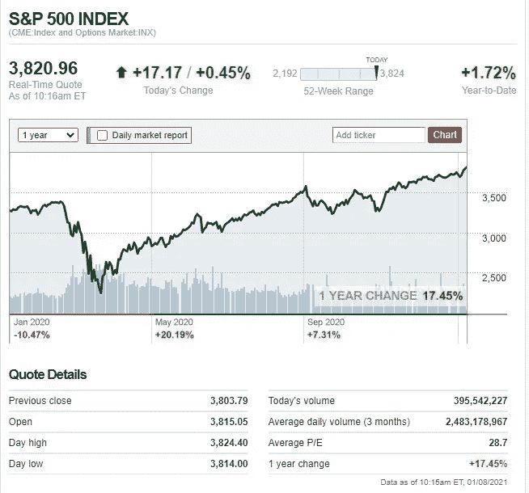
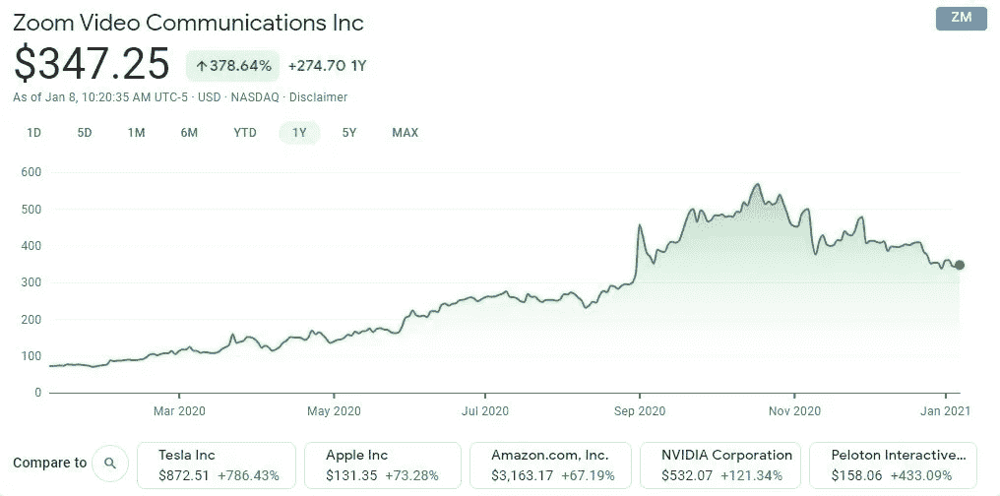
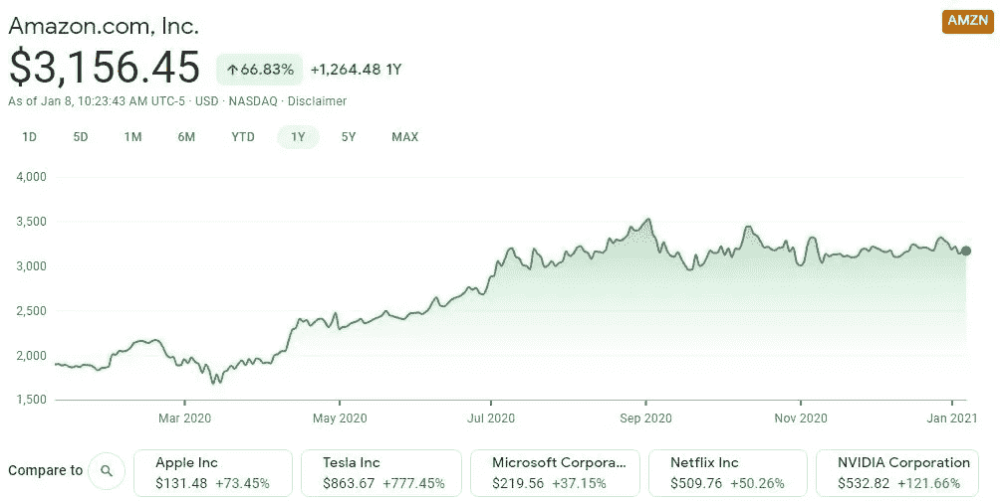
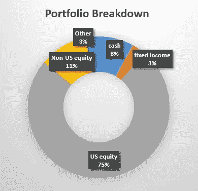
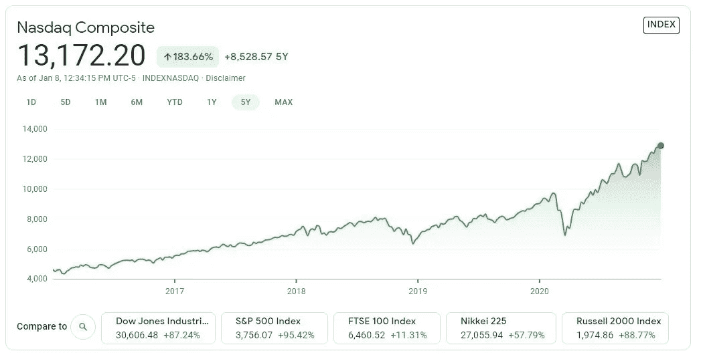
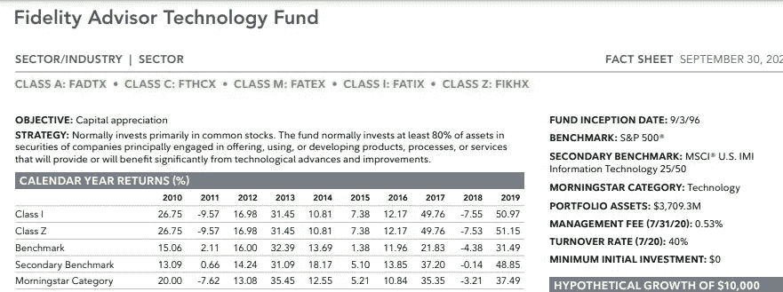
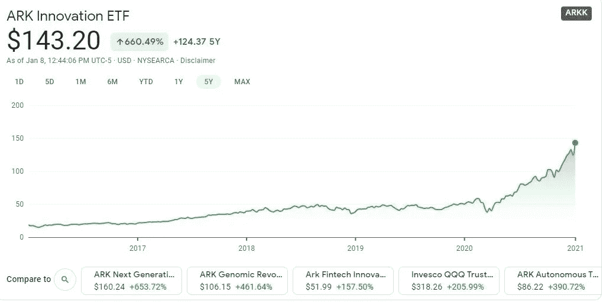
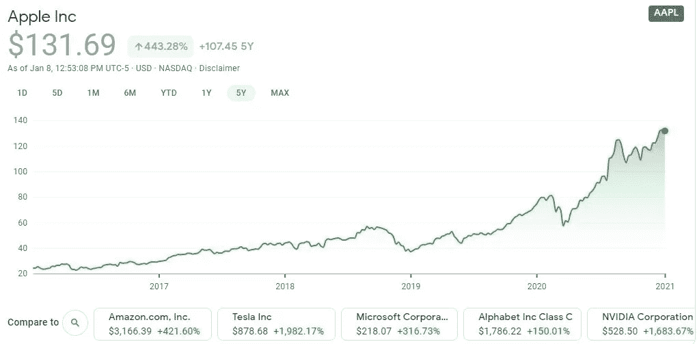

# 我应该投资指数基金，共同基金，还是单一股票？

> 原文：<https://medium.datadriveninvestor.com/should-i-invest-in-index-funds-mutual-funds-or-single-stocks-e044fbfc749c?source=collection_archive---------16----------------------->

我为什么分散投资组合。

Photo by [Chris Liverani](https://unsplash.com/@chrisliverani?utm_source=unsplash&utm_medium=referral&utm_content=creditCopyText) on [Unsplash](https://unsplash.com/s/photos/graphs?utm_source=unsplash&utm_medium=referral&utm_content=creditCopyText)

# 为什么要多元化？

Photo by [Sharon McCutcheon](https://unsplash.com/@sharonmccutcheon?utm_source=unsplash&utm_medium=referral&utm_content=creditCopyText) on [Unsplash](https://unsplash.com/s/photos/diversity?utm_source=unsplash&utm_medium=referral&utm_content=creditCopyText)

当我刚开始投资的时候，我学到的第一件事就是指数基金，比如标准普尔 500。

***指数基金*** 是一种共同基金或交易所交易基金(ETF)——一种涉及特定指数证券集合的证券类型([来自 Investopedia](https://www.investopedia.com/terms/e/etf.asp) 的定义)。目标是 ***尽可能地匹配*** 基准指数。这是一种被动管理的投资基金，费用通常远低于 1%。

当我刚开始投资时，指数基金是我所关心的一切，因为它的投资成本低，是一种相对被动的投资类型。我所需要做的就是研究不同的指数基金和它们的表现，投入资金，等待资金随市场增长。

然而，事实是，每种类型的投资都有其利弊。随着我对指数基金的研究越来越多，我了解到指数基金，比如跟踪标准普尔 500 指数的基金，在市场下跌时，比如在 2020 年的大流行期间，可能会变得完全脆弱。

S&P 500, 1 Year Performace. [Source: CNN Business](https://money.cnn.com/data/markets/sandp/)

共同基金是一种投资基金，涉及多种证券，如股票和债券。共同基金的目标，不同于指数基金，是在主动管理费(通常为 1%–3%)后， ***跑赢*** 基准指数。

在疫情期间，并不是每家公司都经历过业绩大幅下滑。例如，Zoom 在 2020 年增长了 378%。

Zoom Video Communication Inc, 1 Year Performance. [Source: Google Finance](https://www.google.com/finance/quote/ZM:NASDAQ?sa=X&ved=2ahUKEwjquLqm0YzuAhUSY6wKHTcXCYYQ3ecFMAB6BAgBEBk)

亚马逊虽然在 2020 年 3 月经历了一点点下滑，但很快赶上来，增长了 66%。

Amazon.com Inc, 1 Year Performance. [Source: Google Finance](https://www.google.com/finance/quote/AMZN:NASDAQ)

***个股*** 虽然与共同基金和指数基金相比风险更高，但它们是流动性很高的资产，如果需要，我可以迅速将其转换为现金。我可以完全控制我想在投资组合中选择哪些股票。我也可以通过决定什么时候买什么和卖什么来控制我的资本收益。

还有其他类型的投资，如债券。在回顾了过去的数据和每种投资类型的利弊之后，很明显*不存在完美理想的投资类型*。最好的投资方式是分散我的投资组合。

# 保守投资与激进投资

Photo by [Cristofer Jeschke](https://unsplash.com/@cristofer?utm_source=unsplash&utm_medium=referral&utm_content=creditCopyText) on [Unsplash](https://unsplash.com/s/photos/risk?utm_source=unsplash&utm_medium=referral&utm_content=creditCopyText)

不幸的是，学校里不教个人理财。

许多金融知识课程是在家庭中学习的。我妈妈和我在很长一段时间里都很穷，直到我们最终不再担心把食物放在桌子上。在我 50 岁的时候，我妈妈终于买了她的第一套房子。60 岁时，她终于不再靠薪水过活，开始为自己的退休生活投资。

我从我妈妈那里学会了投资债券。当时，我认为这是最好的投资类型，因为它的风险很低。然而，很快我意识到，虽然这可能是我 65 岁的妈妈的最佳投资策略，但它可能不是我的最佳投资。

当我第一次见到我的丈夫时，我被他投资的金额和他愿意承担的风险震惊了。

原来*有不同的投资策略，心中有不同的目标*。有些人，比如我妈妈，喜欢更保守的投资组合；其他人，比如我的丈夫，在投资方面更加激进。

我应该更保守地投资(更多地关注债券和货币市场基金)还是更积极地投资(更多地关注股票)？虽然每个人都有自己的风险承受能力，但有几个因素需要考虑:

## 1.年龄

*时间是积累财富的最重要因素。*在提款之前，您计划将资金在市场上保留多少年？你打算什么时候退休？

从长期来看，市场通常会上涨。下图显示了从 1981 年到 2021 年的过去 40 年中标准普尔 500 指数的表现。增长 2756%！如果你 80 年代 20 多岁投资，2020 年代 60 多岁退休，市场收益是显著的！

然而，如果你像我妈妈一样，在晚年投资，不能把钱在市场上放很长时间。1999 年到 2009 年 10 年的市场涨幅居然是负的！但是，如果你能够把这笔钱再保留 10 年到 2019 年，那么从 1999 年到 2019 年，收益是 100%。

S&P 500 Index from 1981 to 2021\. [Source: Google Finance](https://www.google.com/finance/quote/.INX:INDEXSP?sa=X&ved=2ahUKEwiW4Ob43ozuAhVJ-6wKHRQXAx8Q3ecFMAB6BAgBEBk)

## 2.资金流动

另一个要考虑的因素是现金流。缺乏现金流是许多人和企业申请破产的原因之一。

在决定投资策略之前，重要的是先问一些问题:你的收入是多少？你的预算和支出是多少？你的应急基金、支票和储蓄账户中有多少现金？

## 3.责任

即使收入很高，如果你的钱被债务或其他负债所束缚，你的现金流可能仍然相对较低。

你有债务吗？什么类型的债务？你的债务利率是多少？

你有家属吗？你通常花多少钱在你的家属身上？你也为你的家属准备了应急基金吗？

*在承担任何风险之前，计算我们的风险承受能力是很重要的。*我们能轻松地将亏损转化为现金流吗？我们的负债是什么——我们在财务上要负责的事情？

# 我们的投资目标和投资组合

Photo by [Andrea Natali](https://unsplash.com/@andrea_natali?utm_source=unsplash&utm_medium=referral&utm_content=creditCopyText) on [Unsplash](https://unsplash.com/s/photos/folder?utm_source=unsplash&utm_medium=referral&utm_content=creditCopyText)

我和老公 30 多岁，有两份收入。如果我们计划在 60 多岁退休，我们就有能力在市场上再存 30 年。

我们没有任何学生贷款、汽车贷款或个人债务。我们唯一的债务是我们 30 年的固定利息的房屋贷款。

虽然我希望我的文章能对你的投资有所启发，但本文仅用于娱乐和教育目的，*不应被视为财务建议*。每个人都有不同的理财目标。请自行投资。

听起来可能有些老套，但我的目标是节俭生活，尽可能多地投资，这样我就可以早点退休。以下是我们投资组合中的一些项目。这是一个相对更积极的投资组合，因为与固定收益证券相比，我们大量投资于股票。*采取如此激进投资策略的原因很简单，我们短期内不需要这笔钱。我们收入稳定，只有一笔房贷，还没有家眷。*

Our Investment Portfolio. Source: Author

上图显示了我们的投资组合。我们的大部分资金投资于股票。在我们的股票类别中，我们选择将 70%投资于基金，如共同基金和指数基金，30%投资于单一股票。毕竟，与单一股票相比，选择多元化公司的基金风险更低。这是我们投资的一些基金的表现。

纳斯达克

NASDAQ composite 5-Y performance. [Source: Google Finance](https://www.google.com/finance/quote/.IXIC:INDEXNASDAQ?sa=X&ved=2ahUKEwia7uax74zuAhVICKwKHf-zC4oQ3ecFMAB6BAgCEBk)

富达共同基金

Fidelity Advisor Technology Fund. [Source: Fidelity Face Sheets](https://institutional.fidelity.com/app/proxy/content?literatureURL=/478822.PDF)

方舟创新 ETF

ARK Innovation ETF 5-Y Performance. [Source: Google Finance.](https://www.google.com/finance/quote/ARKK:NYSEARCA?sa=X&ved=2ahUKEwj3x-DE8YzuAhVG2qwKHQZ6CqQQ3ecFMAB6BAgBEBk)

五年趋势数据显示，这些基金在过去五年的表现通常都很好。 ***买入并持有*** 是我从巴菲特那里学到的一条黄金法则。

为什么我们还在挑个股？嗯，因为他们也表现得很好！我们有哪些个股？苹果、亚马逊、LuluLemon、伯克希尔哈撒韦、微软、强生等。但是，**不要盲目追逐投资趋势**。做你自己的研究，选择你个人认为合适的股票。

Apple Inc 5-Y performance. [Source: Google Finance.](https://www.google.com/finance/quote/AAPL:NASDAQ?sa=X&ved=2ahUKEwiH_sTS84zuAhUHIqwKHbWeBgsQ3ecFMAB6BAgBEBk)

# 最后的想法

经历了 2008 年的大衰退和最近的疫情危机，我对多元化的投资组合更加放心。

社交媒体上有许多博客和文章在推广不同类型的投资。但是说到底，*还是要看你个人的财务状况和风险承受能力。*

然而，我从百万富翁那里学到了一些投资的黄金原则:

1.  **不要情绪化，根据短期事件做长期决定。**
2.  **买入并持有。**
3.  使收入流、投资和信息来源多样化。

**进入专家视角—** [**订阅 DDI 英特尔**](https://datadriveninvestor.com/ddi-intel)