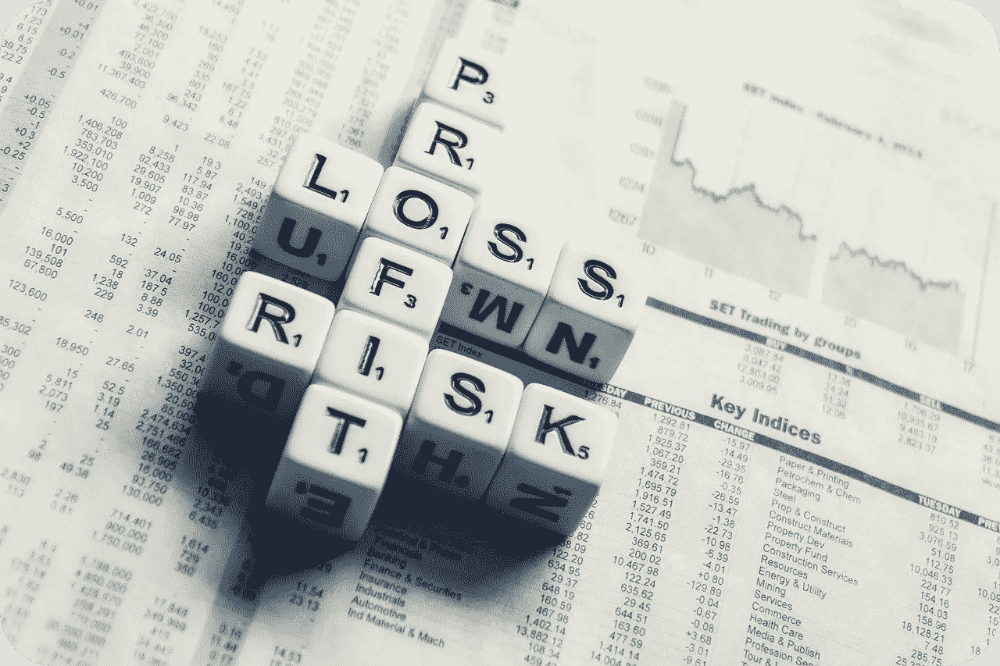

# 我应该继续在动荡的市场投资吗？

> 原文：<https://medium.datadriveninvestor.com/should-i-keep-investing-in-a-shaky-market-600d03021d38?source=collection_archive---------12----------------------->

With the stock market in flux, it can be difficult knowing what to do with current and future investments.

随着三月的疯狂终于过去，我们现在可以开始收拾残局，从全球新冠肺炎疫情引起的最初震惊中继续前进。全国各地的人们都被此次疫情引发的一系列独特挑战弄得惊慌失措，尤其是那些对股市有浓厚兴趣的人。

虽然看起来好像天要塌下来了，但聪明的投资者正在利用这种独特的情况作为一个机会来利用下跌的市场。每个人都知道投资涉及风险，这就是为什么当所有这些都说了，做了，时间可能会青睐勇敢的人。我知道这些信息可能与你最近看到和听到的关于股票市场的情况相反，但这就是为什么我相信现在可能是在股票市场购买一个职位的比以往任何时候都好的时机。

## 原因 1:所有东西都在打折

说到股票，每个人都知道这样一句口头禅:“低买高卖。”尽管由于全球危机，股票处于创纪录的低点，优质公司现在的交易价格却是前所未有的。这意味着，在过去几年里，几乎所有你感兴趣的品牌都正式打折出售。

虽然风险是市场可能会跌得更低，但以创纪录的低利率购买你一直感兴趣的股票是非常有益的。时间可以治愈一切创伤，包括股市崩盘造成的创伤。市场将会反弹，那些在挣扎中获利的人将会在市场恢复时获利。

 [## 投资区块链前要问的三个简单问题(也是一个困难的问题)|数据…

### 现在是了解区块链的最佳时机。不同货币之间的增长率，比如…

www.datadriveninvestor.com](https://www.datadriveninvestor.com/2020/03/12/three-simple-questions-and-one-difficult-one-to-ask-before-investing-in-a-blockchain/) 

## 原因 2:玩长线游戏

短期内可能很难看到如此多的事情发生，但投资是一种长期的财富积累策略，需要时间来赚钱。市场总会有高点和低点，这就是为什么理解这只是市场将经历的许多下跌期之一是很重要的。

猜测股市触底的确切日期基本上是不可能的，所以你所能做的就是用你最好的猜测来判断股票何时会处于最低点，并抓住机会。请记住，这是一场马拉松，而不是短跑。你会从股价最低时买入股票中赚钱，只是可能需要一段时间才能看到正回报。

## 原因 3:放弃可能会更糟

虽然在市场上止损离场可能很诱人，但这实际上可能是你最糟糕的行动。目前你的投资组合可能看起来像是末日，但当市场复苏时，你就会回到崩溃前的位置。

看着你的投资组合贬值，你很难避免情绪激动。但是如果你让你的情绪控制了你，你可能会放弃你的恢复策略，永远不知所措。在情感上和市场上保持强势，安然度过难关，你未来的自己会感谢你的。

我们从未在这个国家经历过如此独特的社会和金融状况，这就是为什么我们比以往任何时候都更需要团结一致，作为一个国家度过难关。我承诺向你提供最新的金融动态，所以请继续关注这个博客，并订阅我的 Youtube 频道以获取更多的经济信息。

来源:

 [## 即使在市场崩溃时也要继续投资的 3 个理由

### 我们正在经历一个不确定的时代，几乎每个人的生活都因此受到了某种程度的干扰…

www.fool.com](https://www.fool.com/retirement/2020/04/05/3-reasons-to-keep-investing-even-when-the-market-c.aspx)  [## 是的，股市可能会走低。以下是你无论如何都应该投资的原因。杂色……

### 下一步是什么？大概每个投资者都在问这个问题。有人认为冠状病毒熊市已经结束…

www.fool.com](https://www.fool.com/investing/2020/04/05/yes-the-stock-market-will-probably-go-lower-heres.aspx)