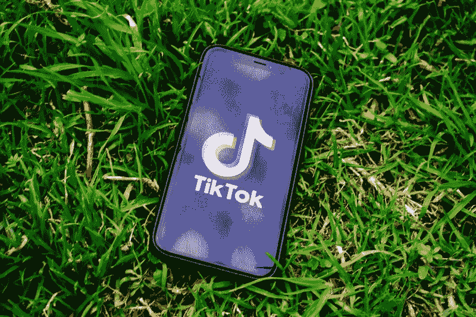
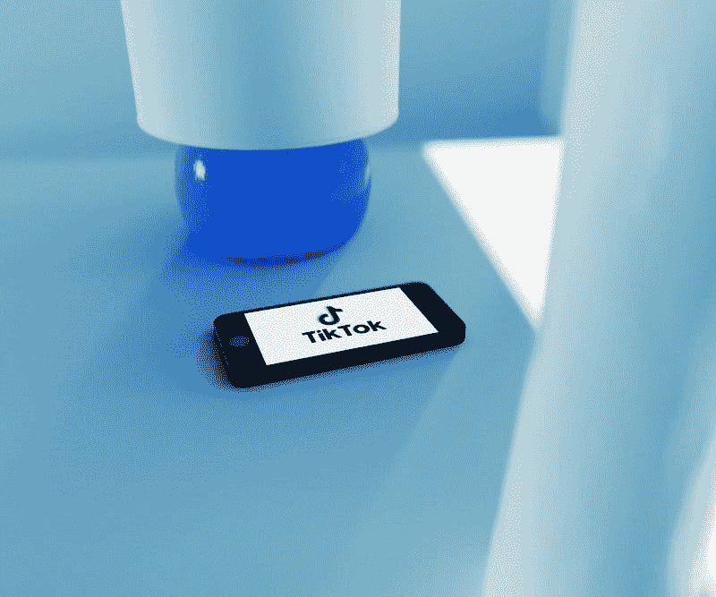

# 微软应该收购抖音吗？—市场疯人院

> 原文：<https://medium.datadriveninvestor.com/should-microsoft-buy-tiktok-market-mad-house-7de417a85664?source=collection_archive---------12----------------------->

微软(纳斯达克股票代码:MSFT) 可以通过从字节跳动收购抖音来赚钱。解释一下，微软正在谈判收购抖音，以阻止特朗普政府在美国关闭该应用。

除非你生活在岩石下，否则你会知道 T2 总统威胁要在 2020 年 7 月 31 日禁止抖音。然而， *Vox Recode* 推测，唐纳德可能会接受将抖音出售给微软。

据 The Verge 推测，微软对抖音感兴趣是因为这个视频分享应用收集的数据。他们认为微软可以利用抖音的数据来增强 Xbox Live 并推动微软的研究。

# 微软能把抖音变成你手机上的 Xbox 吗？

沃伦推测，抖音数据的另一个潜在用途是为 Windows 开发用户友好的视频制作应用。

沃伦认为微软可以通过抖音播放诸如《使命召唤》或《堡垒之夜》等游戏的视频。微软可以通过整合抖音和 xCloud 来实现游戏流。

因此，微软可以将抖音从社交媒体转变为 Xcloud 和 Xbox 的延伸或增强现实的交付系统。

# 抖音有什么价值？

理论上，抖音可以产生大量的数据，因为它拥有庞大的用户群。

例如， [Oberlo 估计，2020 年 7 月，抖音在全球拥有 8 亿用户。此外，Oberlo 估计用户已经从 App Store 和 Google Play 下载了 20 亿次抖音。](https://marketmadhouse.com/should-microsoft-buy-tiktok/#:~:text=TikTok%20has%20800%20million%20active%20users%20worldwide.,App%20Store%20and%20Google%20Play.)

此外，抖音是 2019 年第一季度 iOS 应用商店中下载量最多的应用。此外，Oberlo 估计，2020 年 7 月，美国有 1.65 亿抖音用户。此外，抖音在中国很受欢迎，2020 年 7 月有 1.966 亿用户。然而，抖音最大的市场是印度，印度人已经下载了 6.11 亿次。

Business of Apps 声称，2019 年，平均用户每天在抖音上花费 52 分钟。此外，90%的抖音用户每天都会使用该应用几次。

 [## 资本市场治理 101 |数据驱动的投资者

### 前面，中间，后面？我们是在某种公共交通工具上吗？自雷曼破产以来，10 多年来…

www.datadriveninvestor.com](https://www.datadriveninvestor.com/2020/08/06/capital-markets-governance-101/) 

# 抖音赚钱吗？

因此，奥伯罗估计，抖音会让人上瘾，但其价值值得怀疑，因为 41%的 kTokers 年龄在 16 至 24 岁之间。我认为抖音用户的年龄限制了这款应用的价值，因为年轻人的钱更少。

然而，*影响者市场中心*声称，抖音可以成为一个主要的媒体平台，因为 2019 年[人们每天在抖音](https://influencermarketinghub.com/tiktok-stats/)观看 10 亿个视频。令人印象深刻的是，Influencer Marketing Hub 声称，抖音在 2019 年的每篇帖子的社交媒体参与率高于 Twitter 和 Instagram。

此外，抖音赚钱的能力可能很小。例如，在 2018 年 10 月之前，用户仅在抖音上花费了 5000 万美元。然而，*商务应用*估计抖音 2019 年在中国以外的收入为 1.769 亿美元。奥伯罗称，其中约 20%的收入(3538 万美元)来自美国。

# 川普对抖音对微软不利

然而，抖音在全球 154 个国家开展业务。不幸的是，目前还不清楚微软是在为整个抖音谈判，还是只为美国或北美业务谈判。

微软在这里面临的一个问题是被视为特朗普的工具或利用特朗普政府迫使其他公司向其出售的恶霸。特别是，川普威胁说，如果字节跳动不把抖音卖给一家美国公司，他将在 45 天内关闭该公司。

解释一下，字节跳动是拥有抖音的中国公司。其他字节跳动产品包括移动视频应用 Douyin、内容发现平台 Toutiao、视频应用 Xigua Video、社交媒体平台 Helo、协作工具 Lark 和印度尼西亚新闻应用 Babe。

此外，出售抖音可能对川普不利，因为这有助于大型科技公司变得更大。由于最近的收购，大型科技公司在美国面临反垄断的压力。解释一下，特朗普试图通过给微软一项新资产，让它变得更大、更富有。

# 微软正在赚大钱

我预测川普会因为抖音事件而受到批评，因为微软(纳斯达克股票代码:MSFT)赚了很多钱。

例如，截至 2020 年 6 月 30 日，微软报告的季度收入为 380.33 亿美元，增长率为 12.8%。此外，微软在 2020 年 6 月 30 日报告了 256.94 亿美元的季度毛利。微软的毛利从 2020 年 3 月 31 日的 24.046 美元。

值得注意的是，微软在 2020 年 6 月 30 日指定了 134.07 亿美元的季度运营收入。季度营业收入从 2020 年 3 月 31 日的 129.75 亿美元。最后，微软的季度共同净收入从 2020 年 3 月 31 日的 107.52 亿美元增长到 2020 年 6 月 30 日的 112.02 亿美元。

# 微软产生了大量的现金

例如，微软报告 2020 年 6 月 30 日的季度运营现金流为 186.73 亿美元。该季度运营现金流从 2020 年 3 月 31 日的 175.04 亿美元。

然而，微软的期末现金流从 2020 年 3 月 31 日的 28.46 亿美元降至 2020 年 6 月 30 日的 18.55 亿美元。因此，微软的现金和短期投资从 2020 年 3 月 31 日的 1376.36 亿美元降至 2020 年 6 月 30 日的 1365.27 亿美元。

有趣的是，我认为微软正在偿还巨额债务。为了解释这一点，微软报告 2020 年 6 月 30 日的融资现金流为负 122.62 亿美元。这表明微软偿还了 122.62 亿美元的债务。

因此，微软的债务减少了，有大量现金可供使用。因此，如果首席执行官塞特亚·纳德拉愿意，微软收购抖音或整个字节跳动没有问题。

# 微软是一台收购机器

我认为微软是一支好股票，因为它有大量的现金，增长迅速，并且是一台收购机器。值得注意的[微软收购](https://www.microsoft.com/en-us/Investor/acquisition-history.aspx)包括，Orions Systems、CyberX、jClarity、LinkedIn、Citus Data、Spectrum、Blue Talon、Glint、Obsidian、Playground Games、Bonsai、Flipgrid、Ninja Theory、Semantic Machines、Skype、Cloudyn 和 Deis。

我认为纳德拉先生的收购狂潮正在起作用，因为微软的收入在疫情期间以 12.8%的速度增长。2020 年 6 月 30 日，微软的最新收入增长率为 12.8%。

因此，微软的价值相当于市场先生在 2020 年 8 月 6 日支付的 212.65 美元。此外，我认为微软上一次于 2020 年 6 月 17 日支付的 51₵季度股息是安全的。

微软在 2020 年 8 月 6 日向投资者提供 0.96%的股息收益率和 2.04 美元的年度股息。Dividend.com 将微软 10 年的红利增长归功于 T2。

归根结底，我认为**微软(纳斯达克股票代码:MSFT)** 是那种罕见的生物，一只强劲增长的股票，有着丰厚的股息和高安全边际。想要获得收入、增长和安全的一揽子计划的投资者需要考察一下微软。不管有没有抖音，微软都是一支伟大的股票。

*原载于 2020 年 8 月 6 日 https://marketmadhouse.com**[*。*](https://marketmadhouse.com/should-microsoft-buy-tiktok/)*

***访问专家视图—** [**订阅 DDI 英特尔**](https://datadriveninvestor.com/ddi-intel)*