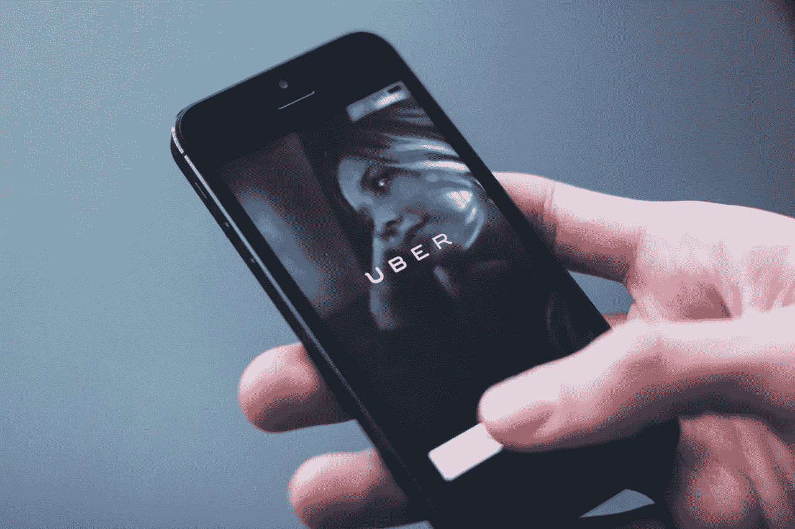
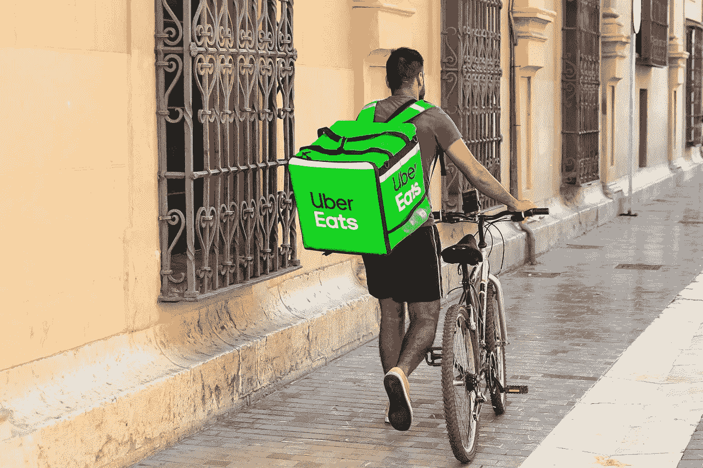

# 优步应该收购 Grubhub 吗？—市场疯人院

> 原文：<https://medium.datadriveninvestor.com/should-uber-acquire-grubhub-market-mad-house-55ef4bf55ab?source=collection_archive---------18----------------------->

可以预见的是，冠状病毒正在数字平台中引发一场绝望的生存斗争。例如，**优步**正试图通过收购**Grubhub**与之相关。

值得称赞的是，Grubhub 拒绝了优步以 1.9 股优步股票换 1 股 T4 Axios T5 股票的提议。优步想要 Grubhub，因为外卖是冠状病毒时代为数不多的增长业务之一。

解释一下，被呆在家里和社会距离感困在家里的人会点更多的外卖。然而，这些人不会去旅行或去酒吧。因此，美国人乘坐优步的次数减少了。

# 优步模仿亚马逊

与此同时，优步模仿亚马逊盲目增长的商业模式。解释一下，杰夫·贝索斯没有试图创造利润，而是追求越来越多的增长，希望亚马逊能够快速增长。

此外，贝佐斯与沃伦·巴菲特一样，认为增长是公司安全边际的重要组成部分。因此，优步试图通过收购 Grubhub 来扩大其安全边际。

优步和 Grubhub 都有大麻烦冠状病毒已经停止或逆转了经济增长。解释一下，没有工作也没有钱的人买不起外卖或者去优步兜风。

因此，我认为零工经济可能会崩溃，因为零工经济的成功需要一个拥有大量可支配收入的庞大中产阶级。然而，我们可能很快就会回到上世纪 30 年代的经济，那时只有少数人拥有可支配收入。

# 冠状病毒能杀死优步吗？

金融数据显示冠状病毒正在伤害优步。优步的季度收入从 2019 年 12 月 31 日的 40.69 亿美元降至 2020 年 3 月 31 日的 35.43 亿美元。

因此，乘坐优步的人越来越少，优步赚的钱也越来越少。优步的季度毛利从 2019 年 12 月 31 日的 21.42 亿美元降至 2020 年 3 月 31 日的 17.57 亿美元。

奇怪的是，Stockrow 估计优步的收入仍在增长。优步报告 2019 年最后一个季度的收入增长率为 36.82%。相比之下，优步 2020 年第一季度的收入增长率为 14.33%。

这些数字显示，随着冠状病毒的传播，优步的业务萎缩。值得注意的是，优步最大的美国市场；纽约市是美国冠状病毒的发源地。

# 优步产生了大量的现金

优步需要帮助，因为它损失了很多钱。例如，优步报告 2020 年前三个月的运营亏损为-12.63 亿美元，普通净亏损为-29.36 亿美元。

相反，优步的生意产生了大量的现金。令人印象深刻的是，优步报告截至 2020 年 3 月 31 日的季度现金流为 95.29 亿美元。相比之下，优步公布的运营现金流为负 4.63 亿美元。

因此，优步在 2020 年 3 月 31 日有 91.89 亿美元的现金和短期投资。因此，我得出结论，优步有现金生存冠状病毒。尽管有诸多缺点，优步仍是一家现金充裕的公司。

# Grubhub 赔钱了

与优步类似， **Grubhub(纽约证券交易所代码:GRUB)** 是一个亏损的公开交易平台。

Grubhub 报告 2020 年 3 月 31 日季度运营亏损-4591 万美元。Grubhub 还报告了同一季度的净共同损失-3343 万美元。

然而，Grubhub 的季度收入在 2020 年第一季度略有增长。Grubhub 报告 2019 年 12 月 31 日的季度收入为 3.4127 亿美元，2020 年 3 月 31 日的季度收入为 3.6298 亿美元。

相反，Grubhub 的季度毛利从 2019 年 12 月 31 日的 1.2178 亿美元下降到 3 个月后的 1.2178 亿美元。因此，Grubhub 从不断增长的销售额中获得的利润可能会减少。2020 年前三个月收入增长率为 12.11%的 Stockrow Grubhub。

我认为优步想要 Grubhub，因为 Grubhub 的业务能够在疫情发展。另一方面，只有优步的一部分业务，优步吃可以在疫情增长。

然而，Grubhub 的增长依赖于拥有大量可支配收入但没有时间做饭的顾客。不幸的是，冠状病毒经济产生了相反的情况，中产阶级没有可自由支配的收入，但有很多空闲时间。

# Grubhub 需要现金

优步有一样东西，是格鲁布迫切需要的；现金。Grubhub 报告的季度运营现金流为 3753 万美元，截至 2020 年 3 月 31 日的期末现金流为 5.6331 亿美元。

然而，Grubhub 的现金流在去年经历了大幅增长。Grubhub 报告的季度运营现金流为 1394 万美元，截至 2019 年 3 月 31 日的期末现金流为 1.9427 亿美元。此外，Grubhub 的现金和短期投资从 2019 年 3 月 31 日的 2.04 亿美元增长到一年后的 5.9707 亿美元。

因此，Grubhub 正在经历现金流增长；这也是优步有兴趣收购它的另一个原因。优步需要增加其业务的增长以在疫情生存下来，而 Grubhub 正在增长。

# 优步应该收购 Grubhub 吗？

我认为优步需要避免 **Grubhub(纽约证券交易所代码:GRUB)** 因为市场先生给它定价过高。市场先生于 2020 年 5 月 18 日以 57.67 美元的价格购买了 Grubhub 的股票，并于 2020 年 5 月 22 日以 56.89 美元的价格购买。

2020 年，Grubhub 的股价从 2020 年 1 月 2 日的 47.24 美元增长到 2020 年 5 月 18 日的 57.67 美元，以及 2020 年 5 月 22 日的 56.89 美元。因此，Grubhub 的股价在 2020 年略有增长。

相比之下，市场先生在 2020 年 5 月 22 日以 34.37 美元的价格购买了一股**优步(NASDAQ: UBER)** 股票。优步的股票价值在 2020 年也有所增长，从 2020 年 1 月 2 日的 30.99 美元上涨到 2020 年 5 月 18 日的 33.62 美元，再到 2020 年 5 月 22 日的 34.37 美元。

因此，我认为优步的股价是安全的。然而，我看不出收购 Grubhub 对优步有什么帮助。优步已经有了自己成功的送餐服务 Uber Eats。

我认为对优步来说，更好的做法是投资现金来扩大 Uber Eats 并升级其技术。至于收购，优步需要跳出技术框框，寻找那些拥有资源、能够为其带来新能力和现金来源的公司。

一个很好的可能性是汽车租赁公司。汽车租赁公司现在很便宜。例如，2020 年 5 月 18 日，市场先生以 14.75 美元的价格购买了 Avis Budget Group(纳斯达克股票代码:CAR)的股票。拥有一家汽车租赁公司将让优步拥有一支车队，即 Zipcar 短期租赁车队，以及遍布全球的数百家维修设施。

# 伯克希尔·哈撒韦会收购优步吗？

最后，优步本身可能会被 T2 收购。B) 。沃伦·巴菲特钦佩优步首席执行官达拉·科斯罗萨西，热爱现金。优步现金充裕，但股票便宜。有趣的是，巴菲特承认他在 2015 年考虑过投资优步的债券，美国消费者新闻与商业频道。

我不认为优步和 Grubhub 是普通投资者的好股票。然而，优步和 Grubhub 股票对那些能够承担损失和风险的人来说是有趣的投资。我认为优步和 Grubhub 都会生存下来并赚钱，但他们在不久的将来会面临严重的问题。

承担不起风险的投资者需要远离 **GRUB** 和 **UBER** 。

*原载于 2020 年 5 月 22 日 https://marketmadhouse.com**的* [*。*](https://marketmadhouse.com/should-uber-acquire-grubhub/)