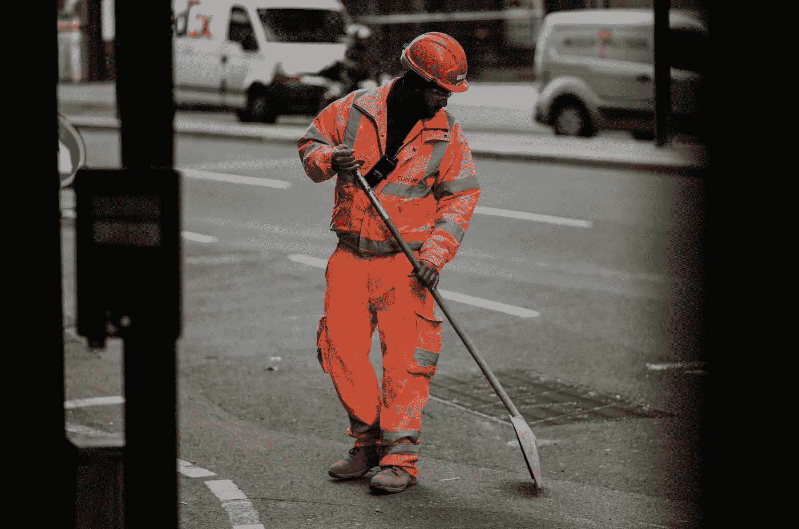
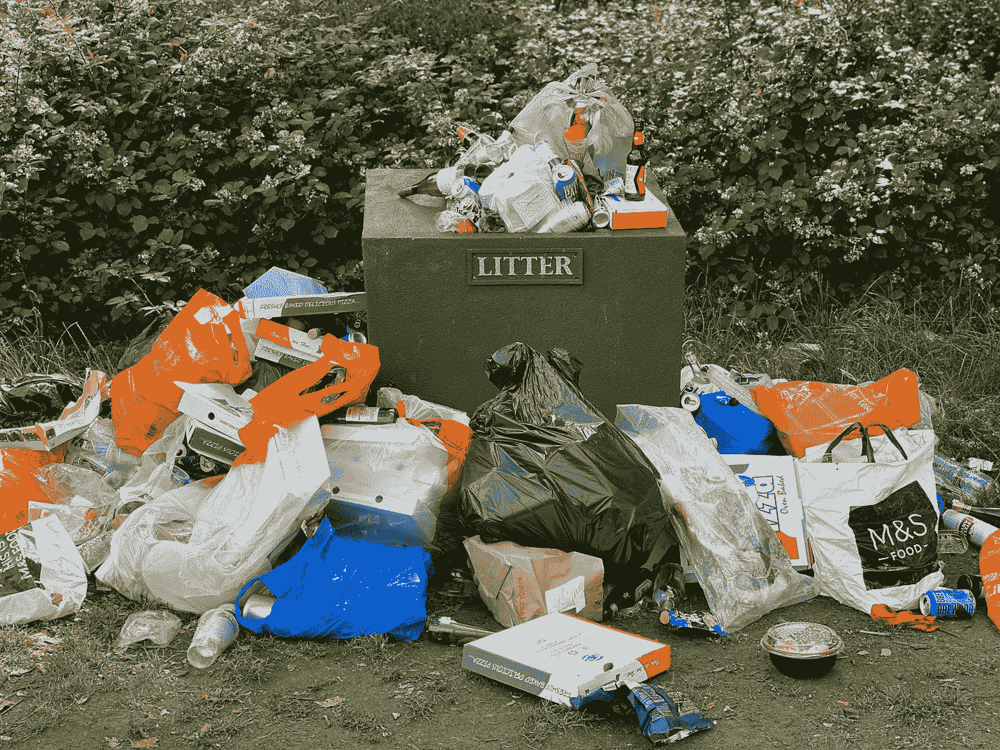

# 失业救济金应该免费领取吗？

> 原文：<https://medium.datadriveninvestor.com/should-unemployment-benefits-be-free-to-collect-bfd676853367?source=collection_archive---------11----------------------->

## 动员失业劳动力

Photo by [Joel Barwick](https://unsplash.com/@joelbarwick?utm_source=unsplash&utm_medium=referral&utm_content=creditCopyText) on [Unsplash](https://unsplash.com/@joelbarwick?utm_source=unsplash&utm_medium=referral&utm_content=creditCopyText)

这可能是一个有争议的话题，一个你可能预先假定会不平衡的话题——事实并非如此。

我住在海边，夏季的旅游业对环境造成了损害。到处都是垃圾。人们丢弃孩子的脏尿布，用来装酒的碎玻璃瓶的残留物散落在小路上。

当我带着我的狗穿过这个众所周知的雷区时，我看到一群穿着高能见度装备的志愿者，试图清理上周末步行留下的混乱。

 [## 国内生产总值下降，国债飙升，新技术可以创造一个强大的新…

### 新冠肺炎危机留下的金融残骸将是毁灭性的，而且会持续很久。已经经济学家…

www.datadriveninvestor.com](https://www.datadriveninvestor.com/2020/04/27/declining-gdp-skyrocketing-national-debt-and-a-new-technology-that-can-create-a-robust-new-economy/) 

他们没有报酬，所以他们只有有限的空闲时间，而且通常不足以完成需要的工作。

我马上想到，一个经济学家会怎么解决这个问题？什么样的人我们已经付了工资，但却对工作不负任何责任？

答案是，那些目前失业的人。

# 有多少人声称失业？

目前美国的失业率为 10.2%，而在我居住的英国，T2 预计失业率将从 3.9%上升到 7.4%，也就是说上升了 90%。

显然，在 COVID 期间，申请失业的人数急剧上升。从全球范围来看，还不确定这些人中有多少人会被允许重返工作岗位——或者甚至不确定是否有企业可以重返。

## 再说说失业激励……

从 3 月下旬到 7 月下旬，典型的失业美国人每周领取大约 930 美元的 T4。每年超过 48，000 美元(约 36，000 英镑)。比我许多在职朋友赚的钱还多。

在与美国的朋友和客户交谈后，他们告诉我，有些人甚至辞去了工作，因为他们意识到失业比工作更有利可图。

> “尤其是在美国，政治和经济不能很好地融合。政客们有各种各样的理由通过各种各样的法律，尽管它们可能是善意的，但却无法解释真实的人对现实世界激励的反应。”史蒂文·d·莱维特，超级经济学家

当你可以降低生病的风险，什么都不做，工资比以前高，失业的时候，工作的动力在哪里？

# 他们领取失业救济金多久？

在英国，只有 44%申请“求职津贴”的人申请不到 6 个月，因为他们可以找到另一份工作。

这意味着超过一半的人 *(* [*确切地说是 55.7%*](https://www.ethnicity-facts-figures.service.gov.uk/work-pay-and-benefits/benefits/jobseekers-allowance-how-long-people-claim-for/latest)*)*持续领取这种免费收入 6 个月或更长时间——其中 22%的人领取了 104 周或更长时间。

> 简而言之，五分之一的失业者申请两年(或更长时间)的福利来帮助他们找工作。

我问你这个… **他们到底有多用心？**

这听起来可能是我缺乏同情心，但很明显，尽管失业救济金是绝对必要的，但至少有一半领取失业救济金的人在某种程度上滥用了它。

# 一个潜在的解决方案——调动员工

Photo by [John Cameron](https://unsplash.com/@john_cameron?utm_source=medium&utm_medium=referral) on [Unsplash](https://unsplash.com?utm_source=medium&utm_medium=referral)

毫无疑问，我们需要更多的社区服务、慈善工作和非熟练劳动力。我们也有失业的劳动力，我们目前支付工资却看不到回报。

成本效益比完全不平衡。如果那些健康状况足以胜任工作的人，我们能不让他们去工作吗？

> “天下没有免费的午餐。”—米尔顿·弗里德曼

解决方案似乎相对简单，但是，有一些障碍需要克服。

# 它会成为一种新的奴隶制吗？

你可以反对这一提议的理由是，传统的“失业福利”远远低于法定最低工资。

期望人们以低于最低工资的工资工作会使一种新形式的奴隶制正常化。失业救济金除以每周平均工作小时数(37.5)等于每小时 1.98 英镑(2.53 美元)。

这比拿最低工资的人每小时少 77%左右。

我不会为了每小时 1.98 英镑而工作，我也不指望其他人会这样。

# 这可能会阻止他们寻找工作

反对动员失业者的另一个主要观点是，如果他们忙于工作，他们就没有时间去找一份“真正的”工作。

在为社区服务了 8 个小时之后，任何人都不会想回家去找工作。通常，需要做的工作是手工的，令人厌倦。因此，消耗了潜在候选人每天找工作的精力。

# 我们能以任何方式克服它吗？

Photo by [Antoine Dautry](https://unsplash.com/@antoine1003?utm_source=medium&utm_medium=referral) on [Unsplash](https://unsplash.com?utm_source=medium&utm_medium=referral)

为了让人们有足够的空闲时间去找工作，并使失业救济金的成本/收益比达到平衡，最简单的解决办法是让这些人工作，但工作时间要少——与最低工资标准一致。

在英国，25 岁以上人群的全国最低工资为每小时 8.72 英镑(合 11.16 美元)。因此收到的福利可以支付每周略多于 8 小时的工作。

> 失业救济金/最低工资= 8.4 小时合格工作

当四舍五入到最接近的整数时，这意味着失业人员的工作收入将比全职工作人员的工作收入略高 20%。剩下 80%的工作时间去找工作。

80/20 法则的支持者会感到满意，但我可以补充说，这也是成功的，没有低估那些失业者，或剥削他们的劳动。

> 当然，每个国家和/或州的合格工作时间会有所不同。

# 我们能从这个行动中期待什么？

理想情况下，每个县的失业人员将从事当地驱动的社区服务任务和慈善工作。

这可能意味着:

*   捡垃圾
*   慈善商店工作
*   传单
*   垃圾收集(公共垃圾箱)
*   为老年人跑腿
*   帮助支持和组织课外活动
*   志愿警务有助于社区安全
*   为无家可归者提供食物等

我们看到这项工作已经完成，在某些情况下是由监狱改革项目和志愿者完成的，但不同的是这些人目前没有得到报酬，而那些领取失业救济金的人得到了报酬。

从工作中获得的满足感不仅会在自尊和目标方面产生积极的心理影响，还会在每个人的社区中产生巨大的改善。

一个附带的好处是每个失业的人都能学到新的技能。提高劳动力技能是让他们重返工作岗位的最快方法。

如果一个失业的人很长一段时间都在努力寻找工作，那是因为他们没有比申请同样工作的同龄人更好的技能。其他人代替他们被雇佣。通过这一举措获得更多技能将使他们对潜在雇主更具吸引力。

通过确保他们的工作资格与政府的最低工资要求直接相关，你将确保政府资助的部门或私营企业也不能剥削这些工人——选择这种“自由”的劳动力，而不是创造就业机会。这会适得其反。

它还在英国每年购买超过 20 亿英镑的额外劳动力和服务，在美国平均每月购买 19 亿美元的额外劳动力和服务(T2)。已经花掉的钱。

你觉得怎么样？我们应该要求失业者为这些福利工作吗？

**访问专家视图—** [**订阅 DDI 英特尔**](https://datadriveninvestor.com/ddi-intel)