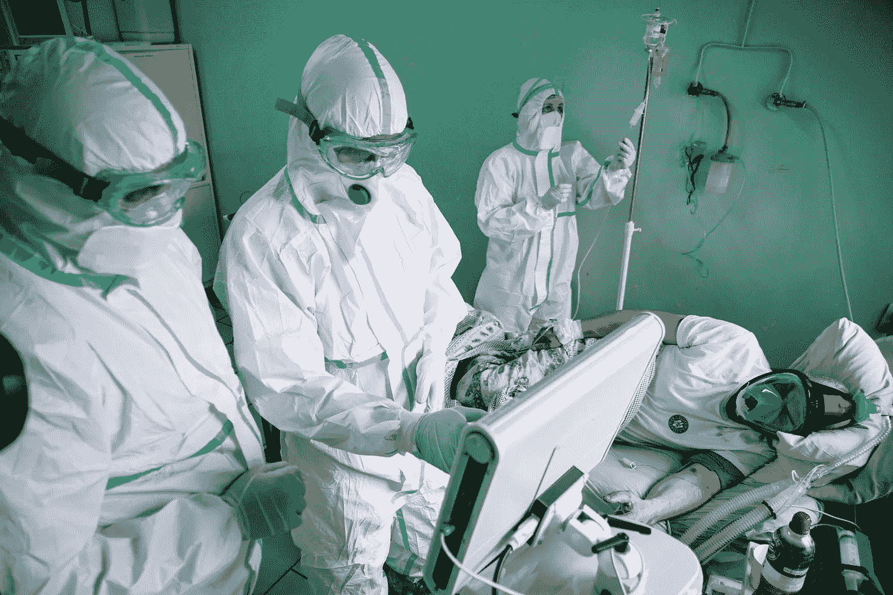
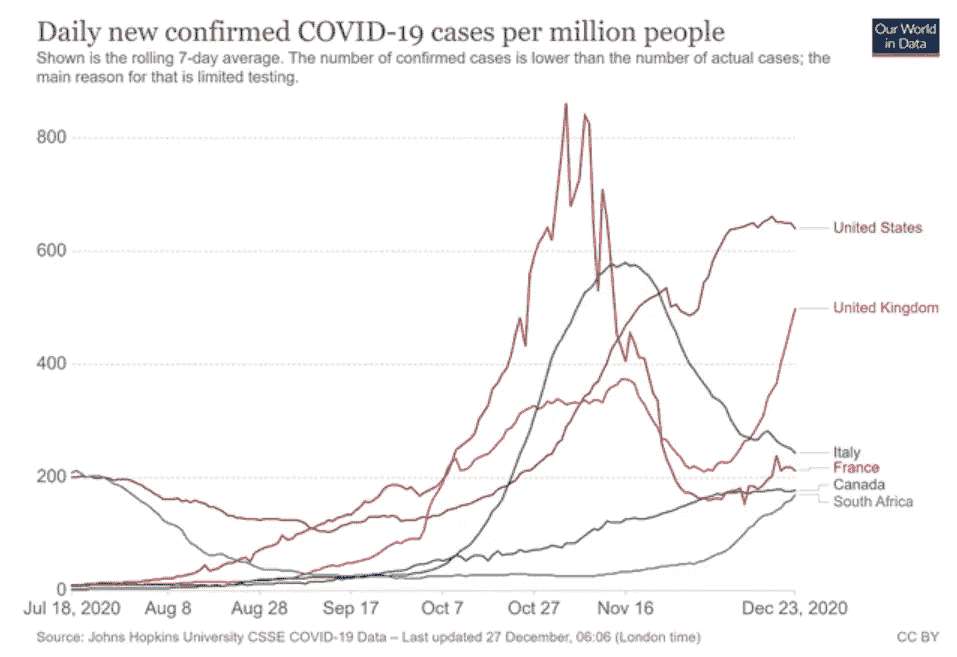

# 你应该担心新的 COVID 菌株吗？

> 原文：<https://medium.datadriveninvestor.com/should-you-be-worried-about-the-new-covid-strains-f9541b1863d8?source=collection_archive---------44----------------------->

关于源于英国、南非和其他地方的 T4 的变异的 T2 COVID 菌株的新闻标题已经传播了对组织和个人影响的焦虑。最近在美国发现的这些菌株很可能在 11 月中旬到达这里，到现在已经有数百个可能的病例。然而，你真的应该担心并改变计划吗？

[媒体](https://www.cbsnews.com/news/covid-vaccines-effective-mutated-strains-doctor/)、[专家](https://www.cbsnews.com/news/anthony-fauci-cbsn-interview-watch-live-stream-today-2020-12-23/)和[官员](https://www.foxnews.com/politics/asst-hhs-sec-giroir-coronavirus-vaccines-effective-against-new-strain)都把注意力集中在对疫苗有效性的担忧上。虽然存在一些合理的担忧，即我们的疫苗对新菌株的有效性可能会降低 10-20 %,但这种相对较小的差异不应该让你过于担心。事实上，科学家可能会迅速更新 Moderna 和辉瑞/BioNTech 的基于 mRNA 的疫苗，使其对这些新的 COVID 变体完全有效。

因此，一旦美国在 2021 年年底[前通过大规模疫苗接种实现群体免疫，这些新毒株将不再重要。然而，这些新菌株的另一个方面确实应该让你非常担心:它们的传染性更强。](https://news.harvard.edu/gazette/story/2020/12/anthony-fauci-offers-a-timeline-for-ending-covid-19-pandemic/)

不幸的是，关于它们的传染性，新闻报道很少。此外，知名政府官员淡化了对新菌株的担忧，称[没有理由恐慌](https://apnews.com/article/england-infectious-diseases-coronavirus-pandemic-united-nations-anthony-fauci-602511040a443320c390ee9ae7527276)。例如，12 月 27 日，白宫冠状病毒检测专家 Brett Giroir 上将接受了“福克斯新闻频道周日”的采访，他在采访中[说](https://thehill.com/homenews/sunday-talk-shows/531738-white-house-testing-czar-more-infectious-covid-strain-is-no-more)“这并不比 COVID 的正常色斑更严重。”

这种自满反映了我们在疫情早期阶段的梦游，尽管有来自我本人和其他风险管理专家的无数警告。我们的大脑不能很好地处理这种威胁，这使得我们更难成功地适应像疫情这样缓慢移动和高冲击力的火车事故，或者更具传染性的变种。

# 新菌株真的更具传染性吗？

研究表明，英国菌株的传染性比 T2 菌株高 56 %( T1)到 70 %( T3 ),这意味着每个感染新菌株的人比旧的 COVID 菌株多感染 56-70%。新的变种很快统治了英国东南部的旧菌株 COVID，从 11 月初不到所有测试样本的 1%到 12 月中旬超过三分之二的。

*图片由* [*BBC*](https://www.bbc.com/news/health-55388846) 提供

南非的毒株似乎比英国的新毒株更具传染性。它很快在该国占据主导地位:[于 10 月](https://www.nationalgeographic.com/science/2020/12/why-new-coronavirus-variants-suddenly-arose-in-uk-and-south-africa/)首次发现，截至 12 月底，它负责了所有新增 COVID 病例的[80%](https://www.reuters.com/article/us-health-coronavirus-safrica-variant-ex/explainer-the-new-coronavirus-variant-in-south-africa-are-concerns-justified-idUSKBN28Z0DR)。

为了证实这项研究，让我们比较一下过去几个月里每百万人中每天新增的 COVID 病例。

*图片来自* [*我们的世界在数据*](https://ourworldindata.org/coronavirus-data-explorer?zoomToSelection=true&time=2020-08-16..2020-12-24&country=GBR~USA~ZAF~ITA~FRA&region=World&casesMetric=true&interval=smoothed&hideControls=true&perCapita=true&smoothing=7&pickerMetric=location&pickerSort=asc)

英国、美国、加拿大、意大利和法国都在 9 月和 10 月经历了病例的大幅上升。这主要是因为北半球较冷的天气促使人们在室内进行互动，因为 COVID 在室内更容易传播。

所有这些国家都在 10 月底和 11 月初实施了不同程度的封锁。到 11 月底和 12 月初，[减少了](https://www.cnbc.com/2020/11/17/covid-19-infections-in-europe-appear-to-slow-down-after-new-lockdowns.html)或[稳定了](https://www.bbc.com/news/world-us-canada-55024674)它们的数量，除了在美国由感恩节引发的上涨在 12 月中旬稳定下来。

然而，英国的数据看起来有所不同。从 10 月初的每天不到 250 个新病例，到 11 月中旬增加到近 400 个。到 12 月初，它成功地弯曲了曲线，新病例再次下降到 250 以下。然而，与其他任何国家不同的是，它随后经历了从 12 月初的 250 到 12 月底的 500 的急剧上升。鉴于英国没有经历任何假期颠簸或政府政策的变化，新菌株为这一致命的激增提供了一个非常令人信服的罪魁祸首。

相比之下，南非位于南半球，从 12 月到 2 月是南非的[夏季](https://www.climatestotravel.com/climate/south-africa)。所以 COVID 病例应该减少，而不是增加。然而，南非经历了一次大的激增，从 11 月初的每天不到 30 例增加到 12 月底的超过 180 例。如果没有政策变化或其他可行的解释，新的 COVID 变体几乎肯定是罪魁祸首。

# 为什么我们忽视缓慢移动的火车残骸

你现在有多担心？你的心跳是否剧烈，你是否感觉到一股热气，你的手心是否在冒汗？你在考虑如何改变你未来六个月的所有计划吗？

可能不会，因为我们的大脑不太适应处理这些看似抽象的数字的含义。我们会陷入危险的判断错误，像我这样的认知神经科学、心理学和行为经济学的学者称之为[认知偏差](https://science.sciencemag.org/content/185/4157/1124)。它们是由我们的进化构造和我们大脑的特定方式结合而成的。

这样的精神盲点影响着我们生活的方方面面，从 T2 的健康到 T4 的政治，甚至购物。幸运的是，最近的研究显示了战胜这些危险判断错误的有效而实用的策略，从了解在疫情最有可能伤害我们的三个开始。

我们深受专注于短期，而最小化长期结果重要性的倾向之苦。这种认知偏差被称为[双曲线贴现](https://psycnet.apa.org/record/1993-97149-003)，它让我们低估了明显趋势的最终影响，比如更具传染性的 COVID 菌株。

常态偏差导致我们觉得事情通常会保持原样——正常。[因此](https://disasteravoidanceexperts.com/how-normalcy-bias-led-boeing-to-crash-into-disaster/)，我们大大低估了发生严重中断的可能性以及一旦发生的影响。事实上，虽然基于过去的经验来评估未来通常是可行的，但对于新的情况，比如一个新的变体，这并不是一个好的方法。

当我们制定计划时，我们觉得未来会按照这些计划发展。这种心理盲点，即[计划谬误](https://www.sciencedirect.com/science/article/pii/S0065260110430014)，威胁着我们[面对风险和问题时有效准备](https://disasteravoidanceexperts.com/are-you-falling-for-the-myth-of-failing-to-plan-is-planning-to-fail/)和[快速转向](https://disasteravoidanceexperts.com/how-to-do-a-strategic-pivot-to-address-covid/)的能力。这包括忽视两个主要的未知威胁，也被称为[黑天鹅](https://en.wikipedia.org/wiki/Black_swan_theory)，以及更令人惊讶的大而明显的威胁，被称为[灰犀牛](https://www.wucker.com/writing/the-gray-rhino/)；新菌株属于后一类。

# 高得多的传染性的含义

让我们不要重蹈疫情之初的覆辙，确保认真对待这些新菌株的真正威胁。那么这意味着什么呢？

从 12 月 10 日的每天 240 例新增病例到 12 月 24 日的 506 例，英国用了大约两周的时间将数字翻倍。在南非，我们看到类似的翻倍模式，从 12 月 10 日的 86 例增加到 12 月 24 日的 182 例。在这两个案例中，从发现变种到新变种出现导致病例激增，大约需要两到三个月的时间。

鉴于新变种[于 12 月在美国](https://www.usatoday.com/story/news/health/2020/12/29/colorado-reports-first-known-us-case-new-covid-strain-uk/4079697001/)被发现，并且两种变种[很可能于 11 月中旬在美国](https://www.cnn.com/2020/12/22/health/uk-coronavirus-variant-surveillance/index.html)登陆，我们可以预计它们已经开始接管。根据英国和南非的例子，它们可能会在 3 月或 4 月成为主导。随着这些菌株在二月和三月开始生长，你可以预期病例会逐渐增加；然后，随着它们在 4 月份变得普遍，更急剧的激增，每两周翻一番。

在感恩节后的高峰之后，从 12 月 10 日到 12 月 24 日，美国[一直保持着](https://ourworldindata.org/coronavirus-data-explorer?zoomToSelection=true&time=2020-08-16..2020-12-24&country=GBR~USA~ZAF~ITA~FRA&region=World&casesMetric=true&interval=smoothed&hideControls=true&smoothing=7&pickerMetric=location&pickerSort=asc)略高于 20 万的每日新增病例数。一旦开始翻倍会发生什么？我们目前每天 20 多万例的速度将在两周内达到 40 万例。然后，再过两周 80 万，再过两周 160 万。

想象一下这意味着什么。[加州](https://www.nytimes.com/live/2020/12/21/world/covid-19-coronavirus#california-builds-field-hospitals-and-considers-rationing-care-as-virus-spreads-unabated)、[得克萨斯](https://gazette.com/news/hospitals-strained-el-paso-county-at-severe-risk-despite-downward-trend-in-new-covid-19/article_4fd54320-4874-11eb-af5c-87bc23d80b21.html)和其他[州](https://www.12news.com/article/news/health/coronavirus/hospitals-have-never-been-busier-arizona-healthcare-system-strained-as-models-predict-worsening-situation-ahead/75-a519ebf4-b37f-4328-900b-fce00e32b07f)的医院系统已经[不堪重负](https://www.theatlantic.com/health/archive/2020/12/the-worst-case-scenario-is-happening-hospitals-are-overwhelmed/617301/)，导致[配给医疗](https://www.latimes.com/california/story/2020-12-21/los-angeles-coronavirus-hospitals-crisis)甚至[拒绝病人](https://www.sandiegouniontribune.com/news/health/story/2020-12-15/governor-says-covid-19-deaths-have-activated-a-grim-supply-chain)。如果在两周内，他们的病人数量增加一倍，然后四倍，等等，会发生什么？与即将到来的将淹没我们医疗系统的海啸相比，纽约市 3 月份可怕的疫情爆发就像是一场夏季阵雨。

很难想象，但数字不会说谎。当然，医院只是其中的一部分。

这种激增无疑会造成严重的短缺。这既是因为员工大量生病导致供应链中断，也是因为购物者陷入恐慌性购买。受到病毒重创的行业，如旅游和酒店，将会遭受更大的打击。

 [## 保护移动医疗应用的安全:在 COVID 时代，开发者如何保护用户数据的隐私

### 远程医疗和移动医疗空间可以采取简单、基本的步骤来更好地保护用户数据免受攻击。医疗保健…

www.datadriveninvestor.com](https://www.datadriveninvestor.com/2020/12/18/keeping-mhealth-apps-secure-what-developers-can-do-to-keep-user-data-private-in-the-age-of-covid-and-telemedicine/) 

# 不会有人做点什么吗？

在美国目前的干预政策下，每两周翻一番的情况就会发生:那些有权力的人不会解决问题吗？

也许吧，但不太可能。考虑到他们对疫苗对抗新毒株的有效性的关注，他们很可能会强调改善疫苗的生产和分配，这已经在 T2 被推迟了。

如果我们按计划进行，到二月底，我们应该[完成](https://www.nbcchicago.com/news/local/phase-1a-covid-19-vaccinations-could-last-through-february-arwady/2400931/)给养老院和医务人员[2400 万](https://www.cdc.gov/vaccines/acip/meetings/downloads/slides-2020-12/COVID-02-Dooling.pdf)接种疫苗。然后，我们将开始下一阶段的工作，2000 万 75 岁以上的美国人不在养老院，3000 万一线基本工作人员，希望在 4 月前完成。但这还不到 3 . 3 亿美国公民的四分之一。这些疫苗将在夏天开始真正发挥作用，特别是当辉瑞公司在 7 月开始交付第二批 1 亿针疫苗时。我们正面临一个黑暗的春天。

政府的限制呢，比如最近在英国[和 T2](https://www.bbc.co.uk/news/explainers-52530518)引入的封锁来对抗菌株，或者像 T4 宣布的那样，禁止外国公民进口这些新菌株到美国？我们不应该寄希望于后者。疾控中心已经宣布将要求英国游客进行阴性 COVID 测试。这对许多患有 COVID 但还没有病到检测呈阳性的人没有帮助。

除非看到明显的激增，否则政客们不会强行封锁。不幸的是，我们可以预计圣诞节和新年后的感染高峰会掩盖新菌株传染性更强的影响。官员们预计数字将在 1 月份上升，然后在 2 月份稳定下来。

当他们看到数字不断上升时，他们会开始表达担忧并寻找原因。当他们意识到新菌株是问题的根源时，特别是当他们说服高层政治家采取行动时，当然就太晚了。

毕竟，美国存在极端[政治化](https://www.dailymail.co.uk/news/article-9001819/Protesters-march-home-Los-Angeles-Countys-public-health-director-insist-open-LA.html)、普遍[抗议](https://www.dailymail.co.uk/news/article-9076331/Armed-protesters-enter-Oregon-State-Capitol-building-special-session.html)以及来自疫情限制的严重[经济痛苦](https://www.seattletimes.com/business/economy/economic-pain-from-new-covid-19-restrictions-will-be-uneven-following-washington-governor-inslees-order/)，这些在疫情早期可以说是[过头了](https://www.politico.com/news/2020/12/27/covid-governors-hogan-whitmer-450906)。因此，绝大多数州长——那些对限制拥有真正权力的人——觉得非常不愿意实施对抗新菌株所必需的那种严格的封锁。

即使有些人这么做了，人们也不太可能会遵守这些限制。以加州为例。在感恩节高峰期过后的 12 月初，州长制定了严格的限制措施。然而，疫情疲劳导致[大规模公众不服从](https://www.wsj.com/articles/u-s-to-require-negative-coronavirus-tests-for-airline-passengers-from-u-k-11608874724)、[抗议](https://abc7.com/barbara-ferrer-protest-open-la-covid-county-stay-at-home-order/8384712/)，以及警察[拒绝](https://www.vox.com/2020/12/10/22167549/southern-california-gavin-newsom-sheriff-stay-at-home-order-enforcement-covid-19-coronavirus)执行封锁。

随着新菌株的扎根，我们可以预计全国其他地方也会出现同样的情况。封锁不会被引入，直到为时已晚，反对封锁的抗议将再次席卷全国。虽然拜登政府打算对联邦建筑发布[口罩强制令](https://www.govexec.com/management/2020/12/biden-will-issue-mask-mandate-federal-buildings/170501/)和对大规模佩戴口罩的[要求](https://www.usnews.com/news/health-news/articles/2020-12-03/among-first-acts-biden-to-call-for-100-days-of-mask-wearing)会有所帮助，但不会有太大作用。

# 你能做什么？

作为一个普通公民和你的家庭，改变你的计划:

*   准备好几个月的大规模供应链中断，获得不易腐烂的消耗品供应，最好使用不会为其他人清空商店货架的在线资源
*   尽量减少冒险活动，如滑雪、旅行或重大的家庭维修，为缺乏紧急医疗护理做好准备
*   现在就采取措施，对你的家人进行严格的疫情封锁，直到你们都接种了疫苗:这意味着避免与家人以外的人进行室内互动，或者最多是蒙面的短暂互动；如果在室外不能超过 12 英尺远，戴上口罩；如果可能的话，把杂货和其他必需品送到，而不是去购物；推迟非紧急医疗就诊
*   在可能的情况下，坚持在家工作，或者投资于职业转型以允许在家工作
*   与你的朋友和家人交流新的菌株，鼓励他们采取措施保护自己，直到他们有了疫苗
*   保护更易受伤害的人，例如在 60 岁以上的朋友和家人或患有糖尿病等疾病的人周围采取额外的预防措施
*   准备好应对其他做出糟糕决定的人，并采取任何你需要的措施来解决这些问题
*   当我们的医院不堪重负时，做好心理准备，面对大量死亡的悲剧

如果你是一名领导者，那么让你的团队为这种情况做好准备:

*   向他们传达新的菌株，并鼓励他们采取上述措施来保护他们的家庭
*   强烈鼓励你的员工利用你提供的任何心理健康资源，为大规模死亡的创伤做准备
*   与您的人力资源部门协调如何补偿您团队中 COVID 更高的案件量，以及因大规模死亡造成的创伤而导致的倦怠，并确保关键岗位的交叉培训
*   现在让你的团队尽可能在家工作
*   重新审视您的业务连续性计划，为春季和夏季的大规模中断做准备
*   为供应链和服务提供商的重大中断，以及旅行中断和活动取消做好准备
*   通过尽早采取所有这些步骤，你将拥有一个主要的竞争优势，所以准备好利用这种竞争优势的后果从没有做好准备的竞争对手那里夺取市场份额

# 结论

今年春天和初夏，我们将面临一个痛苦的世界。这可能感觉不真实，但这只是我们的认知偏见告诉我们，就像他们在疫情早期做的那样。不要因为忽略这个警告而放松警惕。

# 关键外卖

> 由于认知偏差，如常态偏差、双曲线贴现和规划谬误，我们大大低估了新 COVID 菌株的危险。我们需要彻底改变我们的计划，以适应新的现实……>[点击发推](https://twitter.com/intent/tweet?text=We%20greatly%20underestimate%20the%20dangers%20of%20the%20new%20COVID%20strains%20due%20to%20cognitive%20biases%20such%20as%20normalcy%20bias%2C%20hyperbolic%20discounting%2C%20and%20planning%20fallacy.%20We%20need%20to%20change%20our%20plans%20drastically%20to%20adapt%20to%20the%20new%20reality.&url=https%3A%2F%2Fbit.ly%2F3n9DNOr&via=Gleb_Tsipursky)。

# 需要考虑的问题(请在评论区分享你的想法)

*   你对新的 COVID 菌株有多担心？你是否因为常态偏差、双曲线贴现和规划谬误而感到不够担心？
*   你和你的团队在处理疫情和其他主要干扰因素的方法中，从解决常态偏差、双曲线贴现和规划谬误中能获得什么？
*   下一步你会采取什么措施来改变你的计划以适应新的压力？

*图片来源:* [*维基共享资源*](https://commons.wikimedia.org/wiki/File:COVID-19_patient_wearing_scuba_mask_in_absence_of_available_artificial_lung_ventilation._Chernivtsi,_Ukraine.jpg)

*…*

**Bio** :国际公认的思想领袖，被称为灾难规避专家，[Gleb Tsipursky](https://disasteravoidanceexperts.com/glebtsipursky/)博士的使命是通过制定最有效的决策策略来保护领导者免受被称为认知偏差的危险判断错误的影响。作为一名畅销书作家，他最著名的作品是《T4》*《永远不要跟着感觉走:先锋领导者如何做出最佳决策并避免商业灾难* (职业出版社，2019 年)、《我们之间的盲点:如何克服无意识的认知偏见并建立更好的关系 (《新先驱》，2020 年)和《韧性:适应并计划新冠肺炎冠状病毒疫情 (《变革者图书》，2020 年)他发表了 550 多篇文章，接受了 450 多个知名媒体的采访，如[*Inc .*](https://www.inc.com/entrepreneurs-organization/a-behavioral-scientist-explains-why-your-swot-analysis-is-dangerously-flawed.html)[*企业家*](https://www.entrepreneur.com/article/348115)[*CBS 新闻*](https://www.cbsnews.com/video/study-says-taking-a-small-break-from-facebook-might-be-good-for-your-mental-health/)[*时代*](http://time.com/4257876/wounded-warrior-project-scandal/)[*商业内幕*](https://www.businessinsider.com/disaster-expert-companies-should-face-coronavirus-with-pessimism-2020-3)[*政府官员*](http://www.govexec.com/excellence/promising-practices/2017/03/heres-why-your-gut-instinct-wrong-work-and-how-know-when-it-isnt/136104/)[他的专业知识来自于作为](https://disasteravoidanceexperts.com/NeverGut/)[避灾专家](http://disasteravoidanceexperts.com/)的 CEO，20 多年的[咨询](https://disasteravoidanceexperts.com/consulting/)、[辅导](https://disasteravoidanceexperts.com/coaching/)、[演讲和培训](https://disasteravoidanceexperts.com/speaking/)。这也源于[作为一名行为经济学家和认知神经科学家在学术界超过 15 年的](http://disasteravoidanceexperts.com/research)。通过 Gleb[at]DisasterAvoidanceExperts[dot]com、Twitter[@ Gleb _ tsipursky](https://twitter.com/Gleb_Tsipursky)、insta gram[@ dr _ Gleb _ tsipursky](https://www.instagram.com/dr_gleb_tsipursky/)、 [LinkedIn](https://www.linkedin.com/in/dr-gleb-tsipursky/) 联系他，注册他的免费[明智决策者课程](https://disasteravoidanceexperts.com/newsletter/)。

*原载于* [*避灾专家*](https://disasteravoidanceexperts.com/should-you-be-worried-about-the-new-covid-strains/)

访问专家视图— [**订阅 DDI 英特尔**](https://datadriveninvestor.com/ddi-intel)