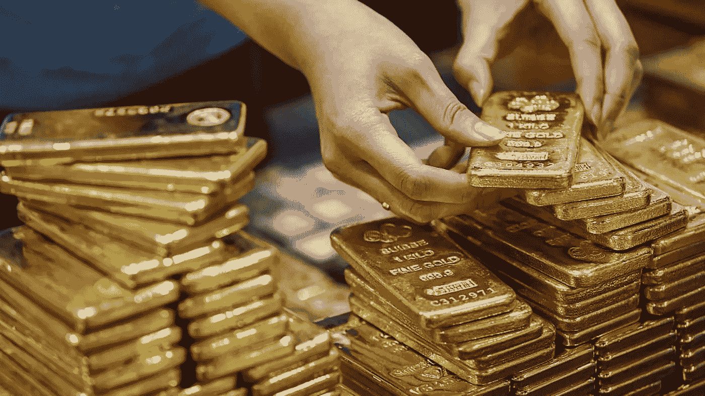
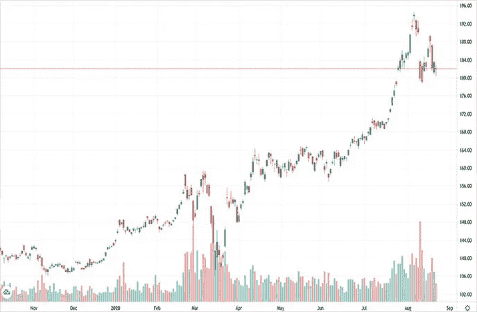
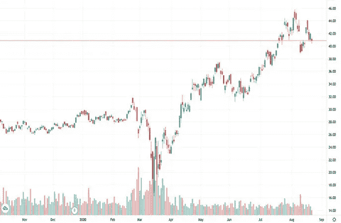
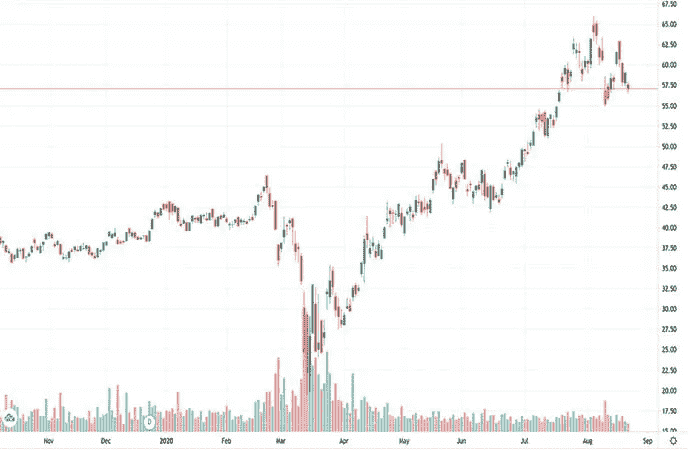

# 你现在应该买黄金 ETF 还是黄金股票？

> 原文：<https://medium.datadriveninvestor.com/should-you-buy-gold-etfs-or-gold-stocks-right-now-661d73e8299?source=collection_archive---------15----------------------->

# 黄金 ETF 比黄金股票更好吗？

对于黄金股和金价来说，这是艰难的一周。在 8 月 7 日创下历史新高后，金价回落至 2000 美元以下。从那以后，它一直在努力保持这一水平。这给黄金股带来了更大的波动性，总体而言，本周虽然波动是利润的来源，但下跌比上涨更频繁。最近的罪魁祸首是美元和债券收益率。

在本月强劲上涨后，黄金市场在本周结束前一直在抑制涨幅。“很多止损单很可能会放在它的下方，所以维持这个支撑区域将很重要。否则，调整可能会拖得更久，”德国商业银行的分析师对 Kitco News 表示。

此外，我们还看到来自欧洲的疲弱经济数据以及美国可疑的就业数据，但随着美元走强，几乎可以肯定黄金将感受到压力。FXTM 的一位研究分析师表示:“尽管最近有所下跌，但基本面仍支持金价走高，并有可能反弹。”

> *“美元普遍走软、美国收益率为负、美国大选前的紧张情绪以及冠状病毒病例不断增加，可能会让黄金在中长期内保持光芒。”*

因此，这可能变成要么“选股”黄金股票，要么在某些黄金 ETF 中寻找机会，以抵御整体波动。无论你决定，有几个选择，当谈到黄金和金条/黄金股票交易所交易基金

# 金条 ETF: SPDR 黄金信托 ETF

SPDR 黄金股份公司( [GLD ETF 报告](https://goldstocks.com/ticker/?symbol=GLD))为投资者提供了一种相对划算且安全的进入黄金市场的方式。SPDR 黄金股份旨在为投资者提供一种参与金条市场的方式。但他们可以投资 GLD，而不是购买实物黄金。

**阅读更多**

*   【2020 年 9 月这 4 只黄金股应该在你的名单上吗？
*   [亿万富翁对黄金股的看法正确吗？](https://goldstocks.com/featured/2020/08/20/billionaires-right-about-gold-stocks-august-20-2020/)
*   [分析师认为最值得购买的黄金股票](https://goldstocks.com/featured/2020/08/18/top-gold-stocks-to-buy-according-to-analysts-right-now-august-18-2020/)

SPDR 表示，推出 ETF 的目的是“降低许多壁垒，比如准入、托管和交易成本”。该公司认为这些是阻止一些投资者投资黄金的障碍。

投资者用 SPDR 黄金股份购买了什么？显然，它代表了信托中不可分割的实益所有权利益。信托公司的唯一资产是金条，有时还有现金。SPDR 黄金股份旨在降低阻止投资者将黄金作为资产配置和交易工具的大量障碍。GLD 对黄金价格有更直接的敞口，但它本身并不拥有实物黄金。

# 黄金 ETF: VanEck Merk 黄金信托

另一个实物黄金 ETF 是 vane CK Merk Gold Trust([OUNZ ETF 报告](https://goldstocks.com/ticker/?symbol=OUNZ))。与 GLD 类似，这种信托旨在为投资者提供一种“便捷且划算的方式”来购买和持有黄金。它似乎解决了实物交割黄金与投资此类 ETF 的相同问题。

据该信托称，其主要目标是为投资者提供通过股票投资黄金的机会，并能够以实物金条(实物黄金)换取其股票。信托的第二个目标是让股票反映扣除信托运营费用后的金价表现。

Merk 开发了一种将伦敦金条转化为金币和金条的专有工艺。ETF 促进税收效率的另一个特征。正如其所言，“接受黄金交割不是一件应税事件，因为投资者只是持有他们已经拥有的东西:黄金。”

# 黄金股票 ETF: VanEck Vectors 黄金矿工 ETF

VanEck Vectors 黄金矿工 ETF ( [GDX ETF 报告](https://goldstocks.com/ticker/?symbol=GDX))试图尽可能地复制纽约证券交易所 Arca 黄金矿工指数(GDMNTR)的价格和收益率表现。该指数旨在跟踪黄金开采业相关公司的整体表现。要被包括在内，公司必须从黄金开采和相关活动中获得至少 50%的总收入。

**【阅读更多】** [巴菲特押注黄金是否预示着又到了买入的时候？](https://goldstocks.com/featured/2020/08/17/buffett-bet-on-gold-time-to-buy-again-august-17-2020/)

GDX ETF 的主要持股包括纽蒙特公司( [NEM 股票报告](https://goldstocks.com/ticker/?symbol=NEM))、巴里克黄金公司([黄金股票报告](https://goldstocks.com/ticker/?symbol=GOLD))、佛朗哥-内华达公司( [FNV 股票报告](https://goldstocks.com/ticker/?symbol=FNV))、惠顿贵金属公司( [WPM 股票报告](https://goldstocks.com/ticker/?symbol=WPM))和纽克雷斯特矿业有限公司。这五家公司加起来，就占了 ETF 的近 43%。该基金总共持有 53 只股票。

# 黄金股票 ETF: VanEck Vectors 初级黄金矿工 ETF

VanEck Vectors 初级黄金矿工 ETF ( [GDXJ ETF 报告](https://goldstocks.com/ticker/?symbol=GDXJ))试图复制 MVIS 全球初级黄金矿工指数的价格和收益率表现。该指数旨在跟踪小型股公司的整体表现。具体来说，这些公司主要从事黄金和/或白银的开采。公司必须从黄金或白银开采及相关活动中获得至少 50%的总收入。

GDXJ ETF 的顶级持股包括 kin Ross Gold Corp .([KGC 股票报告](https://goldstocks.com/ticker/?symbol=KGC))、Gold Fields Ltd. ( [GFI 股票报告](https://goldstocks.com/ticker/?symbol=GFI))、Pan American Silver Corp .([PAAS 股票报告](https://goldstocks.com/ticker/?symbol=PAAS))、Northern Star Resources 和 Evolution Mining。然而，与 GDX 不同的是，GDXJ 的前五大持股仅占整个 ETF 的 28%左右。GDXJ 在少数几只股票中的权重较低，在较小的股票中更加多样化。该基金总共持有 79 只股票。

*原载于 2020 年 8 月 21 日*[*https://goldstocks.com*](https://goldstocks.com/featured/2020/08/21/should-you-buy-gold-etfs-gold-stocks-right-now-august-21-2020/)T22。