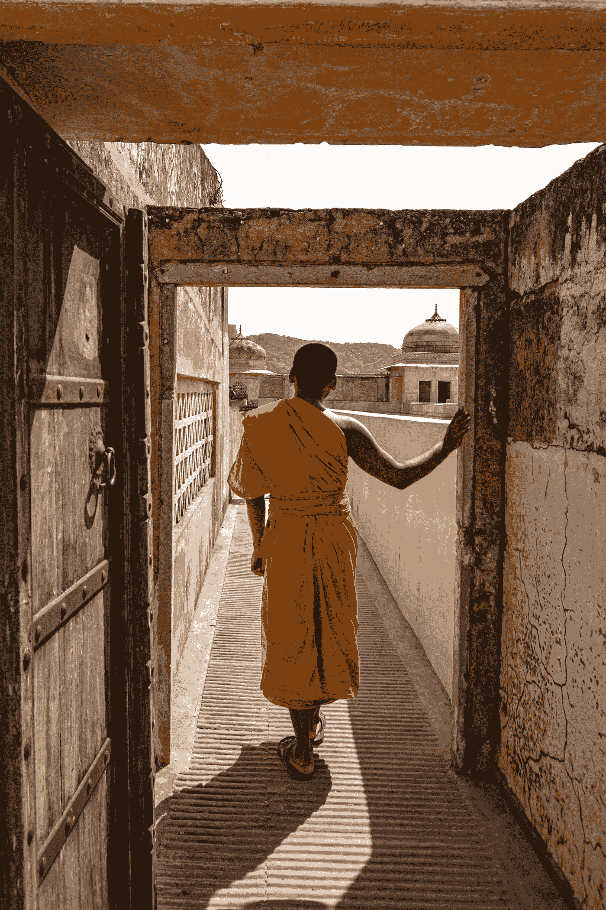

# 你应该渴望更多还是更少？

> 原文：<https://medium.datadriveninvestor.com/should-you-desire-more-or-less-6bc6c791d1e2?source=collection_archive---------4----------------------->

## 当我第一次对个人发展感兴趣时，我是一个十几岁的青少年。

我的第一个引荐人是史蒂夫·帕夫林纳，他是我在早期对制作视频游戏的兴趣中认识的。他已经建立了一个全职的独立游戏开发业务，而开始我自己的小型在线业务的想法成为了我的一个梦想。

后来，我听了金克拉、布莱恩·特雷西和托尼·罗宾斯等经典自助演讲者的有声读物。他们一起都提出了一个相似的人生哲学:设定目标，培养雄心，努力工作，实现梦想。

这是我今天对生活的看法。即使现在，许多早期的梦想已经实现了，我的新梦想也没有了最初那些雄心壮志的执着。

然而，有一个完全不同的学派认为培养欲望是完全错误的。在佛教、道教和斯多葛派中，欲望和渴求是你应该与之斗争的敌人。在他们看来，你为实现梦想而点燃的火焰正是你需要熄灭的火焰。

谁是对的？你应该热情地追随你的欲望，直到你达到目标吗？或者你应该放弃渴望，追求平静安宁的生活？

# 比较两种人生观

这两种人生观完全矛盾。我不确定它们能以任何系统的方式整合。然而，我也发现自己很难拒绝他们中的任何一个。

一方面，我个人的经历证明了目标设定和自我培养的观点。十五岁时，我今天的生活只是一个幻想。今天我有一个在线业务，它全职支持了我近十年。我有一个漂亮的妻子。我住在愉快的城市。我去冒险，享受生活。

如果没有这些早期的灵感，很难说我的生活会是什么样子。我可以想象自己不情愿地出现在一份日常工作中，而我早期的梦想和抱负早已在我的脑海中积满了遗憾的灰尘。

然而，也有可能像我现在的生活一样的事情是不可避免的。也许不是这个确切的职业、配偶或经历，而是类似的东西。在这种观点下，做这些事情是我的天性，不需要特别的哲学或灵感。或者，设定目标和自我发展也是我的天性，因此我从来没有太多的选择是否会如此痴迷地追求它。

# 野心的阴暗面

另一方面，我也理解为什么佛陀主张消除贪欲，为什么老子认为“寻求抓住事物的人将失去它们”，因此在[道德经](https://www.scotthyoung.com/blog/2018/03/27/book-club-tao-te-ching-march-2018/)中“圣人放下过度的努力”。

Photo by [Marius](https://unsplash.com/@marius_oprea?utm_source=medium&utm_medium=referral) on [Unsplash](https://unsplash.com?utm_source=medium&utm_medium=referral)

不可能真正满足你所有的欲望，消除你所有的恐惧，达到完全成功的崇高地位。即使在这样一个永久的成功可能即将到来的短暂时刻，潜在的情绪很少是平静，而是厌倦。

雄心和目标设定的火焰一旦耗尽，很少会蔓延到其他事情上，啃噬着你去做越来越多的事情，即使那不是你最初的灵感。

我自己关于冥想的非常有限的经验给我的印象是，这些想法比简单地避免过度的欲望更深刻。放弃你所有的渴望，即使是很短的一段时间，会给你一种幸福的感觉，这种感觉很难与简单的成就相匹配。

# 培养欲望和抛弃欲望，你该选择哪个？

冒着变得完全语无伦次的风险，我认为矛盾的是，答案是双管齐下。

我不认为生活的最高意义应该是盘腿坐在地板上，在世界与你擦肩而过时保持平静。生物意味着生存，对人类来说，这意味着奋斗、梦想和发挥我们的潜力。

但是，与此同时，相信这样的奋斗和梦想会到达目的地是一种谬误。如果你能达到某个目标，找到那个完美的伴侣，经济自由，开始一个繁荣的事业，这将会带来深刻而持久的幸福。

有这些总比没有好，这是肯定的。然而，在没有它们的时候，人们长期高估了拥有它们会在多大程度上永久地改善他们时时刻刻的现实。

所以我觉得放下欲望也一定要在你的日常修行中。

在第一次旅行中，我觉得我已经走得很远了。第二，我觉得我才刚刚开始。然而，也许事情总是这样，奋斗不可避免地包含了一种个人历史，一个人已经走了一段时间了。相反，放弃渴望将焦点放在此时此刻，因此人总是在迈出第一步。

我越来越相信，生命中那些经久不衰的问题的答案最终可能是自相矛盾的。对生活不一致的回答可能比严格排除所有内在矛盾的不平衡的回答更好。

因此，我认为你应该既培养你的欲望又抛弃它们。点燃你奋斗的火焰，追求你生活中真正想要的东西，尽管你对它们心存疑虑和恐惧。然而，与此同时，要知道如何释放那些同样的欲望，这样它们才不会灼伤你。