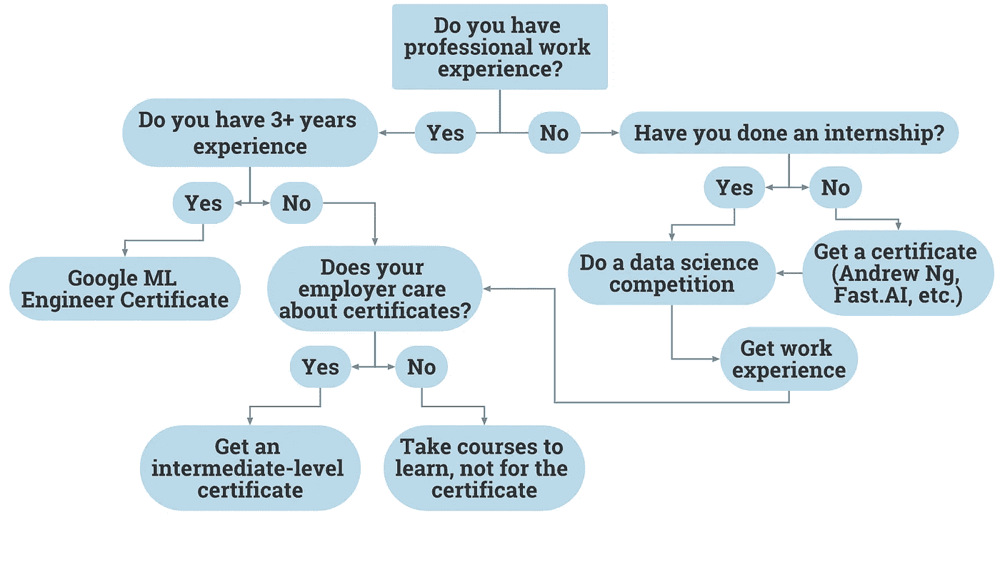
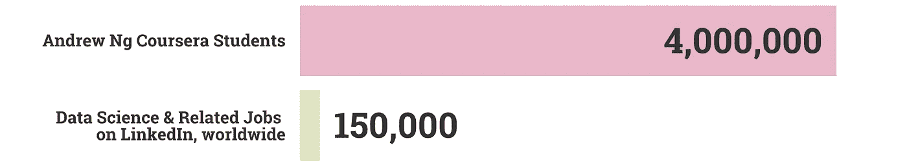

# 该不该考个数据科学证书？流程图。

> 原文：<https://medium.datadriveninvestor.com/should-you-get-a-data-science-certificate-a-flowchart-3e349cc7c43a?source=collection_archive---------10----------------------->

## 世界上最简单的指南。

By author.

# 背景

经常有人问我，“我应该获得数据科学证书吗？”证书在社交媒体上被自豪地分享，数百万有抱负的数据科学家正在热烈追求越来越多的证书。

吴恩达的 AI [Coursera 课程](https://www.coursera.org/learn/machine-learning)有 400 万学习者，几乎有 20 万人注册了 [IBM 的数据科学证书](https://www.coursera.org/professional-certificates/ibm-data-science)。与此同时，在 LinkedIn 上搜索*数据科学*，你会得到大约 15 万个结果(包括分析职位)。

By author.

显然，数据科学证书并不能保证获得数据科学工作——数学并不合理。

# 认证的好处

也就是说，它们是有用的，有几个主要原因:

*   职业发展。
*   证明你的技能。
*   不断学习。

## 高级认证

例如，谷歌的机器学习工程师证书是促进你职业发展的一个很好的方式，并证明你在权限问题、数据集血统、数据可行性等利基主题的技能方面经验丰富。

此外，如果你学习了基础材料——这是你获得证书所需要的——这是一个很好的教育工具。

 [## 为什么你应该获得谷歌新的机器学习证书

### 不要错过去⛵️的船

towardsdatascience.com](https://towardsdatascience.com/why-you-should-get-googles-new-machine-learning-certificate-56af4204744f) 

作为一种全新的证书(仍处于测试阶段)，对证书持有人的需求将远远超过供应，这使得它具有内在的价值。然而，谷歌建议你在该领域有 3 年以上的专业经验，这将是非常困难的。

## 中级认证

如果你有不到 3 年的职业经验，中级证书可以成为职业发展的有用工具(如果你的具体雇主碰巧关心)，或者只是继续教育。

其中包括斯坦福的*人工智能研究生证书*，推荐你有计算用概率的经验。

 [## 人工智能研究生证书

### “人工智能是新的电力。”-斯坦福兼职教授吴恩达利用…

online.stanford.edu](https://online.stanford.edu/programs/artificial-intelligence-graduate-certificate) 

另一个中间选择是*使用 Azure 机器学习开发大数据解决方案，*通过 edX 提供。

 [## 使用 Azure 机器学习开发大数据解决方案

### 过去往往是预测未来的关键。来自历史来源的大数据是一种宝贵的资源…

www.edx.org](https://www.edx.org/course/developing-big-data-solutions-with-azure-machine-l) 

一个更长的选择是吴恩达的*深度学习专业化*，大约需要 4 个月才能完成。

 [## 深度学习

### 从 deeplearning.ai 学习深度学习，如果你想打入人工智能(ai)，这个专精…

www.coursera.org](https://www.coursera.org/specializations/deep-learning?ranMID=40328&ranEAID=vedj0cWlu2Y&ranSiteID=vedj0cWlu2Y-prLF.ZVFar0yetaa0zNneQ&siteID=vedj0cWlu2Y-prLF.ZVFar0yetaa0zNneQ&utm_content=10&utm_medium=partners&utm_source=linkshare&utm_campaign=vedj0cWlu2Y) 

一个更长但更深入的选择是 ColumbiaX 的人工智能中的*微主，这将需要 1 年时间来完成。*

 [## 人工智能微主程序

### 对人工智能指导原则的深刻理解。应用机器学习的概念到现实生活中的问题和…

www.edx.org](https://www.edx.org/micromasters/columbiax-artificial-intelligence?source=aw&awc=6798_1595527029_c51e33816b64582e5272221ee06c0a11&utm_source=aw&utm_medium=affiliate_partner&utm_content=text-link&utm_term=427859_Digital+Defynd) 

## 初级认证

如果你完全没有任何数据科学方面的经验，也不要苦恼。在这个类别中有很多很好的选择。以下是几个例子:

*   [快。AI](http://fast.ai) (注意:与列表中的其他课程不同，这门课程不会以传统证书告终，但你需要保留一个在线文件夹)
*   [艾未未吴恩达](https://www.coursera.org/learn/ai-for-everyone)
*   [吴恩达的机器学习](https://www.coursera.org/learn/machine-learning)
*   [IBM 数据科学专业证书](https://www.coursera.org/professional-certificates/ibm-data-science)
*   [Coursera 上的 Python 介绍](https://www.coursera.org/projects/introduction-to-python)

显然，有许多地方可以开始。虽然这些相对快速和简单的证书是很好的学习工具，但不要指望仅凭这些就能获得热门的数据科学工作。

你也可以尝试远程数据科学实习，并参加数据科学竞赛来增加你的个人资料。

 [## 面向所有人的远程数据科学实习[带证书]

### 无论你是在印度、巴西、中国，还是……世界上的任何其他地方，这些实习机会都是为你准备的。

medium.com](https://medium.com/@frederikbussler/remote-data-science-internships-for-everyone-with-certificates-d4eebb993dac) 

# 结论

证书并不代表一切，但无论你是一名有抱负的数据科学家、初级职位，还是该领域的资深人士，证书都是一个有用的工具。有了丰富的选择，参考这个流程图，以简化您的决策。