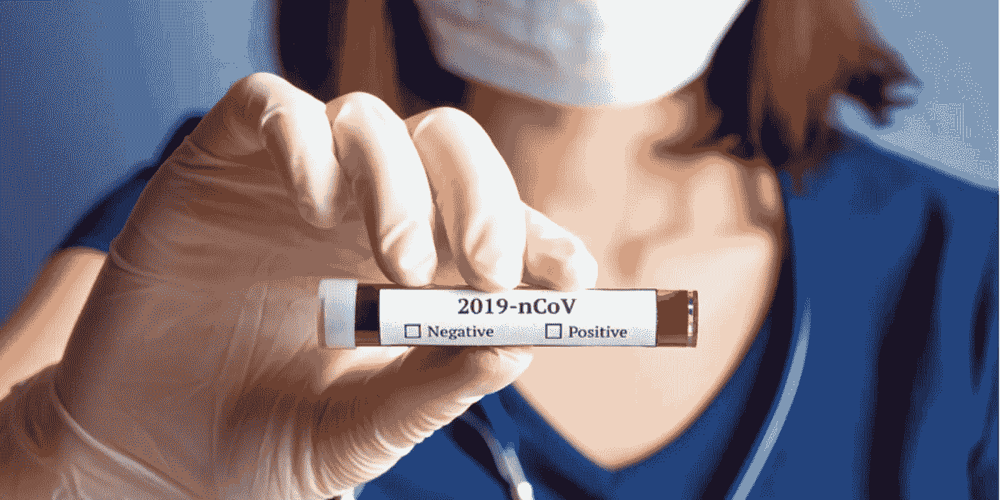
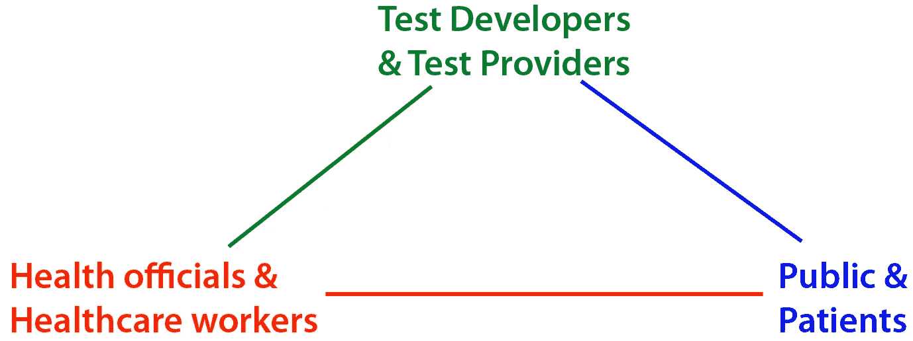

# 你应该接受冠状病毒测试吗？

> 原文：<https://medium.datadriveninvestor.com/should-you-get-tested-for-the-coronavirus-bf6bc06b44ad?source=collection_archive---------5----------------------->

## 这取决于你的目标是谁和什么

我不是健康专家。我是一个批判性的思考者。我阅读和观看了许多关于这个全球性疫情的报道，我主张在大多数人之前尽早采取行动。我看到专家们对测试有不同的看法。这是我努力使情况变得更清楚。希望有帮助。把它加到你已经知道的东西上，然后考虑一下这个情况。

一如既往，你的医生比我更清楚。如果你有任何问题，打电话问你的医生。

# 谁在乎考试？

在我看来，测试被夹在三种力量之间:

所以我想分解一下，从每个演员的角度来看。我先从公众开始，因为他们是我的大多数观众。你不必读完你感兴趣的部分。

# 公众和患者

我属于这一类，你可能也是。我应该接受测试吗？你应该吗？我的答案是否定的，我想解释一下为什么。

循证医学的一个重要规则是*你不应该参加任何测试，除非你计划根据测试的结果做一些不同的事情*。如果检测结果为阳性，你应该准备采取不同的行动。这就是为什么我不做骨骼扫描或 PSA 测试——我假设自己患有骨质疏松症和前列腺癌，并据此生活。

所以想象你去做新冠肺炎测试——如果你测试呈阳性，你会有什么不同？即使你可以在药店花 1 美元进行测试并立即得到答案，你会这样做吗？为什么？

我只是假设我感染了病毒。我想我已经被感染了，并且可能会传染给其他人。我想接下来的 2-4 周我会呆在家里，我已经为此做好了准备。我的工作已经是不去感染别人并做出相应的行动。

 [## 大笔资金和尖端技术:人工智能/人工智能投资将如何革新医疗保健…

### 在过去几年人工智能(AI)和机器学习(ML)的显著发展中…

www.datadriveninvestor.com](https://www.datadriveninvestor.com/2018/03/22/big-money-and-cutting-edge-technology-how-investment-in-ai-ml-will-revolutionize-the-healthcare-industry/) 

我唯一能看到我会有不同表现的情况是我和室友或老人住在一起。然后，如果我愿意搬出去，我会想知道。家庭应该讨论如果父母中的一方检测呈阳性，他们会怎么做——如果他们会采取不同的行动，那么如果他们有症状，他们可能会想去检测(但到那时可能已经太晚了)。孕妇可能有理由知道，尽管我不确定她们会有什么不同。

我至少会等待症状出现。我认为没有症状的人不应该接受检查，除非他们的医生要求他们这样做。

与其接受测试，我认为最好的办法是:

1.  [**尽一切可能避免感染**](https://medium.com/@pullnews/coronavirus-update-march-9-2020-77f62bb65eed) **:卫生和隔离是关键。**
2.  **如果感染，保持隔离，治疗症状。**
3.  **如果发烧或咳嗽很严重并且越来越严重，打电话给医生。**

有可能在那个时候，你可能无法使用呼吸机。你可能会成为超负荷的医院系统的受害者。但我看不出接受测试会改变你的结果。我也看不出去一家医疗机构，让系统承受虚荣心测试的负担，对其他可能需要测试的病人有什么帮助。更不用说你可能会得到[一个假阳性或者假阴性](https://www.theatlantic.com/health/archive/2020/03/where-do-you-go-if-you-get-coronavirus/607759/)。阳性测试不会让你使用呼吸机——只有症状才会这样。

# 测试开发者和测试提供者

这些人夜以继日地设计、改进、制造和分发测试。幸运的是，我们知道很多关于病毒感染测试的知识，而且工作很简单。在需要的地方进行足够的测试是困难的部分。在快/贵和慢/便宜之间有一个权衡。我认为，经过缓慢的启动后，美国正在尽一切努力使测试广泛可用。

# 卫生官员和卫生保健工作者

卫生官员和研究人员想要疾病发展和传播的实时热图。他们的理想世界是，你的智能手表或相机可以给他们提供实时感染数据。这有助于他们跟踪和追踪病毒爆发的源头，并采取干预措施防止更多的传播。

所以，虽然你可能不需要做任何测试，但疾病控制中心希望尽可能多的人做测试。这是接受测试的最好理由——你被要求接受测试。你的数据可以帮助他们追踪感染，并以某种方式防止传播。

另一件可能有帮助的事情就是记录症状。像苹果公司的 HealthKit 这样的新工具可能最终会给卫生官员提供更好的实时数据，从而更好地进行跟踪，即使没有抗体测试。像 [PupilScan](http://pupilscan.co.uk) 这样的公司在智能手机测试方面处于领先地位，更多这样的应用将为我们提供更多的数据。

数据越多越好。数据越快越好。在像西雅图这样感染已经很猖獗的地方，追踪接触者几乎是不可能的。但在圣达菲这样的城市，目前可能只有一两个病例，接触追踪可以产生巨大的影响。卫生官员需要他们能得到的最好的工具。如果你被要求参加考试，请照办。

# **总结**

除非我的医生或卫生官员要求，否则我看不出有任何理由去做检查。我打算关注我的症状。如果我有重感冒的症状，我会认为我得了重感冒。但是如果病情恶化，我会马上打电话给我的医生，按照她的指示去做。

你怎么想呢?你想让我给你的公司做一个冠状病毒概述吗？您想了解最新的发展和建议吗？[取得联系](mailto:david@dsiegel.com)。

[**大卫·西格尔**](http://dsiegel.com/) 是 DC 华府的连环企业家和批判思想家。他是[支柱项目](http://pillarproject.io/)和 [2030](http://2030.io/) 的创始人。他著有《令牌手册》**[*开斯坦福*](http://www.openstanford.com/)*[*文化甲板*](http://theculturedeck.com/)*[*气候好奇*](http://climatecurious.com/)***。他在世界各地发表演讲和网络研讨会。他的全部作品在[**dsiegel.com**](http://www.dsiegel.com/)展出。*******