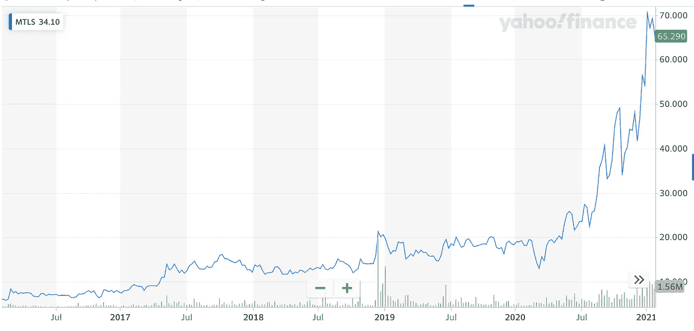

# 为什么您应该投资 3D 打印

> 原文：<https://medium.datadriveninvestor.com/should-you-invest-in-3d-printing-2c77e1505a80?source=collection_archive---------42----------------------->

## 技术和金融

## 看起来很有前途的颠覆性创新

Photo by [Xiaole Tao](https://unsplash.com/@xiaole?utm_source=medium&utm_medium=referral) on [Unsplash](https://unsplash.com?utm_source=medium&utm_medium=referral)

> “你永远无法通过对抗现有的现实来改变事情。要改变什么，就建立一个新的模型，让现有的模型过时。”―巴克明斯特·富勒

颠覆性创新创造了新的市场和价值网络。它们取代了成熟的市场领先企业、产品和联盟。

在早期阶段，颠覆性创新为大规模投资提供了**机会。**

就像网飞之于视频流，汽车之于马车，数码相机之于电影，拼车之于出租车，电动汽车之于燃料燃烧，以及 SpaceX 之于传统火箭。

3D 打印将带来**大规模的颠覆**，主要是在医疗保健、航空航天和房地产领域。

市场数据显示，顶级 3D 公司在过去 5 年中处于最佳状态(下图)。

为了更好地理解 3D 打印行业带来的机遇，我们必须超越传统投资文化，关注短期收益、价格波动、指数和行业。

为了更准确地揭示其价值，我们必须看看 3D 打印是如何工作的，它的应用，以及它如何跨越部门，行业和市场。

技术的**融合**正在所有类型的破坏性创新中发生，如基因组学、脑机接口和 3D 打印。3D 打印与人工智能的融合是它如此具有破坏性的原因。

鉴于 3D 打印如何释放人工智能的潜力，它仍处于起步阶段。它的应用多种多样，因为它支持多种外形。它正在从根本上创造**新的零件架构。**

3D 打印是一种添加制造的形式，它一层一层地构建物体，这与传统的从较大的块中移除材料的减法制造相反。这意味着——第一次，我们可以从头开始，一层一层地使用人工智能来设计每一个零件——从尺寸、数量到美学。

我们能够制造传统制造业无法制造的零件。方舟投资管理公司首席财务官兼分析师塔莎·基尼解释说:“这对医疗保健和航空航天市场来说确实具有破坏性。

3D 打印可用于制造复杂的小批量零件。例如，我们可以扫描人体并打印出专门为患者设计的所需植入物，而无需刮掉患者的骨头。

这是**扰乱医疗保健行业**。

现在所有的助听器都是 3D 打印的。实现这一转变用了不到两年的时间。这只是开始。很快，公司将不得不快速适应这种程度的中断，通过保持成本竞争力和能够提供高质量的产品来留在市场上。

同样，**颠覆也发生在航空业**。[strata sys](https://www.stratasys.com/)——一家 3D 打印塑料零件的领先公司正在制造将使飞机更轻、降低复杂性和简化生产的零件。

交通系统、教育和消费品制造业也将以类似的方式受到破坏。

工程师、医生和企业家彼得·迪亚曼蒂斯(Peter Diamandis)表示:“为零售供应链简化和本地化的未来做好准备，现场 3D 打印可以满足任何需求。”。

3D 打印缩短了设计和生产之间的时间，将权力转移给设计师，并降低了供应链的复杂性，而成本只是传统制造的一小部分。

根据方舟投资管理公司的说法，3D 打印将彻底改变制造业，以大约 60%的年增长率从去年的 120 亿美元增长到 2025 年**的 1200 亿美元**。

管理公司认为今天只有 1%的市场被渗透。因此，对投资者和企业家来说，这是一个巨大的“绿地”空间，让两个极端都成为可能——高回报和高风险。

与任何颠覆性创新一样，在计算风险时，也必须考虑快速变化、监管障碍、政治环境、竞争格局、不确定性/未知性。

所以让我们来看看 3D 打印领域的一些最大的公司在市场上的实际表现—

**3D 系统公司(DDD)**

Screenshot from Yahoo Finance by the author on Feb 1, 2021

**普罗托实验室公司**

Screenshot from Yahoo Finance by the author on Feb 1, 2021

## 法罗技术公司(法罗)

Screenshot from Yahoo Finance by the author on Feb 1, 2021

## **MTLS**

Screenshot from Yahoo Finance by the author on Feb 1, 2021

## ExOne 公司

Screenshot from Yahoo Finance by the author on Feb 1, 2021

如上图所示，所有这些公司的**股价都处于过去 5 年的最高水平**。

由于 3D 打印的巨大破坏性，数据和论据都强烈支持投资 3D 打印。当然，如果我们以耐心、自律和长远眼光对全球趋势保持警惕，最初看起来有风险的东西可能会获得高回报。

[***Upen Singh***](https://medium.com/about-me-stories/about-me-upen-singh-4d16999f650c)***写的是人、进步、未来。他对改善生活感兴趣。***

他已经去过 25 个国家，他总是在寻找新的冒险来学习和分享。他拥有西弗吉尼亚大学发展经济学硕士学位。

***他生活在泰国、尼泊尔和美国，不停地旅行。他目前正在尼泊尔偏远的西部参与一个名为*** [***梅塔谷***](http://www.mettavalley.org/) ***的村庄开发项目。***