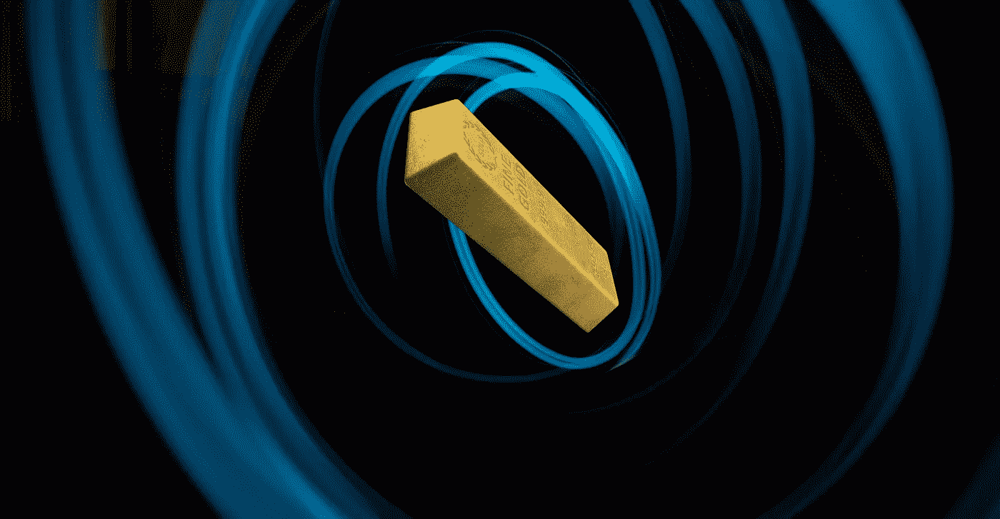
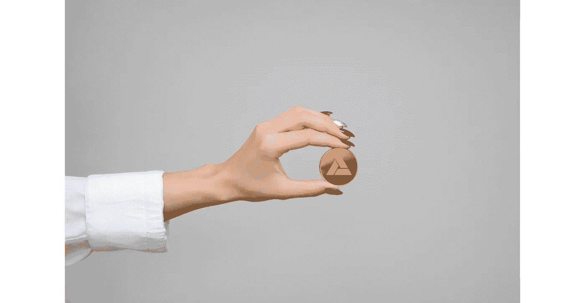

# 你应该投资黄金支持的密码吗？

> 原文：<https://medium.datadriveninvestor.com/should-you-invest-in-a-cryptocurrency-backed-by-gold-a75495128a64?source=collection_archive---------9----------------------->

## 这个令牌给你两全其美的东西，可以让你免受通货膨胀的影响

Created by Author using [Canva](https://www.canva.com/)

在 2017 年的加密泡沫之后，我担心以加密货币的形式储存我的财富。每天都会有一些新闻爆出一些最新的加密骗局或者一些政府宣布加密货币非法。

感觉就像 90 年代又回来了。那时候我还活着，但故事表明没人知道他们在投资什么。每个人都想分一杯羹，每个人都想快速致富。围绕加密的大肆宣传催生了许多[假币、庞氏骗局和加密骗局](https://levelup.gitconnected.com/biggest-crypto-scam-in-history-worth-15-billion-381e97cf2c0f)。

三年后，政府开始接受加密货币。[印度最高法院推翻了印度储备银行的加密禁令。法国楠泰尔商业法院裁定](https://en.ethereumworldnews.com/why-more-governments-will-embrace-bitcoin-btc-and-crypto/)[比特币是一种合法的货币形式。](https://www.lesechos.fr/finance-marches/banque-assurances/la-justice-francaise-assimile-le-bitcoin-a-de-la-monnaie-1182460)

一个这样的密码引起了我的注意是 **PMGT，珀斯铸币厂黄金令牌。这是一枚稳定的硬币，由政府支持，因此值得信赖。**

> 珀斯铸币厂黄金令牌(PMGT)是公共区块链上的第一个数字黄金令牌，最终由政府担保的黄金支持。——[PMGT](https://medium.com/pmgt/introducing-the-perth-mint-gold-token-pmgt-128797957de7)

# 什么是稳定币，为什么存在

加密货币的波动性很大，比如在 2017 年 10 月到 2018 年 1 月的三个月里，[比特币的价格波动达到了近 8%](https://www.investopedia.com/articles/investing/052014/why-bitcoins-value-so-volatile.asp#:~:text=Bitcoin's%20value%20has%20been%20historically,period%20ending%20January%2015%2C%202020.) 。

如果你把财富储存在这样的资产中，你就很难睡个好觉。

稳定的硬币是由另一种资产支持的加密货币，这种资产可以是从贵金属到法定货币的任何东西。

稳定的硬币围绕其挂钩的资产价格浮动。一些著名的稳定硬币是系绳，由美元支持；戴背靠以太坊，没错！[加密也可以钉住另一个加密](https://www.reuters.com/article/us-crypto-currencies-altcoins-dai/crypto-backed-by-crypto-dai-seeks-to-change-stablecoin-game-idUSKBN1XS0MU)；美元支持的 JPM (JP 摩根硬币)。

## 为什么我应该购买稳定的硬币，而不是它所支持的资产？

稳定币有一定的传统资产甚至一些加密货币不存在的好处。

*   它们让你不用担心价格波动就能保护你的财富。
*   稳定币大多交易速度较快，转账费用较低。这对于大额转账非常有用。
*   加密到加密交换不接受法定货币，因此交易只能使用加密货币或稳定的硬币进行。
*   稳定的硬币由实物资产支持，但它们没有任何实物存在，因此可以在全球范围内交易。
*   稳定的硬币是抵御通货膨胀的好工具。几个发展中国家的公民使用稳定的硬币来保护他们的财富免受本国货币高通胀的影响，并抵制金融监管。
*   它们让你可以灵活地赎回支持它们的实际资产。如果 1 枚稳定硬币相当于 1 美元，按照 1:1 配给，您可以用美元兑换等值的稳定硬币。

稳定的硬币让你两全其美。它们给你加密货币一样的灵活性、低费用、透明性和隐私性，以及法定货币或实物资产的信任和稳定性。

这里有一本[凯尔·埃利科特](https://medium.com/u/7e29992d1be?source=post_page-----a75495128a64--------------------------------)的好书，可以让你了解更多关于稳定硬币的知识

 [## 稳定曲线概述

### 在区块链/ DLT 的景观中，稳定的角落已经成为一个越来越重要的类别。

medium.com](https://medium.com/coinmonks/an-overview-of-stablecoins-fed7553fb25b) 

澄清一下，我和 PMGT 没有任何关系。几周前，我偶然发现了这个令牌，并进行了自己的研究。请在投资前做好自己的研究。

# 什么是珀斯铸币厂黄金令牌

Created by Author using [Canva](https://www.canva.com/)

鉴于上述原因，你可以投资各种稳定的硬币，但 PMGT 尤其有趣。

黄金已经存在了几千年，曾经是' [*金本位*](https://www.investopedia.com/ask/answers/09/gold-standard.asp) '。我们认为黄金是一种经受住了时间考验的传统贸易避风港。

珀斯铸币厂是澳大利亚最大的贵金属精炼厂。他们最近与金融科技初创公司 Infinigold 联合推出了 PMGT。该代币由实物黄金储备支持，并保持 1:1 的比例，由澳大利亚西部政府担保。

> PGMT 有政府做后盾，有黄金做担保—[PGM*T*](https://pmgt.io/)

在 PMGT 之前，使用数字技术购买黄金的唯一方式是使用 Gold Pass，这是一款由珀斯铸币厂开发的应用程序，允许黄金数字化。该应用程序发布数字证书，将黄金的所有权转移给投资者。

PMGT 是以太坊区块链黄金通行证的令牌化版本，作为一个 [ERC-20 令牌](https://www.investopedia.com/news/what-erc20-and-what-does-it-mean-ethereum/)。这使得加密货币具有安全性、透明性、更快的交易速度和匿名性等能力。

您可以使用金卡账户将您的证书兑换成 PMGT，反之亦然。你也可以把你的代币兑换成金条，或者按当前市价兑换成法定货币。这赋予了 PMGT 独特的流动性，即使是大宗交易也不例外。

我们可以使用[库币交易所](https://trade.kucoin.com/PMGT-BTC)购买 PMGT，这是 [PMGT 网站](https://pmgt.io/)上推荐的交易所。也可以使用澳大利亚可信的加密货币交易所[独立储备](https://independentreserve.com/buy/perth-mint-gold-token)。

我强烈建议你在投资任何密码之前多了解一些关于密码骗局的知识。这是我关于历史上最大的加密骗局的文章的链接-

 [## 价值 150 亿美元的加密骗局震动了整个行业

### 一个博士如何愚弄整个世界

levelup.gitconnected.com](https://levelup.gitconnected.com/biggest-crypto-scam-in-history-worth-15-billion-381e97cf2c0f) 

在这个时期，当整个世界经济处于过山车状态时，以某种稳定资产的形式来保护你的财富是明智的。稳定的硬币是最简单和广泛使用的方法之一。

然而，并不是所有的人都可以信任。加密空间是庞氏骗局和骗局的流行领域。在这种情况下，PMGT 提供了一个更可靠、更强大的解决方案。

**访问专家视图—** [**订阅 DDI 英特尔**](https://datadriveninvestor.com/ddi-intel)