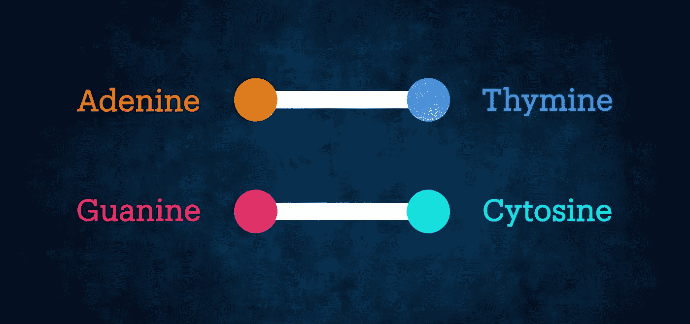
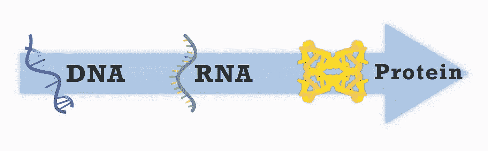
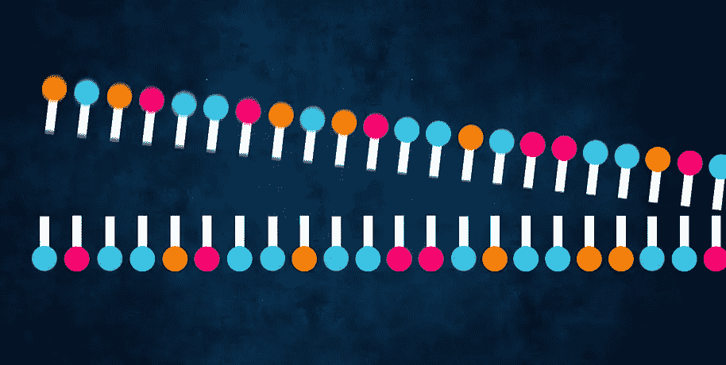
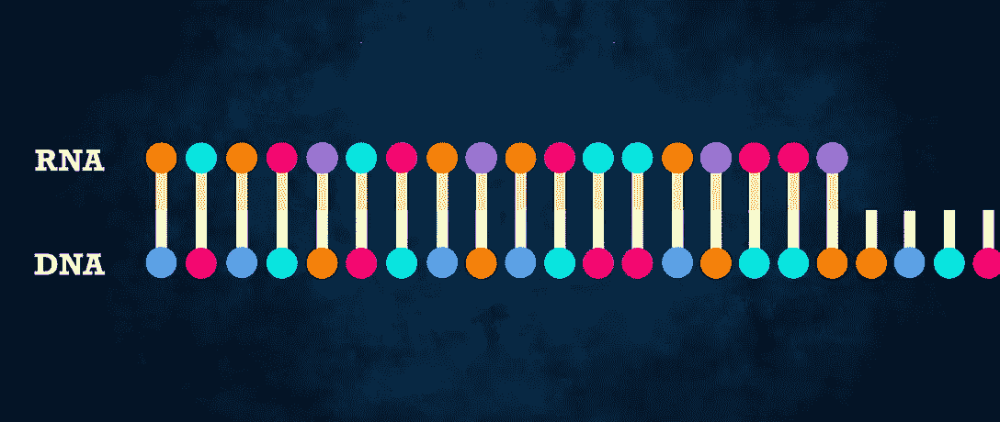
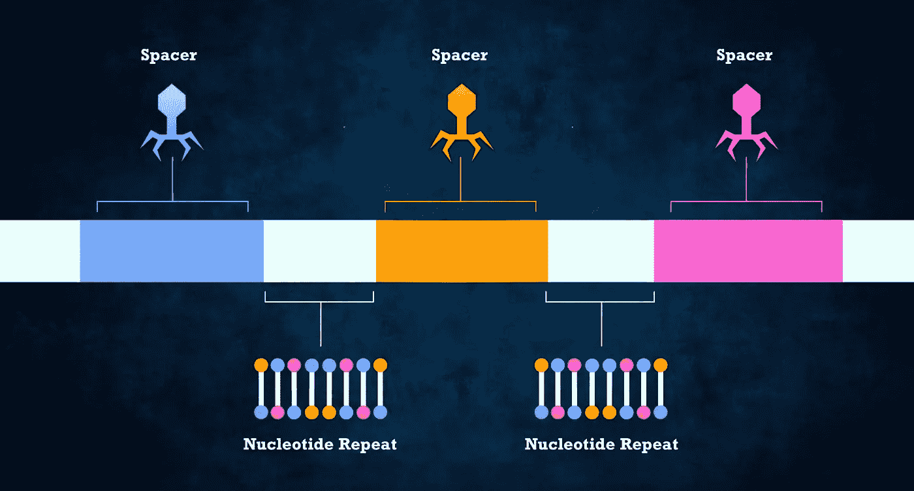
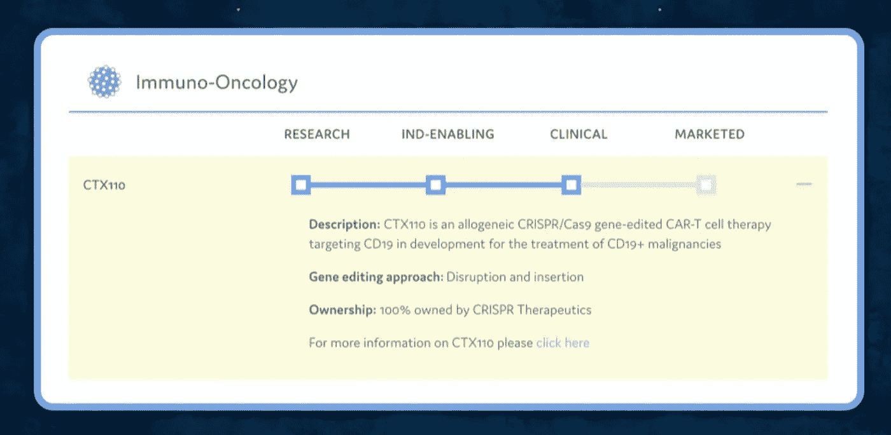
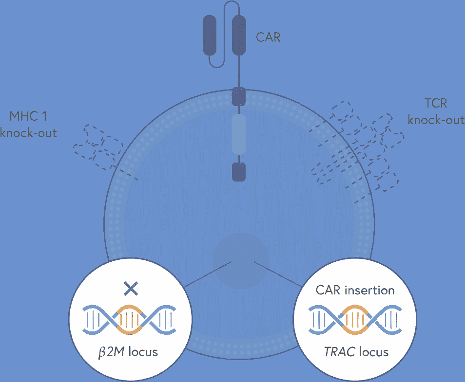
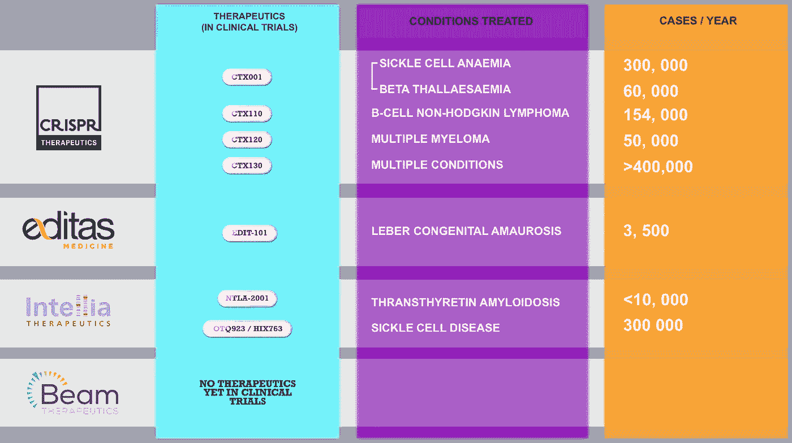

# 应该投资 CRISPR 吗？

> 原文：<https://medium.datadriveninvestor.com/should-you-invest-in-crispr-7cda005b62c2?source=collection_archive---------6----------------------->

## CRISPR 是一项可用于编辑基因的技术，在许多行业中展现了过多的可能性。但最重要的是医疗保健。CRISPR 让你能够编辑一个人的基因，因此有可能治愈一系列遗传疾病，如镰状细胞贫血，还可能彻底改变我们治疗癌症的方式。

CRISPR 已经在研究中使用了很长时间，但我们现在开始看到公司利用这项技术来创造新的治疗方法。不可否认，CRISPR 将改变世界，并将在我们对待患者的方式上引起翻天覆地的变化。因此，能够成功将这项技术推向市场的公司无疑将在未来很长一段时间内成为行业巨头。

但是很多投资者不了解 CRISPR 是什么，以及它的潜在应用，你永远不应该投资你不了解的东西。因此，在本文中，我们将讨论 CRISPR 是什么，这个领域的主要公司是谁，以及我认为谁最有可能取得成功。

现在，在这一点上，重要的是要指出我不是一个财务顾问；在考虑投资任何东西的时候，你都应该做自己的研究。作为一名医生和医学技术专家，我只是在这里给你我对这项技术的看法，你是否同意我的看法，这取决于你自己的决定。

# 理解 DNA

因此，在我们理解 CRISPR 之前，我们首先需要了解一些关于 DNA 或脱氧核酸的知识。DNA 具有双螺旋结构，由四种不同的氮基分子组成:腺嘌呤(A)、胸腺嘧啶(T)、鸟嘌呤(G)和胞嘧啶(C)。这些统称为基地。

这些碱基相互配对形成双螺旋，但只能与它们互补的碱基配对。所以腺嘌呤总是和胸腺嘧啶配对，而鸟嘌呤总是和胞嘧啶配对。

从基因角度来说，这些碱基在你遗传密码中出现的顺序决定了我们的一切。眼睛的颜色，我们可能有多高，我们是否易患某些疾病，这些都写在我们遗传密码的碱基对中。

其工作原理基于 DNA 的基本法则，即 DNA 制造 RNA 制造蛋白质。但这意味着什么呢？

所以 DNA 储存在我们细胞的细胞核里，但是储存在我们 DNA 里的信息不能直接用来制造构成你个体特征的蛋白质。为了实现这一过程，DNA 必须首先被转换成一种叫做 RNA 或核糖核酸的东西。RNA 几乎与 DNA 相同，但有一个重要的区别。RNA 用一种叫做尿嘧啶的类似碱基代替胸腺嘧啶碱基。同样的配对规则也适用，但不是胸腺嘧啶与胞嘧啶结合，而是尿嘧啶结合。

为了制造 RNA，DNA 解开它的双螺旋并暴露它的碱基。RNA 碱基可以与暴露的碱基结合，形成自己的 RNA 链，这是 DNA 的互补序列。

然后 RNA 进入细胞中被称为核糖体的特殊蛋白质。然后核糖体利用 RNA 中的遗传密码，通过组装氨基酸来生产蛋白质，氨基酸是蛋白质的组成部分。氨基酸的顺序取决于你的遗传密码的顺序。

不要太担心细节，但有了这个基本的理解将有助于我们理解 CRISPR。

# CRISPR 是什么？

CRISPR 实际上是一种自然过程，它是一些细菌物种抵御病毒入侵的一种方式。每次面对一种新病毒，细菌都会从该病毒的基因组中捕获 DNA 片段，并创建一个副本存储在自己的 DNA 中。

这些病毒 DNA 片段就像细菌遇到的单个病毒的记忆库——每个片段都包含允许细菌识别并在下次入侵时快速杀死病毒的数据。

在这些有用的 DNA 片段之间，有稍微不太有用的重复 DNA 片段将它们分开——就像每个病毒片段之间的分割线。

这些重复的 DNA 片段是 CRISPR 得名的原因。CRISPR 代表“聚集的规则间隔的短回文重复序列”。卷曲蛋白是 DNA 的一个特殊区域，具有两个明显的特征:核苷酸重复的存在，因此是重复碱基的短片段，与称为间隔区的片段相邻。间隔区的命名有些混乱，因为正是这些区域实际上包含了病毒 DNA 的参考，以及分隔不同间隔区的核苷酸重复。

一旦插入间隔区，病毒再次攻击，CRISPR 的一部分被转录并加工成 CRISPR RNA，或“crRNA”。因此，CRISPR 的核苷酸序列充当模板，产生单链 RNA 的互补序列。因此，每个 crRNA 由一个核苷酸重复序列和一个间隔区组成。

这就是所谓的 cas9 蛋白的来源。Cas9 蛋白是一种切割 DNA 的酶。酶只是一种蛋白质，作为催化剂加速特定的生化反应。

cas9 蛋白与 crRNA 以及细菌宿主 DNA 中编码的另一部分 RNA 结合，称为 tracrRNA(或“反式激活 crRNA”)。然后这两个引导 Cas-9 到达病毒 DNA 上的目标位置。如果 crRNA 与病毒 DNA 上的一段互补，那么这就激活了 Cas-9 酶。然后这种酶切割病毒 DNA，使病毒失活。

真的很聪明！

# 但是这如何让我们编辑基因呢？

但是当然，这只有在你是细菌的情况下才有用，而你们大多数人可能都不是。那么我们是如何将细菌抗病毒系统改造成基因编辑系统的呢？

如此有效的细菌机制给了我们这样一个系统如何工作的蓝图。但是科学家们现在更进一步，在实验室制造了他们自己的 CRISPR 区域。如果你考虑一下，你需要做的就是在你的目标 DNA 中找到一个你想要编辑的区域，然后创建一条与该区域互补的 DNA 链。

因此，如果我们有一条这样的 DNA 链，我们想要靶向这部分 DNA，我们只需要一条这样的互补 RNA 链:

一旦你知道你想要靶向的 DNA 片段，CRISPR-Cas9 复合体就可以开始工作了。Cas9 酶从解开 DNA 双螺旋的片段开始，而 RNA 分子沿着暴露的碱基对寻找完美的匹配。一旦找到完全匹配，Cas9 就在这个位置切除基因。

此时，细胞的天然 DNA 修复机制开始发挥作用。DNA 可以通过两种方式修复，第一种是简单地重新连接两条链的末端，但这种修复过程非常容易出错，所以通常会导致基因失活，所以如果你的目的是禁用特定基因的功能，那么这可能是一种非常有效的方法。

然而，基因也可以通过在 DNA 断裂的部分注入另一条 DNA 链来修复，从而编辑基因的功能。这是真正的基因工程，比简单地破坏基因的功能要复杂得多。

# 应该投资 CRISPR 吗？

现在我们了解了 CRISPR 的基本概况及其工作原理，让我们先了解一下这个领域的主要参与者，然后再深入了解我特别感兴趣的公司。

**Crispr 疗法-**

说到 CRISPR 的大玩家，CRISPR therapeutics 不得不榜上有名。该公司由 Emmanuelle Charpentier 创建，他是 CRISPR 技术的共同发现者之一，也是 2020 年诺贝尔化学奖的共同获得者。CRISPR Therapeutics 正在研发一系列疗法。该公司目前的主要焦点是 CTX001，它治疗镰状细胞病和输血依赖型β-地中海贫血患者。其管道中的另一个候选药物是 CTX110，这是一种针对复发或难治性非霍奇金淋巴瘤患者的治疗方法，它刚刚在 10 月底的一期试验中获得了积极的早期结果。这只是 Crispr 正在研究的众多候选者中的两个，其中任何一个都可能为这家生物技术公司及其股东带来难以置信的利润。

**Editas 医药-**

名单上的下一个是 Editas Medicine。基因编辑有两种形式。第一种是在体内，基因在病人体内被编辑。第二种是离体，基因被编辑后植入病人体内。Editas Medicine 做到了这两点，为该公司提供了一系列广泛的治疗方法，这些方法集中在三个领域:血液疾病、癌症和眼病。此外，一种治疗方法——EDIT-101——已经进入治疗 Leber 先天性黑蒙 10 (LCA10)的 1/2 期试验。这是体内 CRISPR 治疗首次进入临床试验，积极的结果可能会立即使 Editas 成为这一新领域的领导者，大多数 CRISPR 公司都专注于体外治疗，因此在体外处理细胞，然后将其注射到人体内。Editas 在 2020 年第二季度完成了股票发行，并加强了现金头寸，为该公司提供了足够的运营资金，直至 2023 年。所以位置很好。

**Intellia Therapeutics -**

Intellia Therapeutics 是 CRISPR 领域的另一个大牌。CRISPR 是一项如此新的技术，以至于该领域仍然很少有专家——但 Intellia Therapeutics 的联合创始人詹妮弗·杜德纳(Jennifer Doudna)是其中之一。Doudna 与 CRISPR Therapeutics 的创始人 Emmanuelle Charpentier 一起，在 2012 年因发现 CRISPR 技术而获得了 2020 年诺贝尔化学奖——今天，Intellia 正在利用同样的技术为许多遗传疾病创造疗法。该公司管道的顶端是 NTLA-2001，这是一种用于遗传疾病淀粉样变性或 ATTR 的体内治疗方法，于 11 月初开始其 1 期临床研究。Intellia 还有另外两个强有力的候选药物，NTLA-2002(用于治疗遗传性血管性水肿)和 NTLA-5001(用于急性髓性白血病)，正在等待 2021 年的监管提交。另一家公司拥有良好的血统和广泛的潜在疗法，使 Intellia 成为该领域的一个强有力的选择。

**光束治疗公司-**

现在，我要把最后一家公司列入名单的是 Beam Therapeutics。该公司在 2 月份首次公开上市，在接下来的一个月里，其股价与市场其他股票一道迅速下跌。但这并不反映该公司的质量，只是更广泛市场的一个不幸情况。股票迅速反弹，因为 Beam 的团队对如何利用 CRISPR 技术有一些非常好的想法。该公司专注于碱基编辑，这是一种改变 DNA 中单个碱基的技术。据该公司称，“如果现有的基因编辑方法是基因组的‘剪刀’，那么我们的基本编辑器就是‘铅笔’，擦除并重写基因中的一个字母。”投资者有充分的理由对这项技术感到兴奋，Beam 有多达 12 个项目处于各种临床前阶段，具有很大的潜力。

# 那么我喜欢哪家公司呢？

所以我最喜欢哪家公司。值得注意的是，它们都是非常好的公司。但对我来说，目前班上最好的是 CRISPR therapeutics。

我来解释一下原因。

首先，该公司拥有令人印象深刻的渠道。该公司建立了一个项目组合，根据许多标准选择疾病目标，包括未满足的医疗需求、技术可行性、CRISPR/Cas9 相对于其他方法的优势，以及考虑将候选产品推进到临床试验并通过临床试验所需的时间。

以他们的龙头节目 CTX001 为例。遗传性血红蛋白病β-地中海贫血和镰状细胞病(SCD)是由编码血红蛋白(血液中的携氧分子)的关键成分的基因突变引起的。这些都是 CRISPR 的很好的治疗候选，因为它们是由于一个基因的缺陷。

这两种疾病目前都需要终身治疗，这可能导致需要定期输血，并导致疼痛症状和长期住院。可悲的是，这两种疾病都会导致预期寿命缩短。因此，人们长期以来一直在寻找治疗这些疾病的方法。

这两种疾病在出生后的头几个月变得明显，这是由于不同形式的血红蛋白的表达方式。在胎儿中，血红蛋白的主要形式是胎儿血红蛋白，它是一种对氧具有特别高亲和力的血红蛋白形式。

出生后，胎儿血红蛋白的相对量减少，并被成人血红蛋白取代，直到大约 3 个月时，成人血红蛋白占血红蛋白的绝大部分。正是在这一点上，镰状细胞病和β地中海贫血的症状变得明显。这是因为胎儿血红蛋白不受β地中海贫血和 SCD 突变的影响，但成人血红蛋白受影响。

然而，一小部分人在成年后继续表达胎儿血红蛋白，结果导致许多症状减轻。作为一种疗法，CTX001 通过人工增加胎儿血红蛋白的表达来利用这一现象。这种治疗方法包括分离患者自身的血液干细胞，用 CRISPR/Cas9 编辑它们以增加 HbF 的表达，然后将编辑后的细胞输回患者体内。理论是，随着时间的推移，这些编辑的血液干细胞将产生血红蛋白水平增加的红细胞，这可能会减少或消除患者的症状。

CRISPR Therapeutics 也有利用 CRISPR 技术的潜在癌症疗法。在过去的几十年里，科学家们试图改造免疫细胞来寻找和摧毁癌细胞。这些努力在 2017 年 FDA 批准两种嵌合抗原受体(CAR) T 细胞疗法时取得了成果。一种有效地重新训练个体免疫系统以攻击和摧毁其癌症的疗法。

在 CRISPR Therapeutics，他们正在基于他们的基因编辑技术开发自己的 CAR-T 细胞候选产品组合。利用 CRISPR-Cas9 的精确性，该公司相信他们可以克服当前 CAR-T 疗法面临的一些挑战。首先，使用 CRISPR/Cas9 可以产生同种异体 CAR-T 细胞，这意味着这些细胞不是来自患者自身的组织。与目前市场上的自体(患者来源)产品相比，这些产品具有明显的优势。CRISPR/Cas9 还可用于消除或插入基因，以创造新的 CAR-T 产品类别，其主要目的是提高对实体肿瘤的适用性。

让我解释一下我这么说的意思。

目前的 CAR-T 细胞疗法为一些患者提供了极好的治疗效果，但需要几周的时间来生产，因为它们来自患者自身的细胞，这就是自体的意思，在此期间许多患者经历疾病进展。制造过程也可能失败，即使成功，由于患者自身细胞的可变性，产生的 CAR-T 细胞也可能效力低下。

解决这个问题的方法是创造不需要来自患者自身细胞的 CAR-T 产品，称为同种异体产品。而且因为这个过程是可控的，不依赖于个体患者的组织，所以可以更容易地完善，理论上可以产生更高功效的 CAR-T 细胞。CRISPR Therapeutics 认为他们的 CAR-T 候选产品将优于当前产品，原因有几个，包括:

*   **立即可用:**现货供应
*   **效力增加:**由于起始原料来自健康供体
*   **更高的一致性:**意味着* * * *每批生产许多剂量
*   **灵活给药:**能够滴定给药或重新给药

但是公司希望如何实现这些结果呢？CRISPR therapeutics 制造的 CAR-T 细胞与目前的 CAR-T 细胞在 3 个关键方面不同。

CAR 代表嵌合抗原受体(CAR)。正是这个区域允许 CAR-T 细胞靶向并杀死癌细胞。CAR 有两个关键区域:一个与癌细胞表面结合，另一个激活 T 细胞。目前的 CAR-T 产品使用随机整合的病毒将 CAR 构建体传递给 T 细胞的 DNA。相比之下，CRISPR therapeutics 使用 CRISPR/Cas9 系统将 CAR 构造精确地插入 TCR alpha constant (TRAC)位点，该公司预计这将导致更安全、更一致的产品。

第二个区别是 T 细胞受体。t 细胞是免疫系统的一部分，有助于抵抗感染。T 细胞利用 T 细胞受体(TCR)识别并杀死呈递外源抗原的细胞，这是免疫系统对抗感染的一种方式。供体 T 细胞也可以通过这种受体将患者的细胞识别为外来细胞，从而导致一种不必要的副作用，称为移植物抗宿主病(GvHD)。当你像目前一样使用患者自己的细胞时，这不是一个问题，但因为 CRISPR 希望使用同种异体供体细胞，他们需要停用细胞上的 TCR 区域。你可能已经猜到了，他们使用 CRISPR/Cas9 高效率地消除了 TCR，降低了现成使用时发生 GvHD 的风险。

最后，它们还消除了在我们 CAR-T 候选产品表面表达的 I 类主要组织相容性复合体(MHC I)。如果存在 MHC I，患者自身的 T 细胞可能会排斥 CAR-T 产品。所以移植物抗宿主病的对立面。消除这种分子应该会减轻这种影响。

CRISPR therapeutics 目前正在进行 3 个 CAR-T 项目。CTX110、CTX120 和 CTX130。

CTX 110 靶向 CD19，一种在各种 B 细胞恶性肿瘤，如 B 细胞淋巴瘤中表达的抗原，而 CTX120 靶向 BCMA，一种在多发性骨髓瘤中表达的抗原。

CTX130 特别令人兴奋，它靶向 CD70，CD70 是一种在血液肿瘤(包括某些淋巴瘤)和一些实体瘤(包括肾细胞癌)上表达的抗原。目前，CAR-T 尚未被证明是治疗实体肿瘤的有效方法，因此，如果这项技术在临床试验中获得成功，将是癌症治疗的一大进步。

# 有用吗？

所有这些在理论上都是好的，对吗？但是如果它不起作用，那么它就没有价值。那么这些项目进展如何？

所以所有提到的项目现在都已经开始了一期和二期临床试验，我们还没有从这些试验中得到正式的结果。

但我们确实有一些 CTX110 候选药物治疗 B 细胞恶性肿瘤的 1 期试验的早期数据。

从这些早期数据来看，CTX110 显示出与早期自体 CAR-T 试验相当的剂量依赖性疗效和反应率。CTX110 也表现出了可接受的安全性，这使得汽车可以更广泛地使用。因此，虽然需要更长时间的随访，但这些早期数据支持 CTX110 有可能成为复发或难治性 B 细胞恶性肿瘤患者的有效现成 CAR-T 疗法。

这些早期结果令人兴奋，是该公司的一大胜利，但我们必须等待试验的完整结果，这些结果可能会在今年晚些时候或 2022 年初公布。

# 为什么特别是 CRISPR Therapeutics？

那么为什么 CRISPR therapeutics 是我的选择呢？

现在，在这一点上，我认为值得重申的是，我不是一个财务顾问，我只是用我的行业知识告诉你，这是我最感兴趣的。

因此，在计算一种疗法的可能收益时，它取决于几个重要因素。

1.  患有这种疾病的人数
2.  所需的治疗时间
3.  可能的竞争会夺走你的部分市场份额，并在价格上与你竞争。

我认为我提到的这些公司的一个重要区别是它们针对的情况的发生率。

让我们只拿每家公司的主要项目进行比较，对于这种分析，我们将假设所有这些公司都在临床试验中取得了成功，并通过他们管道中的主要项目产生了有效的治疗方法，为此，我只包括那些至少已经达到 1 期临床试验的项目。

以下是 CRISPR therapies 目前已经进入临床试验的每家公司的列表，以及每年被诊断患有每种疗法所针对的疾病的人数。

值得注意的是，波束疗法也针对镰状细胞贫血和β地中海贫血。但重要的是，这些治疗靶点都没有进入 I / II 期临床试验。

因此，看看这些数字，如果 CRISPR therapeutics 在临床试验中取得成功，这当然是一个很大的假设，那么他们的疗法的潜在市场是巨大的，比一些直接的竞争对手大得多。

虽然光束疗法不符合我的分析标准。我将密切关注他们，尽管他们的项目目前都没有进入临床试验，但他们编辑 DNA 的精确方法有很大潜力。

感谢阅读。请务必查看我的其他作品，并订阅我的 Youtube 频道([Dev Doctor](https://www.youtube.com/channel/UCWm6kHjTBaX4clFVXJCoD4A/))以获得我的文章的录制版本。