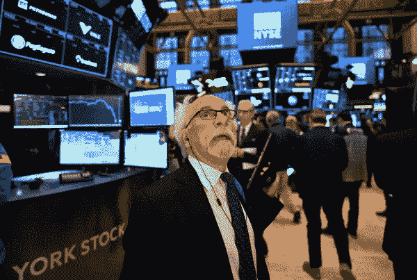
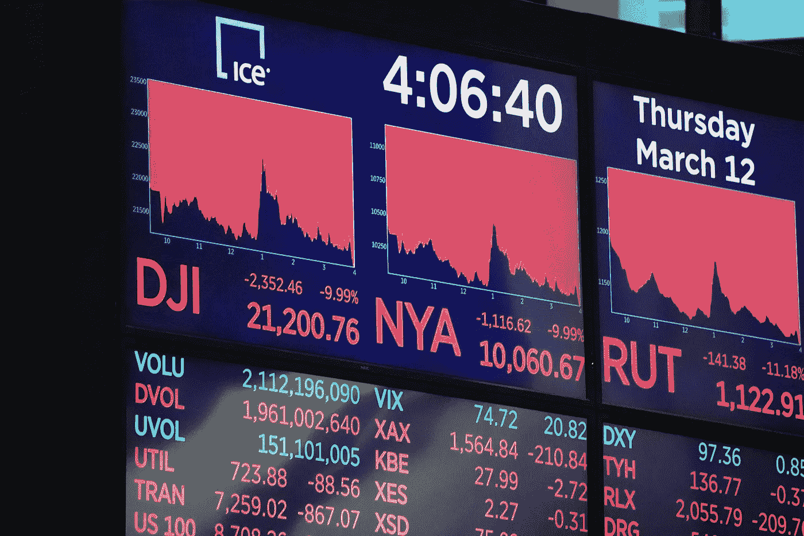

# 疫情期间你应该投资股票吗？

> 原文：<https://medium.datadriveninvestor.com/should-you-invest-into-stocks-right-now-6ed30d34de3b?source=collection_archive---------22----------------------->

## 很多人都退出了。这是一个机会吗？

当谈到投资领域时，我想到的三个词是:势不可挡、令人生畏和令人害怕。

在我的整个部署过程中，我一直在寻找增加现金流的方法。我研究过的一些方法包括体育博彩、贷款和房地产。

我认为赚钱的一个重要途径就是股市。

**初体验**

2017 年夏天，我从未真正花时间去了解股票及其运作方式，但我知道我想投资。我在股票市场上投资了一千美元，结果损失了 400 美元，因为我退出得太早，没有做长线投资。我离开了。我的错误在于我想要即时的满足，作为一个全新的投资者，这并不容易做到。现在。从那以后，我有了更长远的眼光。我无意动用我投入的资金(大约 5000 美元)。

> “凡事都有风险，要做好大起大落的准备”。

**2020 年**

自从 2019 年 12 月疫情爆发冠状病毒以来，股市一直在下滑。大多数人看到数字就跑了。许多人也赔了钱。起初，我认为所有这些下跌的股票都是应该远离的，但当我把它视为一个机会时，情况就变了。我那些炒股的朋友们还在玩这个游戏，我觉得我可能错过了一件大事。

Red means the stocks are losing value. There’s a lot more red than green!

我把自己放在大约 5 只具有竞争力的股票上。例如，股票 A 在市场萎缩前是 130 美元，但我以每股 30 美元的价格买入。如果反弹，我就获利了结。如果下跌，我会继续用美元平均成本买入更多。这种方法确保了只要你不断买入，你对任何一只股票的一般仓位都会较低。一旦该股反弹，市场价格很可能已经上涨。在市场下跌期间，感觉就像黑色星期五买股票一样！

如果我告诉你我不担心市场，那我是在对你撒谎。然而，在阅读文章和观看 YouTube 视频后，我已经找到了在这样一个时期投资的平和心态。在历史上，股票市场要么恢复正常，要么在接下来的几年里表现更好。作为一个像我这样的年轻绅士，现在投资并长期持有它们可以为我带来丰厚的回报。

目前，我认为股市是一个我不想错过的机会。

作为支持，脸书页面“罗宾汉股票交易者”给了我股票交易的信心。我的好朋友 Allen Tran 恰好是这个拥有超过 150，000 名成员的群组的所有者。在整个旅途中，他给了我很好的建议。

> “在投资中，舒适的东西很少是有利可图的”——罗伯特·阿莫特。

经过两周的投资，我为自己抓住了一个在未来能真正帮助我的机会而感到自豪。当大多数人说“不”的时候，说“是”！

**最终想法**

如果我丢了钱，就这样吧。无论结果如何，都要吸取教训。我很高兴这个机会出现在我的部署上，给了我一些期待。

这一代的顶级投资者之一沃伦·巴菲特说

> “我会告诉你如何变得富有。关上门。当别人贪婪的时候要恐惧。在别人恐惧的时候贪婪。”

做好在下跌行情中投资的准备”(目前)，在飙升行情中“出局”。

所有阅读这篇文章的投资者，祝你好运！对任何好奇的人来说，看看 YouTube 视频，读一点关于股票的文章吧！很好玩的小游戏！

使用我的 Robinhood 链接，当你注册时，可以得到一个免费的股票！

股票的价值从 2.5 美元到 200 美元不等！

【http://join.robinhood.com/jordanm514 号