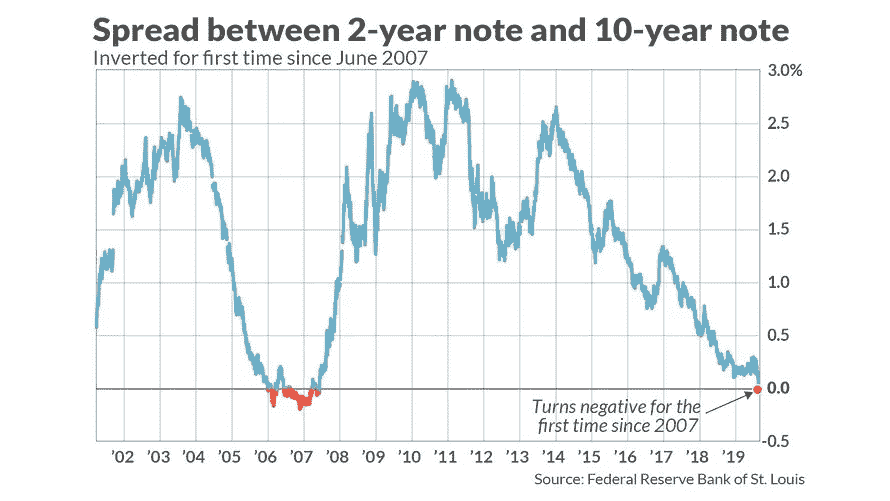

# 只要音乐还在播放，你就应该继续跳舞吗？

> 原文：<https://medium.datadriveninvestor.com/should-you-keep-on-dancing-as-long-as-the-music-is-playing-6a621c6330a8?source=collection_archive---------21----------------------->

今天，股市又创新高，标准普尔 500 指数刚刚超过 3380 点。鉴于 2010 财年的收益预期在 176 左右，预期市盈率稳定在 19 倍以上。这引起了许多分析师的担忧，因为过去 40 年的平均市盈率一直低于 15.5 倍。乍一看，这种差异似乎并不惊人，但换句话说，如果市场交易的市盈率为 15.5 倍，那么它将位于 2700 点以上，比今天的估值下降了近 20%。

自互联网泡沫以来，标准普尔 500 的市盈率从未如此之高，我们不能忘记，我们已经进入债务周期 11 年了，这个周期平均持续 6-7 年。

当然，有必要指出的是，10 年期美国国债的利率非常低，仅为 1.6%。这是估值的顺风，并允许多重扩张，但在这场讨论中经常被忽略的是，全球以及美国的国债在过去一年中大幅下跌，债券市场相对于股票的名义价值要大得多，这显然不是一个好消息:投资者正在逃离安全。

 [## 为什么包容性财富指数比 GDP 更能衡量社会进步？|数据驱动…

### 你不需要成为一个经济奇才或金融大师就能知道 GDP 的定义。即使你从未拿过 ECON 奖…

www.datadriveninvestor.com](https://www.datadriveninvestor.com/2019/03/08/why-inclusive-wealth-index-is-a-better-measure-of-societal-progress-than-gdp/) 

2020 年，经济学家和投资者几乎一致预测全球经济将大幅放缓。在过去的 6 个月里，我们已经看到德国在和衰退调情，现在又一次。就在昨天，日本的经济急剧萎缩，而中国据说正在暂时冻结其经济，以缓解冠状病毒的传播。起初，我的印象是对病毒的担忧被夸大了，但报告表明情况并非如此，彭博表示，上个月中国的石油需求下降了近 20%，同时来自资本经济的其他指标表明，上个月主要城市的每日交通指标下降了 75%。这一切都伴随着仍然存在的高额关税，并扰乱了中国的供应链，导致许多首席财务官对进一步的资本支出保持谨慎。

如果有人告诉你:我们已经被征收关税一年多了，关税将继续存在，并扰乱世界各地的供应链。我们已经进入债务周期 11 年了，就业率创历史新低。减税带来的刺激效应已经减弱了一年多。全球经济正在衰退，利率下降的动力不大，同时债务继续增加，尤其是在整个企业部门。最有希望的是，伯尼·桑德斯现在在全国范围内被认为是领先者，与此同时，民调显示他最有可能击败川普。任何理性的人都会认为股票在哪里？我们在 20 倍的市盈率下交易了几个百分点，在那个点上，标准普尔 500 将达到互联网泡沫时期的距离(不是纳斯达克，S&P)，这当然导致了在接下来的几年里从高峰到低谷的大约 45%的下跌。

许多参与估值讨论的人会提出这样一个问题:你还投资于其他什么地方？这肯定是一个值得问的问题，其存在的原因是由于利率从未如此之低，一些国家实际上是负的。在这样一个时刻，我们还没有一个时间可以参考未来会发生什么，这让经济学家和投资者感到困惑，没有明确的答案。然而，这并不是这种极端估价的理由。这个世界不是二元的，仅仅因为没有太多的选择，并不能宣布一种新的估值方法，可以得出 20 倍的倍数。下一个十年肯定会被载入史册，因为我们似乎正在以低/负利率的形式绘制新的水域，但这并不像雷伊·达里奥和其他人所说的那样内在地推动股票上涨，然而市场现在有不同的想法。

市场会回到平均估值水平并回调吗？欣快感会继续增长吗？没有人知道，但当每个行业的估值都非常高时，人们应该小心行事，1.6%的 10 年期收益率不足以证明周期后期 19-20 倍的收益是合理的。我个人认为美国经济深度衰退的可能性不大，因为消费者似乎没有受到任何影响，但当中国 Q1 的国内生产总值预计将从 6%骤降至 2.5%，而德国、日本和其他欧盟国家正在进入衰退时，我想知道企业收益会是什么样的，尤其是在我们的企业集团越来越多地涉足国际市场的情况下。在如此漫长的牛市中，重要的是不要忘记:市场并不总是需要抛售的理由，情绪总是更快地转向下行而不是上行。