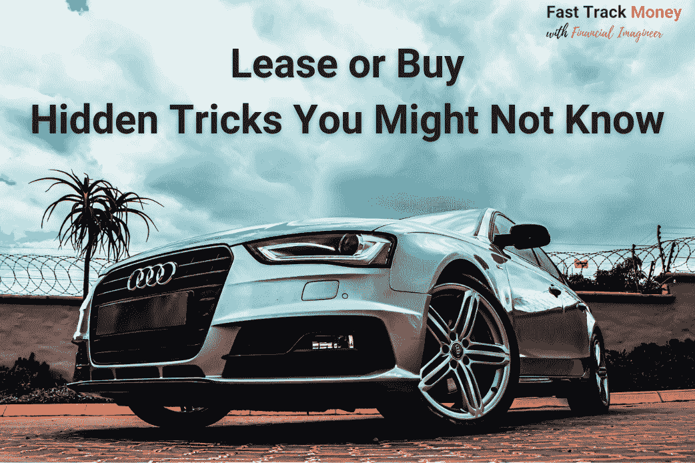
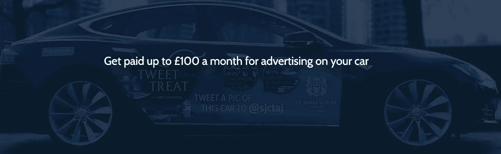

# 你应该租车还是买车？你可能不知道的隐藏技巧

> 原文：<https://medium.datadriveninvestor.com/should-you-lease-or-buy-a-car-the-hidden-tricks-you-might-not-know-8da12b1d0884?source=collection_archive---------25----------------------->

## 不像房子，你可以租或买，汽车是一个完全不同的故事。不管你是租还是买，你每天都在赔钱。因为从本质上来说，汽车是贬值的资产。你需要考虑的是，如果你决定拥有一辆汽车，如何使你的损失最小化。

Photo by [Devon Janse van Rensburg](https://unsplash.com/@devano23?utm_source=unsplash&utm_medium=referral&utm_content=creditCopyText) on [Unsplash](https://unsplash.com/s/photos/cars?utm_source=unsplash&utm_medium=referral&utm_content=creditCopyText)

在我们的 [Fast Track Money weekly YouTube 直播会议](https://youtu.be/ONbtjOR98As)中，我问了 Financial Imagineer 几个关于租赁和购买的问题。反思我们自己拥有一辆汽车的动机是什么是有趣的。如果你真的需要，你如何找到最物有所值的选择。

**Watch full video:** [**https://youtu.be/ONbtjOR98As**](https://youtu.be/ONbtjOR98As)

# 你需要一辆汽车吗？

在某些情况下，你有，在某些情况下，你没有。如果你住在一个公共交通便利的大都市，拥有一辆汽车是多余的。乘公共交通工具从 A 点到 B 点比开车要快得多。即使你需要开车去，你也可以乘坐出租车、优步或 Grab，这取决于你所在的城市有哪些汽车共享服务。在新加坡，拥有和保养一辆车比每天打车还贵。大多数大城市都是如此。即使你偶尔想周末旅行，也许周末租车的总费用比拥有一辆车要少得多。

这种情况真的需要车吗？大概不会。

如果你住在公共交通不那么频繁的偏远地区，也许有一辆车是值得的，这样你可以节省时间，它给你很多方便。例如，我开车去杂货店购物。如果没有汽车，我去超市要花 30 分钟，而不是 5 分钟，我将无法用双手把一周的食品带回家。或者，如果你需要经常开车出差或工作，开自己的车去，你可以节省很多时间，用它来为你的生活创造更多价值。

# 身份象征和生活方式选择

在亚洲文化中，人们通过看你开什么样的车来判断与你做生意的信心。如果你开一辆昂贵的车，这是成功的体现。拥有一辆昂贵的汽车可能会给你带来新的商机。对于我们大多数人来说，我确信你年轻时有一辆梦想中的车。为什么我们经常拥有梦想中的汽车？多亏了广告。

如果你想到宝马，你脑海中有一个特定的形象。

如果你想到莲花，你脑海中就会有一个特定的形象。

如果你想到奥迪，你脑海中就有了某个形象。

这些是汽车品牌给自己的定位。所以他们为目标观众创造了一种生活方式的欲望。买车的时候，可以 80%感性，20%理性。有时可能是 90%的感性和 10%的理性。

如果你是一个精明的“投资者”和精明的投资者，你应该 100%理性地思考。嗯，不是每个人都是 100%理性的，你可以在做决定的时候有 20%的情绪化，但是你越理性，你的决定就会越经济。

在书中，美国百万富翁最喜欢的汽车是福特，首选是二手皮卡、二手丰田等等。

# 如何明智地“购买”

您应该考虑在以下情况下购买

*   你真的需要一辆车
*   你手头有足够的现金
*   你要用这辆车几年

要想把折旧成本降到最低，买一辆二手车是最好的选择。在另一篇文章[<>](https://www.fasttrack.life/blog/the-under-estimated-costs-of-owning-a-car?rq=car)中，我列出了与汽车相关的所有费用，总数可能会让你震惊。尤其是折旧部分，一辆 4 年的奥迪，价格是一辆全新的一半。可以说，新车一离开汽车经销商，价值就下降了 20%。如果你想买车，选择一辆车龄已经几年但车况良好的二手车。这将为你节省很多钱。

如果你贷款买车，你可以优化你的现金流。如果车贷利率低于你的投资回报，你可以贷款，用现金投资。因此，你的投资为你带来的回报大于你支付的利息。

# 如何聪明地“租赁”

你应该考虑租赁，当

*   你真的需要一辆车
*   你不确定你会在这个城市或国家住多久
*   你真的喜欢每隔几年就有新车开
*   你想避免选择保险和汽车转售的麻烦

如果决定租赁，可以对比一下租赁费率。也许租赁比购买更好。例如，你可以用 200 美元的月供租一辆车，包括维护等费用，这取决于实际报价，而不是预付 50，000 美元买车。然后你用这 50，000 美元进行投资，这可能会给你带来 5000 美元的年回报。所以你每月的租车费用由你的投资利润来弥补。然而，对于储蓄投资者来说，这种选择更可行。

# 把你的车当作一台摇钱树

你想过让你的车成为现金流发电机吗？它是一项正在贬值的资产，为什么不让它为你赚些现金来补偿贬值呢？

1.  **将你的车租给一名优步司机。**当你的车晚上闲置在车库里的时候，它可能会被别人开去谋生。这是一个双赢的局面。这个人不需要买车，但仍然可以用它。在优步，你晚上在车库里有一辆闲置的车。这位司机可以使用它，并在清晨返回。
2.  卖掉你车上的广告位。一些公司在私家车上提供广告贴花，以换取一定的费用。广告商将由想做广告的公司支付报酬。看你开了多少公里，什么都不做每月补偿。你只需要把广告贴纸贴在你的后窗上。然后你每个月可以赚几百美元。找出谁在你的地区提供这项服务。

image source: [https://www.carquids.com](https://www.carquids.com)

买车时，有许多创造性的方法可以减少你的损失。但这并不适合所有人。如果你非常想拥有一辆梦想中的车，只要不损害你的财务前景，不妨就这么做。如果你意识到拥有一辆车的生活方式/形象不值这个价钱，那么你知道你应该做什么。

订阅我的 [YouTube 频道](https://bit.ly/3ngv4KQ) l，观看更多与聪明理财、金钱思维和个人理财相关的内容，帮助你建立一个健康的理财未来。

*原载于 2021 年 2 月 4 日*[*https://www . fast track . life*](https://www.fasttrack.life/blog/should-you-lease-or-buy-a-car-the-hidden-tricks-you-might-not-know)*。*