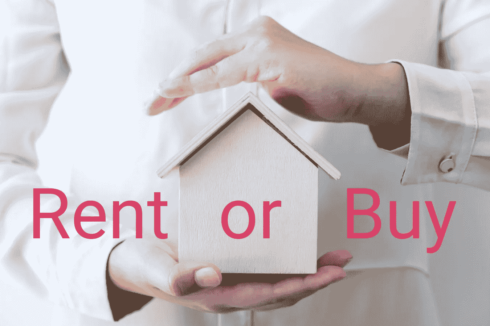

# 你应该租还是买？可能伤害你的被忽视的成本

> 原文：<https://medium.datadriveninvestor.com/should-you-rent-or-buy-the-neglected-costs-that-might-hurt-you-4e858a92f627?source=collection_archive---------32----------------------->

## 在 Fast Track Money Weekly[YouTube live](https://youtu.be/orjR35-4OEM)上，我与[金融幻想家](https://www.financial-imagineer.com/)就租赁与购买的话题进行了交谈。对许多人来说，这是一个非常热门的话题。有很多因素需要考虑，如果你忽视了它们，它们会回来伤害你。现在后悔可能为时已晚，因为我们知道，房产的流动性并不好。让我们看看每个场景的优缺点。

在租房是普遍选择的国家，大多数人将终生住在出租公寓或房子里。还有租赁费用和租赁期限的稳定性。例如，在 T4，大约 60%的人租房住，所以 40%的人拥有自己的房子。然而，在新加坡，大约 91%的人拥有自己的房子。最大的区别在于拥有成本与租赁成本的对比。

## 拥有成本

除了购买价格之外，拥有一处房产的相关成本(和节省)还有

*   **利息支付。如果你从银行借钱，也就是抵押贷款，你要向银行支付利息。这对你来说是一个成本，因为钱不会回到你的口袋里。这就是为什么低利率更受欢迎。**
*   **利息支付节省的税款。**在许多国家，利息支付是免税的，这意味着你的这部分收入不需要缴纳所得税。如果你的年利息是 6000 美元，你的边际税率是 30%，那么你节省了 30% X 6000 美元= 1800 美元的税款。你可以把它当作你的净利息支付是 6000 美元——1800 美元= 4200 美元。
*   **利率风险。如果你的抵押贷款获得了低利率，你是幸运的。但是没有人知道 10 年、20 年后会是什么样子。如果当你的抵押贷款到期，你需要一个新的，利率可能会比以前高得多，那么你每年支付的金额将会大得多。40 万美元贷款的 1%利率是每年 4000 美元。但 20 万美元贷款的 3%利率是每年 6000 美元。这是许多人没有想到的风险。所以要做好准备。**
*   **维护**使您的财产保持良好状态的费用。你永远不知道你的房子或公寓会发生什么，可能会有漏水的问题，白蚁的问题，屋顶的翻新，厨房的翻新，一些电器的更换等等。这些都是我们过去经历过的。你最好留出房屋价值的 1-2%作为维修基金。
*   **财产税**:在一些国家被称为财产税。不是说你能买得起房子，而是你还需要看看你是否有能力支付每年的房产税！在美国，全国平均财产税为 1.1%(T5)。买一套房子要 50 万美元，但每年要交 5500 美元的房产税。在瑞士，没有财产税，只有财产税(资产税)，它是根据你拥有的总资产价值来征税的。除此之外，还有一个假设的租金收入要加到你的应纳税所得税中。假设你拥有一套公寓，当地政府会评估如果你把它租出去，你会得到多少租金收入。通常，他们使用市场租赁价格的 60 -70%(取决于州)来计算这种“可想象的租金收入”。结果，你支付更多的所得税。
*   **机会成本:**如果你用一大笔钱作为首期付款，这笔钱可以在市场上赚取你的利润。因此，对于那些不买就投资的人来说，这是一种机会成本。简单地说，你手头有 10 万美元现金，你可以将它们投资于 ETF 或购买房产。如果你用这笔钱购买一处房产，你就放弃了投资后每年 x%的潜在收益。如果你不投资，那么对你来说就没有机会成本。
*   **买卖时的交易成本**。每次你买卖它，你会产生 5%或更多的交易费用，包括公证费、经纪费、产权转让费等等。这不是一个小数目，取决于你的财产价值。有时交易成本可能会高得多，这取决于你住在哪里。
*   当你以更高的价格转售利润时，对利润征税。在美国、瑞士和许多其他国家，你需要为你转售房产的收益缴税。税率很高。在瑞士，税率随着你在瑞士生活的时间逐渐降低。如果一年后转卖，肯定是重税。但同样，如果你购买了另一处房产，你现在不交税，你会以某种方式“结转”到下一处房产。延期了。在新加坡，没有资本增值税，这很好。

## 拥有的收益

*   内心的平静:我们都渴望安全感，渴望有一个安全的住处。通过拥有自己的房产，你可以免受不可预见的因素的影响，如房租上涨、公寓出售、业主变更等。
*   **让它成为你自己的。**你可以在墙上钻任意多的洞，你可以随心所欲地改造厨房。当你拥有一处房产时，你可以随心所欲。
*   **房产增值:**如果你从银行贷款购买房产，你是在利用杠杆，所以回报会高得多，因为你的初始投资远低于房产的价值。如果你的公寓市场价是 500，000 美元，2%的增值会给你 20，000 美元的未实现收益，如果你投入的首付是 100，000 美元，未实现回报是 20%。这就是杠杆的力量。
*   **黑格尔反对旧时代。如果你拥有自己的房产，当你退休后没有收入来源时，你会很平静，因为你有一个住的地方。到那时，你很可能已经还清了你的抵押贷款，或者已经没什么可还的了。在新加坡，政府要求没有房产的人在退休金账户里有双倍的退休金。**

## 其他考虑

在我们的 [YouTube 会议](https://youtu.be/orjR35-4OEM)中，马蒂亚斯强调，如果你打算在某个地方生活 7 年或更长时间，购买是明智的。记住这不是绝对的，你需要自己计算。这只是一个一般性的建议。

还有什么其他考虑？

*   灵活性:你现在需要灵活性吗？也许你换工作，换城市生活，家庭规模和需求的变化？
*   位置:是需要离工作地点近，还是需要离学校近，还是要离家人近？
*   税收:如果你的收入不是很高，住在高税收但低租金的地区可能是值得的。如果你的收入逐年增加，你可以考虑搬到一个低税收和高租金的地区。在瑞士尤其如此，每个州和城市/村庄都有自己的税率。
*   生活方式:你想住在市中心，靠近所有的便利设施吗？还是更喜欢住在安静的乡下亲近自然？我们的生活方式会在不同的年龄发生变化，如果你不确定未来想要什么，最好保持灵活性。
*   修理。当你租房的时候，很容易，如果公寓里有东西坏了，你可以通知你的房东。如果你拥有房产，你必须自己承担所有的费用。你想要麻烦还是方便？

## 租赁成本

*   **租金**。这是纯成本。你支付的是你口袋里的钱。但是你可以控制你付多少或者你应该付多少。阅读这篇文章 [<为什么你可能会在住房上花费太多，以及如何降低你的住房成本>](https://www.fasttrack.life/blog/why-you-might-spend-too-much-on-housing-and-how-to-reduce-your-housing-cost) 。

## 租赁收益

*   **投资回报:**如果你有多余的存款，又想继续租房。你可以将你的储蓄投资于货币市场，比如 S & P500 ETF。在过去的 10 年里，它产生了[13.44%](http://www.lazyportfolioetf.com/etf/spdr-sp-500-spy/#:~:text=In%20the%20last%2010%20years,granted%20a%201.78%25%20dividend%20yield.)的平均年回报率。不仅是 S & P500 ETF，许多其他指数跟踪 ETF 也是如此。有关投资的更多信息，请访问< [如何建立投资组合](https://www.fasttrack.life/blog/how-to-build-an-investment-portfolio) >。
*   灵活性:你可以选择住在工作地点附近，这样可以节省你的时间和交通费用。你可以选择搬到另一个城市找新工作。当你的家庭规模扩大时，你可以选择住在更大的公寓里。租赁提供了如此大的灵活性。

## 为什么要租房

通过回答上述问题，你可能会发现，对于那些需要灵活性的人来说，租房是一个很好的选择。当你不确定你的生活会有什么变化时，最好保持灵活。如果你知道自己将在这个城市生活 7 年、10 年或更长时间，那么拥有一处房产，保护自己免受通货膨胀和老年时期的影响，在财务上会更好。重要的是成本和储蓄的规模，如果你的租金非常便宜，而房价非常高，也许你对租房解决方案很满意。

结论是，看你个人情况决定租还是买。但是你可以用我们上面讨论的来找出购买和租赁的成本，并做出明智的决定。

[https://youtu.be/orjR35-4OEM](https://youtu.be/orjR35-4OEM)

如果你想了解更多关于如何管理你的钱，开始投资和改善你的个人理财，一定要订阅[快速跟踪 YouTube 频道](https://bit.ly/3ngv4KQ)，每周三加入我们的金钱对话。

**相关文章**

[**逐步指导决定在瑞士买还是租**](https://www.fasttrack.life/blog/step-by-step-guide-to-decide-buy-or-rent-in-switzerland)

[**为什么你可能会在住房上花费过多，如何降低住房成本**](https://www.fasttrack.life/blog/why-you-might-spend-too-much-on-housing-and-how-to-reduce-your-housing-cost)

[**购买房产:直接还是间接摊销？**](https://www.fasttrack.life/blog/buying-a-property-direct-or-indirect-amortisation)

[**如何建立投资组合**](https://www.fasttrack.life/blog/how-to-build-an-investment-portfolio)

[**使用这两个移动交易应用让自己走上财富积累的轨道**](https://www.fasttrack.life/blog/tradingapps)

*原载于 2021 年 1 月 28 日*[*https://www . fast track . life*](https://www.fasttrack.life/blog/hould-you-rent-or-buy-the-neglected-costs-that-might-hurt-you)T22。