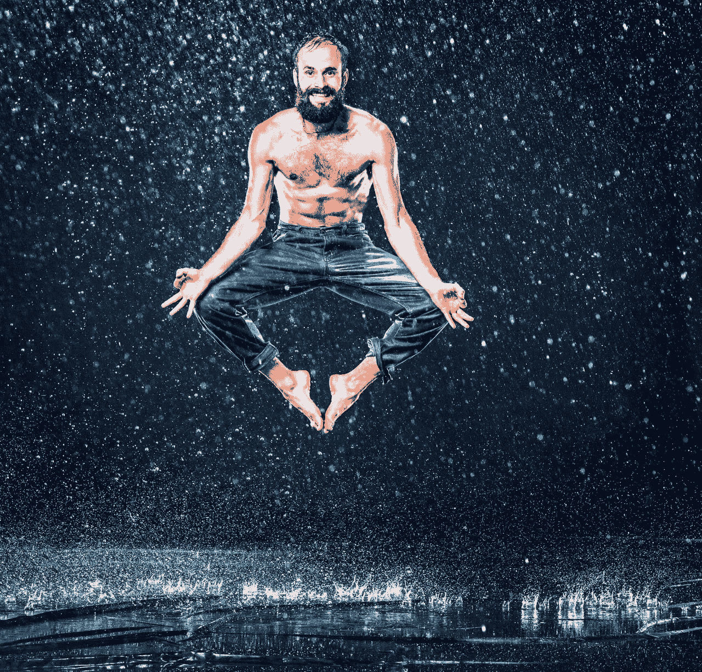
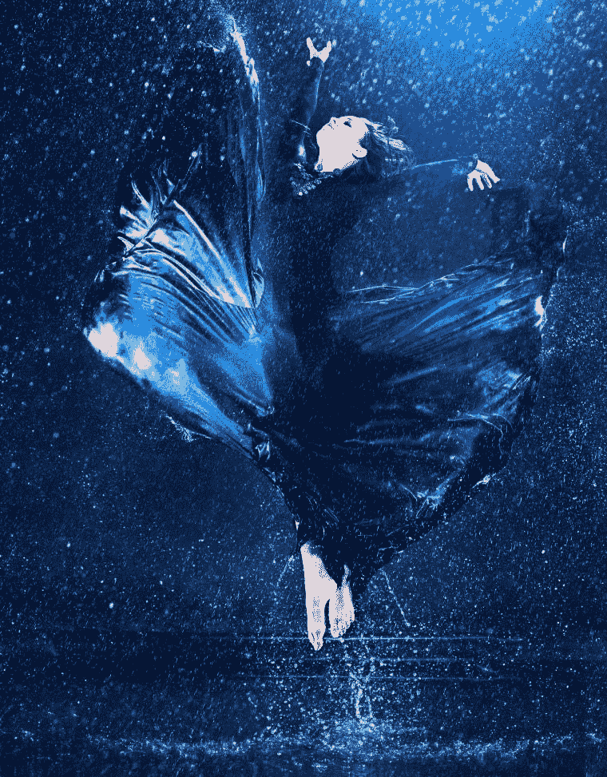
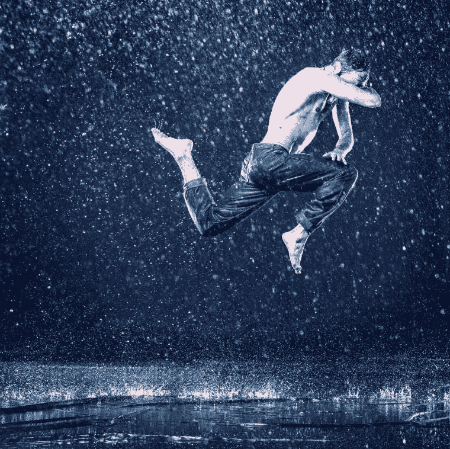
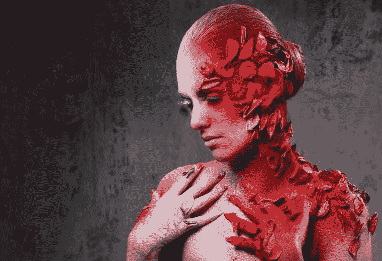
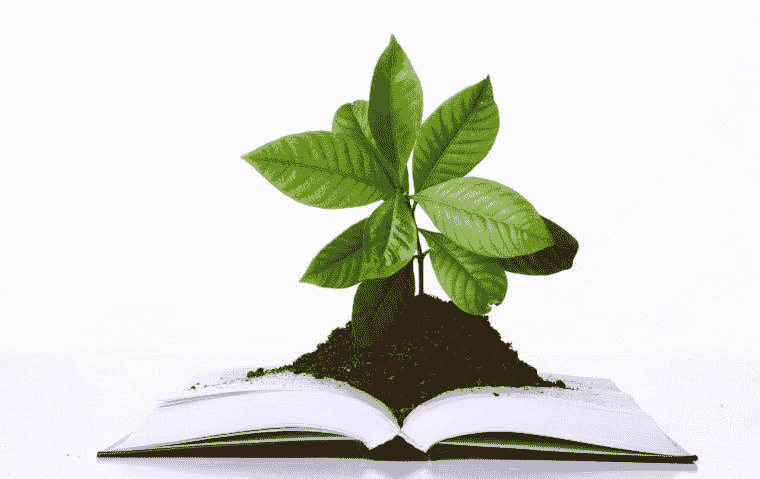

# 你应该走阻力最小的路吗？

> 原文：<https://medium.datadriveninvestor.com/should-you-take-the-path-of-least-resistance-5553af7406a8?source=collection_archive---------1----------------------->

The Path of Least Resistance. Photo by @freepik via freepik.com

# 你应该走阻力最小的路吗？

最小阻力路径是在一组备选路径中对给定对象或实体的向前运动提供最小阻力的物理或隐喻路径(维基百科定义)。这个概念经常被用来描述为什么一个物体或实体采取给定的路径。无论是电路中的电流还是河流中的水，能量都会沿着它所处的环境中阻力最小的路径流动。只要看看水往山下流的方式；它总是会找到让它以最容易的方式流动的路径。

*The path of least resistance. Be Like water. Photo by @freepik via freepik.com*

# 要走阻力最小的路，就像水一样

李小龙作为一个武术家、电影明星和深刻的思想家的遗产今天仍然非常活跃；我们仍然可以从他身上学到很多东西。

在他的训练过程中，有一段时间，李小龙对自己缺乏进步感到沮丧。他工作很努力，但没有看到任何进步。他的主人知道问题出在哪里，他太努力了。

> *"* 遵循事物的自然弯曲来保护自己，不要干涉。记住，永远不要与自然作对，永远不要正面反对任何问题，而是通过与自然一起摇摆来控制它”。
> 
> *李小龙大师*

李小龙驾着他的船在湖上呆了一段时间。他思索着他的主人告诉他的话，但这些话的真正意义仍然暗示着他；当他愤怒和沮丧地拍打水面时，发生了一些事情，他突然意识到。一切都变得清晰了。

*The path of least resistance. Be like water. In order to control myself, I must first accept myself by going with and not against my nature. Photo by @freepik via freepik.com*

> *“似水流年。不要拘泥于一种形式，适应它，建立你自己的形式，让它成长。当你把水放进杯子里，它就变成了杯子。当你把水放进瓶子里，它就变成了瓶子。为了控制自己，我必须首先接受自己，顺应而不是违背自己的本性。像水一样。水的本质是如此之细，不可能抓一把。打击它，但它不会受到伤害。刺它，它不受伤。切断它，但它并没有分开。它没有自己的形状，而是按照容纳它的容器来塑造自己。像水一样。当水被加热时，它变成蒸汽，它是看不见的，但它有足够的力量分裂地球本身。当冷冻时，它结晶成一块巨大的岩石。起初，它像尼亚加拉瀑布一样汹涌，然后平静得像炎热夏日的春天。要如水。”*
> 
> *李小龙*

李小龙明白阻力最小的方法就是像水一样。不要违背你自己的本性，让它顺其自然，并利用它为你所用。武术家学会保存他们自己的能量，同时将你的对手使用的力量转向他们。

 [## 改善之旅始于福祉|数据驱动的投资者

### 一场普遍的健康危机让人们认识到将健康融入工作文化的重要性。过去的陈词滥调已经…

www.datadriveninvestor.com](https://www.datadriveninvestor.com/2020/06/01/journey-of-improvement-starts-with-well-being/) 

# 要学习阻力最小的方法，观察自然。

观察自然是体验这种选择阻力最小的道路的概念是如何运作的一种极好的方式。自然界的一切都有自己的目的。一棵树向着太阳生长，吸收二氧化碳，释放氧气。秋天拿一片叶子来说，垂死的叶子并不抗拒生命的自然循环，它在死亡前的大结局中迸发出壮丽的美，为冬天的定居提供生存空间。随着春天的到来，新叶将在缤纷的色彩中绽放。一切都顺其自然。人性也没什么不同。

*The path of least resistance. The dying autumn leaf does not resist the natural circle of life. Photo by @freepik via freepik.com*

> “我们应该向大自然学习。看看一切是如何完成的，生活的奇迹是如何在没有不满或不快的情况下展现的"
> 
> *埃卡特·托勒*

我们人类喜欢认为我们处于控制之中，我们可以决定我们生活的进程。事实上，很多事情都是我们无法控制的。我们的影响有时比我们想象的要小得多，而有时却比我们想象的要大。想象一下，在一艘独木舟上，湍急的水流将是我们的独木舟稳定地向下游移动的主要原因，而不是我们划桨的动力。我们生活的环境一直在变化，我们搬家往往是因为环境的变化，而不是我们自己的选择。以 2020 年为例，如果我们可以挥动魔杖，让它消失在太空中，我们会毫不犹豫地这么做，只是我们做不到。尽管令人不快，但我们别无选择，只能随波逐流。

我们经历的每一种情况都有一个自然的流向，这是阻力最小的路径的缩影。这就是为什么活出我们的真理，让我们自己与我们的生活目标一致是正确的道路。可悲的是，随着我们长大成人，我们失去了遵循自然道路的能力。当孩子长大后，他们会失去好奇心、自发性和梦想的能力。成为一个成年人通常意味着我们要适应这个世界想要我们成为的样子，而不是我们想要成为的样子。我们避免对抗，我们忘记我们是谁，我们想要什么来适应。我们走的是阻力最小的路，但这一次，这条路不会把我们带到我们真正想去的地方。

我们必须保持警惕，因为有时阻力最小的道路伪装成对我们来说是正确的道路，但它是错误的。不要把阻力最小的道路等同于最容易走的道路。有时，我们会根据最容易、最愉快或最不痛苦的事情做出选择。当我们这样做时，我们可能在短期内获得安慰，但从长远来看，我们也可能最终获得许多痛苦。坐在电视机前比去健身班更容易、更舒服。发脾气比控制它容易。吃冰淇淋和蛋糕比吃甘蓝容易。在这些情况下，选择阻力最小的道路是一种选择，但这种选择不会帮助我们成长并成为最好的自己。你不能靠每天坐在沙发上吃冰淇淋来健身，那是不行的，你必须自己去健身房开始举重。没有杠铃的阻力，肌肉不会生长。

# 要经历阻力最小的道路，就像一粒种子

在我们的生活中，无论我们经历什么样的情况，都会伴随着能量。关注我们内心的罗盘有助于我们感知那种能量。我们的环境很像我们播种的田地。根据你播种的土地和环境类型，有些种子会生长得很好，有些则不会。种在营养丰富的环境中的种子会生长。我们不会马上看到结果，但多年后种子会长成一棵成熟的树。

同样，我邀请你学会像对待花园一样对待我们的心灵。我们应该确保杂草和不需要的植物不会掠夺和窃取树木生长和结果所需的养分。

> “你的思想是一座花园。你可以种花，也可以长杂草。”

*The path of least resistance* — *Your mind is a garden. You can grow flowers, or you can grow weeds. Photo by @freepik via freepik.com*

我们在生活中遇到的障碍就像杂草一样，会耗尽我们的精力。我们的第一个冲动会是绕过障碍，不惜一切代价避免它，但是有些问题不能永远避免，它们不会消失，直到你处理它们。怪物小的时候杀了它通常更好。有时候，沿着阻力最小的路径绕过障碍物可能不是最好的前进方式。

我们要走阻力最小的路吗？是也不是，要看情况。你必须保持警惕，意识到你周围的能量，以决定什么是最好的前进方式。但是无论在什么情况下，记住要像水一样。

我亲爱的朋友，这是你的追求。

如果你喜欢这篇文章，你可以在 [Instagram](https://www.instagram.com/author_joanne_reed/) 、 [Pinterest](https://www.pinterest.co.kr/rlreed71/) 或[脸书](https://www.facebook.com/AuthorJoanneReed/)上关注我，或者你也可以喜欢:

我的书《这是你的追求》的音频版本已经推出。请随意查看并使用此[特别促销代码](https://www.audible.com/pd/B08LJQJWRW/?source_code=AUDFPWS0223189MWT-BK-ACX0-219667&ref=acx_bty_BK_ACX0_219667_rh_us)

Joanne Reed The Author
Author of “This Is Your Quest”. You can’t buy happiness but you can buy books. Your mission, should you wish to accept it is to experience happiness

## 访问专家视图— [订阅 DDI 英特尔](https://datadriveninvestor.com/ddi-intel)