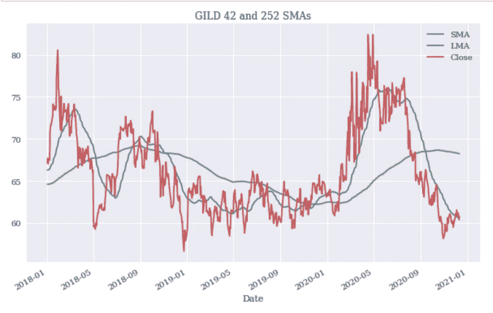
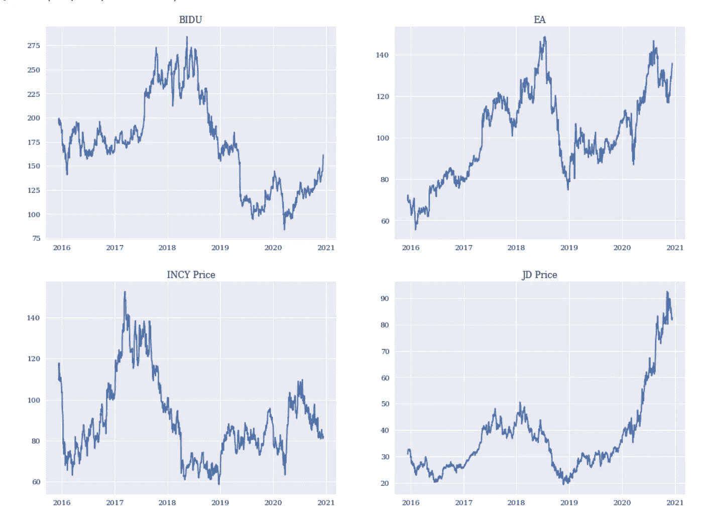
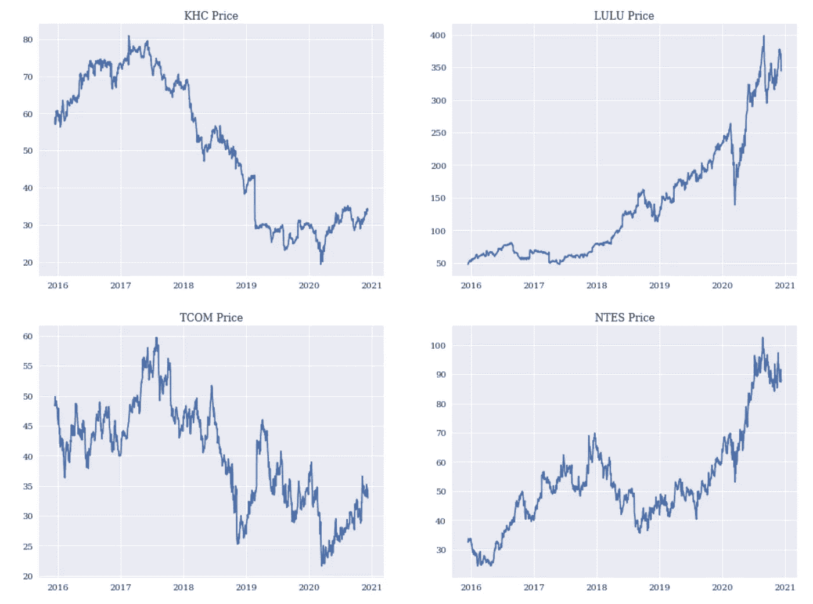

# 你应该用简单的移动平均线交易股票吗？

> 原文：<https://medium.datadriveninvestor.com/should-you-trade-stocks-using-a-simple-moving-average-approach-1fd7686e9517?source=collection_archive---------11----------------------->

Photo by [lo lo](https://unsplash.com/@bylolo?utm_source=medium&utm_medium=referral) on [Unsplash](https://unsplash.com?utm_source=medium&utm_medium=referral)

**免责声明:此信息仅供参考，不得理解为财务或投资建议。它不是对任何公司的认可，也不是购买、出售或持有任何证券的建议。投资者应自行决定某一特定证券或产品是否适合他们的投资需求，或应就其特定情况寻求此类专业建议。**

## 介绍

简单移动平均线是众所周知的投资策略，经常在 marketwatch.com 等热门网站上被提及，它们可能预示着股票近期的走向。本文将检验它们是否是可行的交易策略，即它们是否普遍优于简单的买入并持有策略。答案通常是否定的，但在某些情况下，采用简单的移动平均策略可能是有用的。

## 什么是简单均线？

移动平均线测量一段时间内的股票价格，以减少股票价格的噪音波动，并查看价格是否呈现明显的上升或下降趋势。一种常见的策略是在不同的时间间隔内得出两个独立的移动平均线，然后比较这两个移动平均线，以生成交易信号。交易员经常将一个短期移动平均线(通常是 50 天移动平均线)与一个长期移动平均线(通常是 200 天左右的移动平均线)进行比较。如果短期移动平均线大于长期移动平均线，那么这通常表明股票正朝着一个积极的方向前进，如果短期移动平均线低于长期平均线，那么这可能是一个麻烦的迹象。

以 Gilead 为例，当短期移动平均线超过长期移动平均线时，我们可以清楚地看到其价格的上升轨迹，反之亦然:

Comparing GILD’s 42 Moving Average to its 252 one.

## 简单均线是可行的策略吗？

上图表明，简单的移动平均线策略可能有些道理。为了评估这一点，让我们看看自 2015 年初以来纳斯达克 100 指数中的每只股票，并比较移动平均线策略是否优于简单的买入并持有策略:

均线策略在 90%的情况下都不能打败买入并持有策略。很明显，简单地购买并长期持有一种证券可能对你更有利。

 [## 一瞬间学会数据科学！？数据驱动的投资者

### 在我之前的职业生涯中，我是一名训练有素的古典钢琴家。还记得那些声称你可以…

www.datadriveninvestor.com](https://www.datadriveninvestor.com/2020/07/23/learn-data-science-in-a-flash/) 

## 为什么简单移动平均线通常对股票不起作用

有一个非常简单的解释可以解释为什么这种策略经常不能击败买入并持有策略:这是一个程式化的事实，即股票市场长期来看往往会上涨，所以你只要按兵不动就能获得回报。自金融危机以来尤其如此，纳斯达克 100 指数自 2009 年初以来飙升了 878%。此外，纳斯达克 100 指数中的许多股票也表现出了这种上升趋势，自 2015 年以来的年回报率中值为 21%。换句话说，如果长期方向是向上的，你为什么要积极交易股票呢？

然而，我们的分析表明，在某些情况下，简单的均线策略会胜出。这些案件有什么共同点吗？我的假设是，简单的移动平均线可能对长期表现出下降或不一致轨迹的股票有效:

我认为这一假设总体上是正确的，而且从直觉上讲是有道理的，因为主要是平稳持续上升轨迹的股票更有可能对移动平均线信号表现出假阳性。另一方面，轨迹不一致或大幅波动的股票不太可能出现这种情况。

## 外卖

你最好找一家你相信并长期持有的公司。在一些特殊的情况下，使用简单的移动平均线可能是有益的，但是这个策略应该小心使用。

## 密码

Python 代码可以在[这里](https://github.com/cbecks1212/SMAs/blob/main/Moving%20Averages.ipynb)找到

## 延伸阅读:

[简单移动平均线](https://www.investopedia.com/terms/s/sma.asp)

## 获得专家观点— [订阅 DDI 英特尔](https://datadriveninvestor.com/ddi-intel)