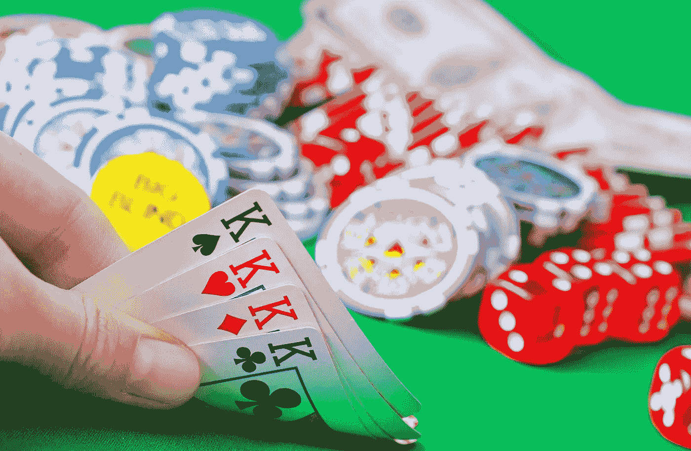
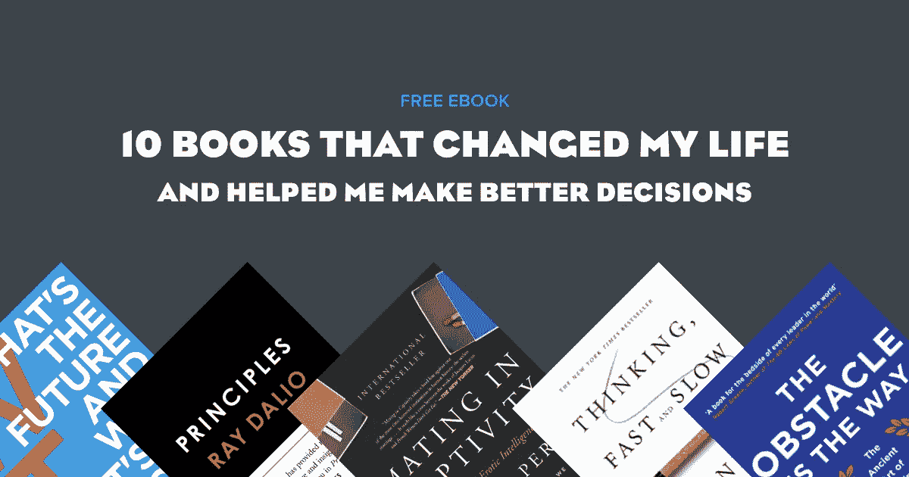

# 你应该对冲你的赌注吗？

> 原文：<https://medium.datadriveninvestor.com/should-your-hedge-your-bets-cfa05677e3dd?source=collection_archive---------15----------------------->

## 全力以赴的价值。

投资者使用对冲来消除或减轻头寸风险并抵消损失。它通过在相关资产中建立相反的头寸来发挥作用。

例如，农民可以通过谈判远期合同来对冲谷物的价格风险，根据远期合同，农民同意在未来某个时候以商定的价格向买方交付一定数量的谷物。

日常生活中对冲的另一个例子可能是做空你最喜欢的运动队。这是一种情感对冲的形式，如果你的球队输了，至少你还是赢了，反之亦然。

你甚至可以通过见多个人来对冲你的关系赌注，或者和一个人约会，同时“跟踪”另一个人。

> **面包屑导航**是指你通过社交媒体或短信让某人陷入浪漫。这基本上意味着他们在欺骗你，但是借助了现代科技。

***但是对冲总是可取的吗？***

要回答这个问题，我们必须强调，对冲是基于一种根本不确定的世界观。

我们对冲是因为我们不太确定我们在亚马逊的投资会有回报，或者我们的团队会赢得超级碗。

当结果不确定时，尝试一下，而不是孤注一掷是有意义的。

但有时，我们受益于对不确定事物的确定。

# **全力以赴可以增加我们的回报**

就像在牌桌上一样，如果我们有一手好牌，我们可以全押，让我们的回报翻倍。就像在牌桌上一样，我们通常在亮出自己的牌之前不会知道自己拿到了一手好牌。

这在商业和艺术中是如此，在爱情中也是如此。

## 全力以赴做生意

无数的创业公司在一夜之间获得成功之前必须苦干多年。

例如，网飞于 1997 年在联合创始人雷德·哈斯汀斯的投资下成立。然而，它经历了无数次挫折，直到它向 Blockbuster 提出的 5000 万美元的出售要约被拒绝，该团队才尽一切努力找到一个成功的商业模式。直到 2001 年，该公司才开始受到重视，并于 2002 年首次公开募股(IPO)上市。其余的，正如他们所说，都是历史了。

关于不对冲，网飞联合创始人马克·伦道夫说“咬子弹的焦虑不会持续太久。但是做出这个决定的快乐将会持续到永远。全力以赴。”

和伦道夫一样，**比尔·坎贝尔**——已故的史蒂夫·乔布斯、埃里克·施密特和杰夫·贝索斯等人的商业教练——敦促他的学生做出承诺。“你不能一只脚进一只脚出，因为如果你没有完全投入，那么你周围的人也不会。如果你加入，那就加入。”

有时候，拥有一个“现实扭曲场”是值得的，史蒂夫·乔布斯(Steve Jobs)和 T2·埃隆·马斯克(Elon Musk)曾用这种方式激励员工攀登新的高峰。

## 在演艺圈全力以赴

在娱乐圈，很难想象人们不全力以赴就能爬到食物链的顶端。传奇摇滚记者**米克·沃尔**说，许多成功的音乐家都有一个共同点，那就是他们没有 b 计划。“对他们来说，要么干，要么死，他们不得不不断努力和失败，因为他们别无选择。”

 [## 释放结果的简单哲学|数据驱动的投资者

### 这是我们播客中帕迪·布鲁斯南的一段话。帕迪是一个正念和冥想老师，一个…

www.datadriveninvestor.com](https://www.datadriveninvestor.com/2020/03/16/a-simple-philosophy-to-unlock-results/) 

他躲过了黑色安息日吉他手、在伯明翰一家工厂被切掉指尖的托尼·伊莫米和在一场车祸中失去一条手臂的鼓手威豹乐队和里克·艾伦。Iommi 和 Allen 都是全力以赴的光辉榜样，尽管明显的不足会让大多数人退缩。

## 在关系生意上全力以赴

当谈到我们的浪漫关系时，心理学家巴里·施瓦茨发现，矛盾的是，当人们的选择更少时，他们会更快乐。

如果一个人有很多选择，他们可能会发现自己永远不知道他们是否能做得更好，永远不会真正承诺与他们在一起的人，并把精力投入到关系中，结果是，没有从关系中获得多少。施瓦茨发现，选择较少但真正投入的人，往往比那些选择充足的人更幸福，对自己的命运更满意。

# 风险和回报

风险和回报是成正比的。

因此，就像投资一样，如果市场表现良好，那么对冲就没有意义——它实际上耗费了我们的资金，降低了我们的回报。

当涉及到人际关系时，你会从对的人身上获得比对冲更多的好处。

但是全押不是一种冒险的策略吗？

我们如何全力以赴，而不把自己送进救济院，或者和让我们痛苦的人一起度过一生？

## 结束不利局面

正如前世界扑克锦标赛冠军 T22 安妮杜克 T23 所说，在你的资金范围内玩。

如果你口袋里有 2，000 美元，但账单和支出总计 1，500 美元，那么你没有 2，000 美元可以玩，你有 500 美元，你不应该玩超过这个数。

***你愿意失去什么？***

说到生意，在结束之前，给你想要全力以赴的时间和金钱设定一个限度是明智的。这与参加一场有绝对出价上限的拍卖没有什么不同，你只是不会超过这个上限。

如果你全力以赴，一段浪漫的关系更有可能成功，那么你可以通过设定一个时间框架，比如一段关系的三个月，来减少在错误的人身上全力以赴的风险，以便在必要时进行反思并采取纠正措施。

永远不要犯错。

# 最后的想法

我们之前介绍的农民可能会通过使用远期合同来谨慎行事，但是如果在出售时间到来时谷物的价格超过了远期合同中的谈判价格，那么农民的情况会更糟。

归根结底，对冲的目的是防止损失，所以在你对冲你的赌注之前，问问你自己收益是否值得花费，并始终将*不全押*在花费中的机会成本考虑在内。

但实际上，在一个信息不完全的世界里，这往往可以归结为掷骰子，希望幸运女神站在我们这边。但是，通过有意识地选择我们愿意输掉的东西，至少我们可以从一手失败的牌中抽身出来，活着去迎接新的一天。

***史蒂夫·格拉夫斯基是*** [***集体校园***](http://collectivecampus.io/) ***的联合创始人，著有《时间丰富的********员工到企业家*** ***和《T34》*的主持人他是一个长期自学成才的人，从 80 年代的金属和高强度锻炼到尝试冲浪和单口喜剧，他什么都喜欢。****

****访问专家视图—** [**订阅 DDI 英特尔**](https://datadriveninvestor.com/ddi-intel)**