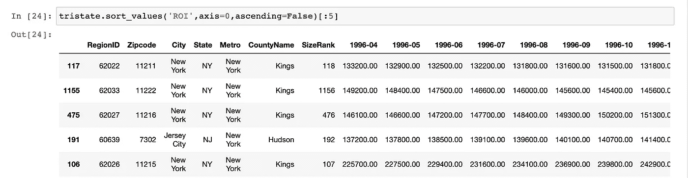
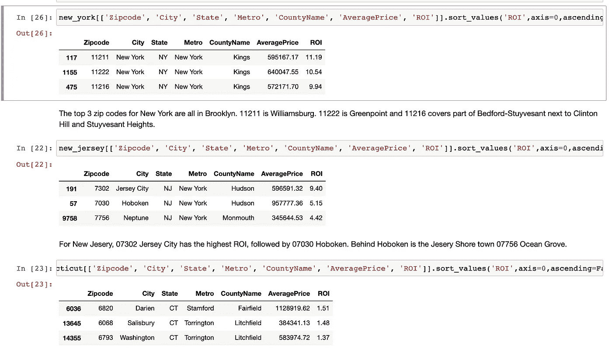
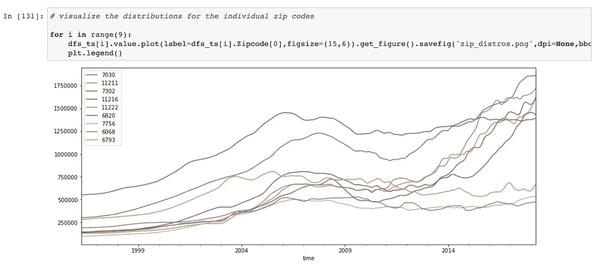
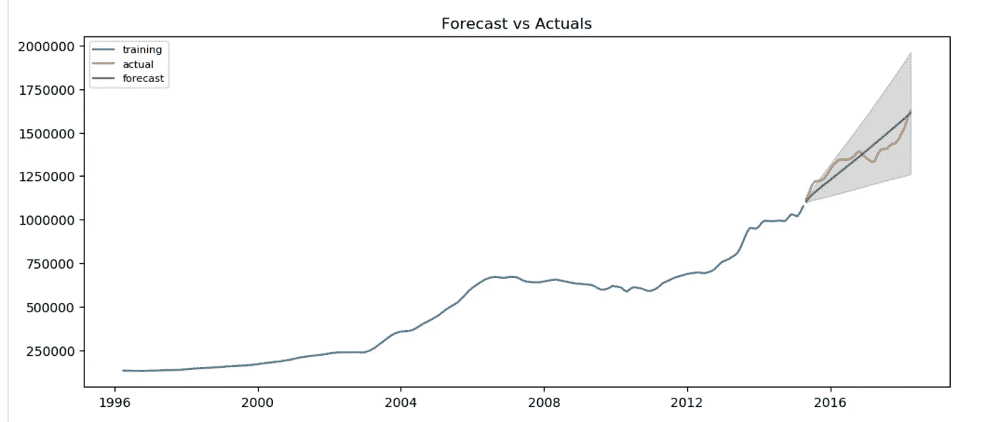

# 应该在布鲁克林买的

> 原文：<https://medium.datadriveninvestor.com/shouldve-bought-in-brooklyn-83ebed5c8267?source=collection_archive---------37----------------------->

quite a [source](https://www.timeout.com/newyork/brooklyn)

房地产是一个不断发展的市场，在这个市场上，买家承担着可能是他们有生以来最昂贵的一次购买的风险。你可以做世界上所有的研究——了解税率、学区、离公共交通的远近、离吵闹的邻居的远近——但你真的不知道几年后当你准备出售时市场会是什么样子。我个人喜欢看着我永远买不起的公寓，作为网上购物的替代品(我的钱包也很高兴这种转变)。HGTV 一直在进行房屋翻新和购买，以满足对更多房地产内容的贪得无厌的需求。现在，我已经在我的数据科学技能上下了很长时间的功夫，我想看看我是否可以将机器学习应用于理解在哪里购买。

我和一个合作伙伴一起，着手了解从 1996 年到 2018 年的 22 年 Zillow 数据。我使用的数据集包括了整个美国，但是为了尽量减少大量的数据点，我把重点放在了三州地区。这是一个时间序列练习，所以我有从 1996 年 4 月开始到 2018 年 4 月的平均房价。为了确定我想要关注的邮政编码，我创建了一个新的 ROI 列，在那里我量化了房屋的价值回报。该计划最初是为了在寻找最高回报时解决前 5 个邮政编码的问题。当我进行排序时，5 个邮政编码中有 4 个在布鲁克林，另一个在泽西城。为了给这个练习增加一点多样性，我们决定查看每个州的前 3 位邮政编码。

original top 5 zip codes

final zip code selection

现在我已经确定了我想工作的 9 个邮政编码，我想想象一下家庭价值的变化。正如你从下面的图表中看到的，在新泽西州霍博肯的案例中，1996 年所有的房屋价格都低于 75 万英镑，价格上涨到 175 万英镑。

在继续预测每个邮政编码的房价之前，我需要检查平稳性。时间序列假设存在平稳性——或恒定的均值和标准差。平稳性并不意味着价值不波动，更多的是波动以相同的速度变化。如果你想了解更多关于平稳性的背景知识，请看[这里](https://medium.com/@mauracerow/the-need-for-stationarity-7e397fbd674e)。为了证实平稳性，我使用了 Dickey-Fuller 测试，我的零假设是不存在平稳性。在不存在平稳性的情况下，我对我的数据进行了差分，并重新进行了统计测试。我的计划是使用 ARIMA 模型来预测未来的价格，其中将包括一个差异参数。我想练习运行 Dickey-Fuller 测试，并对我的数据进行多次差分，这将有助于指导我尝试不同的参数选项。

 [## 一瞬间学会数据科学！？数据驱动的投资者

### 在我之前的职业生涯中，我是一名训练有素的古典钢琴家。还记得那些声称你可以…

www.datadriveninvestor.com](https://www.datadriveninvestor.com/2020/07/23/learn-data-science-in-a-flash/) 

对于我的 9 个邮政编码中的每一个，我都遵循了相同的步骤——感谢功能！——然后准备继续做模特。我想分割我的数据，但时间序列的功能不同于典型的回归模型。我不能使用 train-test split，在这种情况下，不同的观察结果被随机选择到一个训练集中，在那里我练习不同的模型迭代，然后在一个测试集中，我可以看到模型在它尚未看到的数据上运行得有多好。时间序列后面的值依赖于前面的值。我仍然希望在一组数据上训练我的模型，并在另一组数据上进行测试，因此在这种情况下，我将我的数据拆分，以便在 2015 年 4 月之前的所有观测数据上训练我的模型，并且我的测试数据将是 2015 年 4 月之后的所有观测数据。

现在我用 ARIMA 来预测房价。ARIMA 结合了 AR 和 MA 两种建模风格，同时区分平稳性数据(I)。AR 建模或自回归建模是指预测值对同一时间序列中的前一个值进行回归。MA 建模代表移动平均建模。MA 建模不仅着眼于先前的值，而且使用当前和过去的值来创建这个移动目标。ARIMA 利用这两种观点来预测未来的价值。我为 p(来自 AR 模型)、d(差分顺序)和 q(来自 MA 模型)传递不同的值，以确定我的最佳模型。我决定使用我的测试数据的 RMSE 来看看我的每个模型有多有效。我想最小化我的 RMSE 作为准确性检查。

下面是我在威廉斯堡的价值观图表。蓝色的线是我的训练数据。我的测试数据是橙色的。这些是我在这段时间内的实际值。根据我的最佳模型，我的预测是绿色的。在这种情况下，我的 RMSE 是 43308.44。考虑到这个模型预测的值超过 150 万，我对 RMSE 的分数并不生气。我对其他 8 个邮政编码重复了这个过程，如果你感兴趣，我已经链接了我的 github，这样你就可以看到所有的模型。

简言之，最大的错误是 1996 年没有在威廉斯堡或绿点买入。我很乐意接受这个项目，并把它变成一种识别下一个威廉斯堡的手段，因为我的德罗宁在商店里，不存在。将毕业率、空置率和其他指标等邻里因素考虑在内，可能是解开什么样的邻里才是真正的新地方的关键。或者找个人收养我，把他们漂亮的褐砂石房子留给我。

**Github:**

 [## 麦克罗/三态 _ 荣耀

### 艾米莉亚·奥雷利亚纳&莫拉·塞罗数据:https://www.zillow.com/research/data/为了这个项目，我们考察了 zillow 住宅…

github.com](https://github.com/mcerow/TriState_Glory) 

[source](https://media.giphy.com/media/gZ7UAPE4SnjJC/giphy.gif)

**进入专家视角—** [**订阅 DDI 英特尔**](https://datadriveninvestor.com/ddi-intel)