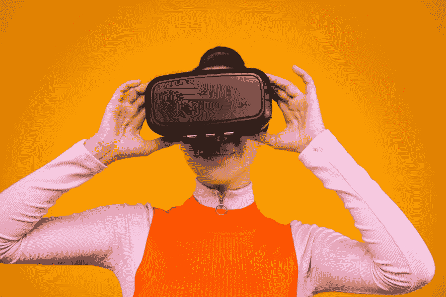
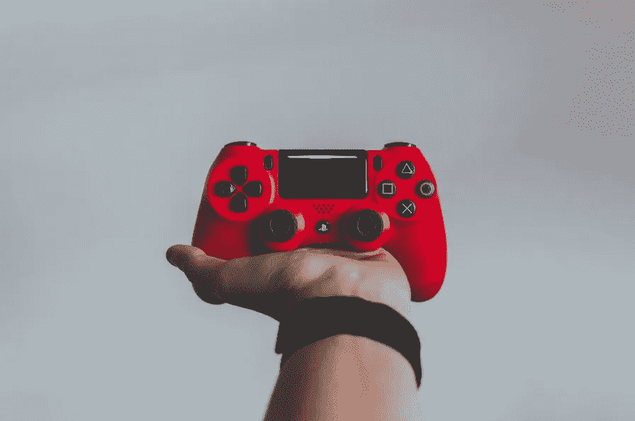

# 表演必须继续:基于区块链的虚拟现实市场的未来优势

> 原文：<https://medium.datadriveninvestor.com/show-must-go-on-future-benefits-from-blockchain-based-vr-marketplaces-a84fb4bc1ab3?source=collection_archive---------24----------------------->

现代社会的生活以计算机技术的快速发展、互联网用户数量的大规模增加和普遍的网络融合为标志。在这些过程中的主要角色之一属于区块链和虚拟现实的结合。

**最有前景的技术市场**

成功的 IT 公司最重要的区别特征是他们理解新技术的相互联系的本质，并积累专业知识来补充他们实施这些技术的计划。大数据分析、人工智能、[物联网和移动应用](https://www.embedded-computing.com/home-page/gauging-the-iot-mobile-app-market)并不是独立的举措。它们中的每一个都大大增加了引入其余部分的好处。

此外，这种方法与最新技术的计划使用相一致，如增强或虚拟现实、[人工智能和移动应用开发中的区块链](https://www.embedded-computing.com/home-page/decentralized-intelligence-how-enterprises-can-leverage-ai-blockchain-in-mobile-app-development)。根据成功公司的说法，这些创新将通过提高服务质量、改变行为和建立信任带来更多好处。

 [## 5 行业转型区块链应用|数据驱动投资者

### 除非你一直生活在岩石下，否则我相信你现在已经听说过区块链了。而区块链…

www.datadriveninvestor.com](https://www.datadriveninvestor.com/2019/02/13/5-real-world-blockchain-applications/) 

虚拟现实和区块链是出现在信息进步新时代黎明的两项技术。多亏了区块链，平台变得更加安全、透明、高效、匿名和独立。区块链允许您维护用户数据的机密性，并防止外界对信息的任何影响。虚拟现实可能是最需要它的行业之一。

区块链和虚拟现实开发是最有前景的市场之一，可以为全球用户提供更优质的服务和更高的安全性。据大观研究公司的专家预测，到 2025 年，区块链市场将达到 576.413 亿美元。[markets and markets 预测](https://www.marketsandmarkets.com/Market-Reports/reality-applications-market-458.html)仅在四年后，即 2024 年，沉浸式技术市场规模将上升至 447 亿美元。正如我们所看到的，这些技术在未来只会越来越受欢迎。

**区块链和 VR 协同**

如果我们谈论如何使用虚拟现实，首先想到的词是“游戏”。然而，VR 在娱乐的背后有着更大的潜力。尽管如此，由于巨大的虚拟现实开发成本，大多数基于沉浸式技术的项目主要处于试点实施阶段。视频游戏仍然是虚拟现实开发服务的主要领域，并且比企业部门使用得更加活跃。

许多行业爱好者认为，区块链可以成为大量引入虚拟现实的催化剂。这两种技术的相互结合只会加速它们的传播。例如，区块链将帮助*小企业和内容作者*保持对他们作品和收入的控制。由于虚拟现实技术，人们将能够足不出户地参加文化活动，而*表演者*将监控谁以及在什么条件下可以参加虚拟音乐会或展览。将能够在虚拟现实应用中展示他们的画作，这样买家就可以知道它们挂在墙上会是什么样子。

至于，开发者将可以创建一个基于区块链的分散式虚拟空间。参与者将能够开设虚拟展厅和销售点。由于这种零售平台，公司和个人将有机会展示他们的产品，并在世界各地销售。

它将允许在区块链移动应用程序开发、教育、旅游、娱乐和许多其他领域运营的小企业主和公司通过使用不限于现实世界的虚拟展厅来优化租赁展厅、物流和员工工资的成本。

**VR 游戏和区块链**

至于*博彩业*，区块链也可以给它带来很多改善。如你所知，你的游戏“我”的数字化身属于拥有游戏的公司，玩家完全依赖于它。此外，在游戏中创建的所有 VR 内容和体验通常都存储在平台上，并由游戏提供商控制。理论上，没有什么可以阻止公司在任何时候屏蔽甚至删除一个游戏角色。例如，当更新游戏时，会出现这样的情况:您发现无法加载您的角色，并且所有对支持服务的呼叫都不成功。

区块链技术可以让玩家免除这样的烦恼。使用分散的网络和不可互换的令牌，或 ERC-721 令牌，首次在 [CryptoKitties](https://en.wikipedia.org/wiki/CryptoKitties) 游戏中引入，允许玩家创建和修改角色、装备和其他单位，他们可以在一生中拥有它们，而不仅仅是在游戏本身存在的时候。因此，这项技术为玩家提供了个性化和符号化创意的机会，他们的产品可以从一个游戏转移到另一个游戏；它们可以买卖。

这个想法有着巨大的潜力，迟早，虚拟现实应用程序的开发将催生游戏，为广大玩家带来这些机会。

*原载于 2020 年 3 月 10 日*[*【https://techbullion.com】*](https://techbullion.com/show-must-go-on-future-benefits-from-blockchain-based-vr-marketplaces/)*。*