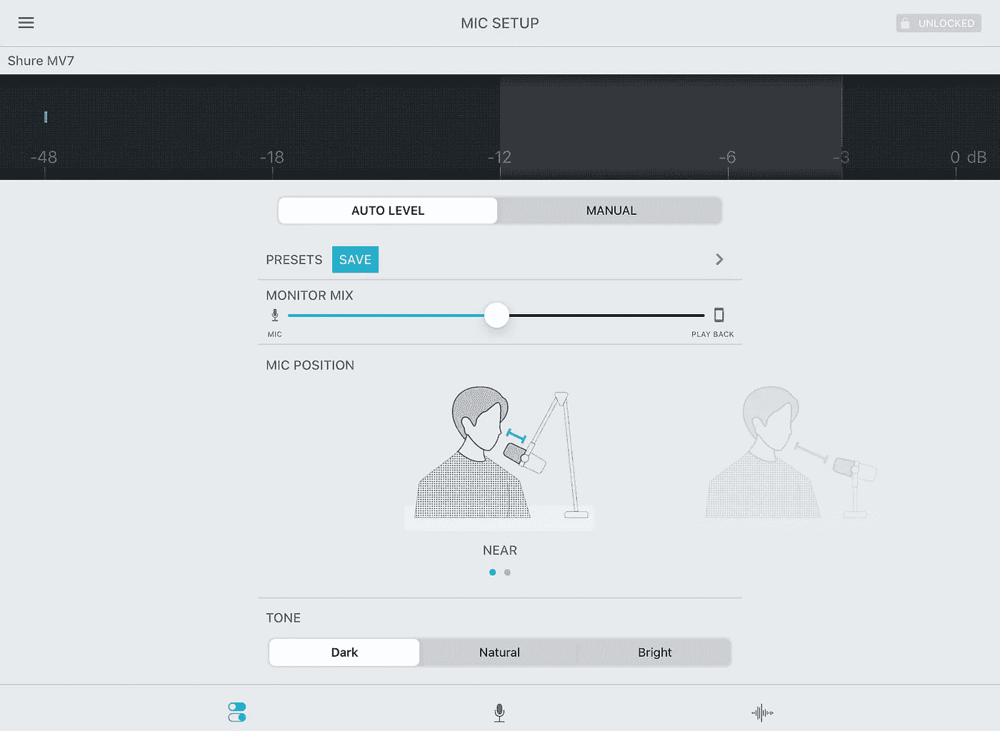
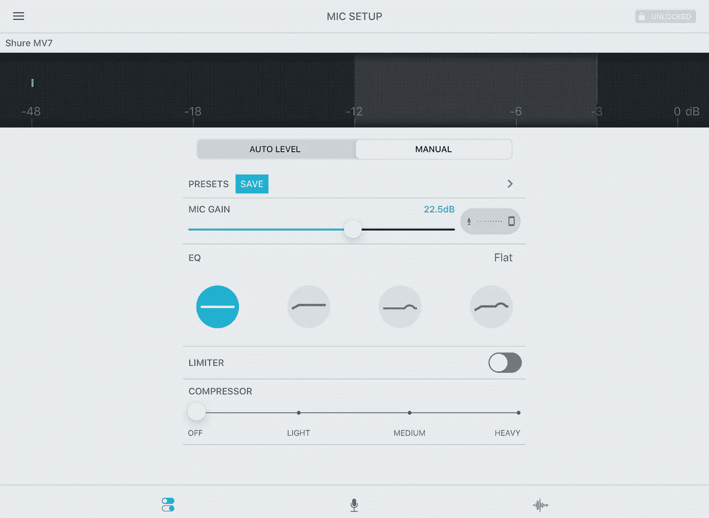

# 舒尔 MV7 播客话筒回顾

> 原文：<https://medium.datadriveninvestor.com/shure-mv7-podcast-microphone-review-64bb717b7f9c?source=collection_archive---------11----------------------->

## 舒尔 MV7B 的小姐妹 MV7 正在为自己赢得声誉

Photo by Derek Oxley at [B@Work](https://www.bworkco.com/?fbclid=IwAR2K3_nG7X7zfpclqpk7PljTo4tIfujF5690vlngPlVj3XsSSZFkwrygmxk)

OG，[传奇的舒尔 SM7B](https://www.shure.com/en-GB/performance-production/louder/the-shure-sm7b-aka-the-sm57-on-steroids-the-history-and-the-facts)44 年来一直是广播行业的黄金标准，这真是一段漫长的时间。它现在有了一个小妹妹，[舒尔 MV7](https://www.shure.com/en-US/products/microphones/mv7) ，这将使播客和游戏玩家兴奋不已。

它始于 [SM5 广播麦克风](https://www.shure.com/en-US/performance-production/louder/sm57-on-steroids-the-shure-sm7-b-story)——一种动态吊杆麦克风，并于 1966 年迅速在广播和电影工作室找到了一席之地。

John Born(舒尔公司项目经理)表示:“一组舒尔声学工程师收到了 SM57 拾音器元件(Unidyne III)，并要求他们在不限制尺寸和成本的情况下对其进行改进。他们都疯了。”这可能是约翰称 SM7B 为“类固醇上的 SM57”的原因

在 SM7 最终进入录音棚之前，业界花了 30 多年的时间。迈克尔·杰克逊用 SM7 录制了《颤栗》。

在 2012 年的一次采访中，David Rochman(舒尔企业公关经理)请 John 解释为什么 SM7 在推出 36 年后引起如此大的反响。他是这样说的:

> “多种因素可能导致了这种持续的人气飙升。也许话筒需要这么长时间才能获得认可。其中一些与。紧急播客——人们对高质量的画外音麦克风情有独钟。其中一些与迈克尔·杰克逊的死有关——每个人都在谈论他的唱片以及它们是如何制作的。还有一个事实是，这是一个 350 美元的麦克风，在麦克风枪战中击败了成本十倍的录音室麦克风。它终于得到了应有的认可。”

SM7B 现在的价格是 399 美元(T1)加上一个[云梯的成本，159 美元(T3)，别忘了还有一个](https://www.amazon.com/s?k=cloudlifter&crid=TNLNTS10RIVZ&sprefix=cloud%2Caps%2C175&ref=nb_sb_ss_ts-a-p_3_5)[音频接口，165 美元(T5)。很容易理解为什么 MV7](https://www.amazon.com/Steinberg-UR22MKII-2-Channel-USB-Interface/dp/B017MVUAHM/ref=sr_1_48?dchild=1&keywords=studio+interface+uk&qid=1606859347&sr=8-48)249 美元的价格如此吸引人。

MV7 和 SM7B:哪个适合你？显然，两种话筒之间存在一些差异，请访问舒尔网站了解更多细节。

 [## 我如何利用技术显著提高身体意识|数据驱动投资者

### 瑜伽练习最大的挑战是什么？是发展肌肉力量，还是柔韧性，还是耐力…

www.datadriveninvestor.com](https://www.datadriveninvestor.com/2020/11/12/how-i-dramatically-increased-body-awareness-using-technology/) 

## 它是如何工作的

MV7 与其他 USB 或 XLR 话筒相似，但有所不同；有了 MV7，您可以在一个话筒中拥有两种选择。它配有 USB 和 USB-C 电缆，所以如果你像我一样，想在 iOS 设备上录音，你需要购买 lightning 电缆。

据舒尔称，MV7 配备了声音隔离技术，因此在录音时，它会将激光聚焦在您的声音上，不会产生任何背景或室内噪音。我查看了麦克风，您可以在此处查看 [MV7 的功能和音质](https://www.instagram.com/tv/CILUPAtHrQh/?utm_source=ig_web_button_share_sheet)。

## 为什么更好

当我在我的车里开始 [BTW 播客](https://www.podpage.com/behind-the-wheel-podcast/) 4 年的时候，我用的是蓝色米奇，然后升级到了 [MV5](https://www.shure.com/en-US/products/microphones/mv5) 。舒尔推出了其 [MOTIV Audio 应用](https://www.shure.com/en-US/products/software/shure_plus_motiv_desktop)，它的简单吸引了我。我手里有一个强大的录音工具。

ShurePlus for desktop 为您提供了额外的功能。您可以激活自动调平模式；从那里，你可以选择三种声音音调(黑暗、自然和明亮)和近或远的麦克风距离。您也可以手动自定义声音。

iPad Screenshot Shure MV7 Auto Level Setup

iPad Screenshot Shure MV7 Manual Setup

## 你决定

八年前，舒尔意识到部分由于人们对播客的兴趣增加而导致销量激增，于是他们提高了 SM7B 的价格。价格和技术诀窍可能导致舒尔失去销售，并阻止新的播客投资 SM7B。

249 美元的价格标签使 MV7 成为新的播客和游戏玩家以及那些想提高声音水平的人的一个有吸引力的选择。

[**下载免费播客发布清单**](https://btw-podcast.ck.page/b6becea33c) 第一个排队领取 [**写出地狱**](https://btw-podcast.ck.page/8390fc1d79) :“写出地狱！”是一个男人的故事，他在两年多的时间里只用手机上的笔记应用和麦克风写了 104 篇短篇小说。在这个过程中，他向全世界成千上万的人传递了鼓舞人心的希望信息，发现了自己的声音，找到了和平。

## 访问专家视图— [订阅 DDI 英特尔](https://datadriveninvestor.com/ddi-intel)