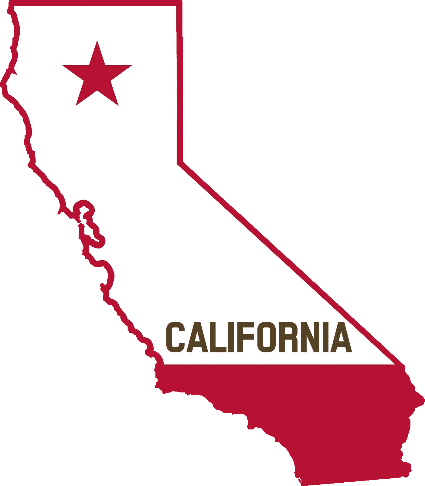

# 硅谷面临逃离危机

> 原文：<https://medium.datadriveninvestor.com/silicon-valley-faces-an-escape-crisis-bb747e0d46af?source=collection_archive---------7----------------------->

## 加州是世界第五大经济体。但现在硅谷正面临前所未有的逃亡危机。如果硅谷被分开，那么它是世界上第 18 大经济体

Image by [Pete Linforth](https://pixabay.com/users/thedigitalartist-202249/?utm_source=link-attribution&utm_medium=referral&utm_campaign=image&utm_content=5673315) from [Pixabay](https://pixabay.com/?utm_source=link-attribution&utm_medium=referral&utm_campaign=image&utm_content=5673315)

加州州长加文·纽瑟姆主动给 Airbnb 联合创始人兼首席执行官布莱恩·切斯基和送餐平台[的联合创始人兼首席执行官许宏涛分别打了电话。州长在电话中祝贺两位企业家的公司最近上市，并希望了解他们对加州创业环境的看法。](https://www.doordash.com/)

令纽瑟姆满意的是，两位企业家都向州长保证他们不会离开加州。

# **硅谷**逃脱**危机**

显然，最近的硅谷大逃亡让州长纽瑟姆有点不安。在过去的几个月里，[特斯拉](http://Tesla.com)，[甲骨文](http://www.oracle.com)，[惠普企业](http://hp.com)， [Palantir](http://palantir.com) 等知名科技公司纷纷将总部搬离硅谷。

> 马斯克、埃里森和戴维·卡普(Palantir 联合创始人兼首席执行官)等商业巨头已经离开了硅谷

加州政府正面临一场“公共关系危机”。马斯克甚至公开炮轰加州政府的高税收和企业监管，称“加州就像一支胜利的球队，似乎把一切都视为理所当然。他们不可能总是赢。”针对这些情况，纽瑟姆显然想听听企业界的想法。

虽然每年都有公司离开加州，但最近这些出走的公司都是标志性的公司。

> **特斯拉是目前美国最火的新能源汽车公司**

虽然今年的出货量只有 50 万辆，还不到传统车企的零头，但特斯拉的股价却涨了 7 倍，目前超过 6000 亿美元的市值甚至是 7 家传统车企的总和。

*马斯克也成为了身价超过 1300 亿美元的世界第二富豪。*

在今年夏天高调反对加州政府暂停疫情的同时，马斯克选择了德克萨斯州的奥斯汀建造特斯拉在美国的第二家组装厂，并获得了当地特拉维斯县政府高达 4600 万美元的税收减免。

> 与此同时，马斯克还宣布，Space X 的总部也将从洛杉矶搬到德克萨斯州，那里是他们火箭的组装和发射基地

**惠普企业的前身**，惠普公司，是见证硅谷历史的活化石。这家老牌 IT 公司成立于 1939 年，是硅谷车库文化的起源，也是硅谷年轻时对乔布斯的向往。

它在硅谷的地位就像现在的[苹果](http://apple.com)。甲骨文成立于 40 多年前，是美国企业软件领域的第二大公司。76 岁的埃里森在新疫情爆发后隐居在夏威夷的拉奈岛，在那里他买下了那里 97%的公共土地。

[https://gph.is/g/Z5LmmBa](https://gph.is/g/Z5LmmBa)

虽然“逃离硅谷”已经成为报道中的热词，但科技公司向德州搬迁并不是今年才出现的现象。

近十年来，[英特尔](http://Intel.com)、 [AMD](http://amd.com) 、[戴尔](http://dell.com)、惠普、甲骨文等数十家硅谷科技公司在得克萨斯州奥斯汀等地建起了园区。

对于甲骨文来说，这次所谓的“总部迁址”，不过是把总部的注册地从硅谷的红木城换到了奥斯汀园区的地址。

# **搬迁背后的现实利益**

对于加州政府来说，企业逃跑是一大尴尬，去德州更是双重尴尬。加州和德州是美国经济和人口最大的两个州，两者之间也有明争暗斗。

在经济政策和价值观上，加州和德州是民主、共和两党的两大根据地，高举自由主义和保守主义的大旗。

> 加州政府倾向于高税收和严格监管的欧洲模式，而德克萨斯州政府支持低税收和宽松监管的小政府模式

**那么，为什么科技公司会搬出加州，去德州的新园区呢？**

公司对政治立场不感兴趣，他们关心的是实际利益。科技公司在奥斯汀建新校区，是因为德州的税收更低，可以省很多钱。

得克萨斯州首府奥斯汀有“硅丘”之称，就像一个小硅谷的热闹景象，是美国发展最快的大都市区。

去年，苹果还宣布将在这里投资 10 亿美元，建设一个可容纳 1.5 万名员工的新园区。早在宣布总部搬迁之前，惠普企业就搬到了德克萨斯州的休斯顿。

> **加州最高的公司州所得税为 8.84%，而德克萨斯州最高为 0.75%**

德州的劳动力和土地成本也明显低于加州。根据企业搬迁专家乔·弗拉尼奇(Joe Vranich)去年的统计，在过去 8 年里，共有 13，000 家公司离开了加州。

从加州搬到德州可以节省 30%的运营成本。

Image by [lauramba](https://pixabay.com/users/lauramba-1896060/?utm_source=link-attribution&utm_medium=referral&utm_campaign=image&utm_content=1194372) from [Pixabay](https://pixabay.com/?utm_source=link-attribution&utm_medium=referral&utm_campaign=image&utm_content=1194372)

甲骨文的奥斯汀园区于 2018 年开业，当时计划拥有超过 1 万名员工。

> 根据甲骨文对当地政府的承诺，2020 年奥斯汀园区员工的平均工资将达到 67，000 美元

根据 Glassdoor 的数据，甲骨文硅谷红木城总部员工的平均工资为 11.5 万美元。特斯拉向奥斯汀工厂当地政府承诺解决当地 5000 个工作岗位，但起薪只有 3.5 万美元，仅为硅谷工厂的一半。

需要指出的是，这些“所谓逃离硅谷”的公司，只是为了享受德州的低税待遇，才把总部从硅谷换到了德州。

但这并不意味着他们会关闭硅谷园区，将所有硅谷员工转移到德克萨斯州。这意味着甲骨文和特斯拉仍然需要向加州政府缴纳房地产税和员工工资税。

# **硅谷高房价不易**

对于科技公司的高管和员工来说，搬到德州也有非常现实的回报。加州的州所得税是全美最高的(高达 13.3%)，资本利得税也是全美最高的(也是 13.3%)。

德州根本没有这两种税。今年因为特斯拉股价飙升，资产飙升 1000 亿美元的马斯克从加州搬到了德克萨斯州。

> **最现实的回报是他省了十几亿美元的税**

而且，由于今年疫情对企业经营的影响和政府收入的下降，加州政府还在计划继续提高高收入群体的所得税税率。

根据加州财政部的数据，加州 45%的个人所得税收入来自 1%的富人。

像马斯克和埃里森这样的超级富豪的离开，意味着加州政府损失了大量的所得税收入。

对于普通人来说，搬到德州意味着生活质量的直接提高。相比加州，德州的生活成本更低，房价也便宜很多。

以今年 10 月的房屋销售数据为例，硅谷圣克拉拉县(Santa Clara County)独栋房屋的中值价格为 144 万美元，而得克萨斯州奥斯汀市(Austin)所在的特拉维斯县(Travis County)的数字仅为 43 万美元。而且还是在同比增长 20%的情况下。

匿名专业社交网站 Blind 在本月早些时候调查了硅谷科技行业的 1500 多人。

超过 60%的受访者表示，愿意随公司搬家。即使在 FAANG(脸书、谷歌、苹果、亚马逊和网飞)的巨型员工中，也有 58%的人愿意搬迁。

Image by [ExplorersInternational](https://pixabay.com/users/explorersinternational-4765923/?utm_source=link-attribution&utm_medium=referral&utm_campaign=image&utm_content=2217654) from [Pixabay](https://pixabay.com/?utm_source=link-attribution&utm_medium=referral&utm_campaign=image&utm_content=2217654)

虽然疫情导致美国经济大幅萎缩，但并未影响硅谷房价的增长。美国股市的大幅上涨使得持有科技公司股票的员工的资产大幅升值。

几个明星创业公司的上市，再次造就了新一批千万甚至亿万富翁。

**今年 10 月**，圣克拉拉县房价中值仍同比上涨 16.8%，继续创出新高。

在现实生活压力的驱使下，加州人纷纷涌向德州。美国人口普查局的统计数据显示，2018 年有 8.6 万人从加州搬到得克萨斯州。

> 同比增长 36%，而同一年从德州搬到加州的人数为 3.8 万人

当加州人无法忍受高税收和高房价时，德克萨斯州总是他们首选的居住地，其次是亚利桑那州和华盛顿州。2018 年移居这两个州的加州人分别为 6.8 万人和 5.5 万人。

# **加州工会很强大**

监管严格也是企业选择远离加州的原因之一。马斯克与加州政府公开交换敌意，源于他对公司在疫情期间停工政策的强烈不满。

> **今年 5 月初，马斯克炮轰家秩序是法西斯**

在未经当地卫生部门允许复工的情况下，他强行在特斯拉工厂开始生产 Model 3。因为马斯克和特斯拉的明星地位，加州政府和地方政府都默许了他的违规行为，没有任何惩罚。

即便如此，马斯克仍然宣布将特斯拉和 Space X 搬到德克萨斯州，而德克萨斯州恰好是美国停工令最宽松的州之一。

在对比了奥斯汀和俄克拉荷马州塔尔萨等城市(税收减免待遇)后，马斯克选择了奥斯汀建设新的超级工厂。

> 就在他和得克萨斯州州长联合宣布该项目几周后，奥斯汀工厂已经开始建设

这个速度在加州可能不太现实。如果是在加州，建设 Giga 工厂可能会遭到环保机构和居民的诉讼，然后要经过两年的诉讼过程才能正式开始。

**在环保方面**，加州是最接近欧洲的美国政府。最近，特斯拉在德国的 Giga 工厂项目也因毁林的环保原因被法院强行叫停。

湾区委员会主席吉姆·温德曼(Jim Wunderman)说，“加州的监管者很难打交道。不仅程序冗长且昂贵。虽然很多公司和创业者都在说这些问题，但是现在。他们真的在考虑离开，新疫情造成的异地工作加速了他们的离开。”

[https://gph.is/g/4oOjV14](https://gph.is/g/4oOjV14)

> 加州拥有美国最严格的劳动法

工会的利益经常被优先考虑。由于拒绝组建工会和长期要求加班，特斯拉的硅谷工厂一直遭到工人权利组织的抗议。

相比之下，德克萨斯州的劳动法对企业更加友好。特斯拉的硅谷工厂是 2010 年从丰田买的现成工厂。

这也是加州唯一的汽车组装厂，丰田和通用汽车都关闭了他们在加州的生产线。

在工会力量的推动下，加州立法机构去年颁布了一项法律，要求优步等拼车巨头将平台签约司机视为全职员工，以提供福利保险福利。

> **这项法律遭到了优步和其他共享经济公司的强烈抵制，他们毫不犹豫地与加州政府打官司，并威胁要关闭加州的运营**

在花费超过 2 亿美元的游说后，这些共享经济巨头终于在今年的加州公投中获得豁免(不遵守前述劳动法)，避免了关闭加州总部的两次挫败。

如果公投失败，也许优步、Lyft 和 Doordash 现在也在考虑搬迁到得克萨斯州。

多元化也是加州公司面临的监管压力。根据加州 2018 年的法律，总部位于加州的上市公司董事会必须在明年年底前包括两名女性。

同样，硅谷科技公司也面临着员工构成不够多样化的指责。许多公司公开承诺招聘非洲裔和拉丁裔员工，为他们创造更大的职业空间。

# **政策立场难改**

虽然 Newsom 非常重视最近科技公司离开硅谷的问题，并主动联系企业家了解他们的观点，但科技巨头搬出加州的真正原因不是 Newsom 和加州民主党政府能够解决的。

> 州长没有能力也不愿意改变加州高税收、监管严格的左派政策

民主党人不能忽视工会的诉求，房价的持续上涨也有助于地方政府增加财政收入(每年的房地产税)。

只要这些问题不变，更多的公司和人还是会选择离开加州，搬到低税收、低房价的德州或佛罗里达等地。

虽然硅谷在过去 50 年一直是美国的科技中心，但真正的中产阶级化问题是过去二十年的互联网和移动互联网创业浪潮。

**在这一波创业**和创富神话中，一批又一批新兴的科技富豪直接推高了旧金山湾区的房价和生活成本，让非科技行业的居民买不起，被迫离开。

无奈的居民将怒火对准了科技巨头，继续抗议这些公司。

他们的投票压力也促使民主党政客增加科技公司和高薪富人的税收负担。

Image by [tunnelmotions](https://pixabay.com/users/tunnelmotions-12767861/?utm_source=link-attribution&utm_medium=referral&utm_campaign=image&utm_content=4916165) from [Pixabay](https://pixabay.com/?utm_source=link-attribution&utm_medium=referral&utm_campaign=image&utm_content=4916165)

旧金山，硅谷最北端，已经成为美国最明显的城市之一。

**一方面**，房价房租上涨，大量暴发户搬进来，老住户被迫搬出去。

**另一方面**，无家可归的人数持续增加，他们聚集在繁华的城区带来了严重的社会治安问题，如盗窃、吸毒、抢劫等。

> 中产阶级化可能是每个繁荣的大都市都面临的危机

房地产的大幅升值必然导致社会多样性的丧失和人口的流失。即使在加州，旧金山湾区的居民也在向萨克拉门托和其他房价略低的地区迁移。

旧金山湾区人口去年仅增长 0.42%，为过去 15 年来最慢增速。

根据加州政府的数据，旧金山湾区五个县的人口增长从 2013 年的 10.2 万人大幅下降到 2018 年的 3.8 万人。

而且湾区新增人口几乎全部来自外国移民，迁出湾区的居民数量远远超过美国其他地区迁入湾区的人口。

> 疫情导致的远程办公确实解放了硅谷的很多年轻人

他们不再需要忍受高昂的房租，住在旧金山湾区。相反，他们可以选择搬到租金和生活成本更低的地区，如萨克拉门托和内华达州的里诺。

即使工作需要，也可以开几个小时的车去公司。

在过去的六个月里，旧金山的房租下降了 7%。在今年的疫情之前，旧金山市中心一居室公寓的租金中位数超过了 3700 美元。

 [## 技术成瘾-是真的吗？数据驱动的投资者

### 通知铃声响起。你很想检查一下。你拿起手机检查了一下。“哇...再来一个喜欢的…

www.datadriveninvestor.com](https://www.datadriveninvestor.com/2020/12/16/technology-addiction-is-it-real/) 

# **硅谷仍然是创业的中心**

硅谷会因为这股逃离热潮而失去美国科技创新中心的地位吗？

过去几十年，美国科技行业一直在稳步寻找新的创业基地。硅丘(得克萨斯州奥斯汀)、硅滩(南加拿大威尼斯滩)、硅草原(得克萨斯州达拉斯)、硅港(马萨诸塞州波士顿)相继出现。

硅巷(纽约曼哈顿)，以及其他许多模仿硅谷的新名字。然而，这些新兴科技中心的发展并没有影响硅谷作为科技中心的地位。

> 2015 年，20%的美国专利来自旧金山湾区

在过去几年“逃离硅谷”的热潮下，旧金山湾区的人口仍在缓慢增长。

有多少科技公司和居民因为难以承受的房价和高税收搬出硅谷，又有多少移民和年轻人追求。

[http://gph.is/11G4Rn8](http://gph.is/11G4Rn8)

创业和成功的梦想来到这里。

即使是炮轰加州政府的马斯克，特斯拉和 Space X 的 R&D 部门仍在硅谷和洛杉矶。

马斯克的言论也引发了硅谷科技行业的热议。那些离开加州，搬到德州的企业家，无疑用实际行动表达了与马斯克的共识。但也有人公开反对马斯克。

> **加州知名媒体人乔·马修斯(Joe Matthews)上周在《洛杉矶时报》上写了一篇评论，以讽刺的口吻感谢“德克萨斯把马斯克带走了”**

他指责马斯克享受加州许多支持创新和新能源的政策来取得成功，但他把自己包装成一个完全靠自己成功的创新者。

他对加州为他创造的一切毫无感激之情，并公开破坏加州的疫情防控工作，不惜牺牲工人的健康来达到他的绩效目标。

**市值近 600 亿美元的云计算公司 Twilio 的联合创始人兼首席执行官杰夫·劳森**委婉地表示，加州确实存在房价高、税收重等诸多问题。

他理解那些为了家庭和生活而离开加州的人。但硅谷也为创业者提供了最好的环境(风险投资、人脉、文化、人才、孵化器、导师)，培育了世界上最成功、最具创新性的科技公司，也造就了许多亿万富翁。

> 在劳森看来，这些因为硅谷而成为亿万富翁的企业家不应该为了税收减免而离开加州

他们迟早会抛弃奥斯汀，因为奥斯汀关心他们的切身利益。劳森呼吁硅谷科技公司的首席执行官公开承诺留在旧金山湾区，投资建设这里的社区，帮助底层民众度过新疫情的艰难阶段。

Image by [raphaelsilva](https://pixabay.com/users/raphaelsilva-4702998/?utm_source=link-attribution&utm_medium=referral&utm_campaign=image&utm_content=3384008) from [Pixabay](https://pixabay.com/?utm_source=link-attribution&utm_medium=referral&utm_campaign=image&utm_content=3384008)

# **相信年轻的梦想**

据伯克利大学哈斯商学院(Haas School of Business)技术与社会讲师莫莉·特纳(Molly Turner)介绍，过去几十年来，加州公司一直抱怨这里的商业环境不够友好，但这显然没有阻止加州成为世界上最大的经济体之一，并继续吸引企业家。

> 马斯克、埃里森和其他人离开加州只是为了避税

风险投资仍在硅谷的山丘上聚集，高科技人才仍在流向硅谷，只要硅谷的风险投资环境不变，来之不易的硅谷仍是世界上最好的创业之地。

即使是已经搬出硅谷的主要科技公司，也大多是已经成长缓慢的老牌 IT 公司，新兴的互联网公司还没有搬出硅谷。

> **在与州长纽瑟姆的通话中，年轻的亿万富翁切斯基保证他和 Airbnb 都不会离开加州**

在切斯基看来，尽管一些明星企业家和科技巨头最近搬出了硅谷，但它仍然是美国创业和创新的中心。

Doordash 的许宏涛也向纽森做出了同样的承诺。

切斯基在推特上说，“当我来到旧金山时，我被这里独特的文化所感动。这里的人们相信一切皆有可能，他们愿意相信一个 26 岁的年轻人和他的两个朋友的疯狂想法。陌生人住在一起。如果不是我在加州遇到的那些人，我觉得我不可能成功。”

切斯基来自纽约中部的一个小城市，父母都是社工。

**2007 年**，26 岁的他来到旧金山找工业设计的工作。因为付不起旧金山高昂的房租，他只能和朋友合租一套公寓。

2007 年 10 月在旧金山举行的工业设计大会上，几乎所有的酒店都客满。想赚点小钱的切斯基买了一个充气床垫，把自己的公寓出租给陌生人合租。

这是 Airbnb 创业的源泉(Airbnb 是空气床垫和早餐的结合)。

【2008 年初，切斯基和两个同学兼室友共同创立了 Airbnb。当年 8 月，网站正式上线，旨在为订不到酒店或囊中羞涩的年轻人提供一个廉价的过夜选择。

他们很快加入了创业导师和风险投资家保罗·格拉厄姆的创业孵化器 Y Combinator，并获得了红杉资本的种子投资。

经过 12 年的经营，Airbnb 在纳斯达克上市，目前市值接近 1000 亿美元。

切斯基也从一个小镇青年变成了身价超过 100 亿美元的超级富翁。

## 获得专家观点— [订阅 DDI 英特尔](https://datadriveninvestor.com/ddi-intel)