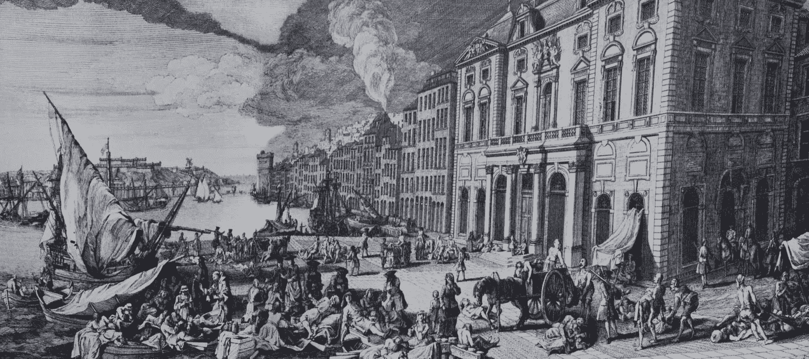
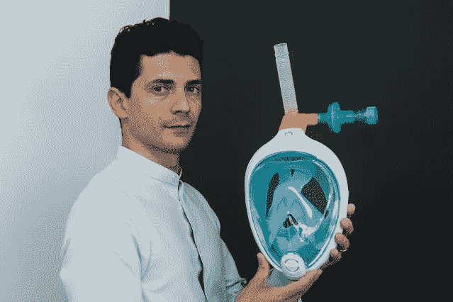

# 一线希望:颠覆创造的世界

> 原文：<https://medium.datadriveninvestor.com/silver-lining-the-world-that-the-disruption-created-56485770ca3b?source=collection_archive---------15----------------------->

在德隆·阿西莫格鲁和詹姆斯·a·罗宾逊(James A. Robinson)关于在不同国家创建包容性或掠夺性机构的著名著作《为什么国家会失败》(Why Nations Fail)中，有一节专门讨论黑死病或黑死病。根据作者的说法，它起源于中国，由热那亚商人带到地中海，并从那里迅速传遍欧洲。这是一场“摧毁了所到地区大约一半人口”的灾难。

黑死病的社会经济后果是巨大的。瘟疫戏剧性地改变了封建经济的运作方式。在西欧，很少有封建领主的仆人要求更多的自由和更高的工资。最终，这些都被批准了。人们可以自由选择居住和工作的地方。许多人搬到了城市。封建社会向自由市场经济的转变开始了。

*Great Plague of Marseille, 1721.*

冠状病毒不能与淋巴腺鼠疫相比。但正如每一次危机一样，它会带来不可避免的转变。已经衰老的旧事物将被迅速淘汰。即将发芽新闻会在一夜之间发芽。会有一些赢家和许多输家，但作为一个社会，我们都会受益。

让我们看看现代。2002-2003 年，SARS 疫情袭击了亚洲地区，尤其是中国，导致数千人患病，数百人死亡。这场流行病给中国经济带来了意想不到的后果。人们被锁在家里，转而在网上消费商品。这个[刺激了新兴的数字产业](https://qz.com/662110/chinas-internet-got-a-strange-and-lasting-boost-from-the-sars-epidemic/)，比如数字移动电话和电子商务。[阿里巴巴，中国科技巨头](https://www.harpercollins.com/9780062413406/alibaba/)，在第一次冠状病毒爆发的阵痛中诞生。

教训是相似的——危机是创新的压力测试，也是过时的死刑判决。技术可以比以往任何时候都更加强大。问题是“什么样的技术？”

# 创新机器

在媒体上兜售的悲观论调中，有声音指出目前正在进行的巨大水平和速度的创新。大多数创新发生在医疗保健领域:疫苗、医疗、医院设备等。学习在世界范围内迅速传播，合作取代了国家间通常的“针锋相对”的竞争。快速学习循环(数周而非数月或数年)让我们想到了“[创新机器](https://www.youtube.com/watch?time_continue=2820&v=GckXys0RInw&feature=emb_logo)，全社会参与其中。这是一个非常美丽的见证。尽管与新冠肺炎的战斗经常被比作“战争”，但由此产生的创新却没有可比性。虽然战争创新有负面的[向量](https://www.datadriveninvestor.com/glossary/vector/)，旨在杀戮和破坏，但疫情创新有正面的推力——它旨在拯救生命，让我们作为一个社会，“抗脆弱”。

许多非医疗保健行业的公司开始提出问题，他们的业务如何在中断期间及之后运营。在后 COVID 时代，客户需求会有怎样的变化？在应该避免面对面交流的情况下，如何更好地与客户互动？当人与人之间的接触应该最小化时，如何组织物理过程(修理、运送、准备食物)？如何应对供应链中断？如何将冲击对金融市场和投资的影响降至最低？几乎我们生活的每一个领域都面临着巨大的挑战:我们如何从庞大、复杂和脆弱转向灵活、分布式和抗脆弱？

投资者正在密切关注疫情颠覆的潜在赢家:“一切在线”、高接触服务中的虚拟现实和分布式制造，仅举几例。让我们依次看看它们。

# 一切在线

当人们被锁在家里时，技术帮助他们继续正常的生活。这项技术包括促进技术和客户服务的交付。

促成技术指的是通讯软件，如 Zoom、微软团队；基于云的 B2B 服务，如 DocuSign(数字签名)；云提供商等。

疫情使视频会议平台成为全球关注的焦点。Zoom 上的呼叫量从 2019 年 12 月的每日 1000 万飙升至 3 月的每日 2 亿多。“动物园研讨会”正在取代传统的“单向”网络研讨会，因为它们更像真实生活中的对话。Zoom 的股票飙升，2020 年涨幅接近 100%。这可能是一个好产品和纯粹运气的结合，但视频会议的趋势可能会在疫情结束后保持下去。可能永远消失的是传统的固定电话和不适应新时代挑战的简陋聊天室。

“在家工作”的革命也给那些尚未迁移到云计算的公司带来了难以置信的压力。一些投资者[在云提供商](https://www.barrons.com/articles/25-tech-stocks-to-buy-for-a-post-coronavirus-world-51585343434)上下了重注，并期望[云计算](https://www.datadriveninvestor.com/glossary/cloud-computing/)在后危机时代继续增长。一旦公司意识到外包数据中心的轻松和便利，他们将不愿回到本地服务器。

在疫情期间，客户服务的提供也发生了变化。亚马逊在三月份已经额外雇佣了 100，000 名员工，现在正在再雇佣 75，000 名员工，因为许多顾客开始在网上购买他们的必需品。但也有一些利基公司，如 Peloton(在线健身课程和高档健身设备)和 Chewy(在线宠物食品和药品配送)正在经历使用热潮，并导致股价飙升。例如，在过去的 12 个月里， [Peloton 股票的表现超过了 IBD 数据库中所有公司的 92%](https://www.investors.com/how-to-invest/zoom-stock-peloton-hit-new-highs-coronavirus-stock-market-rally/) 。自去年 6 月首次公开募股以来，Chewy stock 已经上涨了 22%。我们可能会想，封锁解除后，网上消费的趋势是否会持续下去。养成一个简单的习惯需要 21 天——在许多国家，禁闭持续时间超过 21 天。一旦疫情结束，人们很有可能会坚持使用在线服务的习惯。非典的爆发以及随之而来的中国[电子商务](https://www.datadriveninvestor.com/glossary/e-commerce/)行业的发展就是一个证明。

# 高触感被高科技取代？

疫情还改变了传统的需要身体接触的“高接触”服务方式。由于服务的性质(如房地产或美容护理)或客户的性质(如老年人或非常高端的客户)，一些行业一直是实体商业模式的最后堡垒。在当前的危机中，公司寻求将这些服务转移到网上。新技术(如虚拟现实或 VR)开始帮助苦苦挣扎的高接触市场。

封锁使房地产市场陷入停滞，但房地产机构找到了创新的方法让它继续下去。3D 漫游越来越受欢迎，因为它让潜在买家无需亲临现场就能看到房产。中国公司率先转向完全虚拟观看。二月份，大型开发商每天进行近 35 万次虚拟房屋浏览。欧洲房地产经纪人正在迎头赶上。英国的许多 T2 公司已经依靠虚拟的自助游和代理导游来确保房产交易。虚拟现实技术是由像 Matterport 这样的[初创公司提供的，matter port](https://www.dw.com/en/virtual-viewings-offer-hope-to-troubled-real-estate-market/a-53162144)是一个数字空间数据平台，可以创建任何物理资产的虚拟双胞胎。然后可以在任何数字设备上观看该物业，也可以通过 3D 耳机观看，获得更身临其境的体验。

有趣的是，虚拟现实技术在房地产领域已经存在了一段时间，但在冠状病毒爆发之前，它更多地被认为是一种“无聊的附加产品”。失去了移动性，客户现在更热衷于虚拟观看。这场危机加速了已经开始上升的趋势。

高科技取代高接触的另一个例子包括虚拟博物馆参观、虚拟购物甚至虚拟迪斯科。如果限制持续足够长的时间，人们可以想象虚拟旅行和观光。你想在家里直接虚拟游览马丘比丘或埃及金字塔吗？虽然听起来很好，但 VR 有其自身的局限性。首先，真正的沉浸式体验需要昂贵的耳机。其次，一旦限制取消，我们可以预计对虚拟现实替代品的兴趣将会下降。然而，客户仍将使用虚拟现实技术作为线下的补充，例如，筛选选项，节省亲自观看和逛商店的时间。通过这种方式，疫情有助于进一步巩固 VR 在客户交付体验中的作用。

# 分布式制造

制造业是受电晕危机影响的行业之一，许多工厂关闭，工人休假。另一方面，危机增加了对应急物资的需求，而我们的制造业还没有做好准备。尽管现有的全球供应存在结构性问题，但创新有助于迅速填补生产缺口。

3D 打印是承诺改变世界的技术之一，但到目前为止，这些承诺都落空了。但是个人防护用品的短缺给了它新的生命。大型制造商(例如[大众](https://www.volkswagenag.com/en/news/2020/04/volkswagen_3d_printing.html)和[惠普](https://www.themanufacturer.com/articles/how-3d-printing-is-helping-to-combat-coronavirus/))使用工业 3D 打印机快速重新调整他们的生产，为医院提供零件。像[is nova](https://www.isinnova.it/easy-covid19-eng/)这样的初创公司，使用 3D 打印来帮助对抗冠状病毒。这家意大利公司通过调整市场上已有的浮潜面罩，创建了一个 3D 可打印的紧急呼吸器面罩设计。分布式制造的新模式正在出现。在所谓的[“公民供应链”](https://www.bbc.co.uk/news/technology-52111522)中，3D 打印机的所有者共享设计模板，在家打印产品，并组织向医院的分销。Isinnova 将其面具设计免费公开，因此任何 3D 打印机的所有者都可以复制它。与传统供应链不同，公民供应链没有单点故障，它可以轻松适应不断变化的需求，并为参与分布式制造的人员确保更高水平的人身安全。

“Easybreath” diving mask by Isinnova. Source: [The EU Commission News](https://audiovisual.ec.europa.eu/en/photo/P-043392~2F00-06).

很难预测 3D 打印在当前危机之后的命运。然而，能够几乎“在车库里”快速生产必要产品的技术，将完全符合后 COVID 经济秩序中的本地化生产理念。很可能，在下一次危机期间，人们会在家里印刷卫生纸，而不是冲进当地超市。

# 跨越鸿沟

现在让我们问问自己，这些技术和公司有什么共同点？是什么帮助他们在威胁淹没数百万企业的浪潮中冲浪？

所有这些创新都不是全新的。它们已经存在了一段时间，但并没有满足迫切的需求。Zoom 于 2011 年推出，但在 2020 年 3 月，它的逐步攀升变成了繁荣。同样，3D 打印在 2012 年成为一个时髦词汇，然后一直处于冷宫状态，直到最近。房地产机构和零售商一直在尝试虚拟现实，但在封锁之前，客户参与度仍然低迷。只有当“最好拥有”变成“必须拥有”时，这项技术才会被主流采用。切断数百万人与外界的联系成了这个关键点。

重申一下，危机没有发明任何新东西。它增加了已经存在的东西。它帮助许多公司跨越鸿沟，并在几周内获得主流采用。这种采用可能会反弹，但永远不会回到新冠肺炎之前的保守点。习惯在 21 天内形成。虚拟现实、远程工作、在线交付和分布式制造将逐渐成为主流客户的新常态。

正如保罗·罗默所说:“浪费危机是一件可怕的事情”。

*原载于 2020 年 5 月 8 日*[*【https://www.datadriveninvestor.com】*](https://www.datadriveninvestor.com/2020/05/08/silver-lining-the-world-that-the-disruption-created/)*。*