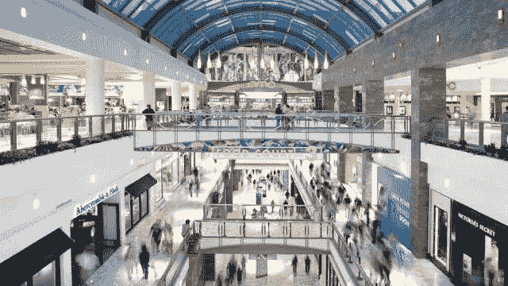

# 西蒙地产集团和麦克里奇:伟大的重新开放的戏剧？

> 原文：<https://medium.datadriveninvestor.com/simon-property-group-and-macerich-great-re-opening-plays-c18b98e61bc4?source=collection_archive---------7----------------------->

Macerich owned mall Tysons Corner. Image Courtesy: Visit Fairfax

COVID 疫苗分发到医院的速度比预期的要快。许多城市和州已经开始开放。包括我在内的许多人预测，大约在 3 月份，社会将开始正常化。随着社会的正常化和经济的重新开放，许多投资者开始押注旅游、购物、餐饮和观光等行业。由于疫情，这些行业受到重创。

新冠肺炎疫情和 2020 年肯定会被载入史册。这个疫情改变了我们的生活。有些事情会恢复正常，而另一些则永远不会一样。一些已经在发展的商业趋势只会加速。自动化、电子商务和区块链等趋势将进一步加速。那我为什么要说两个购物中心房地产投资信托基金呢？

以下是我对零售和电子商务的看法。甚至在疫情之前，电子商务就在挑战传统零售商。许多零售商，如 Borders 和 JC Penny，要么苦苦挣扎，要么宣布破产。疫情期间，电子商务飞速发展。由于许多城市因 COVID 而关闭，人们已经依赖电子商务购物。Instacart、Shopify、Etsy、Wayfair 和亚马逊等公司的利润飙升。我相信电子商务的增长只会越来越快。但就实体零售空间而言，我相信网络租赁、杂货零售和高端购物中心将继续蓬勃发展。我也相信提供“体验”(如餐馆、酒吧和娱乐区)的零售商/商场将会生存下来。基本上，作为“生活方式中心”运营的零售商将会在未来取得成功。

这就是我喜欢西蒙房地产集团和麦克里奇的原因。这两只房地产投资信托基金都有一些我喜欢的特征。这些功能包括:

*   主要服务于高端客户
*   位于高收入社区
*   它们是娱乐/社区中心，而不仅仅是购物的地方

**西蒙地产集团(纽约证券交易所代码:SPG)**

西蒙地产集团是世界上最大的购物中心运营商。就购物中心房地产投资信托而言，SPG 也拥有最大的市值，市值为 280 亿美元。我喜欢西蒙房地产集团的是:

*   国际形象:公司在世界各地都有购物中心。该公司的大部分国际业务都在亚洲。由于亚洲比西方更好地应对了疫情，该地区越来越多的人开始外出购物。在亚洲开展业务有助于该公司降低美国经济因疫情而下滑的风险。西蒙还拥有总部位于巴黎的欧洲第二大购物中心房地产投资信托基金 kle pierre 20.3%的股份。从这个意义上说，西蒙房地产集团是一个真正的总部设在美国的全球购物中心房地产投资信托基金。
*   不仅仅是购物中心:西蒙房地产集团购物中心不仅仅是一个购物的地方。这些商场就像“生活方式/娱乐/社区”中心。许多购物中心也是人们与家人和爱人共度闲暇时光的地方。
*   良好的财务状况:COVID 无疑影响了公司的财务状况。从 2019 年第三季度到 2020 年第三季度，该公司的运营(FFO)资金从 3.05 美元下降到 2.05 美元。但即使是在疫情期间，西蒙旗下的高级直销店部门的基本最低租金也同比增长了 2.9%。入住率仍为 91.3%。该公司还给出令人印象深刻的 6.1%的股息率。[资深房地产投资信托分析师、《智能房地产投资信托投资者》(intelligent REIT investor)一书的作者 Brad Thomas 是该公司的信徒，持有 SPG 的股票。](https://seekingalpha.com/article/4394689-simon-property-group-vaccine-move-shares-to-150)
*   [为后零售世界做好准备](https://www.wsj.com/articles/amazon-and-giant-mall-operator-look-at-turning-sears-j-c-penney-stores-into-fulfillment-centers-11596992863):西蒙地产集团和亚马逊达成协议，将之前的一些 JC Penny 商店转变为亚马逊履行中心。Simon Property Group 了解亚马逊的力量，并希望通过将其一些有价值的房地产转换为亚马逊履行中心来对冲其业务。西蒙地产集团的许多商场都位于主要的州际公路沿线，是非常有价值的房地产。亚马逊可以从 SPG 的部分房地产作为履行中心中受益匪浅，让 SPG 有机会从电子商务的繁荣中受益。

 [## 新冠肺炎期间股票交易的 9 个教训|数据驱动的投资者

### 在你浏览之前，让我告诉你一些关于我自己的情况。我是…

www.datadriveninvestor.com](https://www.datadriveninvestor.com/2020/12/09/9-lessons-learned-about-stock-trading-during-covid-19/) 

**马切里奇集团(纽约证券交易所代码:MAC)**

我喜欢马切里奇集团的地方包括:

*   不仅仅是购物中心:Macerich 拥有的购物中心是生活方式中心。Macerich 拥有的许多购物中心足够聪明，拥有高端餐厅和酒吧，因此人们不仅来购物，还来放松和享受美好时光。比如位于华盛顿特区郊区(弗吉尼亚州北部)的购物中心 Tysons Corner，也有高档餐厅和酒吧供人们享用，度过美好时光。许多零售商，如 Barnes and Noble、特斯拉(是的，他们有一家特斯拉经销商)，以及微软，都是人们体验现代生活方式的地方。Tysons Corner 的原开发商 Lerner Enterprises 建造了直接连接 Tysons Corner 的办公楼和公寓。这意味着泰森角不仅仅是一个购物中心，而且已经成为人们工作、生活和享受美好时光的社区。
*   服务高端客户:许多 Macerich 的购物中心位于美国的城市地区，特别是位于高中等收入的社区。回到泰森斯角的例子，除了你通常的零售商，像古驰、普拉达、路易威登和其他奢侈品零售商占据了购物中心的空间。

我有点担心麦克里奇的财务状况。我特别担心公司的债务水平。该公司的资产负债率高达 232.1%。净资产收益率为-0.4%。尽管如此，许多投资者仍对该公司表现出信心。截至 9 月，销售额已反弹至 2019 年水平的 92%。Coatue Management 的科技投资者兼对冲基金经理 Philipe Laffont 刚刚购买了价值 8524 万美元的 Macerich 股票。

我对这两个房地产投资信托基金仍有一些担心。我主要担心的是国际购物者。多年来，美国一直是国际购物者的圣地。来自新兴经济体，尤其是中国的新晋百万富翁，纷纷涌向美国购物。中国消费者在美国的人均消费约为 7200 美元。美国主要的购物中心房地产投资信托基金已经为这些购物者铺上了红地毯。但是由于疫情，国际旅行显著减少。国际旅行需要一段时间才能恢复。此外，由于美中关系的恶化，许多中国富人将对来美国犹豫不决。相反，他们会选择伦敦、巴黎和新加坡这样的奢华目的地。许多奢侈品零售商正越来越多地涌向上海，这使得新富起来的中国人没有必要去国外购物。这对美国奢侈品商场来说将是一个巨大的挑战，它们一直寄希望于外国购物者来帮助提高收入。

总的来说，我认为购物中心将不得不彻底改造自己。像“娱乐中心”一样经营的购物中心，包括酒吧、酒馆、俱乐部和高端餐厅，是未来成功的选择。此外，奢侈品购物将受到电子商务的最小影响。对富人来说，购物更像是一件有趣的事情，而不是必需品。因此，主要为奢侈品顾客服务的购物中心也会取得成功。

总体而言，零售 REITs 是一种高风险投资。电子商务正在摧毁这个行业，COVID 只是加速了这一趋势。但我确实相信西蒙地产集团和 Macerich 定位于后零售/购物中心世界。通过迎合奢侈品购物者，把他们的购物中心变成娱乐中心，我相信西蒙和麦克里奇都可以成为伟大的反向投资者，重新开始游戏。

这不是投资建议。我不是投资顾问。投资前请咨询专业人士。投资涉及风险。

圣诞快乐！！！

## 访问专家视图— [订阅 DDI 英特尔](https://datadriveninvestor.com/ddi-intel)