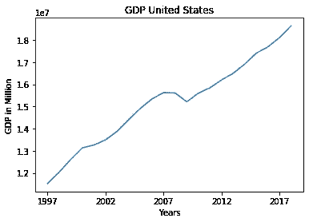
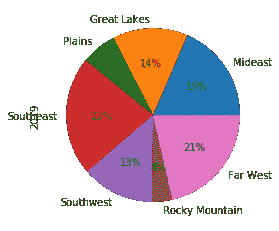
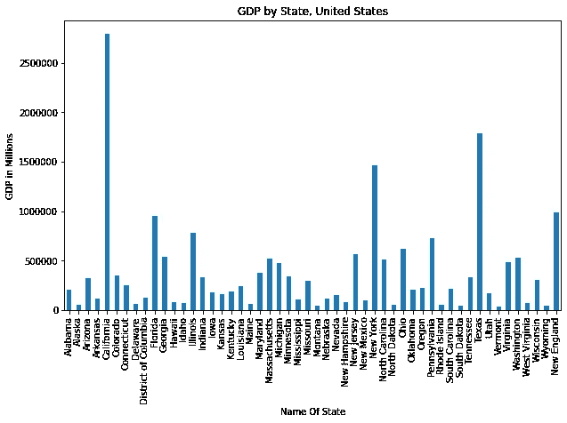
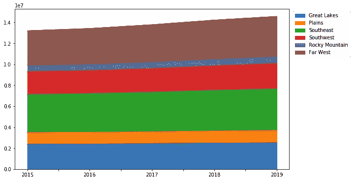

# Python 中的简单绘图技术

> 原文：<https://medium.datadriveninvestor.com/simple-graphing-techniques-in-python-90063682e994?source=collection_archive---------7----------------------->

## 只使用了几行代码

图表数据允许一个人分析模式，显示结果和整体；创造一种更容易理解的方式来快速传达信息。Python 上的一个包 Matplotlib 让这变得非常容易。通过简单的编码，该软件包允许对 Python 有初步了解的个人能够创建既传达相关信息又以简单和吸引人的方式传达信息的图形。

## 导入 Matplotlib

要导入 matplotlib，请打开 jupyter 笔记本并输入:

```
import matplotlib as mpl 
import matplotlib.pyplot as plt 
```

这将导入绘制数据所需的包。确保您已经通过包“numpy”和“pandas”加载并调整了您的数据帧。

## 生成一个图

去创造一个情节。你首先考虑的应该是你想要的那种剧情。[您的选项有:](https://pandas.pydata.org/pandas-docs/version/0.23.4/generated/pandas.DataFrame.plot.html)

*   “线条”:线条图(默认)
*   “条形图”:垂直条形图
*   “barh”:水平条形图
*   “历史”:直方图
*   “方框”:方框图
*   “kde”:核密度估计图
*   '密度' :与' kde '相同
*   “面积”:面积图
*   “饼图”:饼图
*   “散点图”:散点图
*   “hex bin”:hex bin 图

一旦你知道你想要什么样的情节，你就必须定义 X 和 Y。比如说；使用散点图，您将编码:

```
df.plot(kind = “scatter”, x = “x”, y = “y”) 
plt.show() 
```

在这里，您将定义属于数据帧“df”的“x”和“y”。以直方图为例；由于 X 轴显示值的范围，Y 轴显示频率，因此请确保定义了将使用的数据框的列。在这里，您可以使用“loc”和“iloc”来识别数据帧中的特定列。

```
df.iloc[: , :].plot(kind = “hist”) 
```

“iloc”和“loc”用于定位特定的行和列。[这个链接会解释更多](https://www.shanelynn.ie/select-pandas-dataframe-rows-and-columns-using-iloc-loc-and-ix/)。

如上所述，您已经看到了两种编码图形方法。一个是定义图的类型以及“x”和“y ”,另一个是先定义“x”和“y ”,然后定义图的类型。创建图形的另一种方法是将绘图类型定义为命令的一部分。这是它看起来的样子。

```
df.plot.line(x = “x”, y = “y”) 
```

## 几个实际例子

对于这个例子，我使用的是来自[美国经济分析局](https://apps.bea.gov/iTable/iTable.cfm?reqid=70&step=1#reqid=70&step=1)的各州和地区的 GDP。这显示了从 1997 年到 2019 年每个州、地区和整个美国数百万的 GDP (2012 美元)。使用这些数据，我将创建一个折线图，饼图，条形图和面积图。

## 线形图



```
df.iloc[0, 1:23].plot(kind = “line”)plt.xlabel(“Years”) plt.ylabel(“GDP in Million”) plt.title(“GDP United States”)
```

使用“iloc[]”，我们选择数据的第一行(美国 GDP)和第二至第二十四列(1997 年至 2019 年)。通过这个简单的代码，我们得到了一个线图。

## 圆形分格统计图表



```
df2["2019"].plot(kind = "pie", autopct='%1.0f%%')
```

使用“df2[“2019”]”我们标识包含 2019 年美国各地区 GDP 的列名 2019。Python 自动知道我们正在测量区域，区域列被设置为数据框的索引。autopct = ' % 1.0f % % '确保 python 自动计算每个区域的百分比，并在饼图中对其进行标记。

## 条形图



```
df_statesonly["2019"].plot(kind = "bar")plt.gcf().set_size_inches(10, 6)plt.title("GDP by State, United States") plt.ylabel("GDP in Millions") plt.xlabel("Name Of State")
```

该图显示了 2019 年美国各州的 GDP，单位为百万美元。在这里，随着条形图，你会看到轴和标题标签。这是使用 plt.xlabel、plt.ylabel 和 plt.title. plt.gcf()完成的。set_size_inches()定义了图形的大小，以确保所有的州名都合适并且清晰易读。

## 对比图



```
dffinal.plot(kind = "area")plt.gcf().set_size_inches(10, 6)plt.legend(bbox_to_anchor=(1.005, 1.0))
```

面积图显示了 2015 年至 2019 年美国每个地区的 GDP 水平，一个叠一个。这里 PLT . legend(bbox _ to _ anchor =(1.005，1.0))定义了图例应该离图形多远。

Matplotlib 只需几行代码，就可以制作出这种简单而信息丰富的图形和图表。探索 matplotlib.pyplot 的文档将允许你用你能构建的图形和图表进行创造性和创新。