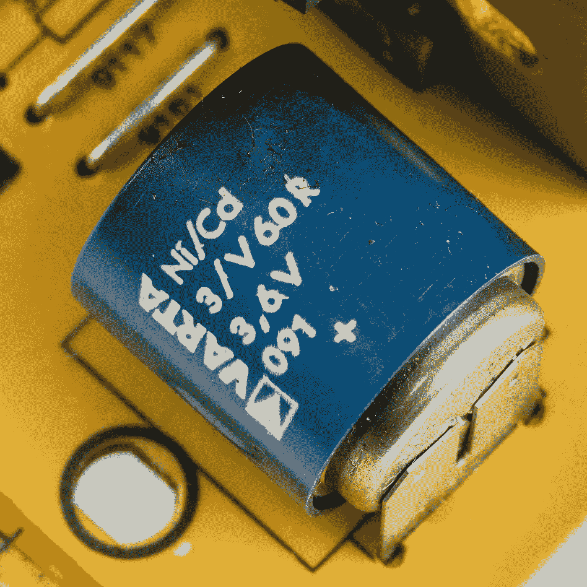
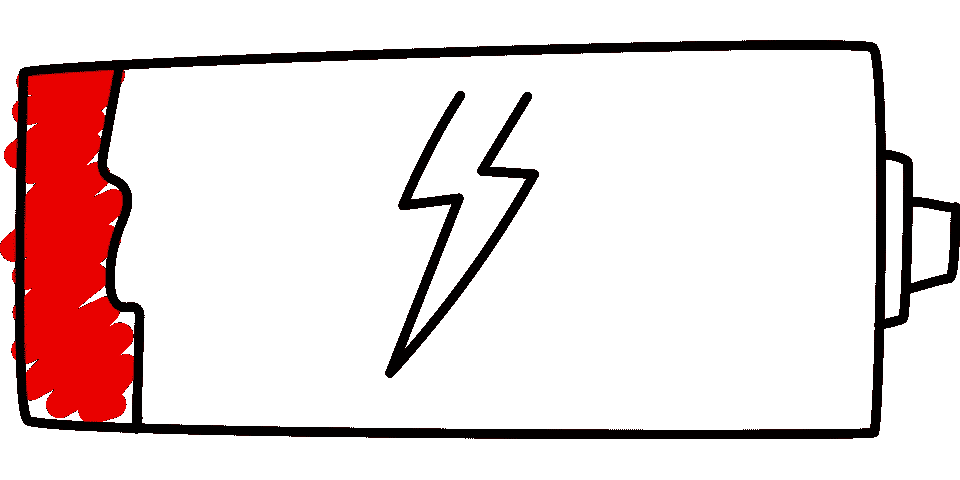
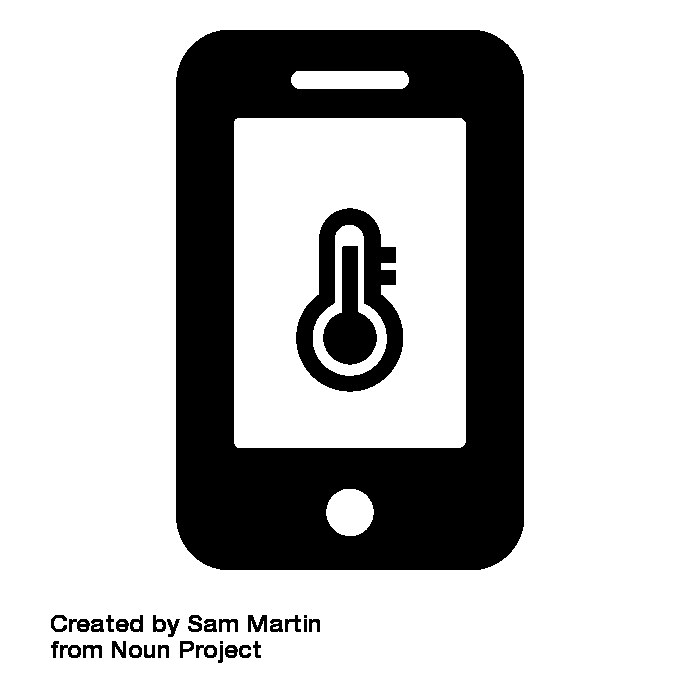
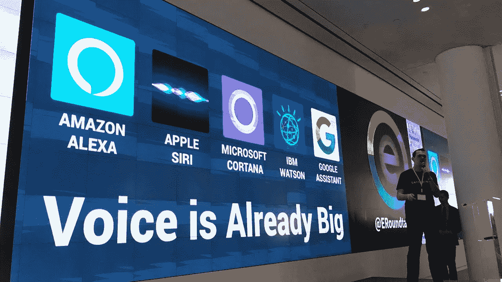

# 移动电池背后的科学

> 原文：<https://medium.datadriveninvestor.com/simple-science-and-logic-looking-after-your-mobile-battery-b68c08b4311?source=collection_archive---------8----------------------->

## 很简单！然而至关重要

没电了？你受挫了。哈哈！！感觉如此？有没有尝试过深入探究移动电池的本质细节？我以为这不会很有趣。但是当我意识到它背后的科学时，它让我敬畏。

锂离子电池是目前广泛使用的电池。然而，还有其他类型，如锂聚合物和镍镉。

尽管锂聚合物电池是市场上最先进的电池，电池寿命比锂离子电池长 40%，但它们不如锂离子电池普遍。原因是，即使出现细微的制造缺陷，它们也会爆炸。

© Raimond Spekking

镍镉电池受到所谓的“惰性电池效应”的影响，这种效应会缩短电池的寿命，因为它“不记得”上次的充电水平，下次会被过度充电，这意味着从长远来看，它会自行耗尽。

为了避免镍镉电池的现象，我们需要在使用时将电池一直放电到零，并一直充电到充满电以备下次使用。谁在乎！！？

所以到目前为止，锂离子电池被认为是最完美的电池，在电池市场上占有最大的份额。尽管电池寿命比锂聚合物低，但它们在电荷重量比方面提供了不可否认的性能，使我们的手机重量轻，但内部仍保持强大的功率。

# 关注电池的后端优化

市场上最近大肆宣传的是充电速度更快、续航时间更长的手机。不仅是电池类型，充电算法对电池的寿命也起着至关重要的作用。例如:

*   苹果公司声称，它的 iPhones“充电快是为了方便，充电慢是为了长寿”。iOS 允许电池快速充电至 80%，然后缓慢充电至 100%，避免电池快速充满。
*   华硕拥有其官方软件“华硕电池健康充电”，允许用户将电池的最大功率限制在 60%或 80%，而不是默认的 100%。“这增加了电池的寿命”——他们的结论。
*   Oppo 通过设计电池优化，在人工智能确定的早上醒来时间完成 100%充电，揭示了它在电池护理方面的魔法。

 [## 当科幻进入现实|数据驱动的投资者

### 科幻小说以其疯狂的技术故事统治了世界，充满了诸如读心术和人类的想法…

www.datadriveninvestor.com](https://www.datadriveninvestor.com/2020/04/17/when-science-fiction-enters-reality/) 

# 什么是充电周期？

这可以认为是本文的关键所在。一个充电周期是指一个人完成 100%的电池容量。不需要马上。它可以一天完成 40%,充电，第二天完成 60%。

大多数锂离子电池承诺额定 500 次充电循环。超过这一点，电池的最大容量可能会下降到 80%，这表明需要更换电池。为了充分利用电池，我们需要减慢充电周期的完成速度。

# 节省电池以延长使用时间的技巧

## 尽快更新软件:

如上所述，制造商在每次更新中都提供了改进的电池优化。因此，建议在它到来的那天更新你的软件。

人们发现它很平凡，因为前端通常没有太大的变化。后端修复是神秘的。

## 避免极端温度:

Overheating Phone by Sam Martin from the Noun Project

无论是冷还是热，电池都不能承受极端情况下的温度。尤其必须避免将手机暴露在 16–35°c 的温度范围之外

即使它意外暴露，在使用之前，我们也需要让它先在室温下稳定下来。

## 关闭“嘿 Siri！”或者“Ok Google”:

MarkChristopherWebster, CC BY-SA 4.0 <[https://creativecommons.org/licenses/by-sa/4.0](https://creativecommons.org/licenses/by-sa/4.0)>, via Wikimedia Commons

这种做法可能会妨碍我们最喜欢的功能，即通过简单的呼叫为我们提供服务的虚拟助手。

这是手机中普遍的默认设置。当它打开时，你的手机需要不断地检查是否有人在呼叫它，这显然需要很大的电池电量，使它直线下降。

## 使用官方或认证的充电器和电缆:

廉价充电器的价格听起来确实不错，但它们缺乏防止过度充电和电压波动的安全机制。您必须只为您的手机购买官方或认证的配件。它们可能很贵，但值得信赖。

另一个广为流传的做法是用其他公司的手机充电器给手机充电。你可以观察到充电器有不同的输出功率。如果它与你的手机不兼容，这可能是致命的。

## 其他小的良好实践:

*   不用时关闭蓝牙和 WiFi。根据科学家的说法，这也能改善你的心理健康。
*   关闭 Paytm、Adobe Reader、Office 等应用程序的通知，这些应用程序不会给出有用的通知，但很烦人。这减轻了扬声器的负荷。
*   关闭触觉振动和键盘点击声音。不需要每次触摸屏幕时都振动和发声。
*   当没有太多手机信号时，打开飞行模式。所以，手机不需要停留在一个追求的信号。
*   使用深色主题和深色壁纸。这对你的眼睛和电池有好处。
*   如果需要，使用节电模式。
*   关闭位置权限中的“总是允许”。这显示了对电池寿命的显著影响。
*   避免在手机充电时使用手机。它会加热电池。

Photo by [Danilo Alvesd](https://unsplash.com/@daniloalvesd?utm_source=medium&utm_medium=referral) on [Unsplash](https://unsplash.com?utm_source=medium&utm_medium=referral)

# 结论:

最新的技术使 noobs 能够毫不费力地理解它的操作。这些公司正处于一种狂热的不安和竞争中，他们尽力为用户提供最好的产品，专注于改进他们的每一个下一代产品的技术。他们把自己的灯塔设在无限远处，每个制造商都以自己的方式在智能手机行业留下不可磨灭的印记。

## 访问专家视图— [订阅 DDI 英特尔](https://datadriveninvestor.com/ddi-intel)