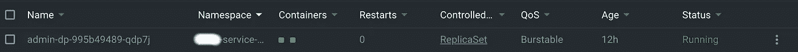

# 使用 sidecar 模式传输 Kubernetes 日志的简单方法

> 原文：<https://medium.datadriveninvestor.com/simple-way-to-stream-kubernetes-logs-with-sidecar-pattern-5240ee88e8f0?source=collection_archive---------0----------------------->

当我们在容器中托管无状态应用程序时，尤其是在 Kubernetes 中，我们面临的最大挑战之一是如何将应用程序日志数据流式传输到任何类型的目的地。库伯内特生态系统是一个高度分布和动态的环境。在真实的生产环境中，可能会运行许多包含数百个容器的机器，这些容器可以在任何时间点终止、重启或重新调度。这是自然的，系统的容器化本身就是一个挑战，最好考虑一下如何获得不会丢失的应用程序日志。

Kubernetes 架构提供了许多管理应用程序日志的方法。可以考虑的一些方法有:

*   使用运行在应用程序窗格中的日志边车容器。
*   使用在每个节点上运行的节点级日志代理和 DaemonSet。
*   将应用程序中的日志直接推送到一些日志存储系统。

其中，我将提供如何用 **EFKK** 栈(EFKK 代表 ElasticSearch、Fluentd、Kibana 和 Kubernetes)捕获应用程序日志并发送到日志存储系统。

# 什么是边车模式


Linn Naing is one of more than 26,000 licensed sidecar drivers in Yangon, Myanmar. With fares ranging from 20 cents to 50 cents, sidecars remain a cheaper option than taxis for short-distance trips. (Julie Makinen / Los Angeles Times)

第一个单节点模式是 sidecar 模式。sidecar 模式是由两个容器组成的单节点模式。第一个是应用程序容器，另一个容器将从应用程序容器获取日志并传输到日志系统，称为 **sidecar** 容器。sidecar 也与父应用程序共享相同的生命周期，与父应用程序一起创建和退出。

默认情况下，docker 容器日志将保存在主机上的 **/var/log/containers** 目录中。如果您的应用程序没有输出到 stdout 和 stderr，那么您可以在您的应用程序旁边部署一个 sidecar 容器，该容器将获取应用程序日志并将它们分别传输到 **stdout** 和 **stderr** 。

[](https://www.datadriveninvestor.com/2020/05/14/the-sway-of-individuality-for-the-benefit-of-mainstream-and-sake-of-rebellious-minority/) [## 为了主流的利益和反叛的少数民族的利益，个性的摇摆|数据…

### 在一个给定的社会中，个人独立行动的能力受到多种因素的影响，例如…

www.datadriveninvestor.com](https://www.datadriveninvestor.com/2020/05/14/the-sway-of-individuality-for-the-benefit-of-mainstream-and-sake-of-rebellious-minority/) 

首先，我们将配置 **Fluentd** 配置文件如下:

```
<source>
  [@type](http://twitter.com/type) tail
  [@id](http://twitter.com/id) in_tail_container_logs
  [@label](http://twitter.com/label) [@TO_ES](http://twitter.com/TO_ES)
  path "/var/log/containers/myapp-namespaces-*.log"
  pos_file "/var/log/mynodejs.log.pos"
  tag "kubernetes.mynodejs.api_server"
  <parse>
    [@type](http://twitter.com/type) json
    time_format %Y-%m-%dT%H:%M:%S.%NZ
  </parse>
</source><label [@TO_ES](http://twitter.com/TO_ES)>
  <match kubernetes.*.*>
    [@type](http://twitter.com/type) copy
    <store>
      [@type](http://twitter.com/type) elasticsearch
      host elasticsearch
      port 9200
      ...
      ...
      <buffer>
        flush_interval 1s
        flush_thread_count 2
      </buffer>
    </store>
    <store>
      [@type](http://twitter.com/type) stdout
    </store>
  </match>
</label>
```

[https://docs.fluentd.org/input/tail](https://docs.fluentd.org/input/tail)

上述代码片段中，fluentd 将从 **myapp** 开始跟踪所有日志文件名，并传输到 ElasticSearch，fluentd 配置将需要放入 ConfigMap，如下所示:

```
apiVersion: v1
kind: ConfigMap
metadata:
  name: fluentd-config
  namespace: price-service-dev
  labels:
    k8s-app: fluentd-logging
    version: v1
    kubernetes.io/cluster-service: "true"
data:
  fluent.conf: |
    <source>
      [@type](http://twitter.com/type) tail
      [@id](http://twitter.com/id) in_tail_container_logs
      [@label](http://twitter.com/label) [@TO_ES](http://twitter.com/TO_ES)
      ...
      ...
      ...
    </source>
    <label [@TO_ES](http://twitter.com/TO_ES)>
      <match kubernetes.*.*>
        [@type](http://twitter.com/type) copy
        ...
        ...
        ...
    </label>
```

现在，是时候在 Kubernetes 部署文件中将 fluentd 容器配置为 sidecar 了。默认情况下，官方的 [fluentd](https://hub.docker.com/r/fluent/fluentd/) docker 映像不与 [elasticsearch](https://github.com/uken/fluent-plugin-elasticsearch) 插件一起传输，因此我们需要使用[自定义映像](https://hub.docker.com/r/fluent/fluentd-kubernetes-daemonset)将应用程序日志传输到 elasticsearch 集群。

```
- name: fluentd
  image: fluent/fluentd-kubernetes-daemonset:v1-debian-elasticsearch
  env:
    - name:  FLUENT_ELASTICSEARCH_HOST
      value: "localhost"
    - name:  FLUENT_ELASTICSEARCH_PORT
      value: "9200"
    - name: FLUENT_ELASTICSEARCH_SCHEME
      value: "http"
    - name: FLUENT_ELASTICSEARCH_USER
      value: "elastic"
    - name: FLUENT_ELASTICSEARCH_PASSWORD
      value: "mypassword"
    - name: FLUENT_UID
      value: "0"
  volumeMounts:
    - name: fluentd-config
      mountPath: /fluentd/etc/fluent.conf
      subPath: fluent.conf
    - name: varlog
      mountPath: /var/log
    - name: varlibdockercontainers
      mountPath: /var/lib/docker/containers
      readOnly: true
```

*   使用专门配置了弹性搜索的`fluent/fluentd-kubernetes-daemonset:v1-debian-elasticsearch` Docker 图像作为 Fluentd 输出。
*   您会看到**配置图**也附在边车容器中。
*   它应该提供一些环境变量，以便连接到您的 Elasticsearch 集群。这些是您的 Elasticsearch 主机、端口和凭证(用户名、密码)。
*   Fluentd 需要 root 权限才能读取`/var/log`中的日志并将`pos_file`写入`/var/log`。为了避免权限错误，在您的清单文件中将`FLUENT_UID`环境变量设置为`0`。

我们将使用我们的自定义 Fluentd 配置配置一个新的`ConfigMap`卷，并将其安装在容器中的`/fluentd/etc/fluent.conf`路径。

```
volumes:
  - name: fluentd-volume
    configMap:
      name: fluentd-config
  - name: varlog
    hostPath:
      path: /var/log
  - name: varlibdockercontainers
    hostPath:
      path: /var/lib/docker/containers
```

要在`fluentd-efkkk.yml`中保存清单并创建部署文件:

```
kubectl apply -f fluentd-efkkk.yml
```

部署之后，您将能够看到两个容器在相同的节点上运行，一个是应用程序容器，另一个是日志代理容器，在您的 Kubernetes 中称为 sidecar 容器。



# 结论

好了，您已经学习了如何将 Fluentd 部署到 Kubernetes 集群，以及如何将 Kubernetes 应用程序及其日志流式传输到 Elasticsearch。这只是一个将 Kubernetes 日志流式传输到 ElasticSearch 的简单示例，我使用 Fluentd 作为日志代理，但您也可以使用 Fluent Bit 或 Logstash 或类似的东西，这取决于您的选择或您项目的要求。您可以创建更复杂的过滤器，并在 Fluentd 配置文件中转换日志更复杂的功能。希望你们会喜欢我的文章，也请不要忘记鼓掌。

顺便说一下，下一篇文章我将描述如何为你的复杂架构编写集中日志记录系统的 Helm Chart 库。敬请期待，伙计们…！！！

## 访问专家视图— [订阅 DDI 英特尔](https://datadriveninvestor.com/ddi-intel)