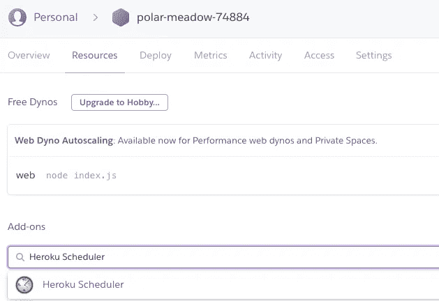
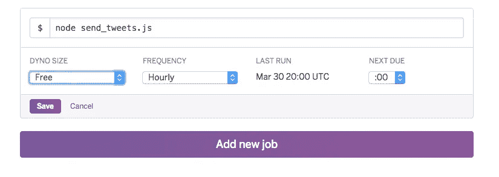
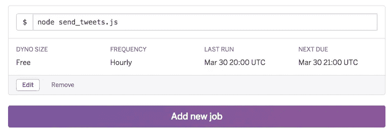
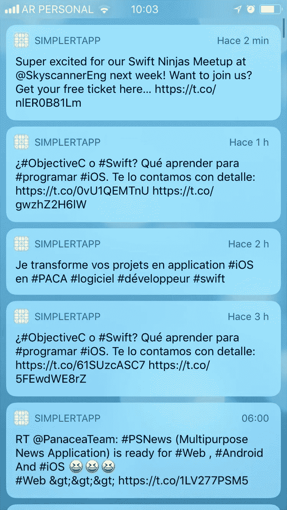

# SimpleRTApp:如何使用 Heroku 调度程序运行 cron 作业

> 原文：<https://medium.datadriveninvestor.com/simplertapp-how-to-use-heroku-scheduler-to-run-cron-jobs-3ff1c0c1e1f7?source=collection_archive---------8----------------------->

*这篇文章也可以上* [*我的个人博客*](https://federicojordan.github.io/blog/2020/09/22/simplertapp-how-to-use-heroku-scheduler-to-run-cron-jobs-3ff1c0c1e1f7.html) *。*

本文是众多解释如何在 iOS 设备中基于与用户最相关的推文获得通知的文章中的最后一篇。更多关于项目[的信息请点击](https://medium.com/@federicojordn/how-to-obtain-relevant-tweets-in-a-ios-app-with-heroku-nodejs-swift-4c0027c88a4a)

现在，我们将在 Heroku 上创建一个作业，它将在我们需要的某个时间被调用，它将运行脚本来查找推文并通知用户。

# 要求

我们需要有一个 Heroku 帐户，与上传的应用程序。

在我们的教程中，我们将继续 SimpleRTApp 项目的最后一部分。

# 什么是 Heroku 调度程序？

Heroku Scheduler 是 Heroku 应用程序的一个插件。它只是允许我们定义一个命令在期望时间间隔内运行。它可以是每天、每小时或 10 分钟窗口。

# 配置

为了能够将 Heroku Scheduler 添加到我们的应用程序中，我们必须进入 Heroku 仪表板。我们转到“参考资料”,在附加部分我们寻找“Heroku 调度程序”

有可能 Heroku 要求我们验证我们的帐户进入信用卡。如果是这样的话，它不会收取任何费用，除非我们在那里选择付费服务计划。

一旦我们添加了插件，我们进入它的配置。在我们的例子中，我们希望它每小时运行一次命令`node send_tweets.js`。为此，我们添加了新作业:

我们填写所有必需的数据，然后点击“保存”。它将告诉我们作业下次在“下次到期”字段中运行的时间:

搞定了。只需等待这一页给我们指示的时刻。

像 dynos 一样，我们有可能看到作业的日志。为此，我们转到 Heroku 仪表盘左侧“更多”菜单中的“查看日志”。

我们可以在下图中看到运行 cron 的结果:

# 结论

我们看到了如何在 Heroku 上创建 cron，简单地添加一个像 Heroku Scheduler 这样的插件。它只会要求我们提供所需的命令和频率。

至此，我们完成了关于 SimpleRTApp 的系列文章，这是一个简单的系统，包括 iOS 开发、Node.js 后端、MySQL 数据库配置和 Heroku 上的云服务设置。

非常感谢你的阅读！

# 来源

*   [https://devcenter.heroku.com/articles/scheduler](https://devcenter.heroku.com/articles/scheduler)

**进入专家视角—** [**订阅 DDI 英特尔**](https://datadriveninvestor.com/ddi-intel)