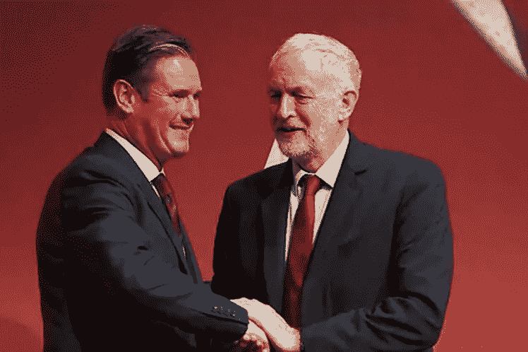

# 凯尔·斯塔莫爵士是工党的新领袖

> 原文：<https://medium.datadriveninvestor.com/sir-keir-starmer-is-the-new-leader-of-the-labour-party-cc6a032fe82?source=collection_archive---------15----------------------->

## 这是他面临的三大挑战

[Sir Keir Starmer (left) Jeremy Corbyn (Right)](https://www.plenglish.com/index.php?o=rn&id=54223&SEO=outgoing-british-labour-leader-congratulates-his-replacement)

鲍里斯·约翰逊(Boris Johnson)以舒适的保守党多数席位保住了首相职位，这决定了杰里米·科尔宾的命运和他成为英国首相的机会。这是这个国家的第二次选举，由于杰里米·科尔宾未能为工党提供具体的领导和政策，选举出现了分歧和争议。随着选举结果的公布，有消息称科尔宾将辞去领袖职务。随着该国对英国退出欧盟和未来政治方向的看法最终明朗，作为官方反对党，工党是时候组建一个由新领导人领导的新影子内阁了。

三名候选人脱颖而出，成为领导层的潜在替代者。他们是[凯尔·斯塔默爵士](https://en.wikipedia.org/wiki/Keir_Starmer)、[丽莎·南迪](https://en.wikipedia.org/wiki/Lisa_Nandy)和[丽贝卡·朗·贝利](https://en.wikipedia.org/wiki/Rebecca_Long-Bailey)——他们都曾在杰里米·科尔宾的影子内阁中任职。斯塔默爵士今天的当选标志着与工党短暂的极左路线的决裂。斯塔默爵士被描述为英国政坛的温和左派。对于对 21 世纪英国政治略有了解的人来说，这一点与埃德米利班德(前工党领袖)很接近。

 [## 保护主义、政治和经济动荡|数据驱动的投资者

### 美国股市昨日出现 400 多点的大幅反转，为未来的事情发出了警告信号。市场…

www.datadriveninvestor.com](https://www.datadriveninvestor.com/2018/06/28/protectionism-politics-economic-turmoil/) 

随着时间走向下一个选举周期，如果他希望获得令人垂涎的荣誉首相头衔，斯塔默爵士将不得不解决三个主要问题。首先，建立一个讨人喜欢的形象。杰里米·科尔宾的主要问题似乎是杰里米·科尔宾本人。在英国政界，他个人的受欢迎程度异乎寻常地低。他对工党内部反犹太主义的处理，他在英国退出欧盟问题上不确定的政策，以及他普遍缺乏幽默感(这是英国议会政治中的一个重要因素)促成了这一点。简单来说，杰里米·科尔宾是那种在 2016 年[年度英国烤肉串奖](https://www.gq-magazine.co.uk/article/why-do-people-hate-jeremy-corbyn)上兜售沙拉对健康有益的人。个性和受欢迎程度很重要，斯塔默爵士有充足的时间来建立良好的公众形象。

其次，工党将不得不经历一场意识形态和政策的转变。尽管公众强烈反对，民意调查甚至党内大声疾呼，但工党却一次又一次地未能就英国退出欧盟问题提出具体的政策立场，这种做法证明不利于选民对该党的信心。工党现在将不得不重新评估其政策立场，并向公众提出一套基于原则和支持的政策。如果该党因为害怕失去选民而再次试图不对政策做出承诺，那将是一个错误。任何政党，不管其政策如何，都会有一定数量选民永远不会投他们的票。一个政党的职责是提供一个明确的选择，并向选民展示其政策如何能最好地帮助他们。

第三，工党需要内部团结。在杰里米·科尔宾执政期间，工党内部出现了分歧，这种分歧已经公开化了——甚至影子内阁大臣也公开反对领导层。《T2 卫报》在 2019 年 2 月报道了关于影子内阁如何避免在会议上讨论英国退出欧盟和他们政策的话题，因为领导层本身太分裂了。另据报道，像影子外交大臣艾米丽·索恩伯里这样的成员不会在会议上讨论这个话题，因为她害怕这个话题会泄露给媒体。党领导层内部的这种不信任和尴尬不应该被接受为一个主流政党的运作党。

新领导人需要做大量的工作来团结全党，树立对领导层的信心。党内仍然有一个强大的派系支持科尔宾和他的政策，党内也有支持和反对英国退出欧盟的人——这种影响和政策分歧将得到解决。时间会证明斯塔默爵士将如何应对所有这些挑战。