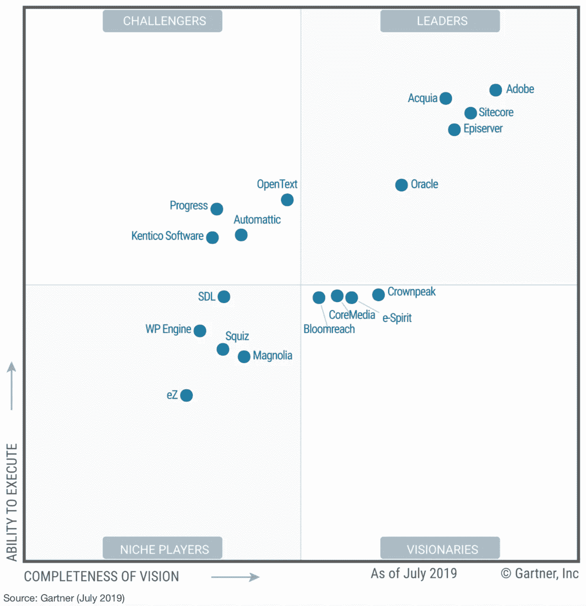
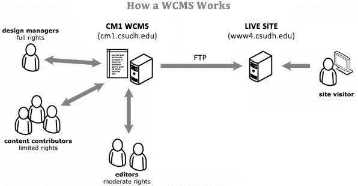
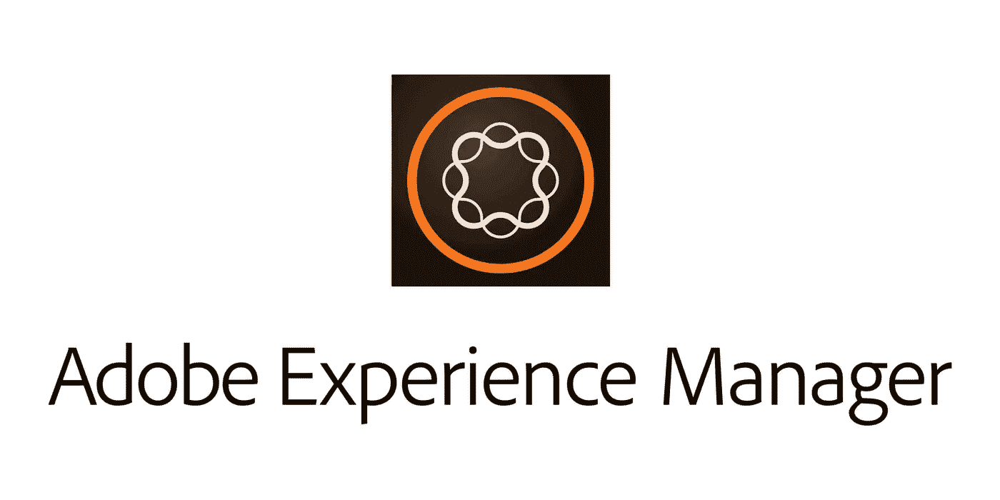
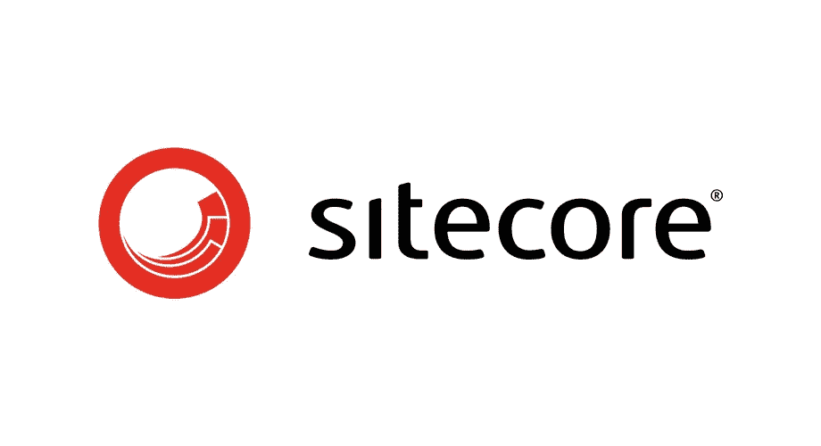

# Sitecore vs Adobe。Gartner 观点

> 原文：<https://medium.datadriveninvestor.com/sitecore-vs-adobe-gartner-opinion-b0f2675ab499?source=collection_archive---------5----------------------->

2019 年新的 Gartner 网络内容管理魔力象限最近已经发布。所有相同的玩家仍然在新的高德纳 WCM 报告的领导者象限中:Adobe 和 Sitecore。

截至 2019 年 11 月，互联网用户总数估计约为 52 亿人。所有这些都使用网络内容管理系统提供的信息。我们为您提供一个来自世界领先分析师的这一部分的状态的小型回顾。

网站内容管理系统(WCMS)是一个软件系统，提供网站创建、协作和适当的管理工具。WCMS 通常还包括相对简单的编程语言或标记，允许非专业人士创建网站并管理其内容。
网页内容管理系统仍然需要系统管理员和/或网页开发人员配置和添加必要的选项，但最重要的是，它是非技术人员的网站维护工具。
如果你愿意——你可以在[维基百科](https://en.wikipedia.org/wiki/Web_content_management_system)上了解更多关于这个系统的信息。

2019 年的 WCMS 市场仍然多元化且不断增长。负责应用程序、营销人员、数字体验专家和销售人员——他们今天都将 WCM 视为解决其关键任务的一种手段。
[Gartner](https://www.gartner.com/en) 对网络内容管理(WCM)的定义与维基百科所称的内容管理流程相同，即使用基于基本存储库的特定管理工具，通过许多数字渠道进行消费。
WCMS 可以作为商业产品、开源工具或主机服务交付。WCMS 产品的功能比简单的网络内容发布更广泛，包括:

*   内容创建功能，如模板、工作流和变更管理。
*   图书馆服务，如登记/注销、版本控制和安全。
*   向 Web 服务器提供预打包内容或点播内容的内容部署功能。
*   与 CRM、营销资源管理(MRM)、数字资产管理(DAM)和网络分析等相关技术的高度互操作性。
*   实时适应与访客的互动。
*   与交付层的良好集成，如电子商务和社交媒体门户软件。

**Adobe Experience Manager(AEM)**是 Adobe Systems Inc .旗下领先的内容和媒体管理系统，专为拥有大量内容的网站而设计。AEM 提供:

*   方便的在线内容编辑工具，使内容创建者易于创建
*   将页面和资源复制到单个 AEM 发布服务器，以便最终用户快速访问
*   API 与分析、标签管理、图像创建、营销活动等的集成。
*   基于您需求的可扩展性，Java 解决方案和开源堆栈

Gartner 承认 Adobe 拥有“巨大的市场动力”，但表示许多组织抱怨安装和集成 Adobe 产品的困难——甚至没有提到它们比其他 WCM 平台更高的成本。Adobe 仍然领先于“执行能力”轴。

几年来，Sitecore 一直被视为 Adobe Experience Manager 的有力竞争对手。Sitecore 的主要优势是:

*   一个跨渠道大规模管理个性化内容交付的平台
*   多站点和多语言内容管理系统(CMS)
*   所有客户交互数据的中央存储库
*   无头架构增强了一次性创建内容并在任何地方显示的能力
*   原生分析、测试、优化和机器学习能力

尽管客户满意度很高，但 Sitecore 面临着激烈的竞争，因为它不像 Adobe 那样提供那么多产品作为其营销云的一部分。营销人员也可能觉得 Sitecore 的功能不够全面。谈到领先的内容管理系统，Sitecore 和 Adobe Experience Manager 都是重要的参与者。事实上，正是这两个平台在 Gartner 最近的年度 Web 内容管理幻方图(WCM)中一直被定位为领导者。

从上面可以明显看出，这两个 CMS 有很多共同之处:如果定制得很好，它们都可以正确地执行，并为机构增加价值。然而，这些系统也有积极的区别，根据公司的要求和期望，这些区别可能变得至关重要。它们是个性化功能、从单一平台控制机器的能力和用户界面的友好性。
当我们的客户问我们何时优先应用 Sitecore 而不是 Adobe 内容管理软件时，我们通常建议搜索项目的首要需求。很明显，这些 CMS 不是初创公司和小型企业的首选，而中型和大型企业可能会找到这些答案。如果企业经营多样化的组织，他们可能会发现 Sitecore 是他们的一个合适的设备，同时，对于专注于内容共享的企业，Adobe Experience Manager 将会形成账单。

*最初发表于*[T5【https://geniusee.com】](https://geniusee.com/single-blog/sitecore-vs-adobe-gartner-opinion)*。*