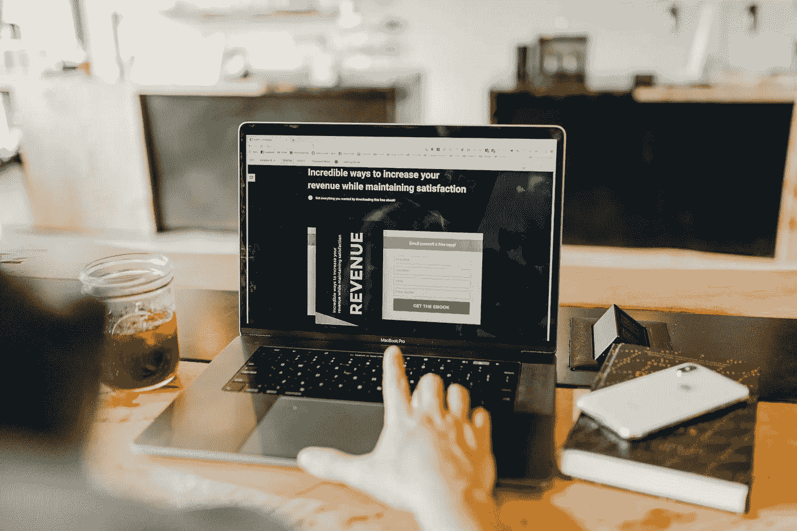
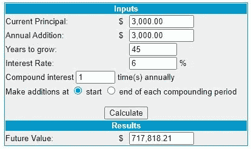
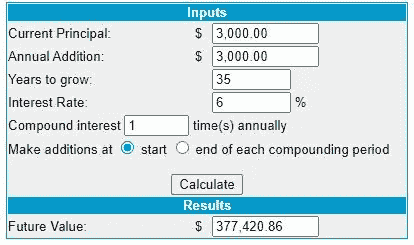

# 改变我生活的六项投资

> 原文：<https://medium.datadriveninvestor.com/six-investments-that-changed-my-life-b08c9594ad8?source=collection_archive---------2----------------------->

六项重要投资的货币和非货币收益

Photo by [Austin Distel](https://unsplash.com/@austindistel?utm_source=unsplash&utm_medium=referral&utm_content=creditCopyText) on [Unsplash](https://unsplash.com/s/photos/invest?utm_source=unsplash&utm_medium=referral&utm_content=creditCopyText)

> 根据 [Business Insider](https://www.businessinsider.com/millennials-waiting-to-invest-until-they-earn-more-mistake-2020-9#:~:text=In%20total%2C%2041%25%20of%20the,investing%20in%20any%20financial%20products.&text=But%20even%20across%20personal%20income,might%20be%20missing%20the%20point.) 和 Insider Intelligence 在 2020 年进行的调查，41%的千禧一代调查受访者(21 岁至 38 岁)目前没有投资任何金融产品。

老实说，直到成年以后，我才明白投资的价值。但是，回过头来看，有六种投资完全改变了我的生活。我希望我早点开始，但是开始任何好习惯都不晚。

以下是让我受益匪浅的六项投资，也许它们也会对你有所帮助。

# 1.投资退休账户

Photo by [Harli Marten](https://unsplash.com/@harlimarten?utm_source=unsplash&utm_medium=referral&utm_content=creditCopyText) on [Unsplash](https://unsplash.com/s/photos/retirement?utm_source=unsplash&utm_medium=referral&utm_content=creditCopyText)

尽管 T2 建议 60 多岁的美国人的退休储蓄是他们年薪的 8-10 倍，根据 T4 雅虎！64%的美国人没有为退休做准备。

得益于复利效应，尽早设立退休账户是我们退休时实现 10 倍工资储蓄目标的关键。

如果我们从 20 岁开始，在一年的 10 个月里每月储蓄 300 美元，假设平均市场收益为 6%，到我们 65 岁时，我们的银行账户上将有 717，818 美元。

[http://www.moneychimp.com/calculator/compound_interest_calculator.htm](http://www.moneychimp.com/calculator/compound_interest_calculator.htm)

然而，如果我们将开始投资的时间推迟 10 年到 30 岁，到我们 65 岁时，我们将只有一半的金额(377，420 美元)用于退休。

[http://www.moneychimp.com/calculator/compound_interest_calculator.htm](http://www.moneychimp.com/calculator/compound_interest_calculator.htm)

> 创造财富最有价值的因素是时间。

如果你不想工作一辈子，现在就开始一个退休账户是很重要的。

美国有不同类型的退休账户，如 401(K)，403(b)，个人退休帐户，罗斯个人退休帐户。

***IRA*** 代表为*【个人退休安排】*。对于退休储蓄来说，这是一种税收优惠的投资工具。

一些类型的个人退休帐户，如传统的个人退休帐户，是免税的。但是你要在 59.5 岁以后支取的时候交税(提前支取的话罚款)。其他类型的个人退休帐户，如罗斯个人退休帐户，是不可扣税的。罗斯个人退休帐户的供款(每年限 6000 美元)是税后资金，提取时无需缴税。

一些公司提供 401(K)匹配，这是一个很好的免费额外现金投资来源。其他机构提供政府养老金，这曾经是一笔不错的交易。但最近对全额养老金福利资格的更新引起了我的担忧。是的，老师的退休养老规则改了(也要看国家)。有了政府养老金，个人几乎被固定在工作岗位上一定的服务年限，以便从退休养老金中受益。有了养老金，工人们无法控制自己喜欢的退休年龄。因此，及早行动并开始个人退休安排(IRA)是很重要的，即使我们将从工作中获得养老金。

我的祖父母都提前退休了。我的祖母 40 多岁退休，我的祖父 50 多岁退休(他们申请提前退休并领取养老金，是的，这在我的祖国曾经是一笔很好的交易)。我完全是由祖父母抚养长大的。因为他们退休早，有精力有时间养我。感谢我的祖父母在我生命的前 8 年照顾我，我的母亲有机会在一个不同的城市追求她的事业。

当我母亲在经济上挣扎的时候，我祖父母的提前退休储蓄给了我一个快乐的童年。投资退休账户就是投资未来，把我们从办公桌前解放出来，让我们能够帮助和照顾家人。

# 2.投资教育

Photo by [Susan Yin](https://unsplash.com/@syinq?utm_source=unsplash&utm_medium=referral&utm_content=creditCopyText) on [Unsplash](https://unsplash.com/s/photos/education?utm_source=unsplash&utm_medium=referral&utm_content=creditCopyText)

美国的大学学费可能有点贵，但教育的价值是无价的。

教育不仅为我们提供了一个打开许多就业机会之门的学位，而且赋予我们在生活中获得成功的思想力量。

虽然我的博士学位并没有让我付出巨大的金钱代价，但它确实激励我研究更多成功、持续学习和自我发展的途径。攻读博士学位赋予了我批判性思维的能力，来挑战我读到、听到和看到的一切。作为一名移民，我读研期间的经历丰富了我的世界观，开阔了我的视野，并引导我在美国文化中导航。

事实是，你甚至不需要正式入学接受教育。有大量免费的在线视频和订阅课程教你一切，从计算机编码和数据科学等技术技能到摄影和摄像等创造性技能。

如果我没有投资教育，我的生活会完全不同。如果没有我的教育，我就不会找到现在的工作，写下这个故事，或者学会如何为我的 YouTube 频道编辑视频。即使是在大学里，我也可以在餐馆打工赚 8 美元/小时，而不是辅导孩子做作业赚 20 美元/小时。

教育是我们时间和金钱的一大投资。可能没有投资房子刺激。**但投资自己是一种能产生最高回报的人力资本** ( [见《人力资本理论和文化资本理论在社会分层中的操作价值》](https://journals.sagepub.com/doi/full/10.1177/2047173416629510))。

投资教育不一定意味着大学的传统学术轨道。相反，学习一项使人难以被取代的技能更重要；而持续的终身学习更有益。

你永远不知道明天会出现什么机会，今天就做好准备吧！

# 3.投资健身房会员和健身器材

Photo by [Jonathan Borba](https://unsplash.com/@jonathanborba?utm_source=unsplash&utm_medium=referral&utm_content=creditCopyText) on [Unsplash](https://unsplash.com/s/photos/gym?utm_source=unsplash&utm_medium=referral&utm_content=creditCopyText)

在许多国家，医疗费用高得惊人，尤其是在美国。

我们再也不能生病了。当我们生病时，我们不仅要支付高价的医药费，我们还得不到雇主因病假而给予的补偿。

如果说我从疫情身上学到了什么，那就是我不能生病。

大多数公司只提供一周的带薪病假。保险不会 100%赔偿我们的医疗费用。任何重大疾病都可能在瞬间摧毁一个家庭。

相反，我们可以通过尽早投资健康来采取预防措施。

> 锻炼改变了我的生活。

我生来就有免疫缺陷和自身免疫性疾病。我生命中的前 9 年是一个生病的孩子。

从 10 岁开始，我决定和妈妈一起骑车 40 分钟去学校。我们太穷了，无法乘坐任何其他交通工具，我变得太重，无法坐在妈妈自行车的后座上。

令人惊讶的是，那一年我并没有经常生病。相反，我的实验室结果显示我的白细胞有所改善。医生也很震惊。他问我是否为我的病情采取了任何家庭疗法，这可能对其他病人也有好处。

**我唯一的改变是每天骑 80 分钟自行车。**

就这么简单。当我祖父与癌症抗争时，锻炼帮助他度过了化疗期。锻炼让我变得更强壮、更健康，不再缺课那么多天。正是这个习惯的改变赋予了我生活的所有其他方面。

投资健身房会员和一些家庭健身设备可能不会立即带来金钱收益，但它会给我们的生活带来长期的好处。

# 4.不分红的优质股票

Photo by [Chris Liverani](https://unsplash.com/@chrisliverani?utm_source=unsplash&utm_medium=referral&utm_content=creditCopyText) on [Unsplash](https://unsplash.com/s/photos/stocks?utm_source=unsplash&utm_medium=referral&utm_content=creditCopyText)

投资股票市场可能有风险。股市生活与我们的日常生活没有什么不同——你永远不知道下一块巧克力是什么味道。虽然我们可以根据一家公司过去一年的数据预测其业绩，但我们根本无法预见世界疫情的出现。

拥有多样化的投资组合可以减轻股票市场的不确定性。这个比喻很简单。如果你有十个孩子，其中一个成功的可能性比只有一个孩子高。

许多公司向投资者支付股息。当你从一家公司购买股票时，你拥有该公司的一小部分股份。有些公司在获利时会定期分红。这些分红的股份公司通常是历史悠久的，而公司成长相对较小和缓慢。

我母亲喜欢购买分红股票，她靠分红生活。这些股票大多相当稳定。作为一个 65 岁的单身母亲，分红股票为她的退休生活提供了稳定性。

然而，当一家公司选择将利润分配给股东，而不是投资回企业本身时，股票的增长是非常缓慢的，如果有的话。

30 多岁， ***我拥有的最宝贵的东西就是时间。***

我承担得起风险。因为如果我失败了，我有时间把钱赚回来。

我可以等待一家公司成长，在它的起起落落中适应和参与市场竞争。

我会从高质量的公司中挑选股票，在投资前回顾他们过去的数据和表现，并长期持有这些股票，不管市场的涨跌。

当然，不同的投资人可能有不同的目标和策略，比如我妈。以上只是我对个人理财目标的个人看法。我确信我的策略会随着我未来财务状况的改变而改变。

# 5.房地产:买入并持有

Photo by [Harmen Jelle van Mourik](https://unsplash.com/@jelleharmen?utm_source=unsplash&utm_medium=referral&utm_content=creditCopyText) on [Unsplash](https://unsplash.com/s/photos/real-estate?utm_source=unsplash&utm_medium=referral&utm_content=creditCopyText)

由于维护成本，房地产可能会成为一种负债，但它也可能是我做过的最好的投资。

虽然由于前期需要大量资金和现金流的权衡，我对房地产投资非常谨慎，但一个个人故事确实改变了我的观点。

大约 17 年前，在无家可归一段时间后，依靠一个又一个亲戚，在雇主的帮助下，我妈终于在北京买了她的第一套公寓。

当时，北京的一居室公寓价值 8 万美元。这是一个相对高端的社区中最小的单元。我妈妈想在一个更偏远的地方买一些更大的东西，但我坚持要那个特别的地方，因为它离我去的中学很近。

16 年后，一所崭新的小学，一个豪华的购物中心，一个地铁站，以及其他基础设施都由这个街区建造起来。随着城市发展和市场膨胀，同样一套 8 万美元的公寓卖到了 130 万美元！

这个故事可能有点极端，可能不会发生在其他城市或国家。但是，投资一个出租物业并出租以支付其成本(即财产税和维护)，在一定数量的年后，这个物业可能会成为一个宝石。

购买房产需要支付很多费用。这种类型的投资完全没有必要操之过急。在购买任何大宗商品之前，先咨询一下当地的专家。

# 6.为上面列出的投资雇佣专业人员

Photo by [Ben Rosett](https://unsplash.com/@spiritvisionstudios?utm_source=unsplash&utm_medium=referral&utm_content=creditCopyText) on [Unsplash](https://unsplash.com/s/photos/professional?utm_source=unsplash&utm_medium=referral&utm_content=creditCopyText)

我最有价值的投资之一是为上面列出的投资聘请专业人士。

我花了一段时间来理解不同个人退休帐户的利弊，但它们只是第一步。

我应该如何让我的现金为我工作？我应该投资什么，债券还是股票？我该挑哪些股票？

有哪些风险相对较低但成长潜力大的公司？如何分散我的投资组合？

我应该购买什么财产？如何与买方或卖方谈判？我应该进行哪些检查？

当做出重大决策时，最好根据数据、研究和经验来做。聘请专业人士来回答这些问题本身可能是一项投资，但它可以防止错误，并为我们提供最多的信息来做出最佳决策。我们可以从错误中吸取教训，但也有我们不能犯的错误。向专业人士咨询税务、金融和法律服务对于防止我们生活中的致命错误至关重要。

Photo by [Dariusz Sankowski](https://unsplash.com/@dariuszsankowski?utm_source=unsplash&utm_medium=referral&utm_content=creditCopyText) on [Unsplash](https://unsplash.com/s/photos/notebook%5C?utm_source=unsplash&utm_medium=referral&utm_content=creditCopyText)

新的一年你的投资计划是什么？在评论中分享你的见解吧！

谢谢你阅读我的观点。

**进入专家视角—** [**订阅 DDI 英特尔**](https://datadriveninvestor.com/ddi-intel)