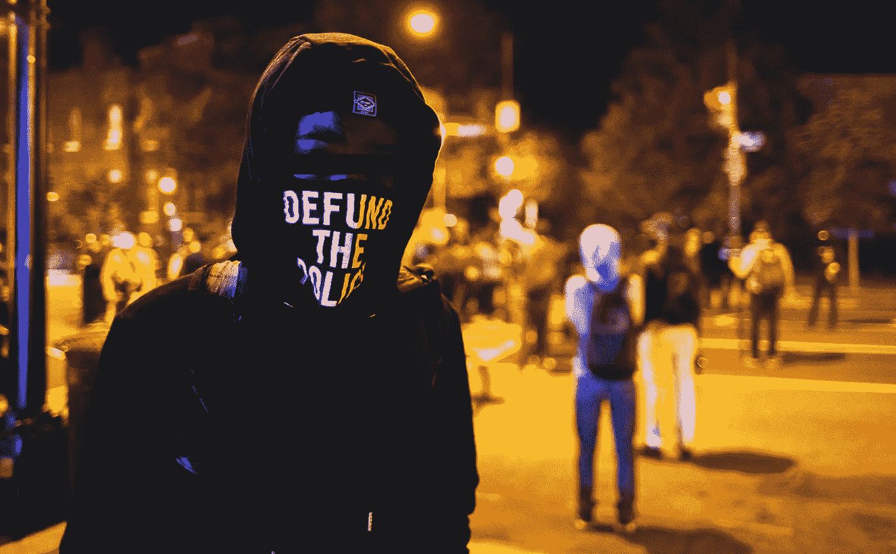
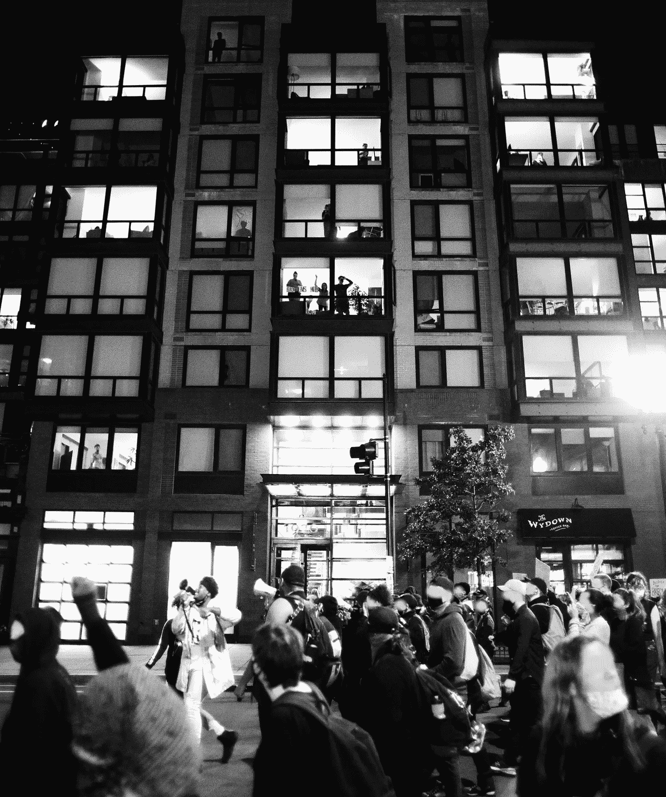
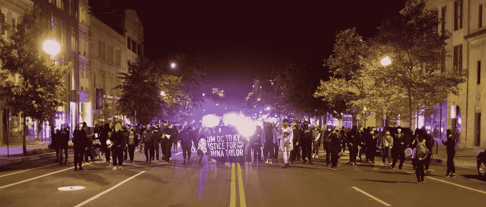
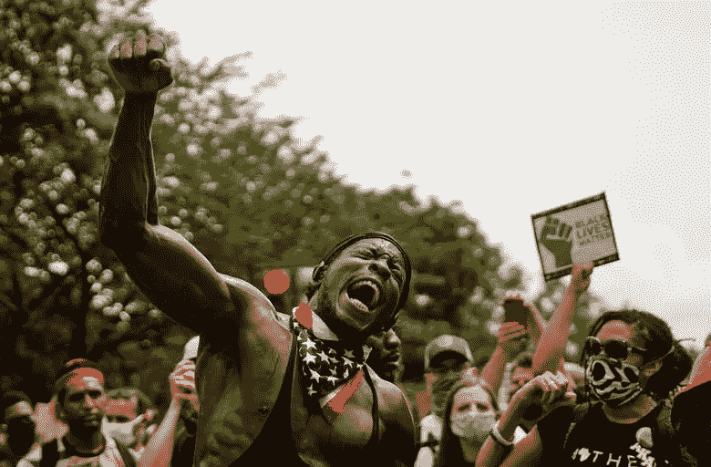

# 我拒绝停止抗议的六个理由

> 原文：<https://medium.datadriveninvestor.com/six-reasons-i-will-never-stop-protesting-cfaa9c5f06bb?source=collection_archive---------6----------------------->

## 一个毫无歉意的 DC 黑人抗议者

“Defund the Police”. Twitter/@JohnnySilverclo

我写这封信是因为我在等待对谋杀布莉娜·泰勒的凶手提起公诉的决定。我已经知道司法部长丹尼尔·卡梅伦不会。这意味着这座城市，华盛顿州 DC 市，今晚将与路易斯维尔市团结一致。

很好。

我知道对某些人来说可能会很可怕。我知道，我的战友、盟友和我很可能要忍受很多。我知道，随着我们继续前进，我们的安全和自由面临的风险也在不断增加。我知道整个国家都在关注着，大部分人都在担心我们会做什么。

但是很好。

我为国家的焦虑感到抱歉。但我更为 Breonna 的家人和我深爱的整个黑人民族感到悲伤，因为这个国家又一次背弃了我们。

直到解放，我都不会停止抗议。

我不应该解释我自己。但这是为什么:

**1。因为黑人命*他妈的*要紧。有些人仍然不明白。**

美国，我们试图教育你。我们试图进行讨论，并赢得你的尊重。我们通过非暴力展示了同情心。我们已经描述了我们所需要的，并阐明了我们的要求。我们向你展示了我们的力量，希望你最终能认识到我们的基本人性。

但是布里奥纳·泰勒和许多其他人被一个国家支持的恐怖组织残忍地杀害了，这个恐怖组织是建立在迫害没有特权的人的基础上的。你不承认她的死是一种犯罪。

黑人的生命对你们来说还是无关紧要的。

我们只剩下灼热的流血证词来说服你。

Spectators, looking onto the streets from their homes. Twitter/@JohnnySilverclo

**2。因为未来是我的责任。**

对于盟友，尤其是自由派白人盟友，由于这一关键的历史时刻，未来现在是我们所有人的责任。

事情正在发生变化。这是无法阻止的，也是无法反驳的。但是，我们最终是走向法西斯主义，还是走向一个相信全人类的社会，完全取决于我们共同做出的决定。

不要保持沉默。不要看别处。不要再让我们失望了。

我抗议，因为我知道我们都必须积极进化发生。我们都必须把我们的心放在这条线上，齐心协力去推动这个破碎的系统哪怕是一英寸。我们不能停下来。因为未来属于我们。我不能忍受这样的生活。

**3。因为我们，这个勇敢的为种族正义而战的集体，是我们自己的一个四面楚歌的群体。**

我们明白我们唯一能信任的保护我们的人是彼此。

“我们保证我们的安全”

这是我们运动的口号。自从 DC 爆发抗议活动以来，我遇到了如此多热情、勇敢、美丽的人。在我的一生中，他们比其他任何东西都更能激励我。

我们是*可能成为*的社区的一个例子。

我们是来自不同背景的个体的集合。在此之前我们并不认识，绝大多数我现在仍然不知道。

但是我从来没有加入过一个由富有同情心的人组成的更加善良和忠诚的文化。他们给了我希望，这是我在这个国家从未见过的。我必须继续保护他们，就像他们保护我一样。

**4。因为对我来说，这是一场*战争*。**

我知道太多的人，这个系统已经采取了任何人告诉我，否则。

但这不是一场金钱、石油或政治权力的战争。这是为了我和我未来的孩子在这里生存的权利而战。

这不是一场致命武器的战争(到目前为止)，而是正义观念和美国无知之间的较量。为了捍卫人类的生命，我们用我们的身体和革命思想无畏地战斗。

我的痛苦、愤怒和强烈的黑人决心的见证通过我的声音和在前线的存在得到了证明。这在我与朋友和同事的争论中显而易见。它与警察发生冲突，扰乱了中产阶级的安宁。它大声而愤怒，迫使[无知的人去关注](https://medium.com/@newtonabby36/i-am-a-modern-black-revolutionary-and-i-am-good-trouble-7d910b355580)。

这场战争取决于美国人民愿意看到、相信和承诺什么。

我们的敌人知道这一点，并不断试图破坏我们持续行动的真相。总统和他的支持者撒谎并歪曲我们，以报复我们对白人霸权的攻击。

Justice for Breonna Taylor, Washington D.C. Twitter/@JohnnySilverclo

然而，我们用诚实、激进、流血的表情回击——这是我们对付持枪敌人的全部手段。

敌人不仅能够残酷地对待我们，而且他们得到了报酬和鼓励。我已经看到并感受到了这一点。我下定决心反击。

我从小就喜欢回击恶霸。在我来的地方，你必须反击。

但是，由于这场运动是建立在同情的基础上，而不是甜蜜的黑色报复的前景，幸运的是，身体暴力不是我们报复的方式。

我们通过抗议来发动这场战争——通过大声说出我们的证词，让你们听到我们的声音。

**5。因为我从来不觉得美国白人社会能给我提供什么。**

不管我愿不愿意，美国是我的家。我在这里出生，在这里长大，我爱的人都在这里。

但是黑人为这个国家建立的贪婪、消费主义和自私的帝国对我来说从来都不是很有吸引力。

然而更重要的是…

Eric Thayer/ Reuters

当我看着我的社区在我眼前被扼杀时，我怎么可能享受美国的繁荣？

当我周围的人不断遭受痛苦时，我怎么能在这个社会中找到自己的位置呢？

对于那些将痛苦归咎于他们所忍受的事情的人，那些否认系统性种族主义存在并对白人资本主义制度造成的几代人的贫困视而不见的人，请诚实地问问自己，为什么同情不是对你的自然反应。

除非长久以来支撑着黑人社区和其他有色人种社区的同情和爱在每个人的心中得到发展，否则我认为这个社会不会给我提供什么。

所以我愿意为这个事业做出牺牲。

一切。直到解放。

**6。因为我厌倦了悲剧。**

***安息力量:***

*   布雷翁娜·泰勒
*   乔治·弗洛伊德
*   迪昂·凯
*   托音萨劳
*   桑德拉·布兰德
*   艾哈迈德·奥贝里
*   特雷冯·马丁
*   迈克·布朗
*   塔米尔大米
*   菲兰多卡斯蒂利亚
*   弗雷迪·格雷
*   埃里克·加纳
*   沃尔特·斯科特
*   奥尔顿·斯特林
*   约翰·克劳福德三世
*   埃泽尔·福特
*   但丁·帕克
*   斯蒂芬·克拉克
*   第戎基泽
*   迈克尔·安东尼·哈里斯
*   朱利叶斯·佩耶·凯伊
*   达米安·拉马尔·丹尼尔
*   特雷福德·佩勒林
*   哈萨尼贝斯特
*   阿德里安·杰森·罗伯茨
*   安东尼·麦克莱恩
*   肯德雷尔·安特伦·沃特金斯
*   拉斐尔·杰冯·明尼菲尔德
*   乔纳森·杰斐逊
*   萨拉提斯·梅尔文
*   朱利安·爱德华·罗斯福·刘易斯
*   阿米尔·约翰逊
*   阿什顿·布鲁萨德
*   达林·沃克
*   温斯顿·约瑟夫·拉图尔三世
*   大卫·厄尔·布鲁克斯
*   杰里米·南方
*   文森特·哈里斯
*   达柳斯·华盛顿
*   马尔科姆·科莫
*   安特万·布里斯
*   文森特·德马里奥·特鲁特
*   卡纳维斯杜鹃玻璃
*   哈基姆·利特尔顿
*   理查德·刘易斯价格
*   埃罗尔·约翰逊
*   马利克·坎迪
*   约瑟夫·丹顿
*   威廉·韦德·伯吉斯三世
*   凯旺·鲁芬
*   Ky Johnson
*   金鲁贤·拉鲁·基顿
*   拉希德·马修·穆尔曼
*   罗伯特·德隆·哈里斯
*   斯凯勒·扬
*   泰伦·贾马尔·布恩
*   布兰登·加德纳
*   唐纳德·沃德
*   凯恩·范佩尔
*   雷夏德·布鲁克斯
*   迈克尔·托马斯
*   菲利普·杰克逊
*   小刘易斯·鲁芬
*   卡马尔鲜花
*   马利克·泰全·格雷夫斯
*   大卫·麦卡蒂
*   德里克·汤普森
*   莫莫杜·拉明·西赛
*   特雷尔·米切尔
*   贾维斯·沙利文
*   鲁本·史密斯三世
*   莫德斯托·马雷罗·德斯托·雷耶斯
*   托尼·麦克达德
*   乔治·弗洛伊德
*   迪翁·约翰逊
*   莫里斯·戈登
*   老威利·李·夸尔斯
*   特里·卡维尔
*   小威廉·约翰逊
*   托比·拉龙·威金斯
*   小罗伯特·约翰逊
*   兰迪·罗塞尔·刘易斯
*   雷夏德标度
*   大卫·泰勒克·阿特金森
*   亚辛·穆罕默德
*   阿德里安·梅德里斯
*   麦克黑尔·罗斯
*   菲南·贝尔赫
*   德雷斯乔恩“肖恩·达东”里德
*   卡冯·韦布
*   贾西恩·兰迪·霍奇
*   德蒙特·布鲁纳
*   乔奎恩说
*   威廉·拉蒙特·德博斯
*   布伦特·安德鲁·马丁
*   马尔科姆“牛奶”泽维尔·雷·威廉姆斯
*   肖恩·李·富尔
*   乔纳斯·约瑟夫
*   开尔文·肖
*   埃尔默·麦克
*   约书亚·约翰逊
*   蔡斯·罗莎
*   维尔吉尔·索普
*   乔尔·阿塞维多
*   史蒂文·德马科·泰勒
*   吴镇男·鲍尔
*   贾斯曼·华盛顿
*   戈尔迪·贝林格
*   李宗盛·亚当斯
*   卡尼莎·内科尔·富勒
*   德斯蒙德·富兰克林
*   约书亚·达里安德烈·鲁芬
*   杜恩·柯蒂斯·拉丰
*   伊德里斯·阿卜杜勒·萨拉姆
*   小汤米·戴尔·麦克格劳滕。
*   内森·霍奇
*   伊顿·坦齐莫尔
*   泰里尔·雷克斯·芬奇
*   丹尼尔·普鲁登
*   卡马尔·科比·爱德华兹
*   阿尔文·拉蒙特·鲍姆二世
*   迈克尔·约翰逊
*   哈罗德·斯潘塞
*   勒巴伦·巴拉德
*   威廉·迪翁·托尔伯特·辛普金斯
*   达尔文“达林”巴内尔·福伊
*   老达雷尔·威廉·莫布里
*   布雷翁娜·泰勒
*   唐尼·桑德斯
*   小扎克里·安德森。
*   巴里·格迪斯
*   泰勒·琼斯
*   伊莱贾·贾马尔·布鲁尔
*   德万·奥斯汀·特维利
*   曼努埃尔·埃利斯
*   安东尼·泰勒
*   德斯蒙德·海斯
*   贾斯汀·李·斯塔克豪斯
*   肯尼斯·拉尼尔·萨辛顿
*   马修·费利克斯
*   约瑟夫·朱厄尔三世
*   凯文·奥尔德菲
*   鲍比·乔·吉布斯
*   杰里米·格雷森
*   多米尼克·安特文·安德森
*   马克·多米尼克·尼尔
*   阿尔文·科尔
*   龙内尔·穆松
*   小伦纳德·查尔斯·帕克。
*   阿卜迪拉赫曼沙拉
*   基思·杜特里·柯林斯
*   杰昆·奥尼尔之光
*   小威廉·霍华德·格林
*   德奥维恩·塞马伊·帕金斯
*   约书亚·詹姆斯·布朗
*   戈登侯爵
*   迪安卓·李·西伯勒-帕特森
*   安德鲁·士麦那
*   迈克尔·里维拉
*   雷金纳德·莱昂·波士顿二世。
*   大流士·塔弗
*   加梅尔·安东尼奥·布朗
*   凯文·怀特
*   塞缪尔·大卫·马拉德
*   穆巴拉克·苏莱马内
*   勒纳尔·安东尼奥·丹尼尔斯
*   利雅博·休斯
*   基南·麦凯恩
*   亨利·艾萨克·琼斯
*   瑞安·西姆斯
*   厄尔·费西
*   克劳德·华盛顿·费恩三世
*   米西亚·李
*   夸梅·琼斯
*   布兰登·迪翁特·罗伯茨
*   蒂娜·玛丽·戴维斯
*   泰瑞·戴维斯
*   贾马里·戴文·塔弗
*   还有更多的…

[https://www . CBS news . com/news/say-their-names-list-people-injury-killed-police-officer-incidents/](https://www.cbsnews.com/news/say-their-names-list-people-injured-killed-police-officer-involved-incidents/)

[https://www . Washington post . com/investigations/a-打-高调-致命-遭遇-镀锌-抗议-全国/2020/06/08/4 fdb fc9 c-a72f-11ea-b473-04905 B1 af 82 b _ story . html](https://www.washingtonpost.com/investigations/a-dozen-high-profile-fatal-encounters-that-have-galvanized-protests-nationwide/2020/06/08/4fdbfc9c-a72f-11ea-b473-04905b1af82b_story.html)