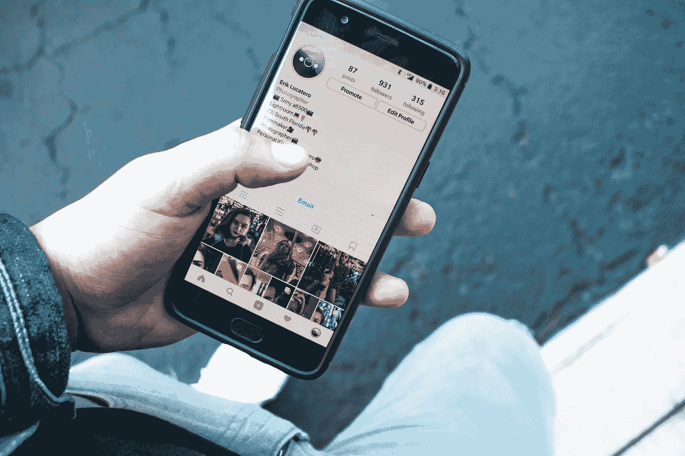

# 人们在社交媒体上发帖的六个原因

> 原文：<https://medium.datadriveninvestor.com/six-reasons-people-post-on-social-media-a3309dd3501f?source=collection_archive---------2----------------------->

## 真正重要的原因只有三个

Photo by [ROBIN WORRALL](https://unsplash.com/@robin_rednine?utm_source=unsplash&utm_medium=referral&utm_content=creditCopyText) on [Unsplash](https://unsplash.com/?utm_source=unsplash&utm_medium=referral&utm_content=creditCopyText)

自 2013 年以来，我一直在积极使用社交媒体，在这段时间里，我了解到人们在这些平台上发布内容有六个主要原因。

其中，三个原因会对你有所帮助(尤其是作为一个创作者)；另外三个会以非生产性的方式消耗你的时间和精力。

## 在社交媒体上发帖的三个有用理由

Photo by [Erik Lucatero](https://unsplash.com/@erik_lucatero?utm_source=unsplash&utm_medium=referral&utm_content=creditCopyText) on [Unsplash](https://unsplash.com/?utm_source=unsplash&utm_medium=referral&utm_content=creditCopyText)

## 告知

作为一名创作者，当你想让你的观众知道你正在制作的东西，这将有助于他们的旅程，你可以在网上“通知”他们。

这可能是你正在销售的产品，你正在开办的课程，或者你正在提供的辅导课程。记住要确保不是每个帖子本质上都是销售导向的。社交媒体是为了舒适的思想交流。

## 去激励

当你发布的内容帮助人们从不同的角度思考他们做事的方式时。

例如，你是否发现你自己或你的观众在网上花了太多时间？一篇关于这个话题的好的社交媒体文章，以及帮助他们应对这一挑战的技巧，将有助于他们更加意识到这一习惯。

## 教育

如果你是一个分享相关和有用信息的创造者——更好的营养/健康/健身/社交媒体提示/商业提示等——你使用这个平台是为了一个积极的目的。

社交媒体是一种很好的(免费的)接触现有和未来受众的方式。然而，大多数内容创作者忘记了社交媒体的巨大潜力，而是遵循以下三个选项。

这些是你对社交媒体感到沮丧，并试图停止与人交往，并通过漫长的社交媒体排毒来重置你的想法的原因。

## 三个原因会让你在网上分心

Photo by [Markus Winkler](https://unsplash.com/@markuswinkler?utm_source=unsplash&utm_medium=referral&utm_content=creditCopyText) on [Unsplash](https://unsplash.com/s/photos/angry-online?utm_source=unsplash&utm_medium=referral&utm_content=creditCopyText)

## 发泄

我们很多人都这样做过。想发泄你所有的愤怒吗？发帖指责你的处境。更糟？把自己的现状归咎于某个人/某个品牌。

你为什么这么做？因为把它从你的系统中释放出来感觉很好

事实是，这并不能解决实际问题。当你花费宝贵的时间和精力在网上发泄或咆哮时，你总是在等待人们对这些挫折做出反应。

 [## 社交媒体和通过赞助受欢迎度超过可信度的秘密审查|数据驱动的投资者

### “喜欢”按钮，如选项、鼓掌、关注或推荐按钮，是社交网络平台、互联网…

www.datadriveninvestor.com](https://www.datadriveninvestor.com/2020/11/19/social-media-and-covert-censorship-by-sponsoring-popularity-over-credibility/) 

每一点点的认可都让你觉得*被听到了。*遗憾的是，这对你作为创作者没有任何帮助:你在验证上浪费时间，而不是与你的观众和你关心的人真诚地交流。

## 参加比赛

当你发布内容试图与“商业对手”竞争时，很明显你来自一个负面能量的空间。大家看到帖子就知道这个了。

想象一下这个:

a)你的产品/服务与你所在领域的其他产品/服务相似。

b)你在社交媒体上发布帖子，兜售你的产品的好处

c)但是你*也*强调它如何优于你竞争对手的产品

最糟糕的是，这完全违背了你的初衷，人们在购买你的产品之前会三思而行。如果你停在(B)点，你实际上会得到销售额。

但是(C)是你的毁灭。你忙着否定别人的努力工作，以至于经常回头张望。这样的关系健康吗？你希望你的客户带着你公开贬低他人及其产品的信息来找你吗？

克制这种做法。它可能在短期内对你有所帮助，但从长远来看，同情心、同理心和质量将帮助你更好地销售你的作品，并为你的服务建立一个非常忠诚的观众。

## 娱乐

Twitter 上 24 小时的 Instagram 故事/车队——这些都被称为社交媒体世界的快餐。消失的内容没有长期价值。

同样，这让你*感觉良好*，但并不能真正帮助你的长期发展。

你应该停止做后者吗？不，我是*不是*这么说的。我只是说，记下它如何/是否有助于你的总体目标。

如果你仔细注意你的社交媒体方法，你会意识到最后三个原因往往会给你 FOMO，让你有压力。

当我们停留在与他人竞争、在网上比较我们的价值和吸引人们的注意力的空间时，我们对社交媒体的态度非常悲观。

问问你自己为什么在社交媒体上，下次上网时你需要发布什么样的内容。

专注于前三个选项，告诉我当你遵循那个模式时，你是否注意到明显的不同。

(*剧透预警:我知道你会*):)

## 访问专家视图— [订阅 DDI 英特尔](https://datadriveninvestor.com/ddi-intel)