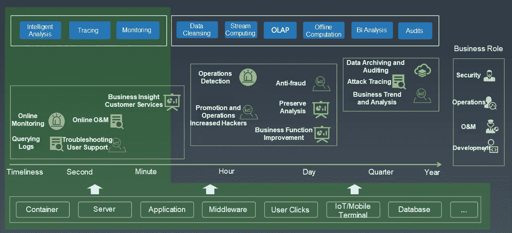
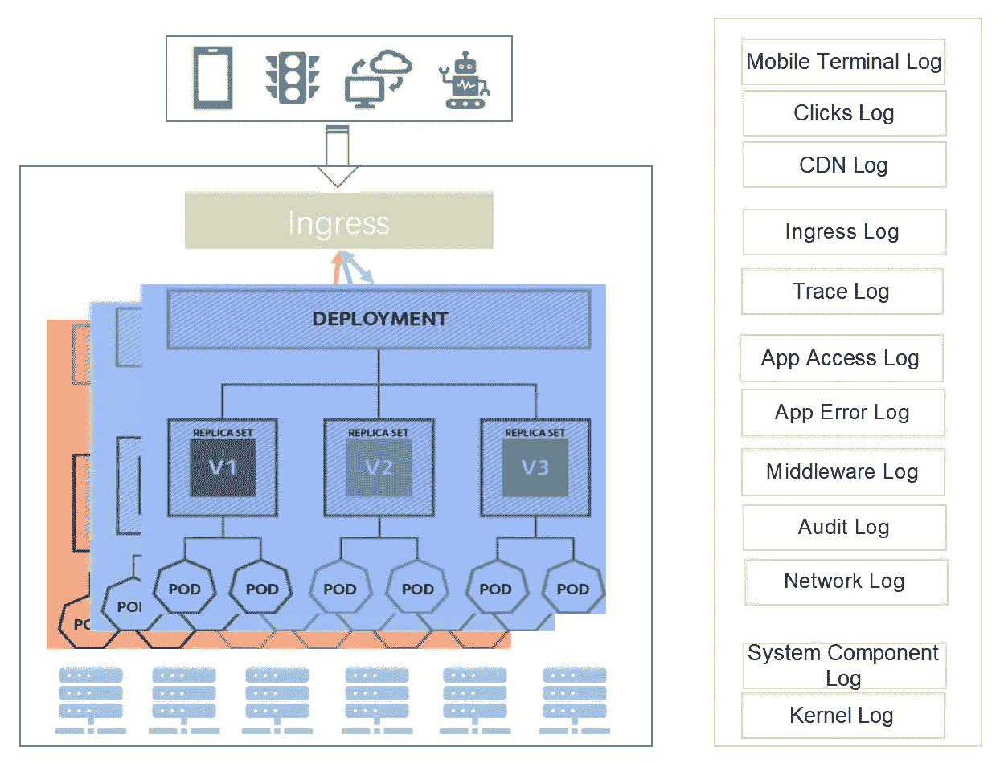

# 构建 Kubernetes 日志系统时的六个典型问题

> 原文：<https://medium.datadriveninvestor.com/six-typical-issues-when-constructing-a-kubernetes-log-system-e1108a01f629?source=collection_archive---------6----------------------->

*阿里云 Logtail 负责人张诚(袁遗)*

在过去的一年里，越来越多的用户寻求咨询如何为 [Kubernetes](https://www.alibabacloud.com/product/kubernetes?spm=a2c41.13869699.0.0) 建立一个日志系统，或者如何在整个过程中解决问题。因此，下面这篇文章描述了我们多年来构建日志系统的经验，希望能给你一条为 Kubernetes 成功构建一个[日志系统](https://www.alibabacloud.com/product/log-service?spm=a2c41.13869699.0.0)的捷径。本文是关注我们的实践和经验的系列文章之一。随着相关技术的发展，内容会不断更新。

# 前言

2016 年，Kubernetes 仍然与 Docker Swarm 和 Apache Mesos 三足鼎立。最后，Kubernetes 凭借一系列优势获得了主导地位，比如高可伸缩性、声明式 API 和云友好。

作为[云原生计算基金会(CNCF)](https://www.cncf.io/?spm=a2c41.13869699.0.0) 的唯一核心项目，Kubernetes 是云原生实现的基础。目前，阿里巴巴已经开始了基于 Kubernetes 的云原生转型。阿里巴巴的所有业务将在一到两年内迁移到公有云。

 [## 信息图:云之旅|数据驱动的投资者

### 聪明的企业领导者了解利用云的价值。随着数据存储需求的增长，他们已经…

www.datadriveninvestor.com](https://www.datadriveninvestor.com/2018/09/22/infographic-journey-to-the-clouds/) 

在 CNCF，Cloud-native 通过公有云、私有云、混合云中的容器、服务网格、微服务、可执行基础设施、声明式 API，构建并运行具有高容错性、易管理性、可观察性、松耦合的弹性可扩展应用系统。可观测性对于应用系统是至关重要的。值得注意的是，云原生设计概念之一是可诊断性设计，它涉及集群级日志、指标和跟踪。

# 为什么需要日志系统？

查找在线问题的一般流程如下:

根据指标检测问题，使用跟踪系统定位有问题的模块，并根据模块日志查明问题的原因。日志包含错误、关键变量和代码运行路线等信息，这些信息是故障排除的核心要素。因此，日志对于在线解决问题是必要的。

在过去的十年里，阿里巴巴的日志系统随着计算形式的发展而发展。这一演变可以分为三个阶段:

# 第一阶段

在单机时代，几乎所有的应用都部署在单机系统中。随着服务压力的增加，用户只能转向规格更高的 IBM 微型计算机。作为应用系统的一部分，日志服务主要用于程序调试。通常，使用常见的 Linux 文本命令(如 grep)来分析日志。

# 第二阶段

由于单机系统成为阿里云业务发展的瓶颈，Apsara 5K 项目于 2013 年正式启动，进行实质性的规模扩张。在这个阶段，已经实现了向分布式业务的转换，实现了从本地服务调用到分布式服务调用的转变。为了更好地管理、调试和分析分布式应用程序，我们开发了 trace(分布式链路跟踪)系统和各种监控系统。这些系统的一个共同点是它们以集中的方式存储所有的日志，包括指标。

# 第 3 阶段

近年来，为了支持更快的开发和升级，我们进行了基于容器的转型，并开始拥抱 Kubernetes 生态系统，将所有业务迁移到云，并进行无服务器实践。在这个阶段，日志在规模和类别上都呈爆炸式增长，对日志的数字化和智能化分析的需求也在增加。结果是一个统一的日志平台。

# 可观测性的解释

在 CNCF，可观察性被用来诊断问题。在企业级，可观察性不仅涉及开发，还涉及业务、运营、商业智能(BI)、审计和安全。可观察性的最终目标是实现企业各方面的数字化和智能化。

在阿里巴巴，几乎所有的业务角色都使用各种类型的日志数据。为了支持不同的应用场景，我们开发了许多工具和功能，如实时日志分析、跟踪分析、监控、数据操作、流计算、离线计算、BI 系统和审计系统。日志系统连接到各种流计算和离线系统。它侧重于实时数据收集、清理、智能分析和监控。

# Kubernetes 测井系统的施工挑战

简单日志系统有很多成熟的解决方案，我们不详细描述。相反，本文只关注 Kubernetes 中日志系统的构建。Kubernetes 的日志系统解决方案与物理机和虚拟机的解决方案有很大不同。

# 挑战 1

日志的形式更加复杂，不仅包括来自物理和虚拟机的日志，还包括标准容器输出、容器中的文件、容器事件和 Kubernetes 事件。

# 挑战 2

另一方面，环境变得更加动态。在 Kubernetes 中，设备可能停机、离线、在线、向外扩展或向内扩展。豆荚可能会被摧毁。在这种情况下，日志是暂时的。例如，一个 pod 的日志在 pod 被破坏后就没有了)。因此，必须在服务器上实时收集和记录日志数据。此外，日志收集必须能够适应这种高度动态的场景。

# 挑战 3

还有更多类型的日志。典型的 Kubernetes 架构，其中来自客户端的请求需要经过多个组件，如 CDN、入口、服务网格和 pod。这涉及各种类型的基础设施和其他类型的日志，如 Kubernetes 系统组件日志、审计日志、服务网格日志和入口日志。

# 挑战 4

业务架构发生了变化。更多的公司正在 Kubernetes 中实现微服务架构。在微服务系统中，服务和底层产品之间的依赖性越来越强，使得服务开发和故障排除变得更加复杂。因此，很难将不同维度的日志关联起来。

# 挑战 5

很难集成日志解决方案。一般来说，我们在 Kubernetes 建立一个 CICD 系统。这个 CICD 系统需要尽可能地自动集成和部署业务。此外，日志收集、存储和清理必须以 Kubernetes 使用的声明式部署模式集成到这个系统中。然而，现有的日志系统在大多数情况下都是独立的系统，将它们集成到 CICD 系统中成本很高。

# 挑战 6

日志的数量会增加。一般来说，我们在系统的早期阶段使用本地开源日志系统。这种方法在测试和验证期间，或者在公司的早期阶段是可行的。然而，随着业务的增长和日志量增加到一定规模，本地开源系统会遇到各种问题，如租户隔离、查询延迟、数据可靠性和系统可用性。尽管日志系统不是最关键的 IT 部门，但在关键时刻发生的问题可能会导致灾难性的后果。

例如，如果在重大促销期间发生紧急情况，故障排除工程师的并发查询可能会淹没日志系统，导致故障恢复缓慢并影响重大促销。

如果您参与了 Kubernetes 日志系统的构建，您需要对本文中分析的困难有深入的理解。要了解如何构建 Kubernetes 日志系统，请继续关注我们即将发布的文章或访问我们的 [Kubernetes 产品页面](https://www.alibabacloud.com/product/kubernetes?spm=a2c41.13869699.0.0)开始构建自己的日志系统。

# 原始资料

 [## 构建 Kubernetes 日志系统时的六个典型问题

### 阿里巴巴开发者 2019 年 12 月 24 日 122 由阿里云 Logtail 负责人张诚(袁遗)在过去的一年里，更多…

www.alibabacloud.com](https://www.alibabacloud.com/blog/six-typical-issues-when-constructing-a-kubernetes-log-system_595670?spm=a2c41.13869699.0.0)