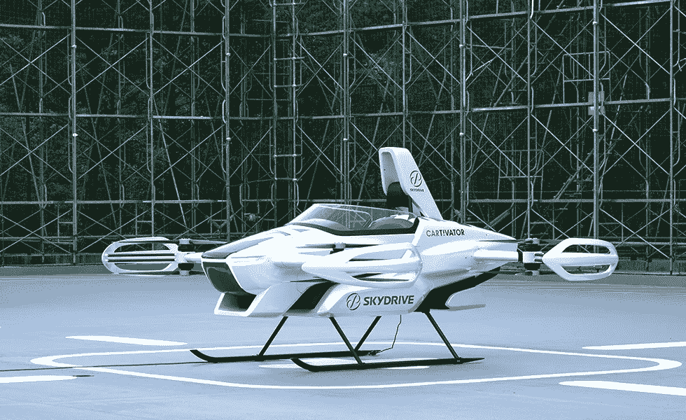
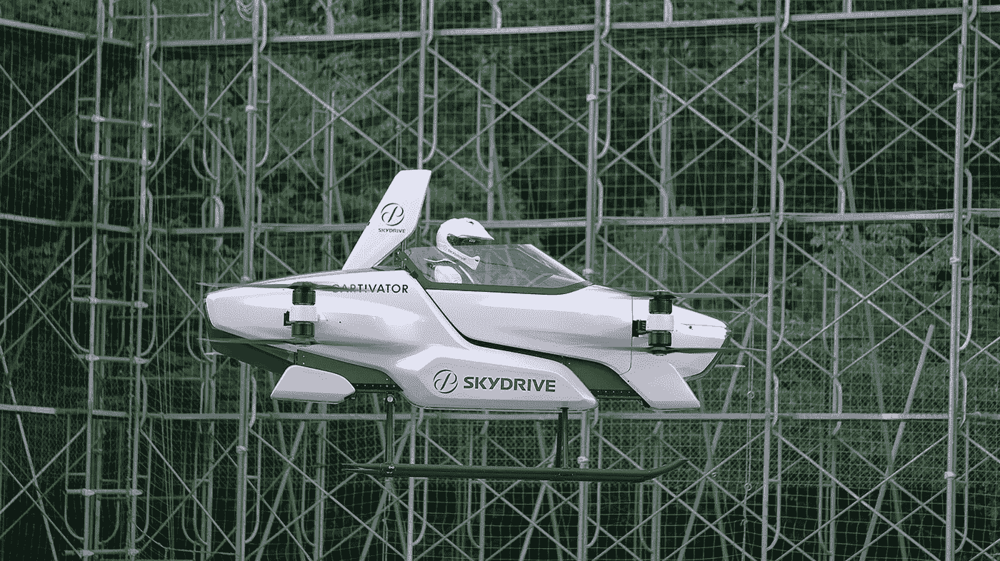
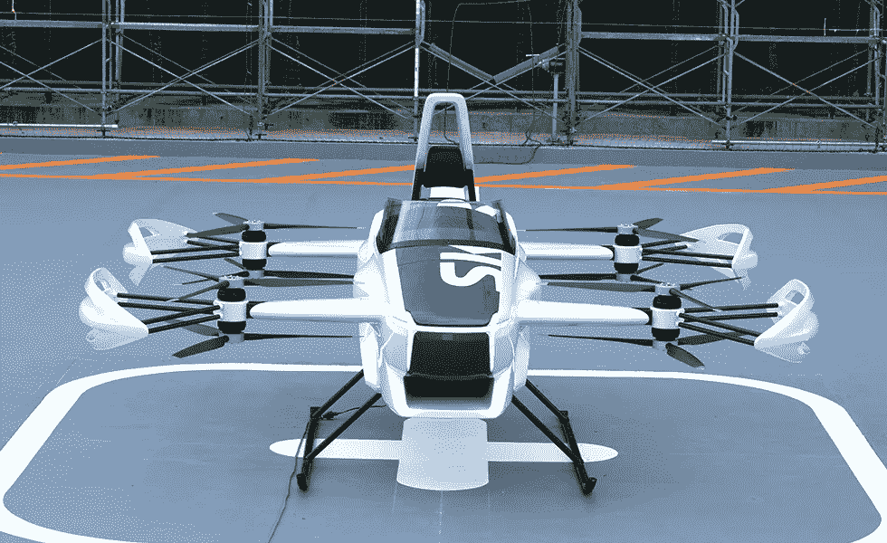
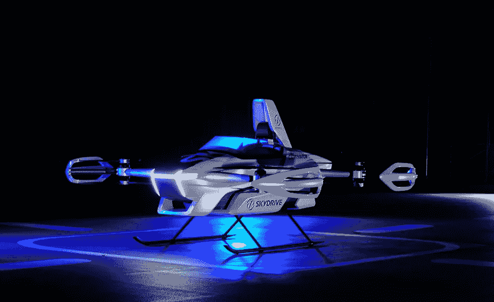

# SkyDrive 在飞行汽车中成功进行首次载人飞行

> 原文：<https://medium.datadriveninvestor.com/skydrive-successfully-performs-first-manned-flight-in-a-flying-car-1c13d38186d4?source=collection_archive---------6----------------------->

## **SD-03 型计划于 2023 年推出**

SD-03 SkyDrive manned flight model — Photo by: (Sky Drive Inc.)

*sky drive Inc .【sky drive】是 metropolitan air portability arrangements 的全球驾驶工程师，很高兴地宣布，它将于 2020 年 8 月 25 日领导其新的 SD-03 飞行器模型的公开展示之旅。这是日本主要的飞行器公开展示。*

*飞行发生在 10，000 平方米(大约 2.5 节土地)*丰田试验场*，这是日本最大的试验场之一，也是该组织前进基地的所在地。*

*单座 *SD-03* 在凌晨起飞，围绕场地飞行了大约四分钟。*

***一名飞行员负责控制，然而，一台个人计算机帮助控制框架保证了飞行的稳定性和安全性，同时，专业人员在现场检查飞行条件和飞机执行情况，以此作为加强。***

**

*SD-03 SkyDrive manned flight model — Photo by: (Sky Drive Inc.)*

*这架飞机被设计成世界上最小的电动垂直起降(*电动垂直起降*)模型，作为不久的将来的另一种运输方式。它的规格最小为 2 米高、4 米宽、4 米长，需要的地面空间相当于两辆左侧车辆。*

> *动力系统由电动发动机组成，驱动四个区域的转子，每个区域容纳两个转子，分别以相反的方式旋转，每个转子由自己的发动机决定。*

*使用八个发动机是一种在飞行过程中的危机情况下保证安全的方法，因此旨在解决一致的原则和平息可能的管理问题。*

**

*SD-03 SkyDrive manned flight model — Photo by: (Sky Drive Inc.)*

*指导飞机计划的口号是*“改革主义者”，*适合另一种交通方式。从侧面看，机身有一个精简，光滑的外观与转子住宿延伸到潜水弯曲，保持飞机的计划和强调其流线型特征的视觉团结。*

> *SD-03 的视觉平面图上安装了醒目的 *SkyDrive* 密封件，传达了一对螺旋桨升入天空的动力，这是一对工作对。*

***这架飞机前面有两个白光灯，机身下部有一个红光灯，这是飞行器特有的商标，旨在使目击者能够简单地辨别飞行器在空中掠过时的方向。***

**

*SkyDrive 的飞行汽车被设计成一辆封装梦想和散发活力的汽车，最终目标是它将被邀请到个人生活中，并被正常使用。*

> *SD-03 的主要外部色调是珍珠白，这是为了表达白色羽毛的生物和客户未来天空中掠过的薄雾。*

*该组织相信，它的飞机将成为个人在天空中的帮凶，而不仅仅是一件物品，它将继续试图作为天空中的帮凶为未来规划一个受保护的天空。*

*SkyDrive Project SD-03 world debut — Video by: (SkyDrive Inc) Youtube.com*

*SkyDrive 将继续在更大范围的条件下指导实验性演习，以进一步改进其进展，并与《民用航空法》的安全安排完全一致。*

*为此，鉴于 SD-03 测试的后果，它打算在 2020 年结束前获得对*丰田测试场*限制之外的行程的认可。*

***福泽友弘，首席执行官***

**“自 2018 年我们成立 SkyDrive 以来，我们非常渴望在很长一段时间内完成日本历史上第一次飞行车辆的监控之旅，目标是将这种飞机商业化。我们打算在 2023 年将我们的社会测试提高到以下水平，为此，我们将加快我们的创新转变和业务发展。我们需要了解一个公众，在这个公众中，飞行器是开放的，是空中交通的有利方法，个人可以永远遇到一个受保护的、安全的、令人愉快的更好的方法。我们同样寻求与我们的合作组织一起创建更广阔的市场，因此 SkyDrive 提供飞机的大都市航空运输协会将在日本和全球范围内成为现实。”**

***首席技术官岸信雄***

**“我们这次完成的监控飞行是 SkyDrive 在专业检查方面成就的顶峰。我们一直在一点一点地拍摄电驱动框架、飞行控制框架、飞机结构、测试、制造和在飞行测试期间呈现飞机状况检查装置的计划，并有显著的速度感。我们将继续创造进步，并获得类型确认，以便在 2023 财年可以派遣受保护和安全的飞行车辆活动管理机构。”**

***Takumi YAMAMOT 设计总监***

*在计划一种未被探索的新型交通工具——飞行器时，我们选择了口号“改革者”作为动力。我们需要这辆车现代、有吸引力，吸引每一个未来的客户，同时完全加入 SkyDrive 的高度创新。我们接受这辆车将承担部分功能作为你的犯罪伙伴，一辆在天空中飞行的保守跑车。作为另一个阶层的先驱，我们可能希望继续规划每个人都渴望的汽车。”*

*该公司计划让飞行器成为普通生活的一部分，而不仅仅是一件物品。更多的实验演练将在各种条件下进行，以确保车辆的健康和创新符合行业准则。尚未公布价格。*

## *感谢您的阅读！📖*

## *如果你喜欢这篇文章，这里有另一篇你可能喜欢的文章:*

* [## “飞人 V”气动飞机成功首航

### 这架飞机的外形将减少 20%的燃料消耗

medium.com](https://medium.com/datadriveninvestor/the-flying-v-aerodynamic-airplane-makes-successful-maiden-flight-47af91371154)*