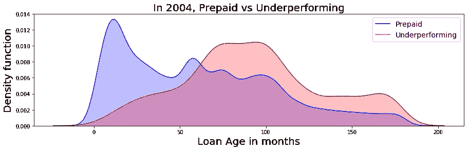
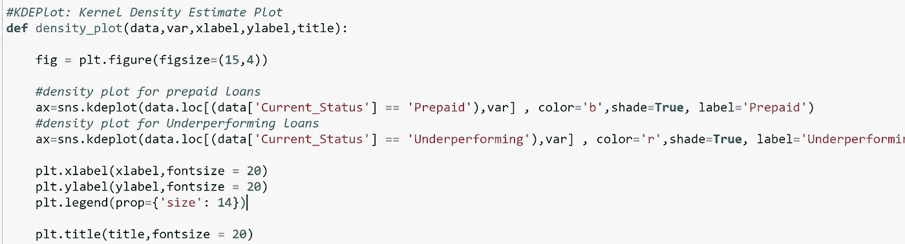
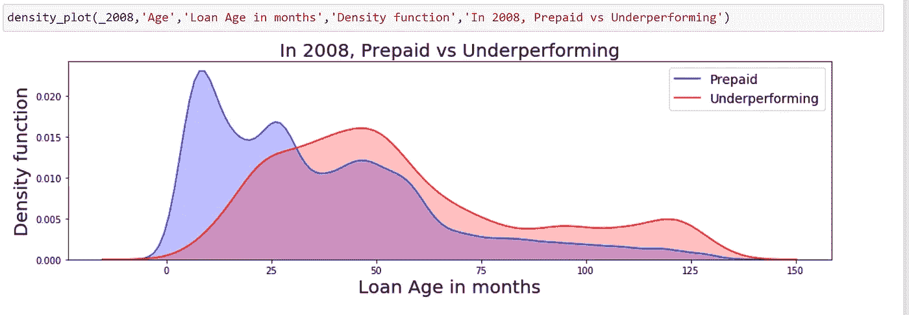
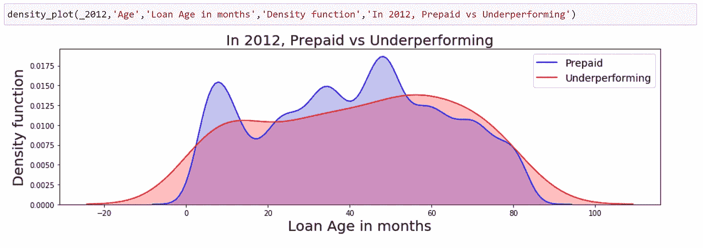
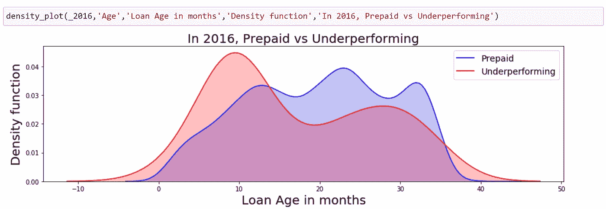
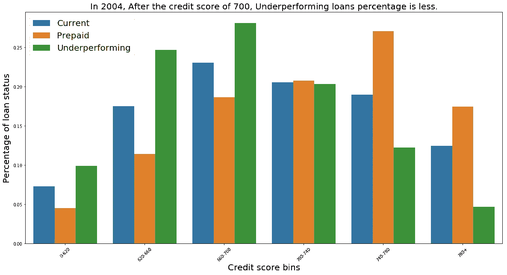
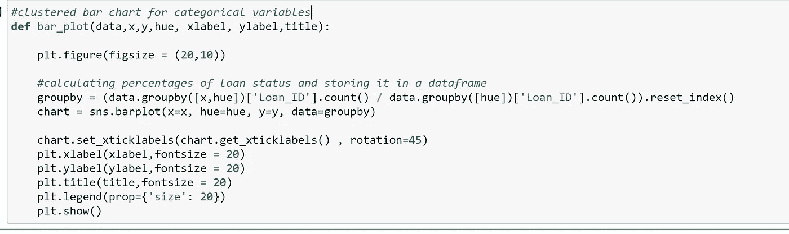
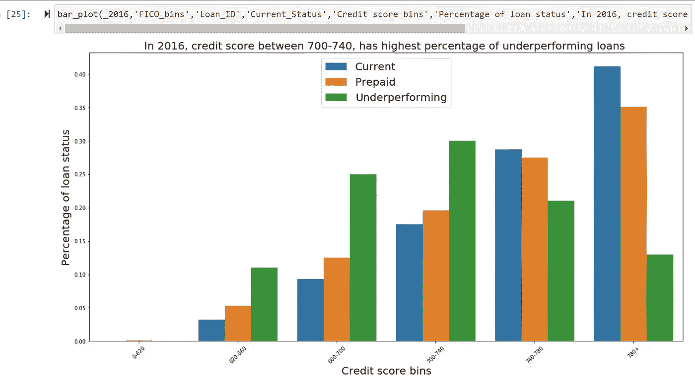

# 仅用两句咒语就能在数据可视化领域掀起一场黑客马拉松！！

> 原文：<https://medium.datadriveninvestor.com/slash-a-hackathon-in-data-visualization-with-just-2-mantras-61209e04ba5f?source=collection_archive---------11----------------------->

## 通过参加黑客马拉松提高 10%的技能

这篇文章的目的是分享我赢得黑客马拉松的经历，以及它的重要性。为了说明黑客马拉松的价值，我想分享一下我在黑客马拉松前后的知识状况。

黑客马拉松之前:

1.  我对金融领域知之甚少。
2.  我从未以可重用的方式编写过数据可视化代码。

黑客马拉松之后:

1.  我有机会学习金融领域的新术语。
2.  我可以以可重用的方式编写整个 EDA 可视化代码。

要赢得 EDA 黑客马拉松，最重要的两件事是:

1.  数据可视化框架
2.  协力

这两个依赖于问题陈述。和我一起解决下面的黑客马拉松挑战，你就会明白这一点。

【2019 年房利美黑客马拉松挑战赛:

*   分析并想象 15 年来“风险因素”的差异。
*   借款人的数量、首付金额或初始信用评分等因素对贷款的最终状况有影响吗？
*   使用(2004、2008、2012、2016)第三季度的数据子集，发现与贷款状况相关的风险因素如何随时间变化？

在这里，我们的焦点或目标变量是贷款的最终状态。它是一个分类变量，有三个类别:

1.  目前的
2.  预付
3.  表现不佳

为了进行适当的分析，我们应该知道这个变量如何影响我们案例中的业务，即房利美。

房利美从银行购买抵押贷款，将它们作为证券出售给投资者。因此，为了挑选好的贷款，房利美收集买家的数据和贷款信息，以决定是购买贷款还是放弃贷款并将其发送回贷方。

基于此，如果贷款状态为预付或表现不佳，则不适合房利美。所以我们需要更多的关注这两类，选择他们哪些因素可以考虑，哪些因素不可以考虑加班？

数据有两种类型:分类数据和数字数据。

暂停一分钟，思考一下我们如何根据数字变量来可视化对贷款状态的长期影响？

对于数字变量，我们能找到一个区分预付贷款和不良贷款的值吗？我们如何将它视觉化？

密度图最适合这种情况，要了解更多关于密度图的信息，请阅读这篇[文章](https://towardsdatascience.com/histograms-and-density-plots-in-python-f6bda88f5ac0)。简单来说，直方图的平滑版本。

让我们想象一下 2004 年的贷款年龄。

在上图中，预付贷款和不良贷款之间有明显的区别。我们可以说，年龄为 60 岁或以上的贷款有更高的机会表现不佳比预付。

我们可以对不同的时期和其他数值变量使用相同的可视化。让我们以可重用的方式为这种可视化编写代码。

2008 年，预付和表现不佳之间有明显的区别，但这种区别的价值与 2004 年相比已经发生了变化。

2012 年，预付和表现不佳没有区别。

2016 年没有明显区分，但年龄越小，预付贷款分布越少；这是前几年所没有的。

现在，我们将能够用上面的代码可视化数据中的任何数值变量；这是数据可视化的框架，我之前提到过。

> 总的来说，Framework 正在考虑一个可以基于数据类型可视化变量的图，然后使它可以在类似的数据类型中重用。

对于数字变量，我们可以进一步可视化每个贷款状态的趋势。这个博客没有涉及到。然而，你可以在我的 [GitHub](https://github.com/kalyanpesala17/Hackathon-by-Fanniemae/blob/master/each_year.ipynb) 中查看更多的分析，随意使用代码和框架对不同的变量提出不同的见解。

我们得到了数值变量的框架。让我们写分类变量。

暂停一分钟，思考我们如何可视化显示分类变量对贷款状态的长期影响？

对于分类变量，我们可以显示每个贷款类别的贷款状态相对于变量的百分比。来证明它是如何随着时间的推移而变化的，从长远来看，我们能依赖于此吗？

举一个分类变量的例子，信用评分箱[' 0–620 '，' 620–660 '，' 660–700 '，' 700–740 '，' 740–780 '，' 780+']。我们可以把它想象成聚集的条形图:信用评分箱是 X 轴，贷款状态的百分比是 Y 轴，颜色表示贷款状态。

让我们为分类变量创建一个框架，并为不同时期和其他变量可视化。

让我们来看看 2016 年信用评分箱中每个类别的每种贷款状态的百分比。

2004 年，信用评分为 700 分后，不良贷款的百分比较低，但 2016 年，不良贷款的最高百分比在 700-740 之间。

因此，我们不能只依靠买方信用评分来预测贷款的长期状况，因为它是随着时间而变化的。

如果你对预测贷款状态感兴趣，请查看这个[代码](https://github.com/kalyanpesala17/Hackathon-by-Fanniemae/blob/master/full_pipeline_2004%20(1).ipynb)。

我们的下一个口号是团队合作。这是必不可少的，尤其是在黑客马拉松中，因为他们有时间限制，我们需要在团队中分配任务。

数据科学黑客马拉松的典型任务是:

1.  商业理解。
2.  探索性数据分析。
3.  机器学习模型。

在划分这些任务之前，每个人都应该理解问题陈述并朝着它努力。

例如，团队中有三名成员，他们可以专注于理解数据中的每个变量及其对业务的影响，并提出问题来改进问题陈述的解决方案。

人们可以专注于 EDA 框架，这样他们就可以快速可视化数据中的大多数变量。

最后一个可以关注数据预处理和基本的机器学习模型。

在此之后，您将拥有该解决方案的基本版本。现在，通过分享彼此的发现来改进解决方案。有了足够的商业知识，你将会有更多的问题需要寻找，你将会使用这个框架来快速地将这些问题可视化。从 EDA 中，您可以创建新的功能来改进模型，如交互和将数字变量宁滨到类别。

因此，通过团队合作和 data viz 框架，你将有更好的机会赢得 EDA 数据科学黑客马拉松。

这是我有过的最好的黑客马拉松体验之一。第一个在舞台上。我学到了很多关于 Tableau 的知识，尽管我错过了提交解决方案。

我提交了第二轮的答案，但没有资格进入最后一轮。黑客马拉松中给出的数据是我迄今为止遇到的最混乱的数据。因此，我能够学习更多的 python 和熊猫技术来处理它。

第三个是我赢得 EDA 黑客马拉松的魅力。

黑客马拉松的结果可能会有所不同，但一个共同点是，通过参加黑客马拉松，我的技能至少可以提高 10%。

谢谢你把火车读到最后。黑客马拉松不仅仅是竞赛；它们是快进模式的实践课程。

黑客马拉松对求职者也很有帮助。使用 StackOverflow 开发者的数据调查，我发现在正规教育之外，黑客马拉松和开源贡献比其他教育类型对工资有更大的影响，你可以在这里阅读这个分析。