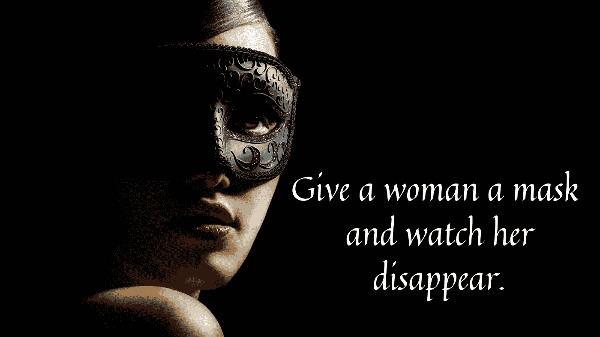

# 睡美人活着

> 原文：<https://medium.datadriveninvestor.com/sleeping-beauty-lives-9a4d623391c3?source=collection_archive---------23----------------------->

## 我发誓几十年前我就杀了她。

Image by Kharchenko_Irina7, Canva via Getty Images Pro

睡美人和她乏味的朋友们来到我们面前，被包裹在银幕上，被束缚在浪漫小说的米色书页里。人们经常会一本正经地告诉你，做你自己就好。

你知道那是谁吗？

睡美人一动不动地躺着，等待白马王子发现她藏起来，用他的吻拯救她。在当前的“我也是”文化中，这是一个很大的“不”,但暂时忽略这一点。

灰姑娘被压迫和不足，直到她的脚的尺寸拯救她悲惨的生活。你的尺寸会符合白马王子的模型吗，或者你会像邪恶的继姐妹一样切掉一些东西来符合标准吗？

我喜欢看人们互动。在目睹了一个看起来很有前途的初次约会被隐喻性地血腥谋杀后，我感到有必要向被抛弃的年轻女性提供我的建议。我内向的性格不允许我和陌生人有这种程度的互动，但却允许我写下这种互动。

考虑一下这个场景。你会在健身房、书店、朋友聚会等任何地方遇到一个迷人的未来恋人。约定了一个下午喝咖啡的时间，你比他早到了几分钟。

是的，我用了*他*。请随意替换您选择的人类名称。作为一个彻头彻尾的异性恋女性，一切都与众所周知的*他*有关。

夫妻店灯火通明，背景播放着欢快的音乐，白色的地铁瓷砖排列在墙上，一个装满饼干和馅饼的玻璃面包房放在你的右边，一个巨大的窗户可以看到街对面古雅的商店。空气中弥漫着烘烤肉桂糖果和黑咖啡的味道。

你找到一张朝向后墙的棕色小桌子，坐下来看着门。他来了，发现了你。他脸上浮现出一丝充满希望的微笑，然后你马上找到了你的牌。

游戏开始了。你扮演谁？

他多才多艺，年纪大吗？你是把《黑客帝国》里胆小的灰姑娘和冷酷的三位一体折腾出来的，还是和你年龄和生活状态差不多，所以你把《睡美人》里一动不动的睡美人和《x 战警》里略显残破的凤凰放出来的？

他有没有表现出像一支粘在手掌上的 vape 笔那样的直接缺陷？也许,《美女与野兽》中的美女会改变他，而神奇女侠会迫使他服从她的鞭子。

**还记得做自己的建议吗？你今天是谁？**

我们通过观察部落中其他人的互动来学习社交技能。你看到你的父母以健康的方式互动了吗？对我们大多数人来说，这是一个大大的否定。

你是否目睹过年长的兄弟姐妹约会或任何真正的人类享受浪漫、无忧无虑的生活？大概不会。但是我可以猜想你看电影和读书是为了逃避对爱情的不切实际的模仿和对“从此幸福快乐”的致命观念。

**回到咖啡店。他带了什么卡？**

你热情的问候和你的穿着会首先打动他。你的服装、妆容和发型完美无瑕吗？除非你们在相似的情况下相遇，否则他可能被吓到了。你说的每一句话和你的身体动作都会被认为是故意的。

他可能会想，“*那么帅的人在第一次约会时不可能会紧张。”*

错误的想法，但如果你坐在睡美人和 Phonex 的光环后面，看起来自信而泰然自若，谁会知道其中的区别。我不是说要难看地出现。保持最佳状态，但要考虑时间、地点和适度。也许把高跟鞋留给第三次约会。

为了对抗你的完美，他抛出了超人，双重生活，安静，受控。与路易斯·莱恩约会，并在求婚前死去，将他从实际婚姻中拯救出来。然后为了反击凤凰城的炮火，他使用了《终结者》中的里斯，“*如果你想活命就跟我来*”也许沙丘的保罗骑着他的巨型蠕虫在沙漠里喝着他加工过的尿。不容易被杀人机器、巨虫或漂亮女人动摇的男子汉。

开场白。你是站起来拥抱他，说“你看起来很棒”还是“咖啡闻起来很棒。”或者一句“多棒的地方。”有些东西需要很棒，但睡美人是冷的，三一和凤凰绝对没有性交。

那我们该怎么办？挑一张新牌，找一个新主角，或者做自己。当你离开的时候，你需要一辆小型货车来把这些人都带离咖啡店。

我的主题不成立。她没有拥抱她的约会对象，即使很快。她微笑着，但她从未碰过他，甚至没有轻轻拂过他的手。几分钟后，他交叉双臂，坐在离她尽可能远的地方，而不是真的逃跑。

她的约会对象一离开，她就打电话给某人。我带回家的烤饼终于出炉了。当我站在柜台付款时，我无意中听到她对着电话说:“我不知道。我猜他不喜欢我。”

两个想法闪过我的脑海。这不是一次求职面试——我认为可能是。还有，这个可怜的女孩让一个英俊的男人独自回到这个世界。我差点打破了从不和陌生人说话的规矩，但我没有。我闭上嘴，把手伸向自己。

为了帮助命运修复我目睹并故意选择忽略的悲剧，我提供以下内容:

出于兴趣，写下五个词，描述你希望未来的伴侣从与你的交往中得到什么。你现在正在做的事情，一个主要目标和一些你没有立即意识到的意想不到的事情。

记住，我们反映了我们从别人那里寻求的东西。猴子看猴子做。

你想要一个诚实的另一半——你也必须诚实。不要考虑身高或眼睛颜色等身体属性。这是一个完全不同的游戏，我们可以稍后讨论。

想想当你的世界崩溃，你需要另一个人在你身边的时候，你想要握着你的手的特质——男性，女性，两者兼而有之。想想你想在下一次社交聚会上介绍谁作为你的另一半。

让我们选择诚实、有趣、聪明、关心他人和适应性强作为我们的五大特质。为了便于讨论，你的名字是伊芙。你的性格陈述可能是这样的:

伊芙是一位诚实、有趣、有爱心、美丽的年轻女性，她很容易适应新环境。她是一名准律师，渴望成为一名律师。Eve 正在攻读学位，但仍会抽出时间去看望家人，并和她九十岁的祖父一起弹奏班卓琴。

我们中的许多人会对简历上的每一个字母苦读几个小时，但从来没有花五分钟考虑我们是谁，更不用说把这些单词写下来了。

现在让我们把 Eve 加入我们的咖啡店。

伊芙对认识一个新朋友感到焦虑，这是可以理解的。没有服装可以隐藏。如果你是一个娘娘腔，把这一点加到你的角色表上，尽情享受吧。如果你不喜欢，那也很好。夏娃回答问题或自己问问题，因为她可以问任何她想问的问题——她不再是睡着了或不充分了。在你的第一个问题之后，提出第二个问题或评论。“真的，你怎么……”想想播客主持人，问问题，参与对话。

白马王子不需要超人来唤醒睡美人，这样她就可以选择一杯咖啡或者把灰姑娘塞进一双鞋里。不需要为了人类的安全而击退漫威家族，一场谈话，可能是一场缓慢开始的尴尬的谈话会在几分钟后自然地展开。

很久以前我杀死了睡美人。灰姑娘不会让我感到羞耻，我也不需要躲在超级英雄后面。从银幕上剥离你的自我价值感需要时间，可能还需要你做大量的工作。你可以进化成比今天更好的人。更好的是，明天你可以再做一次。

**认真审视自己以及自己想要从生活中得到什么的副产品是自信。**

Image from Chorograph Getty images via Canva

女人往往很擅长扮演另一个人，把真实的自己留在后门廊，在寒冷中，看着烛光晚餐派对展开。

在我杀死睡美人之前，我符合我所有的自信和通常控制的男人。一旦我写了自己的角色，不再躲在别人写的故事情节后面，我发现了一个不同类型的人。我把我现在的幸福归功于这一个小小的自我提升的举动。

在我们众多的社会群体中，我们都有不同的行为。我们的同事可能会看到更保守的个性。我们的亲戚可以看到一个管理员。我们的朋友可能会看到一个外向的党猎犬。仅仅出于理智的原因，需要有一个人看到这一切，摘掉面具，把饥饿的孤儿从寒冷中带进来。

要找到这个神话人物，你需要*亲自去见*。你不能要求其他人接受*你*如果你一直给他们看睡美人。

一劳永逸地干掉她。用你自己的角色代替她的面具，向你生命中的下一个人展示你是多么的出色。

[西莉·威尔斯](https://www.celiewells.com) 2020 年

 [## 刚刚 16 岁，快 25 岁了

### 在 1987 年阴沉的夏天寻找生命。

celiewells.medium.com](https://celiewells.medium.com/just-16-and-almost-25-7a5eb23275cd)  [## 天使的责任——这并不重要

### 第 4 章——亨利在健身房的夜晚。

celiewells.medium.com](https://celiewells.medium.com/onus-angelorum-not-that-it-matters-e6a1c1b1bce6)