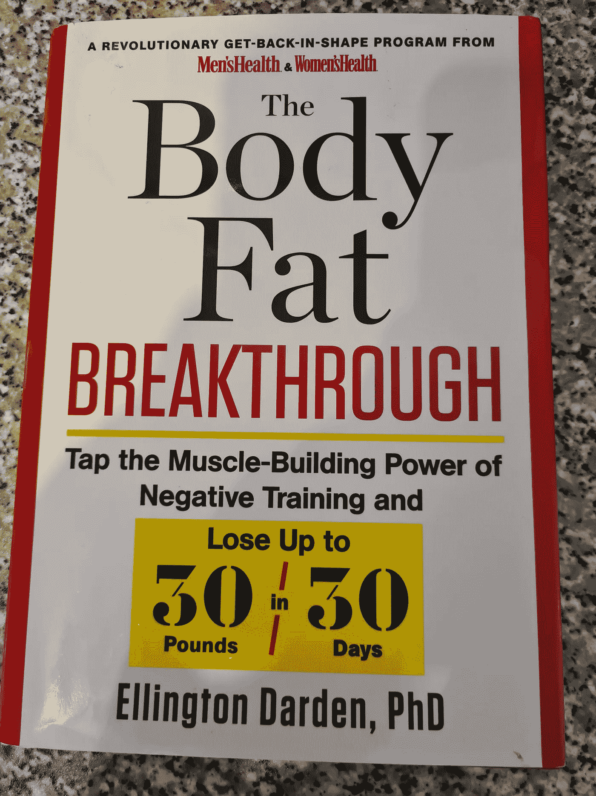

# 为快速获利而缓慢行动

> 原文：<https://medium.datadriveninvestor.com/slow-moves-for-fast-gains-496044f78291?source=collection_archive---------6----------------------->

燃烧脂肪，在 90 秒内煎出你的肌肉

Photo by [Scott Webb](https://unsplash.com/@scottwebb?utm_source=medium&utm_medium=referral) on [Unsplash](https://unsplash.com?utm_source=medium&utm_medium=referral)

昨晚我去了健身房，只用了不到五分钟就把我的腿完全烤焦了。最后，我几乎站不起来了。我不得不抓住设备来稳住自己。我已经锻炼了很多年，我的腿很强壮，非常强壮。我经历过让经验丰富的举重运动员呕吐的训练，也经历过让他们昏倒的训练。当他们醒来时，他们几乎不能坐在马桶上，他们的腿筋太疼了，他们的大腿太疼了，以至于不能把他们扶起来。因此，如果我昨天使用的技术可以增加我腿部的力量和肌肉，并改善它们的形状，我认为它可以对任何人产生同样的效果。

我在二十多岁的时候第一次锻炼出了巨大的大腿肌肉、隆起的腿筋和紧实的臀肌。我做了大量的深蹲(100 公斤时做 20 次，体重 80 公斤时做 12 次，140 公斤时做 12 次)和硬拉。如果我做完这两个练习后还能走路，我会用腿部弯曲和腿部伸展来结束我的双腿。我现在四十多岁了，由于粘连性关节囊炎(一种严重限制肩部活动并导致慢性疼痛的特发性疾病)，我目前不能做深蹲或硬拉。如果你已经认真锻炼了一段时间，你可能知道，如果没有深蹲或硬拉，你很难实现腿部严重的肌肉酸痛。如果你是健身新手，你还没有足够的信心进行深蹲或硬拉，你会很高兴知道我的锻炼不包括这两项。

昨晚我的腿筋疼得厉害，我很难舒服地入睡。今天我的大腿疼死了，明天可能会更疼。这种肌肉酸痛是一个好迹象，表明你已经做了足够多的工作，迫使肌肉通过比以前更大更强的方式来适应。

除了消除我的下肢，我还在我的胸部、二头肌和三头肌上使用了同样的技术。我的孩子们一直告诉我，我的胳膊大得多。我一直在使用的技术不是秘密，它已经被研究和应用(在某些圈子里)了 50 年，但我从未见过其他人使用它。

为了在 90 秒内彻底消除身体的一部分，我一直在集中精力做每项练习的负面部分。消极的是练习的降低阶段。有幸使用 X-Force 设备训练的健身爱好者已经看到了极好的效果，X-Force 设备在运动的下降阶段增加了 40%的阻力。但是大部分人都接触不到 X-Force。幸运的是，你可以使用一些技巧，通过常规的健身器材和体重练习来充分利用消极训练。尽管如此，如果我变得非常富有，我可能会买一整套 X-Force 机器。

已经意识到消极训练的巨大潜力并在训练中加以利用的著名健美运动员包括多里安·耶茨(6 x 奥林匹亚先生)和迈克·门策尔(第一个获得满分的健美运动员)。但是当然，健美运动员使用类固醇。那些不注射危险的违禁物质的普通人呢？

2012 年 2 月，艾灵顿·达顿博士在佛罗里达州对 40 名男性和 25 名女性开始了负面训练的试验。五十年来，达顿一直在研究锻炼和减肥。他的工作已经在超过 75 种研究期刊和杂志上发表，他已经写了近 50 本书。他还被总统健身和运动委员会选为美国十大健身领袖之一。他的负面训练实验的结果，以及锻炼计划、饮食计划和许多其他优秀的信息可以在《身体脂肪突破》一书中找到。

Photo by Nasar Karim

达顿 2012 年研究的参与者取得的成果远远超过了他四十多年来培训客户的任何成果。通过消极训练，参与者获得了前所未有的肌肉增长和脂肪减少。在研究结束时，达顿已经改变了 118 名以前超重的男女的体质。在所有情况下，他们都增加了大量肌肉，减少了大量脂肪。达顿研究的参与者之一是安吉尔·罗德里格斯，一名 48 岁的男子，在 30 周的时间里，他减掉了 121 磅脂肪，增加了 20.5 磅肌肉，腰围缩小了 20 多英寸。他的亲生母亲没有认出他。我已经经历过消极训练，但是在重读了《体脂突破》之后，我决定调整我的方法。我开始使用 90 秒技巧。

## 它是如何工作的？

有几种方法可以利用消极训练。你可以用两条腿举起重量，用一条腿放下重量(详见我的文章停止举重！).在重读《体脂突破》之前，我已经这样训练了几个星期。90 秒技术更优越，因为它允许我在同一组中训练双腿/双臂，这增加了锻炼的强度，减少了总的锻炼时间。

对于任何允许的练习，你应该能够成功地使用 90 秒的技巧，你可以正常举起的重量最多重复 10 次。你从完全收缩的姿势开始，慢慢降低重量。你应该花 30 秒来完全减轻体重。然后，你把重物举回到完全收缩的位置，再一次花 30 秒完成这个动作。最后，你再次降低重量，花 30 秒钟这样做。总的来说，你的肌肉将工作 90 秒，其中两倍的时间花在锻炼的消极部分。因为否定是练习中最强的部分，它是最后耗尽的。如果你能在第二次否定后移动重量，那就太轻了。我用了 90 秒的技术来做压腿和腿部弯曲，之前我用 107 公斤的腿部伸展来热身。压腿和卷腿之后，我就彻底完了。

为了体验像这样的锻炼有多难，试着按照描述的方式做俯卧撑。从双臂完全伸展开始，只有手掌和脚掌放在地板上。把手表放在地板上，这样你就可以自己计时了。降低你的身体，保持运动，试着用 30 秒的时间用你的胸部接触地面。不要在底部休息；当你的胸部接触到地面时，反向运动，花 30 秒回到原位，然后再开始下降。你也可以尝试深蹲，或者双杠深蹲。相信我，这并不容易。

一旦你能顺利完成 90 秒，你就需要为下一次锻炼增加重量。每次锻炼你只需要做一组。尝试 90 秒技巧的一个很好的练习是引体向上。你的二头肌、前臂和背阔肌将得到彻底的锻炼。一旦我的肩膀痊愈，我会开始做消极引体向上，并停止做二头肌弯曲。你可以减少锻炼的次数，但仍然可以获得很好的收益。也可以用这种方式进行深蹲(我最喜欢的腿部运动)，但你需要一个深蹲架，上面有精确放置的安全别针，让你的重量停留在动作底部一英寸以下。你可以走到底部，然后把肩膀稍微放下来，把杠铃放在柱子上。

在艾灵顿·达顿的负面训练试验中，除了在晚餐后悠闲地散步 30 分钟外，没有一个参与者进行任何有氧运动，但他们都经历了显著的脂肪减少。有氧运动不是排出体内脂肪的必要条件。在以前使用标准练习(以正常方式举起和放下重量)的研究中，达顿的受试者在没有使用有氧运动的情况下也经历了脂肪减少和肌肉增加(尽管从未达到与消极训练相同的幅度)。达顿声称，负面训练是脂肪减少的原因，因为它的强度很大。到目前为止我只进行了一次锻炼，所以对我来说评论脂肪减少还为时过早。

如果你想以最有效的方式锻炼，使用消极训练。人们可能会想知道你在做什么，但不要为此烦恼。你的结果会让你大吃一惊。每周改善你举起的东西和你的外表是非常有益的。尤其是四十多岁的时候！

要了解更多信息，我强烈推荐阅读《体脂突破》。这本书包含 10 个“脂肪炸弹”；超级水合作用和降低卡路里等技术可用于增加脂肪损失。你还可以找到关于习惯养成的信息。这本书有 35 份研究参与者的简介，结果令人吃惊。阅读这本书，获取信息，获得灵感，然后开始行动。以前所未有的速度增肌减脂。