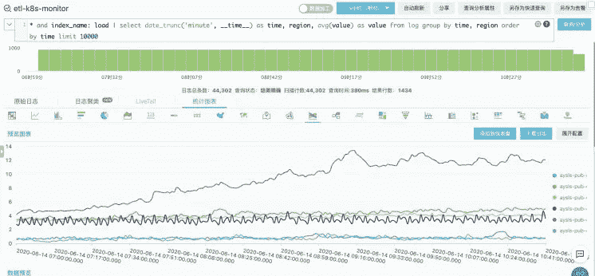
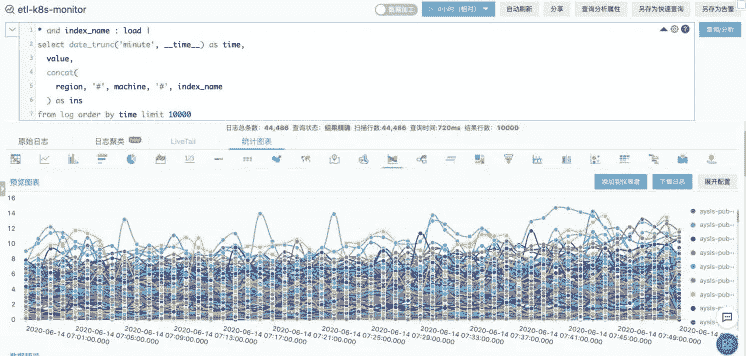
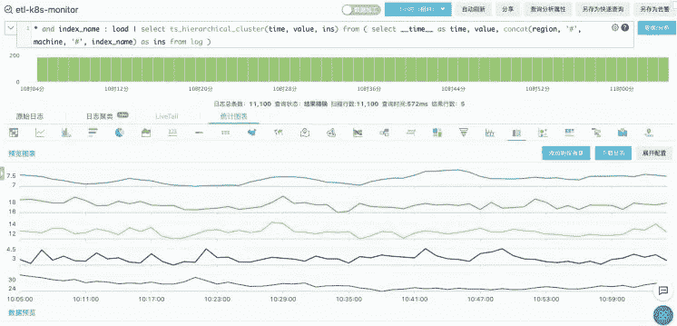
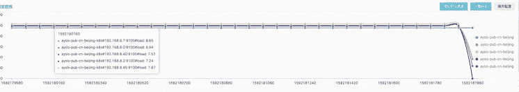

# SLS 机器学习最佳实践:时间序列的相似性分析

> 原文：<https://medium.datadriveninvestor.com/sls-machine-learning-best-practices-similarity-analysis-for-time-series-6946f1e24a21?source=collection_archive---------11----------------------->


[阿里云日志服务](https://www.alibabacloud.com/product/log-service) (SLS)为 DevOps 和 AIOps 提供了一系列工具，涵盖了异常检测、时序聚类、时序预测等方法。为了使服务更容易访问，我们已经将我们的算法集成到 SQL 中，以便以最低的成本进行相关的配置。本文介绍了时间序列聚类和相关性分析的最佳实践。

# 1)场景

本文涵盖了时间序列相似性分析的几个有用的函数，包括使用[日志服务](https://www.alibabacloud.com/product/log-service)的时间序列聚类和相似性计算。这些功能适用于以下情况:

*   当我们有 n 台机器的指标数据，并希望快速找出一段时间内的 CPU 使用情况，以便更好地了解当前的系统状态时。
*   当我们为一台机器指定一个度量的曲线，并想知道哪些机器对于指定的度量有相似的曲线时。
*   当我们手动输入时间序列曲线(网站的访问延迟曲线)并想要确定哪个服务具有相似的访问延迟变化曲线以缩小故障排除范围时。

前面的场景归结为两个方面:时间序列聚类(按形状和按值)和时间序列相似性的确定。

# 2)描述

SLS 平台提供了两个功能。查看[文档页面](https://www.alibabacloud.com/help/doc-detail/93235.htm)了解更多详情。

```
ts_density_cluster
ts_hierarchical_cluster
```

第一个功能目标是基于曲线形状的聚类，其底层核心聚类算法是基于密度的聚类(DBSCAN)算法。第二个函数的目标是基于原始曲线之间的相似性进行聚类，更强调曲线之间的欧几里德距离等因素。它的底层核心聚类算法是层次聚类算法。有关这些函数如何工作的更多信息，请参阅我以前的文章，或者在线搜索相关信息。以下部分描述了如何在 SLS 中使用这些功能。

# 3)案例研究

## 3.1)数据探索

*   查询-01

```
* | select DISTINCT index_name, machine, region from log
```

*   查询-02

```
* | select count(1) as num from (select DISTINCT index_name, machine, region from log)
```

*   查询-03

```
* and index_name : load | 
select 
  __time__, 
  value, 
  concat(
    region, '#', machine, '#', index_name
  ) as ins 
from log order by __time__ 
limit 10000
```

*   查询-04

```
* 
and index_name : load | 
select 
  date_trunc('minute', __time__) as time, 
  region, 
  avg(value) as value 
from log group by time, region order by time limit 1000
```

通过执行 query01，我们获得了以下信息，这些信息表明了当前 Logstore 中包含的不同曲线的数量以及每条曲线的标识符。为了更好地观察 1300 条曲线，我们使用了流程图。然而，在一个图表中绘制所有这些曲线会消耗大量的浏览器资源，即使生成了图表，也很难从图表中获得洞察力。我们使用 query04 来观察一些曲线的可视化效果，并将它们的视觉效果与 query03 的效果进行比较。



## 3.2)集群实践

根据前面的观察，我们是否可以将一些曲线进行聚类，并将相似的曲线分组，以减少可视化分析的维度？

[](https://www.datadriveninvestor.com/2020/11/19/how-machine-learning-and-artificial-intelligence-changing-the-face-of-ecommerce/) [## 机器学习和人工智能如何改变电子商务的面貌？|数据驱动…

### 电子商务开发公司，现在，整合先进的客户体验到一个新的水平…

www.datadriveninvestor.com](https://www.datadriveninvestor.com/2020/11/19/how-machine-learning-and-artificial-intelligence-changing-the-face-of-ecommerce/) 

以下 SQL 语句支持快速曲线聚类。在本例中，选择的指标是机器负载，因为我们想知道不同机器的使用情况如何变化。为此，我们使用`ts_hierarchical_cluster`函数得到一个刻面图。为了使图表更直观，将其存储在仪表板中。

```
* 
and index_name : load | 
select 
  ts_hierarchical_cluster(time, value, ins) 
from 
  (
    select 
      __time__ as time, 
      value, 
      concat(
        region, '#', machine, '#', index_name
      ) as ins 
    from 
      log
  )
```



## 3.3)相似性查询

通过执行下面的 SQL 语句，我们得到一个具有与`aysls-pub-cn-beijing-k8s#192.168.7.254:9100#load`相似度量曲线的机器列表，并使用下面的流程图来可视化结果。相似性函数提供的用于确定相似性的选项包括形状、曼哈顿和欧几里德。

```
* 
and index_name : load | 
select 
  cast(
    cast(ts_value as double) as bigint
  ) as ts_value, 
  cast(ds_value as double) as ds_value, 
  name 
from 
  (
    select 
      tt[1][1] as name, 
      tt[2] as ts, 
      tt[3] as ds 
    from 
      (
        select 
          ts_similar_instance(
            time, value, ins, 'aysls-pub-cn-beijing-k8s#192.168.7.254:9100#load', 
            10,
            'euclidean'
          ) as res 
        from 
          (
            select 
              __time__ as time, 
              value, 
              concat(
                region, '#', machine, '#', index_name
              ) as ins 
            from 
              log
          )
      ), 
      unnest(res) as t(tt)
  ), 
  unnest(ts) as t(ts_value), 
  unnest(ds) as t(ds_value) 
order by 
  ts_value 
limit 
  10000
```



# 原始来源:

[](https://www.alibabacloud.com/blog/sls-machine-learning-best-practices-similarity-analysis-for-time-series_596957) [## SLS 机器学习最佳实践:时间序列的相似性分析

### 悟冥 December 2, 2020 65 Alibaba Cloud Log Service (SLS) provides a series of tools for DevOps and AIOps, which cover…

www.alibabacloud.com](https://www.alibabacloud.com/blog/sls-machine-learning-best-practices-similarity-analysis-for-time-series_596957) 

## 获得专家视图— [订阅 DDI 英特尔](https://datadriveninvestor.com/ddi-intel)