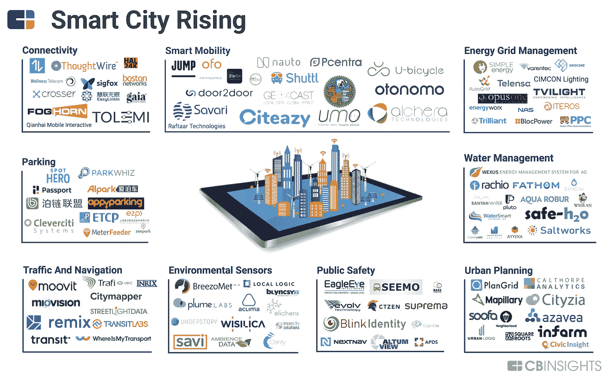

# 智能城市:创业成功的三种方式

> 原文：<https://medium.datadriveninvestor.com/smart-city-three-ways-startups-can-succeed-c38807d2867f?source=collection_archive---------15----------------------->

能够与道路对话并相互对话的自动驾驶汽车，确保快速、安全和便捷的交通。

*响应城市动态需求的能源生产和分配。*

*通过动态定价供水，考虑到家庭的实时需求。*

从根本上改善交通、能源和水是智能城市最大的承诺。如下图和 CB Insights 的[完整报告所示，大量创业公司正在参与其中。](https://www.cbinsights.com/research/smart-city-startups-market-map/)

是的，支持这些用例的技术也可以被非常破坏性地使用，侵蚀隐私和言论自由——但这是另一篇文章的大主题。这篇文章从利益的角度出发，关注企业家如何在潜力大于现实的领域取得成功。

**1)外国走向市场** —智能城市是非常公私合作的，即这完全是政府技术。不过，问问任何风投，他们都会告诉你，鉴于采购周期特别长，govtech 要么还没有开始，要么至少是一个非常困难的提议。擅长与政府合作的初创公司通常专注于具有前瞻性思维的城市，这些城市在采用技术方面已经有着良好的记录。想到的名字是新加坡、伦敦和东京等人口密集的发达地区，以及阿联酋马斯达尔市和韩国松岛等不断发展的项目。总的原则是，如果你更大的国内市场更难打开，那么不要害怕国外市场。

**2)作为投资者的政府** —在新加坡，政府无所不在，准公共实体或实际公共实体也在积极投资初创企业。在美国，In-Q-Tel 是构建安全解决方案的典型例子。我们这里不是在谈论赠款，这些实际上是股权投资，就像任何其他风险投资一样。企业家应该像企业投资者一样处理这些问题，也就是说，让他们跟随或者甚至共同领导是个好主意，但不是领导，这样你就可以向市场发出足够多的财务上升信号。战略投资者通常在决策上也比较慢，对如何投资和何时投资有更严格的限制。

**3)多年和多源** —市政府通常会根据年度预算运作，但当涉及非选举产生的政府机构时，预算通常会在项目持续期间进行分配。对所有公司来说，一个优势是采购可能持续多年。政府通常还会采用多种来源，而不是单一供应商，以表明决策是独立的。这是一个公平竞争的优势——对初创公司来说更好，因为他们可以与更大、更知名的竞争对手一起赢得合同。

*原载于* [*数据驱动投资人*](https://www.datadriveninvestor.com/2020/02/23/smart-city-how-startups-can-succeed/) *，“我很乐意在其他平台上辛迪加。我是*[*Tau Ventures*](https://www.linkedin.com/pulse/announcing-tau-ventures-amit-garg/)*的管理合伙人和联合创始人，在硅谷工作了 20 年，涉足企业、创业公司和风险投资基金。这些都是专注于实践见解的有目的的短文(我称之为 GL；dr —良好的长度；确实读过)。我的许多文章都在*[*https://www . LinkedIn . com/in/am garg/detail/recent-activity/posts*](https://www.linkedin.com/in/amgarg/detail/recent-activity/posts/)*上，如果它们能让人们对某个话题产生足够的兴趣，从而进行更深入的探讨，我会感到非常兴奋。如果这篇文章有对你有用的见解，请对这篇文章和 Tau Ventures 的 LinkedIn 页面***发表评论和/或给予赞，感谢你对我们工作的支持。这里表达的所有观点都是我自己的。**