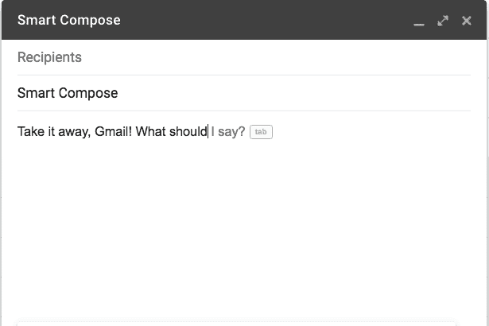
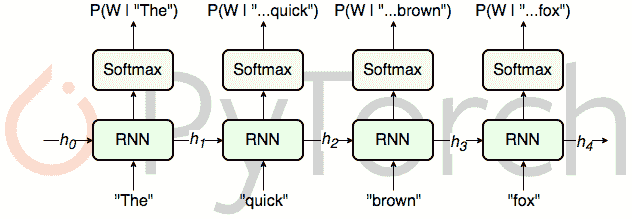

# 使用深度学习的智能作曲

> 原文：<https://medium.datadriveninvestor.com/smart-compose-in-email-using-deep-learning-c9cc29d9d60a?source=collection_archive---------5----------------------->


PicCredit:Unsplash

深度学习的进步将自然语言处理带到了一个新的高度。无论是情感分析还是文本摘要，一切都变得非常简单。此外，像 LSTM 这样的语言模型的出现使得单词预测变得更准确、更好。在这篇文章中，我们将看到如何使用 LSTM 构建一个像 gmail 一样的智能编辑器。



(Gmail’s smart compose feature)

# 数据收集:

为了让任何人工智能模型工作，我们需要一个数据集来训练我们的模型。这里我们将使用来自 kaggle 的数据集，称为 *kaggle-spam-dataset。*我们可以尝试其他更大的数据集。因为当有足够的数据时，深度学习模型表现良好。

[](https://www.datadriveninvestor.com/2019/01/23/deep-learning-explained-in-7-steps/) [## 深度学习用 7 个步骤解释-更新|数据驱动的投资者

### 在深度学习的帮助下，自动驾驶汽车、Alexa、医学成像-小工具正在我们周围变得超级智能…

www.datadriveninvestor.com](https://www.datadriveninvestor.com/2019/01/23/deep-learning-explained-in-7-steps/) 

# 预处理:

作为预处理阶段，我们将获取数据集并应用基本的数据清洗技术(*我们可以在任何标准的 nlp 教程*中了解它们)。清理数据集后，我们将对其进行标记化。我们还将找到数据集中不同单词的数量，并根据它们出现的频率对它们进行排序。我们还将把单词转换成索引，这样每个单词都有一个唯一的索引。我们还会有一个字典来做相反的事情，即把索引转换回单词。

# 数据生成:

在预处理步骤之后，我们将调整数据集，使其能够服务于我们的单词预测目的。因此，我们应该这样划分数据，既有输入数据，也有输出数据。输出数据是模型的预期结果，即要预测的单词。输入作为给定单词的索引序列进入模型，输出是要预测的单词的索引。

让我们取任意长度 20，其中前 19 个字作为输入，最后一个字作为输出。我们期望我们的模型最大化输出单词的概率。类似地，我们将从第 1 个索引到第 20 个索引的单词作为输入，第 21 个单词作为输出。对于数据集的其余部分，我们将遵循这个过程，可以很容易地用 python 进行编码。最后，我们将把输出标签转换成一次性编码的表示。

# 型号:

我们会用 LSTM 作为基本模型。选择 LSTM 的原因是因为他们具有长期依赖性的能力，因为我们采用 19 个单词作为输入，并期望第 20 个单词由 LSTM 预测。虽然最近在本帖中已经发明了更强大的模型，但我们仍将讨论基本的 lstm。



(Language modelling using RNN,Source:[http://torch.ch/blog/2016/07/25/nce.html](http://torch.ch/blog/2016/07/25/nce.html))

我们将使用具有 256 个单元的一层 LSTM，以便每个 lstm 找到不同的表示。我们还可以使用各种其他架构，比如使用更多或更少的 lstms。最后，我们将得到密集图层，其形状与输出数据集中的单词数相同。

```
model=Sequential()model.add(LSTM(256,input_shape=(X.shape[1],X.shape[2])))model.add(Dropout(0.2))model.add(Dense(Y.shape[1],activation=’softmax’))model.compile(loss=categorical_crossentropy,optimizer=’adam’)model.fit(X,Y,epochs=10,batch_size=128)
```

keras 中的上述代码片段显示了粗略的架构，可以根据可用的硬件进行调整。我们也可以借助试听来进行更好的训练。

# 预测:

训练完模型后，就轮到我们做预测了。因此，基本的方法是给模型一个单词序列作为输入，并期望模型输出概率最高的单词作为输出。在获得所需的输出后，我们不应该忘记将结果转换成所需的单词，因为结果将是一个索引。

# 结论:

这篇文章讲述了使用基本语言建模技术进行智能预测的一般思想。当提供更大的数据时，该模型将执行得更好。转换器也可以用于同样的目的，这被认为是语言建模问题中的最新技术。