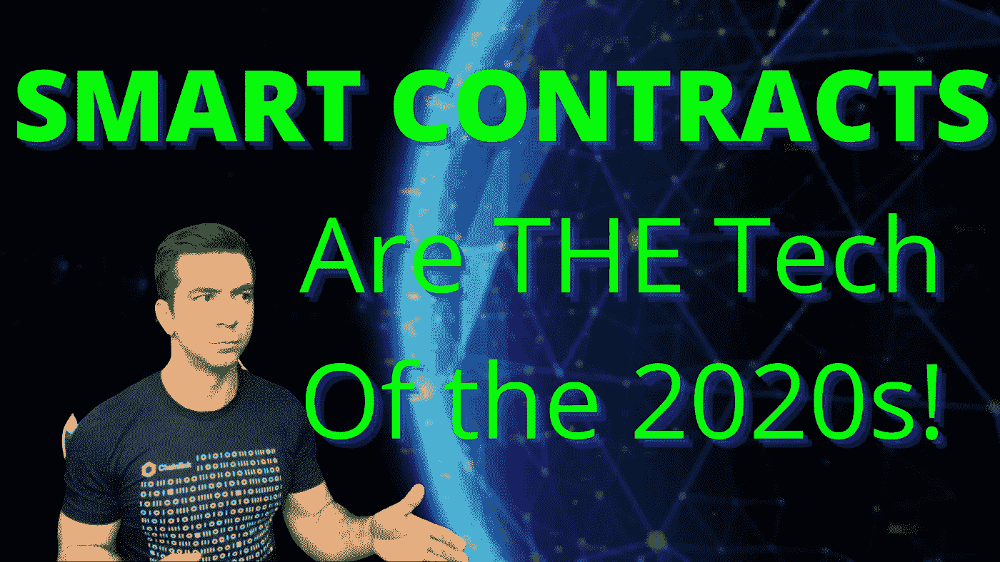
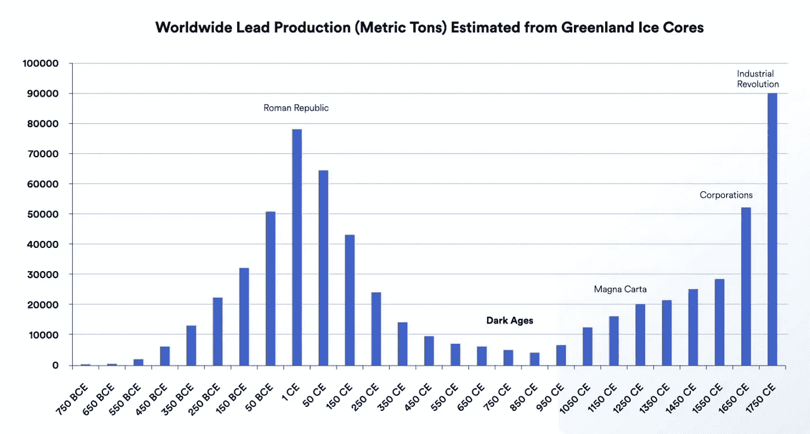
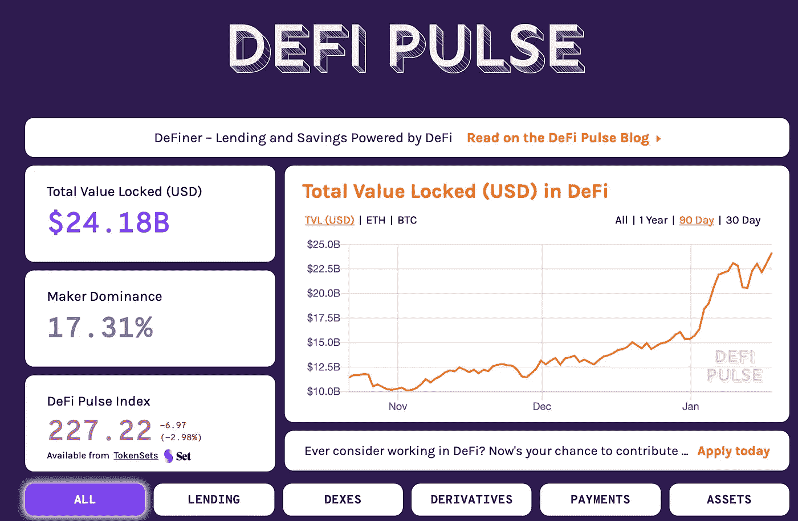
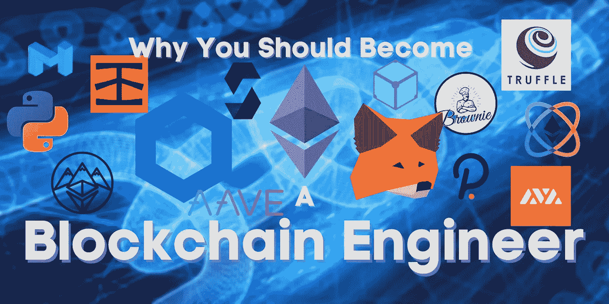

# 智能合同:我们迫切需要智能合同的 4 个原因

> 原文：<https://medium.datadriveninvestor.com/smart-contracts-4-reasonswhy-we-desperately-need-them-53a1774d94e3?source=collection_archive---------0----------------------->

## 为什么智能合约如此重要？智能合约是做什么的？为什么智能合约是 21 世纪 20 年代最重要的技术之一？智能合约如何让我们的生活更美好？这些都有回答，还有更多。



Original Image from spainter_vfx from Getty Images Pro

## 介绍

智能合同是一项将定义我们人类未来如何互动的技术，并且已经开始了爆炸式的增长和采用。我们已经看到仅在金融领域使用的智能合约就从[的 5 亿美元增加到 2020 年的 200 多亿美元](https://defipulse.com/)，使用智能合约平台的项目价格飙升，如 ETH 从 2020 年初的 130 美元增加到[的 700 多美元](https://www.coingecko.com/en/coins/ethereum)。

智能合约的实现得益于被称为[区块链](https://www.investopedia.com/terms/b/blockchain.asp)的技术。区块链不仅仅是旗舰货币“比特币”。比特币是最初的区块链用例，但现在有了更多。最棒的是，你不需要知道任何关于智能合约如何在密码学/区块链层面上获得好处的知识。所以，如果你紧张，没有足够的先验知识来阅读这篇文章(我经常做更多的技术文章),不要担心，继续读下去。

你知道互联网是如何工作的吗？对于大多数人来说，答案是否定的，你知道你所在网站的网址中的 https 代表什么吗？


URL of Medium

我告诉你。它代表:

```
HotTopicTeachesPeopleSkills
```


Totally unrelated to this article, but I am amused by it

当然，这实际上并不是它所代表的意思，但也许当你在听[黄牌的海洋大道时充满了青少年焦虑时，你学到了关于热门话题人物的有价值的一课。](https://www.youtube.com/watch?v=LvyHVgocP_0)

这算不算一个过时的参考？

反正这不是它真正代表的意思，但大多数人不知道，也不关心。同样，使用和理解智能合约和区块链并不需要成为密码学大师。如果你感兴趣，可以看看我写的关于这个主题的其他文章。

重要的是今天科技能为我们做什么。你可能不知道互联网是如何工作的，但你知道你可以点披萨、看电影、和你的朋友联系，或者在社交媒体上被禁止。

现在，区块链可以做的不仅仅是智能合约，但让我们只关注智能合约，因为在我看来，它们是区块链如此重要的最大原因。要理解智能合约，我们先来定义传统合约。

I also made a video on this subject, if you’d like to learn in another form of content.

# 什么是合同

合同是人与人之间的任何协议。如果我做了什么，你会回报我的。如果你付房租，你和你的房东有合同。你每月给他们 800 美元，他们就会让你住在他们的房子里。如果你有网络，你就和网络提供商签了合同。如果你买了一只股票，你就与交易所或经纪公司签订了合同。如果你在 [medium](https://medium.com/@patrick.collins_58673) 上关注我，我们有一个协议，你将继续看到加密货币领域的最佳文章。

拥有有效、可信的协议是文明得以运行的关键因素。越多的协议被信任和执行，文明就越繁荣。在 Chainlink 和 SmartContract.com 的联合创始人 Sergey Nazarov 的这个[视频中，你可以了解更多关于这些协议的历史和重要性。](https://www.youtube.com/watch?v=ufVyX7JDCgg)



Image from science.sciencemag.org

越多的人将有效地创建契约，我们就越能看到文明的繁荣。全球铅产量是将文明与幸福联系起来的一个很好的例子(见上图)。当文明能够达成有效的协议时，他们可以开始从事除寻找食物和住所以外的事情。

所以很明显，契约是让世界运转的东西。你看到的电脑是许多协议的结果，有挖掘材料的矿工，组装零件的工厂，编写软件代码的工程师，把它送给你的送货司机(如果你是由于 covid 订购的)。你坐的椅子是从合同中来的。你因为觉得这是个好主意而购买并狼吞虎咽的一夸脱冰淇淋，都来自于有效协议的结果。

现在，智能合同对这些传统合同进行了大规模改进，包括执行速度、协议成本和安全性，但我们将看看传统协议的 4 个致命缺陷。这些是:

*   极端中心性
*   合同利益冲突
*   执行
*   透明度

> 智能合约通过去中心化、完全透明、自动执行的代码解决了这些问题，不需要依赖第三方中介。

如果你的大脑刚刚从这种状态中分裂出来，让我们通过解决每一个致命的缺陷来解开这句话。

# 1.极端中心性

在你的所有协议中，即使是两个人之间的协议，也经常会有人控制合同的执行，而且通常都是一边倒的。一个很好的例子是你的银行账户。一旦你把你的钱存入他们的账户，他们现在就可以保管你的钱，并可以选择冻结你的钱，起诉你，或者任何他们想制造的问题。如果你曾经遇到过银行不兑现你的支票，不让你提款，或者开始向你收取虚假透支费的问题(这发生在我身上)，你就会知道我在说什么。

我们甚至在历史上看到过这种情况，大萧条不允许任何人退出，因为他们都破产了。这是你的钱，但既然他们有合同和账户，里面有你的钱，他们就可以为所欲为。在集中式合同中，他们是运行代码的人，他们拥有过程，所以他们可以严重地偏向于他们自己。由于你无法控制这份协议，你只能坐在那里寻求支持或威胁采取法律行动，而他们只是像一个轻微的烦恼一样拒绝你。

How big corporations respond to your support tickets

智能合同通过成为[去中心化协议](https://en.wikipedia.org/wiki/Decentralised_system)来固定这种中心化。智能合同写在[去中心化的区块链](https://www.investopedia.com/terms/b/blockchain.asp)上，代码不是由一家公司执行，而是由世界各地去中心化的集体执行。任何人都可以加入这个集体，所以你知道你正在以一种公平的方式完成你的计算，因为每个人都在尽可能诚实地计算。

因此，如果你通过智能合约与银行达成协议，他们对可能发生的事情没有任何控制或影响，无论他们如何尖叫或希望回到旧的方式，编码的执行都会发生。从现在开始，他们不是协议的负责人。我们已经在这个领域看到了这样的项目，你可以把钱存入高息账户，除了你自己，没有人能控制你的钱和你何时取出。



Image from [DeFipulse](https://defipulse.com/)

这种解决方案可以在任何时候帮助你，包括当你没有得到退款，公司谎报清洁产品的有效性，你的保险没有支付索赔，等等。一个聪明的合同，其中的控制是分散的，把权力还给你，还给人民。

在传统协议中，正是因为这种集中化，我们直接进入了第二点。

# 2.合同利益冲突

这些传统的合同不仅对拥有合同的任何人来说都是小菜一碟，而且在实际履行合同的过程中存在巨大的利益冲突。

保险公司不想给你钱让你理赔，他们是营利性组织，给你钱让你理赔和他们想做的恰恰相反！如果一个盈利组织拿了钱却什么都不做，你可以打赌他们会这么做。谁能为此责怪他们呢？但是我们 100%可以并且应该指责那些本应该提供服务的人，然后从中脱身。在传统的合同中，用户不得不时刻担心另一个用户是“[对其有利的](https://www.merriam-webster.com/dictionary/good%20for%20it)”。

一个很好的例子是，在 2005 年的卡特里娜飓风中，在这一年中，你会期望保险公司支付巨额款项，并亏损，而事实上他们[获利超过 440 亿美元](https://www.tampabay.com/archive/2006/04/06/katrina-didn-t-make-insurers-cry/)，这几乎比前一年增长了 20%。现在，在那种情况下导致这种情况的还有很多，但无论如何，在这样的灾难之后，你会期望他们不会以牺牲这么多人为代价做得这么好。

智能合同再次拯救了我们，我们已经看到像 Arbol 这样的项目出现来解决这个问题。农民需要保险，因为当季节天气不好时，他们可以依赖与保险提供商的分散协议，当有效索赔到来时，保险提供商别无选择，只能支付，因为他们无法控制合同的执行，利益冲突被消除。

# 3.执行

现在，对所有这些的一个简单的回答是“好吧，好吧，但是我可以把这些骗子告上法庭，对吗？”。这里的问题是，你甚至不得不首先花时间把他们叫出来。也许你需要马上做手术，如果你因为延误而做手术，3 个月的法庭诉讼会让你丧命。也许你需要那笔钱来付房租。也许你需要一个真正随机的样本来进行你的医学试验，而回去真的不是一个选择。

只要参数得到满足，智能合约就会自动执行，因此您不必担心有人会坚持自己的承诺，或者被迫坚持自己的承诺。有了智能合同，基础设施的实施。

# 4.透明度。

最后一个是透明度，它在当今时代产生了巨大的影响。有时你和某人达成协议，他们承诺基于一些计算做一些事情。也许他们承诺给你 50%的版税，也许他们会给你一个随机的奖励。也许，他们说他们会关起门来做一些事情。

关起门来可以发生很多事情。也许他们没有报告你应该收到的所有版税。也许他们实际上并不产生一个公平的随机数，而是产生一个适合他们的数。当一方不值得信任时，紧闭的大门往往会成为一个问题。

2008 年的金融危机是一个巨大的例子，它也可以与上述所有其他问题结合起来。

A bit of a hyperbole, but a nice example here.

[信用评级机构](https://www.usatoday.com/story/money/business/2013/09/13/credit-rating-agencies-2008-financial-crisis-lehman/2759025/)将金融产品标为安全和 AAA，而事实上它们完全是垃圾。评估使公共信息和算法开源，我们作为一个集体可以更好地监管和测量一个人有多准确。现在我不想轻视 2008 年，并说这一切都归结为一件事，但如果我们一次解决每一个问题，我们可以 100%取得进展。2008 年确实归结于大集团的贪婪和缺乏诚信。拥有一个因透明而迫使诚实的契约网络将是一个巨大的进步。

想象一下，如果你能看到评估某人产品好坏的每一个细节。更容易看到的是，仅仅因为公司在让产品做得更好方面有既得利益，这些“额外加分”就会被加上去。

# 摘要

智能合同解决了数字世界中的信任问题。这些是分散化的数字优势协议，可以取代整个行业，变得更加诚实、安全、可靠和公平。这是一个我非常想生活的世界，并且已经开始生活在一个已经取得了一些进步的世界里。

现在有很多智能合约平台，但并不是所有的区块链都支持智能合约。例如，比特币并不是一个真正的智能合约平台。这并不是 100%正确的，但现在让我们假设它是正确的，因为还有其他平台的唯一目的是实现智能合约。



Image from [Coinmonks](https://medium.com/coinmonks/6-reasons-why-you-should-become-a-blockchain-engineer-9954e26105dd?source=friends_link&sk=d0ba343bc7c8292949515c04af2ea93b)

到目前为止，以太坊是最受欢迎的，其他智能合约平台还有 [Cardano](https://cardano.org/) 、 [Solana](https://solana.com/) 、 [Matic](https://matic.network/) 和 [Avalanche](https://www.avalabs.org/) 。这些平台需要通过[去中心化的 oracle](https://medium.com/better-programming/what-is-a-blockchain-oracle-f5ccab8dbd72?source=friends_link&sk=d921a38466df8a9176ed8dd767d8c77d) 、 [Chainlink](https://chain.link/) 来获取数据，以便让它们正确执行。因此，区块链领域正在发生很多事情。

目前，智能合约最受欢迎的用途是在 Defi(分散金融)领域，在那里，您可以与分散的银行、经纪公司和其他日常使用的金融工具合作。智能合约正在慢慢地彻底改变整个行业，对我来说，一个更加诚实的世界是我迫切想要生活的世界。

我有没有提到在 DeFi 中你得到的回报比传统世界中高得多？

期待与每个人一起建设这个新世界，只是成为其中的一部分，并帮助其他人了解这一切。一场革命从一个人开始。保持好奇的朋友。