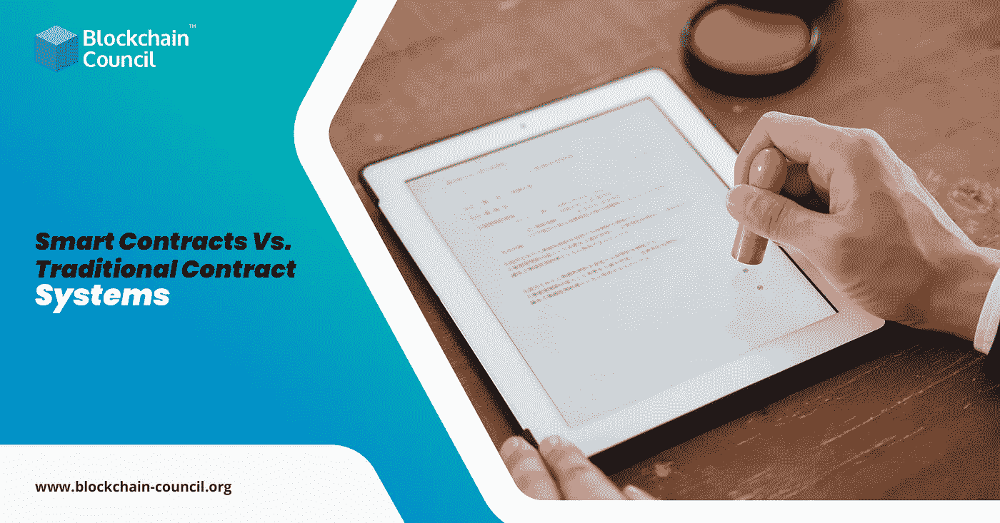

# 智能合同与传统合同系统

> 原文：<https://medium.datadriveninvestor.com/smart-contracts-vs-traditional-contract-systems-9ad42c5468ae?source=collection_archive---------13----------------------->

在最令人惊讶的技术突破中，智能合同是一个吸引了很多关注的概念。这是区块链的分支，区块链是一种分布式账本技术，有助于在不依赖第三方的情况下实现更快的交易。区块链最初是比特币交易所框架的一部分，但它不断发展，现在我们发现了大量区块链的用例，智能合约就是其中之一。在这篇博客中，我们将强调为什么智能合同对你的企业来说是必须的，以及它如何优于传统合同。

# 为什么选择智能合约？

在你深入理解和使用智能合约之前，我们必须知道为什么需要智能合约？传统的合同制度不仅费时，而且有太多的文书工作，使人负担完成手续。此外，执行这样的合同是一项艰巨的任务。如果你不得不依赖于一个自动系统，一旦合同的条件得到满足，交易就开始了。

从根本上说，合同是一份由双方当事人同意的条款和条件的文件。一旦满足条件，该方释放付款。这是传统合约的运作方式。我们就拿区块链这个保护伞下的东西来说吧。

智能合同是基于区块链的合同，具有预先确定的条件，一旦条件得到满足，合同就会自动执行。人们不必等待批准或确认。一切都是预编程和自动化的。不仅节省了你的时间，还保证了你不用等着付款。它确保无缝运行，从而提高企业的生产力。智能合约再次对不同的行业变得有用。合同签署是不同行业的一部分，如果我们转向自动化和预编程的合同，那么工作将变得更简单。

智能合约将成为未来，如果你也想成为这一不断发展的技术的一部分，你必须拥有关于区块链和可靠性的完整知识。对于这一点，可以确保上线 [**区块链认证**](https://www.blockchain-council.org/blockchain-certification/) 程序。

# 前进的道路

区块链委员会正在提供区块链和智能合同等相关概念方面最好的在线证书计划。这个全面的 [**学习区块链**](https://www.blockchain-council.org/blockchain/how-can-a-newbie-start-learning-about-blockchain/) 计划将帮助你精通区块链的概念及其实际应用。您还将学习如何开发和实现智能合约。如需了解更多信息，请立即联系区块链委员会。