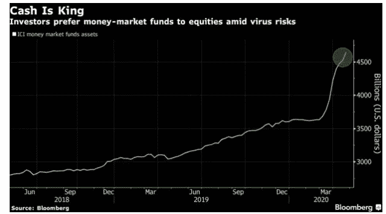

# 在这次股市反弹中，精明的投资者一直保持观望态度

> 原文：<https://medium.datadriveninvestor.com/smart-money-is-staying-on-the-sidelines-during-this-stock-market-rally-197eff7fae66?source=collection_archive---------4----------------------->

## 不要被当前市场的乐观情绪所迷惑

Photo by [Austin Distel](https://unsplash.com/@austindistel?utm_source=medium&utm_medium=referral) on [Unsplash](https://unsplash.com?utm_source=medium&utm_medium=referral)

这次股市反弹在很多方面都是前所未有的——就像 2020 年的几乎所有事情一样。随着全球经济衰退已经降临，当全球经济陷入困境时，股票市场却处于历史最高水平，几乎每天都在创造新的记录(无论是 [**S & P 500**](https://www.thebalance.com/what-is-the-sandp-500-3305888) ， [**道琼斯工业平均指数**](https://corporatefinanceinstitute.com/resources/knowledge/trading-investing/dow-jones-industrial-average-djia/) ，还是 [**纳斯达克 100**](https://www.dailyfx.com/nas-100/what-is-nas-100.html) )。

自 3 月下旬复苏阶段开始以来，这一直是散户投资者主导的复苏。随着所有的赌场和全球体育运动几乎嘎然而止，人们希望有一个地方放置他们的赌注和赌博。股票市场似乎是交易和赌博的唯一场所。但这就是赌博。精明的投资者没有参与此次反弹，这将导致上涨空间有限，泡沫极有可能破裂。

我们已经看到了现在的全球经济衰退和高水平的政府债务来应对这个疫情。然而，经济衰退的原因仍然非常普遍。冠状病毒仍在继续传播，没有人知道事情何时会恢复正常，也不知道我们是否会有疫苗来遏制这种致命病毒的传播。

市场和经济复苏存在巨大的不确定性，股市的这种乐观情绪就像什么都没有发生过一样，这让我担心附近可能出现的崩盘。

 [## 收盘，但没有雪茄-股票市场目标在停滞的 COVID 救济中创新高|数据驱动…

### 专家聊天程序:一个协作市场，在这里人们可以和能够解决他们问题的专家聊天。是……

www.datadriveninvestor.com](https://www.datadriveninvestor.com/2020/08/18/close-but-no-cigar-stock-market-targets-record-highs-amidst-stalled-covid-relief/) 

# 那些愚蠢的钱现在在做什么

谷歌搜索“如何开始炒股”和“股市”在 2020 年达到历史新高。自 3 月中旬市场大幅调整以来，最活跃的大多是千禧一代。我们已经十多年没有经历过衰退了，所以现在看起来是以低估值投资的最佳时机。有一种更强烈的贪婪感和对错失良机的恐惧(FOMO)。这暂时受到廉价利率、政府向市场注入流动性、即将到来的美国总统选举以及由于封锁而在互联网前的大量时间的支持。但这是不可持续的，因为精明的投资者同时也在这么做。

# 精明的投资者现在在做什么

精明的投资者将现金存放在 [**货币市场基金**](https://www.thebalance.com/money-market-funds-risks-and-benefits-315497) 。据精明的钱，现金是王道。他们耐心地等待市场反映经济的真实情况——真正的深度衰退。

Photo is sourced from Bloomberg

货币市场证券的期限少于 12 个月，资金存放在包括现金证券和债券在内的高流动性投资中。货币市场证券由大型机构投资者和主要银行以及其他保险公司和政府主导。这些最大的玩家可以创造或破坏市场，因为他们可以向市场注入或从市场带走资本。他们最清楚可能会发生什么(或者他们是这么认为的)。

# 你是应该等待崩盘，还是应该跟随聪明的投资者？

选择权在你。老实说，我部分投资于市场。在这个 [**有史以来最快的修正**中，我已经在不同的时间点把我的利润拿掉了。](https://finance.yahoo.com/news/stock-market-enters-fastest-correction-212700762.html)我将一些现金放在货币市场工具上，等待市场回归其内在价值时分配资金的信号。

# 最后的想法

没有人能把握市场时机。如果有人告诉你，他们总是能够完美地把握市场时机，赶紧离开。没有人能预测未来。我们唯一能做的就是分析我们的论点来做出投资选择，然后耐心和自律，支持自己。

我知道现在市场上有很多不稳定的资金，许多第一次投资者涌入市场，他们对在市场上最短的时间内产生的回报感到非常高兴。我预计未来会出现不稳定的季度。有很多因素和变量在起作用。

我将按照我的计划和策略进行规划和投资。我将继续部分投资，同时在场外积累一些现金。在不久的将来，很可能是时候再次抄底了。

> ***“机会难得。下雨的时候，拿出水桶，而不是顶针”——沃伦·巴菲特*T3**

**访问专家视图—** [**订阅 DDI 英特尔**](https://datadriveninvestor.com/ddi-intel)