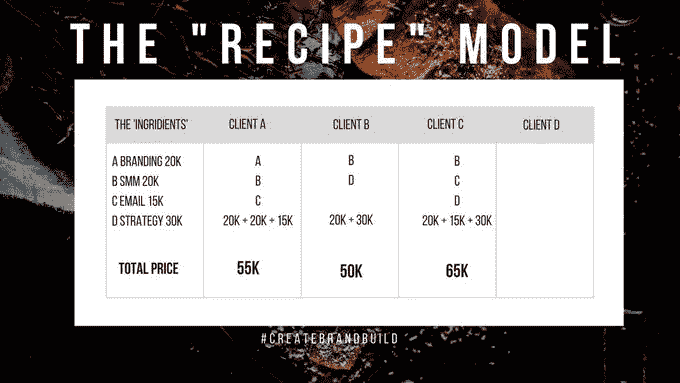

# 合理的价格让你物超所值

> 原文：<https://medium.datadriveninvestor.com/smart-prices-pay-you-the-best-value-4ceafe0bdf8b?source=collection_archive---------29----------------------->

## 找出你工作的真正价值所在

Photo by Scott Graham on Unsplash

简单可以太简单:按你的价值收费，并加税。当然，但是你知道你的价值吗？自由职业者不会免费工作，除非他们更喜欢有一个昂贵的爱好。

[让·万迪米](https://twitter.com/Jeanwandimi/)就是其中之一，她不做免费工作，并以大胆著称。数字营销战略家帮助内容创作者和自由职业者创造性地、有效地和有利可图地使用互联网。

她在 YouTube 上创建[内容，并在她的网站](https://www.youtube.com/c/JeanWandimi%C2%A0)上发布葡萄酒和食物评论[，正如她在](https://thewineandfoodreview.com/)[非洲推特聊天](https://twitter.com/AfricaTweetChat)中解释的那样。

定价对话实际上是关于如何从你决定销售的产品或服务中获得最大价值。无偿工作听起来是一个不错的敲门砖，但是当人们不劳而获时，他们会不愿意最终为之付钱。

 [## 如何知道你的价格是正确的|数据驱动的投资者

### 你收多少钱？这对初创企业和自由创业者来说都是一个难题。什么是…

www.datadriveninvestor.com](https://www.datadriveninvestor.com/2019/12/05/how-to-know-your-price-is-right/) 

“在某些情况下，免费工作并不是百分之百的坏事，”万迪米说，如果这些因素适用的话:

*   当你没有任何荣誉，并决定在写作和插图等行业建立自己的名声时
*   如果你想得到有价值的认可
*   如果有另一种形式的互惠互利
*   当建立你的权威时

“大多数人一开始都是免费创作内容，”万迪米说。“如果你试图通过自己创作的内容在业内树立自己的名声，你可能不会立即获得回报。然而，随着时间的推移，你开始从事有偿项目。

“如果这是一个你完全陌生的领域，你会免费工作让自己出名吗？”她说。"与其白忙活，不如快速学习，知道何时扩大规模."

# 了解所有方面

她的建议是，在免费工作之前，权衡利弊。

你得知道你做生意的代价。最低是多少？需要加什么才能生活下去？

“事先计算好你的价格，”万迪米说。“期待‘你为什么收费这么高？’问题。"

她建议创作者通过展示以下内容来支持他们的价格:

*   数据，包括参与度、受众规模、转化等。
*   您的受众和影响范围
*   你过去的工作

“我喜欢用数据来支持我的一些工作，”万迪米说。"分享数字、数据、过去的工作、影响等等."

Wandimi 研究了一系列可能的定价模型，创意人员可以用这些模型来得出基本价格。

# 竞争对手定价

*   看看你所在领域的其他人，他们收费多少。
*   如果你是一名在线自由职业者，看看其他人在个人资料上的收费。
*   你可能不得不放下自尊，直截了当地问。

 [## 不见面就做交易？风投和企业家的 5 个指南|数据驱动…

### 自从 covid 六个月前登陆美国以来，全球的风险投资家和企业家都不得不适应新的现实…

www.datadriveninvestor.com](https://www.datadriveninvestor.com/2020/09/20/doing-deals-without-meeting-in-person-5-guidelines-for-vcs-and-entrepreneurs/) 

# 成本加成定价

*   将制作这些内容的成本加到你的费用中。将固定成本和可变成本相加。
*   固定成本:不变。这是你的价值、专长和时间。
*   可变成本:取决于演出，包括设备、网络交通和摄影的成本。

# 配方模型

X 提出这些指控:

*   写博客每月 3 万美元
*   摄影每月 3 万美元
*   社交媒体每月 40，000 美元

如果一个[客户端](https://www.datadriveninvestor.com/glossary/client/)想要 A 和 B？收费 6 万，有小优惠。

# 对价格的感知

“人们认为价格较高的商品质量更好，”万迪米说。“例如，人们以 1，000 美元 KSH 购买手袋，一名卖家将价格定为 3，000 美元 KSH 和 7，000 美元 KSH。我们假设价值 7000 美元的 KSH 包质量上乘。定价时要记住这一点。”

# 目标市场

“你的目标市场是谁？”万迪米说。“奢侈品市场的价格更贵，而针对中低收入阶层的价格会更低。知道你的目标客户是谁，并据此设定价格。"

# 价格高还是量大

"你是想卖出更多的低价货还是更少的高价货？"万迪米说。“我的目标可能是卖出 100 份咨询，所以我必须降低价格。或者我的目标是销售三个高级咨询，所以我提高价格。”

# 额外提示:随你的发展而调整——并成长

“我肯定你见过那些 Instagram 商店告诉你‘DM for price’，以便他们调整，”Wandimi 说。“在为服务定价时，你不能向跨国客户收取与小企业相同的价格。”

“没有具体的公式规定你需要收取多少费用，”万迪米说。“在定价之前，你需要记住这些事实。按你的价值收费并加税。做好调查，确保你没有要价过高或过低。”

熟悉你的服务或产品的市场价格。然后看看你是否能更有效地交付，让自己在竞争中获得价格优势。

万迪米提供了这些建议，以确保你不会要求太少:

*   做彻底的研究。
*   事先调查公司或客户。他们是做什么的？它们有多大？
*   事先写下所有可交付成果。
*   自己计算自己的价值。这样，如果有人得到了 3 美元，但你确信你的价值是 2 美元，你不会因为问这个问题而感到难过。
*   按你的价值收费并加税。这样的话，如果他们妥协了，你还可以继续。

# 真的那么高吗？

“你太贵了”的异议总是潜伏在附近。

“到目前为止，你已经研究过你的价格是否高于竞争对手，或者你的价值是否与你的要价相称，”万迪米说。“如果客户是开放的，这是一个很好的问题，‘假设钱不是问题，你会雇用我吗？’有时候，人们会说“你太贵了”，因为他们已经决定不和你一起工作了。

“展示那种价值，”她说。“确保你能够支持你的价格。为什么每个 Instagram 帖子要收取 20 万美元的 KSH？和其他人相比，你的收费是多少？你的价值是什么？是因为你的目标市场吗？达到？转换？权威？”

注意不要把谈判误认为浏览。

“有时候，有人只是为了价格而购物，并没有决定与你合作，”万迪米说。“他们会提出异议，比如，‘你太贵了。’

“反对不是一个*不*。”她说。“‘T2’说服了我。澄清。”他们可能有问题或疑虑。"

Wandimi 指出了影响品牌为内容付费的关键因素:

*   品牌的预算
*   可交付成果。
*   预期的内容类型
*   活动持续时间
*   创意的市场比率

她给出了为什么了解其他创意人员的薪酬很重要的几个原因:

*   它可以帮助你设定价格和计算内部成本。
*   如果你知道做同样的工作，你得到的报酬更少，这有助于人们不感到被欺骗。
*   它还能帮助你自信地接近品牌。

# 市场意识

“当人们知道他们被集体支付了多少时，他们可以争取一个更好的价格，”Wandimi 说。“你们国家的创意人员有组织或协会吗？

“从本质上说，如果创意人员对他们的薪酬更加开放，品牌就会知道标准的市场价格，不会主动向人们支付曝光率很低的报酬，”她说。

Wandimi 列出了内容定价和媒体工具包中最重要的内容:

*   什么:可交付成果。我会为你做 X，Y 和 Z。
*   时间:持续时间。帖子能贴多久？[付款](https://www.datadriveninvestor.com/glossary/payment/)日期。
*   如何:什么类型的内容？
*   哪里:哪些平台？

“记得包括付款条款和渠道，”万迪米说。“是付款前、付款后、付款间吗？银行或者 Paypal 呢？是提成还是固定？”

**关于作者**

吉姆·卡扎曼是拉戈金融服务公司的经理，曾在空军和联邦政府的公共事务部门工作。你可以在[推特](https://twitter.com/JKatzaman)、[脸书](https://www.facebook.com/jim.katzaman)和[领英](https://www.linkedin.com/in/jim-katzaman-33641b21/)上和他联系。

*原载于 2020 年 9 月 28 日 https://www.datadriveninvestor.com**的* [*。*](https://www.datadriveninvestor.com/2020/09/28/smart-prices-pay-you-the-best-value/)

## 访问专家视图— [订阅 DDI 英特尔](https://datadriveninvestor.com/ddi-intel)