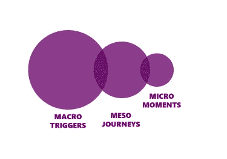

# 更聪明的 CX:入门指南

> 原文：<https://medium.datadriveninvestor.com/smarter-cx-a-starter-guide-7df58414d75d?source=collection_archive---------5----------------------->

Photo by [Robby McCullough](https://unsplash.com/@mybbor?utm_source=unsplash&utm_medium=referral&utm_content=creditCopyText) on [Unsplash](https://unsplash.com/s/photos/borderless?utm_source=unsplash&utm_medium=referral&utm_content=creditCopyText)

> “人们不会总是记得你说了什么，甚至你做了什么，但他们会永远记得你给他们的感觉。”—玛娅·安杰洛

在这个被大数据、数字化转型、“数字”品牌体验、自动化等流行词汇所主导的时代，营销人员越来越需要理解简单的基础知识。

作为营销人员，我们所做的基本工作不仅仅由 P&L 上的硬数字来定义，我们是我们所代表的品牌的保管人，我们的客户是我们的第一要务。

因此，理解为什么每一次顾客与我们品牌的互动——跨越不同的接触点——都会形成某种感知，进而形成对我们品牌的整体亲和力是至关重要的。

 [## 2019 年即将改变世界的技术|数据驱动的投资者

### 很难想象一项技术会像去年的区块链一样受到如此多的关注，但是……

www.datadriveninvestor.com](https://www.datadriveninvestor.com/2019/01/17/the-technologies-poised-to-change-the-world-in-2019/) 

> 我们为太沉迷于自己的行话而感到内疚。我们忘记了，我们故事的主人公实际上是顾客。

因此，我们需要认识到顾客旅程的重要性。

不，不是购买途径。

他的生活。他的故事。他的痛点。他的挫折。他的动机。他的幸福。

这才是真正重要的。

在每一步中，我们都需要问自己——我们怎样才能让他的生活变得更好？

**答案是:更聪明的 CX(客户体验)**

John Lewis’ App provides for seamless CX across phygital

# 那么，CX 到底是什么？

根据约翰·西尔斯的说法:

> *CX 是品牌和向顾客提出的主张的有形现实。*

简而言之，CX 是顾客在接触点对你的品牌的所有互动感知的总和。是他对你品牌的体验。是他对你品牌的每一次体验。

# 我为什么要关心 CX？

在当今时代，当更好的选择只是点击或轻击时，我们必须知道我们需要提供更好、更智能和一致的品牌体验，减少客户生活中的努力、压力和焦虑。

任何长期成功的公司都知道这一点——如果你没有让客户感觉良好，你的资产负债表看起来有多好也没用。

# 那么，我从哪里开始呢？

设计更好的客户体验不仅仅是一次性规划客户的旅程。

## #1 了解你的客户

了解他从哪里来，下一步要做什么。真正的洞察力来自于理解什么触发了他，他的痛点和挫折是什么——以及什么让他快乐。

洞察力不仅限于调查和焦点小组，而且肯定不会来自预先定义的和照本宣科的研究。我推荐的一个有用的框架来自[x plane——同理心地图](https://x.xplane.com/empathymap)。这种视觉表现框架有助于我们以简单的方式更深入地了解我们的客户。从这个开始。

## #2 彻底分析客户体验

当你从三个角度分析顾客体验时，你会得到最好的理解:宏观触发、中观旅程和微观时刻。与其专注于规划端到端的旅程，不如从这三个角度来考虑一个练习:

**宏观触发因素:**这些是客户将会经历的重要时刻，在这些时刻，一家公司可能是最有用的(例如，首次购买者)，这通常会触发一种体验。首先确定客户生活中公司可以发挥作用的时刻范围；你需要优先考虑你能以最有效的方式产生最大影响的地方。

**中观旅程:**顾客在一个不止一步的组织中的体验。这里，需要从顾客和商业的角度来分析旅程。从顾客的角度来看，这意味着审视情感、身体和精神的旅程。对于商业镜头，这意味着要从运营角度(如投诉、出错率、所需资源)和财务角度(成本、辍学率、薪酬)来看。这将为组织提供在微观层面合理安排旅程优先级所需的所有信息**。**

**微时刻:**经历中可能短暂但可能影响巨大的特定部分；这是公司关注提高对客户和业务的价值的地方。

## #3 CX 设计带来愉悦

大多数 CX 专注于解决痛点，而不是积极寻求愉悦和差异化。伟大的 CX 是经过深思熟虑、精心设计的，而不是权宜之计。

因此，一旦你了解了顾客的旅程，就开始关注 CX 设计，并在以下 3 个领域寻找机会:

愉悦的机会

差异化的机会

减少沮丧的机会

## #4 情感与功能——人情味

虽然 CX 可能功能健全，但如果它缺乏人情味，不能在同理心上得分，它就会失败。有一个人，上下文理解是非常重要的。

根据一些统计模型，塔吉特曾经给一个 15 岁怀孕女孩的父亲送去一张孕妇用品的折扣券，这样的故事并不是没有听说过。它发生了。本不该如此——尽管数据是正确的，但事实并非如此。

# CX 的成功故事:亚马逊

没有比亚马逊更好的聪明 CX 的例子了。

从一开始，亚马逊就深刻理解了在商品选择、交付速度和体验确定性方面对客户来说什么是重要的，并采用了现在人们熟悉的方法来让客户始终了解情况。

此外，它对问题和投诉采取“客户永远是对的”的方法，立即解决它们，并使事件几乎立即被遗忘。

无论是通过亚马逊 Dash 按钮进行一键式订购，还是 Prime Now 带来一小时送达，该公司都保持领先并塑造了趋势。

# 就这样结束了！

希望在这篇文章结束时，你会对建设和设计更智能的 CX 有更多的了解。CX 的重要元素是功能和情感上的健全，在宏观触发、中观旅程和微观时刻方面迎合顾客的整个旅程——以及对顾客的深刻理解。

请记住，你让客户感受到了什么。